# Frequency Dividers

[Back to Revision Atlas](../README.md) | [Original 13-page notebook](sources/frequency-divider-handwritten-notes.pdf)

This chapter follows the handwritten notebook page by page. Every source page is shown before its explanation, and every visible question, highlighted statement, duty-cycle claim, and circuit is resolved beside the page where it appears.

## Quick index

| Revision area | Jump directly |
|---|---|
| Fundamentals | [Core term dictionary](#core-terms) · [What is actually divided?](#what-is-divided) · [Minimum flip-flops](#minimum-flip-flops) · [Revision method](#revision-method) |
| Basic integer division | [Page 01: divider meaning](#page-01) · [Page 02: toggle divide-by-2 and divide-by-4](#page-02) · [75/98 counter example](#counter-75-98) · [Page 03: duty cycle](#page-03) |
| Modulo and duty-cycle designs | [Page 04: modulo-3](#page-04) · [Page 05: divide-by-3 and modulo-5](#page-05) · [Page 06: modulo-5](#page-06) · [Page 07: divide-by-2 duty cycles](#page-07) · [Page 08: pulse cutting and divide-by-3](#page-08) · [Page 09: divide-by-3 and divide-by-4](#page-09) |
| Fractional division | [Page 10: divide-by-1.5 meaning](#page-10) · [Page 11: divide-by-1.5 edge detection](#page-11) · [Page 12: divide-by-2.5](#page-12) · [Page 13: both-edge state machine](#page-13) |
| Related coding subject | [Programmable Frequency Divider — subject plan](../Programmable%20Frequency%20Divider/README.md) |
| Final review | [Points to remember](#points-to-remember) · [Reference checks](#reference-checks) |

A frequency divider creates a periodic output whose frequency is related to the input clock by

$$
f_{out}=\frac{f_{in}}{N},
$$

or equivalently,

$$
T_{out}=N T_{in}.
$$

The division ratio $N$ determines edge spacing. It does not, by itself, determine duty cycle. Before designing any divider, specify whether the required result is:

- a one-cycle clock-enable pulse every $N$ input cycles;
- a continuous divided waveform;
- a particular HIGH/LOW duty cycle; or
- a clock that will drive other registers.

For an interview, the default architecture should be synchronous: all state flip-flops receive the original clock. If a flip-flop output clocks the following stage, the result is an asynchronous or ripple divider. On an FPGA, prefer a clock-enable for slower internal activity or a dedicated clocking resource when a real divided clock is required.

## Core term dictionary

The basic frequency and period meanings follow [NIST’s time-and-frequency definitions](https://www.nist.gov/pml/time-and-frequency-division/popular-links/time-frequency-z/time-and-frequency-z-f); the duty-cycle equation follows [Keysight’s measurement definition](https://helpfiles.keysight.com/scopes/FlexDCA-UG/Content/Topics/Oscilloscope-Mode/Time-Measurements/duty_cycle.htm). Divider implementation terms are tied to the vendor documentation in their rows.

| Term | Precise meaning | Physical / RTL meaning |
|---|---|---|
| **Periodic signal** | A waveform for which there is a positive interval $T$ such that its pattern repeats: $x(t+T)=x(t)$. | Because the input repeats, complete input cycles can be counted and related to a repeating output cycle. |
| **Frequency (`f`)** | Rate of a repetitive event, measured in hertz; for period $T$, $f=1/T$ ([NIST](https://www.nist.gov/pml/time-and-frequency-division/popular-links/time-frequency-z/time-and-frequency-z-f)). | Frequency counts completed patterns, not voltage magnitude, bit value, or the number written on a data bus. |
| **Period (`T`)** | Time interval for one complete repetition; it is the reciprocal of frequency ([NIST](https://www.nist.gov/pml/time-and-frequency-division/popular-links/time-frequency-z/time-and-frequency-z-f)). | A divide-by-$N$ output needs $N$ reference periods per output period: $T_{out}=N T_{in}$. |
| **Division ratio (`N`)** | Ratio $N=f_{in}/f_{out}=T_{out}/T_{in}$. | It specifies output repetition rate, but it does not by itself specify HIGH time or duty cycle. |
| **Modulus** | Number of distinct states in a counter’s repeating state sequence. A modulo-$N$ counter returns to its initial state after $N$ accepted clock events. | A decoded event from a modulo-$N$ sequence can repeat at $f_{in}/N$. The chosen output decode determines its pulse width. |
| **Duty cycle** | Fraction of one output period spent HIGH: $D=t_H/T_{out}\times100\%$ ([Keysight](https://helpfiles.keysight.com/scopes/FlexDCA-UG/Content/Topics/Oscilloscope-Mode/Time-Measurements/duty_cycle.htm)). | Two outputs can have the same divided frequency and different HIGH/LOW durations. |
| **Toggle** | State transition $Q^{+}=\overline Q$ on a selected active edge. TI’s DFF divider example uses complement feedback so Q toggles at every rising edge and completes one cycle every two input cycles ([TI SN74LVC1G80-Q1](https://www.ti.com/lit/ds/symlink/sn74lvc1g80-q1.pdf)). | A stored bit needs two toggles—LOW→HIGH and HIGH→LOW—to return to its starting state, producing divide-by-2. |
| **Clock-enable pulse** | A synchronous, usually one-cycle control event that tells registers when to update while they remain clocked by the original clock. | It slows *activity* without creating another clock tree. A pulse repeating every $N$ cycles has event rate $f_{in}/N$, but it is not automatically a 50% clock. |
| **Divided / generated clock** | A periodic signal derived from a reference and used as a clock for other sequential elements. It must be routed and constrained as a clock; Intel documents generated-clock division with `-divide_by` ([Intel Timing Analyzer clock-divider example](https://docs.altera.com/r/docs/683081/22.2/quartus-prime-timing-analyzer-cookbook/basic-clock-divider-using-divide_by)). | It creates a new clock domain/relationship and therefore needs clock-network and STA treatment. |
| **Synchronous divider** | Divider whose state flip-flops all sample the same original clock and compute next state together. | Combinational next-state logic decides which bits toggle; there is no stage-to-stage clock ripple. |
| **Asynchronous / ripple divider** | Divider in which one flip-flop output clocks a later flip-flop. | State bits change after accumulated clock-to-Q delays rather than at one common edge. Intel recommends avoiding ripple counters in FPGA logic ([Intel ripple-counter guidance](https://docs.altera.com/r/docs/683323/18.1/intel-quartus-prime-standard-edition-user-guide-design-recommendations/avoid-ripple-counters)). |
| **Integer divider** | Divider whose output period spans an integer number of reference periods, such as divide-by-3 or divide-by-5. | A rising-edge counter can directly represent its repeating sequence, although odd ratios need extra design for 50% duty. |
| **Fractional divider** | Divider with a non-integer ratio, such as 1.5 or 2.5, usually implemented through alternating intervals, phase techniques, or both clock edges. | Not every output edge can remain an integer number of rising-edge periods apart. |
| **Dual-edge operation** | Deliberate use of both rising and falling reference edges. Dedicated FPGA primitives such as ODDR are designed for opposite-edge output behavior ([AMD ODDR documentation](https://docs.amd.com/r/2020.2-English/ug953-vivado-7series-libraries/ODDR)). | It provides half-period edge placement; it is different from writing an ordinary fabric register in an unsupported two-edge `always` block. |

## What is actually divided, and why must it be periodic?

The divider acts on the **reference clock or event repetition rate**. It does not divide the constant on a T input, the logic voltage, or ordinary data values. The input clock supplies regularly spaced state-update events; the counter or FSM makes the output pattern repeat after a chosen number of those events.

A single frequency and division ratio require a repeating reference period. If an arbitrary data signal has irregular edges, a circuit can count, filter, or select those edges, but the result does not have a guaranteed $f_{in}/N$ because one stable $f_{in}$ does not exist. A periodic data pattern can be treated as a reference waveform, but then the divider is acting on its repetition/event timing—not on the meaning of its bits.

**Interview form:** A frequency divider is a sequential circuit that counts or sequences periodic input-clock events and produces an output event or waveform whose repetition rate is a defined fraction of the input rate. It divides the clock/event rate, not the data value or voltage.

## Minimum number of flip-flops for a counter or divider

If a counter or finite-state machine must represent \(S\) distinct states, the minimum number of flip-flops for **binary state encoding** is

\[
\boxed{m_{\min}=\left\lceil\log_2 S\right\rceil}.
\]

Here, \(S\) is the number of required states and \(m_{\min}\) is the minimum number of state flip-flops. The ceiling brackets mean that any fractional result is rounded **upward**, not rounded to the nearest integer. This standard state-encoding rule is stated directly in the [UMBC FSM laboratory notes](https://userpages.cs.umbc.edu/phatak/212/labs-s21/lab10/index.html) and illustrated in the [University of Iowa FSM notes](https://homepage.divms.uiowa.edu/~dwjones/arch/notes/04fsm.html).

For hand calculation, the safest equivalent method is

\[
\boxed{\text{choose the smallest integer }m\text{ for which }2^m\ge S}.
\]

This works because \(m\) flip-flops can encode \(2^m\) different binary combinations.

| Required states \(S\) | Smallest sufficient power of 2 | Minimum flip-flops |
|---:|---:|---:|
| 1 | \(2^0=1\) | 0 |
| 2 | \(2^1=2\) | 1 |
| 3 or 4 | \(2^2=4\) | 2 |
| 5 to 8 | \(2^3=8\) | 3 |
| 9 to 16 | \(2^4=16\) | 4 |

### Applying it to a modulo-\(N\) divider

A modulo-\(N\) counter has \(N\) distinct counter states. Therefore,

\[
\boxed{m_{\min}=\left\lceil\log_2 N\right\rceil}.
\]

For example, a modulo-5 divider needs five states:

\[
2^2=4<5,\qquad 2^3=8\ge5,
\]

so it needs at least three binary-encoded state flip-flops.

### Applying it to the 75/98 sequence

The repeating sequence

\[
75,\ 98,\ 75,\ 98,\ldots
\]

contains only two sequence positions:

\[
S_0:\text{ output }75,\qquad
S_1:\text{ output }98.
\]

Therefore,

\[
S=2,\qquad
m_{\min}=\left\lceil\log_2 2\right\rceil=1.
\]

The numbers 75 and 98 require a seven-bit **output bus**, but they do not require seven state flip-flops in the minimum-state implementation. One flip-flop stores whether the machine is in \(S_0\) or \(S_1\); combinational selection logic converts that one-bit state into the required seven-bit output.

> **Exam rule:** Count the required states or sequence positions. Do not substitute the largest output value or the output-bus width into the state-memory formula.

This formula gives the minimum for binary encoding. A one-hot implementation deliberately uses one flip-flop per state, so it may use more flip-flops in exchange for simpler decoding or different timing trade-offs.

## How to revise frequency dividers

For every circuit, write the state sequence, mark the exact output transitions, count input periods per complete output period, and calculate duty cycle separately. Then state whether the result is a clock-enable pulse, a continuous waveform, or a real generated clock, and whether the implementation is synchronous or ripple. Use the global [revision plan](../REVISION_PLAN.md) for the review schedule.

## Page 01 - Chapter cover: what frequency division means

### What this page establishes

The cover names the chapter but already contains the central idea in the two words **frequency divider**:

- **Frequency** measures how many complete cycles occur per second.
- **Divider** means the output completes fewer cycles in the same time.

If $N$ input periods are needed for one output period, then

$$
T_{out}=N T_{in}
$$

and, because frequency is the reciprocal of period,

$$
f_{out}=\frac{1}{T_{out}}
=\frac{1}{N T_{in}}
=\frac{f_{in}}{N}.
$$

Digital division does not cut the voltage or physically split one pulse. A sequential circuit counts clock events and changes stored state according to a repeating pattern. The output waveform is slower because its complete state pattern takes more input-clock periods to repeat.

### Definition that should be used in an interview

> A frequency divider is a sequential circuit that produces a periodic output whose cycle or event rate is a specified fraction of a reference input-clock frequency.

The words **cycle or event rate** matter. A terminal-count pulse occurring once every $N$ clocks has repetition rate $f_{in}/N$, even though it may be HIGH for only one input-clock period. A square divided clock also repeats at $f_{in}/N$, but its HIGH and LOW durations are separately designed.

### Active recall

If an output waveform repeats after five input-clock periods, what are $T_{out}$ and $f_{out}$, and what extra information is still needed to know its duty cycle?

## Page 02 - Toggle division by 2 and extension to divide by 4

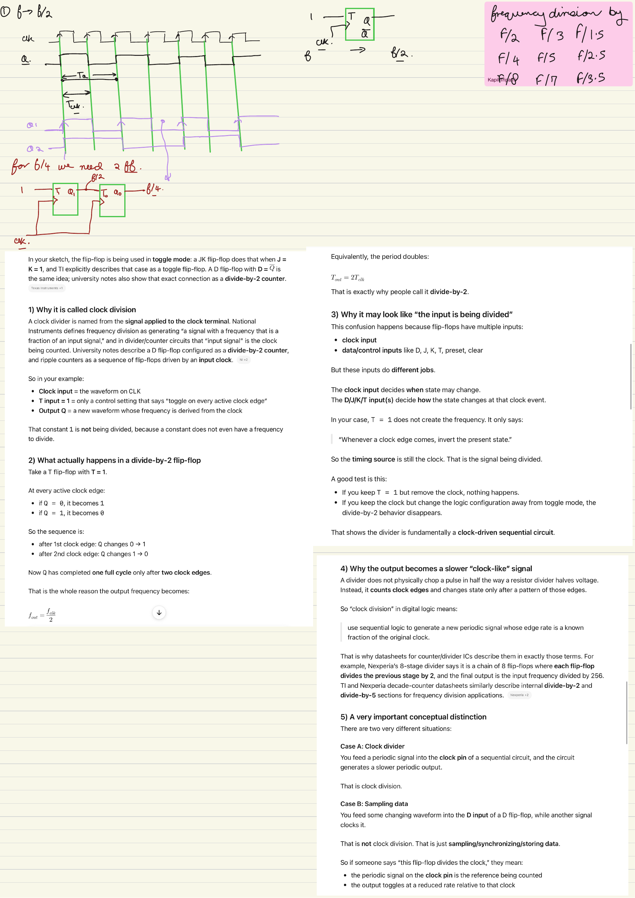

### Why one toggle flip-flop divides by 2

The page draws a T flip-flop with $T=1$. Its next-state equation is

$$
Q^{+}=T\oplus Q.
$$

Therefore, with $T=1$,

$$
Q^{+}=\overline Q.
$$

A D flip-flop implements the same behavior by feeding back the complement:

$$
D=\overline Q.
$$

At each active clock edge, the stored bit toggles:

| Clock edge | Present $Q$ | Next $Q$ |
|---:|---:|---:|
| 1 | 0 | 1 |
| 2 | 1 | 0 |
| 3 | 0 | 1 |
| 4 | 1 | 0 |

The output needs two input periods to return to the same state:

$$
T_Q=2T_{clk},
\qquad
f_Q=\frac{f_{clk}}{2}.
$$

For an ideal 50% input clock, $Q$ remains HIGH for one complete input period and LOW for one complete input period, so the divided output has 50% duty cycle.

Texas Instruments documents this exact DFF feedback application: connecting $\overline Q$ to $D$ makes the output toggle at every rising edge and complete one output cycle every two input cycles. See the [TI SN74LVC1G80-Q1 frequency-divider example](https://www.ti.com/lit/ds/symlink/sn74lvc1g80-q1.pdf).

### What is actually being divided?

The constant $T=1$ is not being divided. It has no frequency. The input on the flip-flop's clock pin supplies the event sequence:

- The clock determines **when** the state may change.
- $T=1$, or $D=\overline Q$, determines **how** the state changes at that event.
- $Q$ is the new periodic signal derived from the clock.

This also distinguishes frequency division from sampling. Applying changing data to $D$ while another signal clocks the DFF stores samples of data; it is not automatically clock division. Division occurs here because the feedback forces a known periodic state sequence.

### The divide-by-4 drawing

Two toggle stages can produce

$$
f_{Q_0}=\frac{f_{in}}{2},
\qquad
f_{Q_1}=\frac{f_{in}}{4}.
$$

There are two architectures:

1. **Ripple implementation:** $Q_0$ clocks the second flip-flop. The first stage changes after its clock-to-Q delay, then the second stage changes after another delay. This is asynchronous.
2. **Synchronous implementation:** both DFFs receive the original clock. For state $Q_1Q_0$, use

$$
D_0=\overline{Q_0},
$$

$$
D_1=Q_1\oplus Q_0.
$$

The synchronous state sequence is

$$
00\rightarrow01\rightarrow10\rightarrow11\rightarrow00.
$$

$Q_0$ toggles every clock and divides by 2. $Q_1$ toggles after every two clocks and divides by 4. This is the preferred interview implementation unless a ripple counter is explicitly requested.

### Correction and implementation warning

A flip-flop output can look like a clock, but using ordinary internally generated logic clocks requires proper routing and timing constraints. Intel recommends synchronous counters when logic division is unavoidable and advises against ripple counters in FPGA designs; see [Avoid Asynchronous Clock Division](https://docs.altera.com/r/docs/683323/18.1/intel-quartus-prime-standard-edition-user-guide-design-recommendations/avoid-asynchronous-clock-division) and [Avoid Ripple Counters](https://docs.altera.com/r/docs/683323/18.1/intel-quartus-prime-standard-edition-user-guide-design-recommendations/avoid-ripple-counters).

### Active recall

Why does $T=1$ not count as the signal being divided, and what clock connection distinguishes the synchronous divide-by-4 circuit from the ripple version?

### Worked bridge example - counter sequence 75, 98, 75, 98, ...

**Question:** Design a counter that produces 75, 98, 75, 98, and repeats. Identify the suitable flip-flop and the minimum number of flip-flops.

This example belongs beside the divide-by-2 circuit because its internal state bit uses the same toggle behavior. The important distinction is:

- the one-bit state \(Q\) is a divide-by-2 waveform;
- the seven-bit **count** output is data selected by \(Q\), not a divided clock.

#### Step 1: Write the required outputs in binary

\[
75_{10}=1001011_2,
\qquad
98_{10}=1100010_2.
\]

Seven output wires are required to represent these values, but the sequence has only two positions:

- \(S_0\): output 75, then go to \(S_1\);
- \(S_1\): output 98, then go to \(S_0\).

Therefore the minimum state memory is

\[
\left\lceil \log_2 2 \right\rceil=1
\]

flip-flop.

#### Step 2: Assign one state bit

Let

\[
S_0:Q=0,
\qquad
S_1:Q=1.
\]

The complete state and excitation table is:

| Present state | \(Q(t)\) | Decimal output | Binary output \(C_6C_5C_4C_3C_2C_1C_0\) | Next state | \(Q(t+1)\) | T input |
|---|---:|---:|---:|---|---:|---:|
| \(S_0\) | 0 | 75 | 1001011 | \(S_1\) | 1 | 1 |
| \(S_1\) | 1 | 98 | 1100010 | \(S_0\) | 0 | 1 |

A T flip-flop is the natural choice because both transitions require toggling:

\[
0\rightarrow1,\qquad1\rightarrow0.
\]

From the T-flip-flop excitation rule, \(T=1\) for both rows. Thus,

\[
T=1,
\qquad
Q^{+}=\overline Q.
\]

A D flip-flop could also be used with \(D=\overline Q\), but a T flip-flop states the required behavior most directly.

#### Step 3: Use \(Q\) as a selector

The single flip-flop does not store the seven-bit values. It only remembers which value must appear. The output logic is

\[
\text{count}=
\begin{cases}
1001011_2=75, & Q=0,\\
1100010_2=98, & Q=1.
\end{cases}
\]

This is simply a seven-bit 2-to-1 multiplexer:

- input 0 is 75;
- input 1 is 98;
- select is \(Q\).

So the implementation uses **one state flip-flop plus combinational output-selection logic**.

#### Step 4: Connect it to frequency division

The state sequence is

\[
Q:0,1,0,1,\ldots
\]

A complete \(Q\) cycle needs two input-clock periods:

\[
T_Q=2T_{clk},
\qquad
f_Q=\frac{f_{clk}}{2}.
\]

Therefore \(Q\) itself is a divide-by-2 signal. The displayed data follows

\[
75,98,75,98,\ldots
\]

on successive active clock edges, but the seven-bit bus is not a clock and should not be used to clock other registers.

#### Verilog

~~~verilog
module counter_75_98 (
    input  wire       clk,
    input  wire       rst,
    output wire [6:0] count
);
    reg state;

    // T flip-flop behavior with T permanently equal to 1.
    always @(posedge clk or posedge rst) begin
        if (rst)
            state <= 1'b0;
        else
            state <= ~state;
    end

    // state = 0 selects 75; state = 1 selects 98.
    assign count = state ? 7'd98 : 7'd75;
endmodule
~~~

The reset places the circuit in \(S_0\), so **count** is 75. Each later rising edge toggles **state**, producing 98, 75, 98, and so on. The reusable source is in [examples/counter_75_98.v](examples/counter_75_98.v).

#### Interview answer

> The sequence has two states, so only one flip-flop is required. Choose a T flip-flop with \(T=1\), because the state must toggle every clock. Use its output \(Q\) to select either 75 or 98 through seven-bit combinational logic. \(Q\) is a divide-by-2 waveform; the seven-bit count bus is data.

#### Active recall

Why are seven output bits required but only one flip-flop is required, and which signal in this design has frequency \(f_{clk}/2\)?

## Page 03 - Divider definition, stored-state toggling, and duty cycle

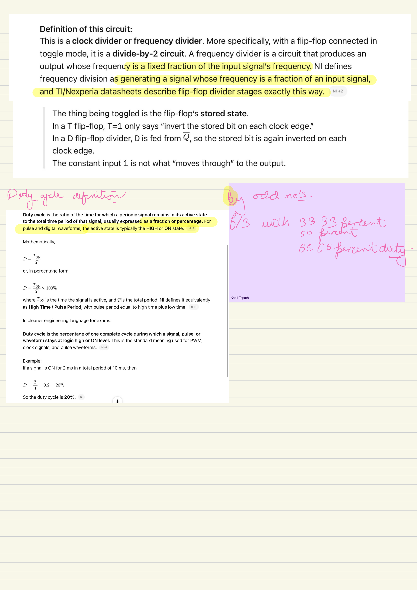

### The highlighted divider definition

The page correctly states that a frequency divider produces an output frequency that is a fixed fraction of the input frequency. The most useful mathematical form is the ratio

$$
N=\frac{f_{in}}{f_{out}}
=\frac{T_{out}}{T_{in}}.
$$

For an integer divide-by-$N$, one output period spans $N$ input periods. For a fractional divisor such as $N=1.5$, the equation is still valid:

$$
f_{out}=\frac{f_{in}}{1.5}
=\frac{2}{3}f_{in},
$$

but the output edges can no longer all be produced by counting only integer numbers of rising-edge periods. That issue is developed on pages 10-13.

### What toggles inside the flip-flop?

The stored state toggles, not the constant control input:

$$
T=1
\quad\Longrightarrow\quad
Q^{+}=\overline Q.
$$

For a DFF,

$$
D=\overline Q
\quad\Longrightarrow\quad
Q^{+}=D=\overline Q.
$$

The output sequence is a state trajectory created by feedback. This is why a single DFF can be both a storage element and a divide-by-2 state machine.

### Duty-cycle definition

Duty cycle is the fraction of one complete output period for which the signal is in its active state:

$$
\mathcal D=\frac{T_{HIGH}}{T_{out}},
$$

or in percentage form,

$$
\mathcal D(\%)=
\frac{T_{HIGH}}{T_{out}}\times100\%.
$$

For example, if a signal is HIGH for $2\,ms$ during a $10\,ms$ period,

$$
\mathcal D=\frac{2}{10}=0.2=20\%.
$$

Duty cycle must always use the period of the waveform being described. When the notebook says an $f/3$ output has 33.33% duty, it means

$$
T_{out}=3T_{in},
\qquad
T_{HIGH}=T_{in},
$$

so

$$
\mathcal D=\frac{T_{in}}{3T_{in}}=\frac13.
$$

The complement is HIGH for two of the three states and therefore has 66.67% duty. Both waveforms still have the same fundamental repetition frequency $f_{in}/3$.

### Why odd divisors create a 50% problem

For divide-by-3, a 50% waveform must remain HIGH and LOW for

$$
\frac{T_{out}}{2}
=\frac{3T_{in}}{2}
=1.5T_{in}.
$$

A rising-edge-only state machine changes only at integer multiples of $T_{in}$, so it cannot place both transitions at 1.5-period intervals. A true 50% odd divider must use additional phase information, commonly the falling edge or a dedicated clocking circuit.

### Active recall

Can two $f_{in}/3$ waveforms have different duty cycles? Give the HIGH duration for 33.33%, 50%, and 66.67% duty.

## Page 04 - Designing a synchronous modulo-3 divider

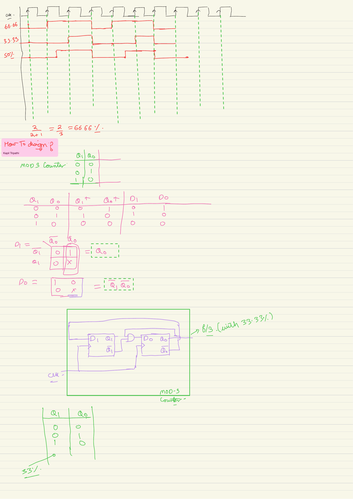

### Reading the three waveforms

All three red waveforms repeat every three input-clock periods, so each has

$$
f_{out}=\frac{f_{in}}{3}.
$$

Their HIGH times differ:

| Duty cycle | $T_{HIGH}$ | $T_{LOW}$ |
|---:|---:|---:|
| 33.33% | $T_{in}$ | $2T_{in}$ |
| 66.67% | $2T_{in}$ | $T_{in}$ |
| 50% | $1.5T_{in}$ | $1.5T_{in}$ |

The first two can be decoded directly from full modulo-3 states. The 50% waveform requires a half-cycle boundary.

### State assignment

Two DFFs are sufficient because

$$
\left\lceil\log_2 3\right\rceil=2.
$$

Use the three-state sequence drawn on the page:

$$
00\rightarrow01\rightarrow10\rightarrow00.
$$

The unused binary state is $11$.

| Present $Q_1Q_0$ | Next $Q_1^{+}Q_0^{+}$ | $D_1$ | $D_0$ |
|---:|---:|---:|---:|
| 00 | 01 | 0 | 1 |
| 01 | 10 | 1 | 0 |
| 10 | 00 | 0 | 0 |
| 11 | unused | $X$ | $X$ |

Because a DFF loads its D input,

$$
D_1=Q_1^{+},
\qquad
D_0=Q_0^{+}.
$$

Using the unused state as a don't-care, the K-map reductions shown on the page give

$$
D_1=Q_0,
$$

$$
D_0=\overline{Q_1}\,\overline{Q_0}.
$$

### Verifying the equations rather than trusting the K-map

Substitute every used state:

- At $00$: $D_1=0$, $D_0=1$, so the next state is $01$.
- At $01$: $D_1=1$, $D_0=0$, so the next state is $10$.
- At $10$: $D_1=0$, $D_0=0$, so the next state is $00$.

The simplified logic also recovers from $11$:

$$
11\rightarrow10\rightarrow00.
$$

Thus the implementation is self-recovering, although it takes two clocks to return from the unused state to $00$. If immediate recovery is required, define $11\rightarrow00$ explicitly and minimize with that requirement instead of treating $11$ as a don't-care.

### Obtaining 33.33% and 66.67%

Across the repeating states $00,01,10$:

- $Q_0$ is HIGH only in $01$, so $Q_0$ is $f_{in}/3$ with 33.33% duty.
- $Q_1$ is HIGH only in $10$, so $Q_1$ is also $f_{in}/3$ with 33.33% duty.
- $\overline{Q_0}$ and $\overline{Q_1}$ are each HIGH for two states, so either gives 66.67% duty.

There is no 50% state decode because three full clock periods cannot be split into equal integer numbers of periods.

### Active recall

Starting from $11$, where do the simplified equations send the counter, and which output polarity gives 66.67% duty?

## Page 05 - Making divide-by-3 50% and beginning the modulo-5 design

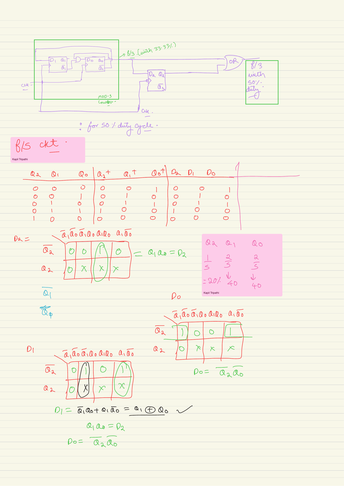

### Extending the divide-by-3 pulse to 50%

The top circuit begins with the modulo-3 counter from page 4. Let $P$ be a 33.33% output that is HIGH for one complete input period. A negative-edge-triggered DFF samples it:

$$
Q_2^{+}=P
\quad\text{on each falling edge}.
$$

The final output is

$$
Y=P+Q_2.
$$

Trace the important transition:

1. $P$ rises on a positive edge when the counter enters its selected state.
2. Half a clock later, the negative-edge DFF samples $P=1$, so $Q_2$ rises.
3. At the next positive edge, $P$ falls, but $Q_2$ remains 1.
4. Half a clock later, the negative-edge DFF samples $P=0$, so $Q_2$ falls.

The OR output is therefore HIGH for

$$
T_{in}+\frac{T_{in}}{2}=1.5T_{in}.
$$

Since $T_{out}=3T_{in}$,

$$
\mathcal D=
\frac{1.5T_{in}}{3T_{in}}
=50\%.
$$

This is the reason the extra DFF is falling-edge triggered: it creates the half-cycle extension that a positive-edge-only modulo-3 counter cannot create.

### Practical limitation

The OR gate combines signals launched on opposite clock edges. In an ASIC, this can be implemented and timed deliberately. In an FPGA, ordinary fabric logic should not casually become an internal clock. If the waveform must clock other registers, prefer a PLL/dedicated clock resource or keep the input clock and use a synchronous enable.

### Beginning a divide-by-5 state machine

The lower half of the page starts a three-DFF modulo-5 counter. Three bits are required because

$$
\left\lceil\log_2 5\right\rceil=3.
$$

Choose the binary sequence

$$
000\rightarrow001\rightarrow010\rightarrow011
\rightarrow100\rightarrow000.
$$

The complete used-state table is:

| Present $Q_2Q_1Q_0$ | Next $Q_2^{+}Q_1^{+}Q_0^{+}$ |
|---:|---:|
| 000 | 001 |
| 001 | 010 |
| 010 | 011 |
| 011 | 100 |
| 100 | 000 |

States $101$, $110$, and $111$ are unused.

### Deriving the three D inputs

Reading each next-state column and using the unused states as don't-cares gives:

$$
D_2=Q_1Q_0,
$$

$$
D_1=\overline{Q_1}Q_0+Q_1\overline{Q_0}
=Q_1\oplus Q_0,
$$

$$
D_0=\overline{Q_2}\,\overline{Q_0}.
$$

The XOR recognition on the page is correct: $D_1$ is 1 exactly when $Q_1$ and $Q_0$ differ.

### Active recall

Why does ORing the 33.33% signal with its falling-edge sample add exactly half an input period, and which modulo-5 next-state bit becomes an XOR?

## Page 06 - Completing modulo-5 and selecting the correct 50% precursor

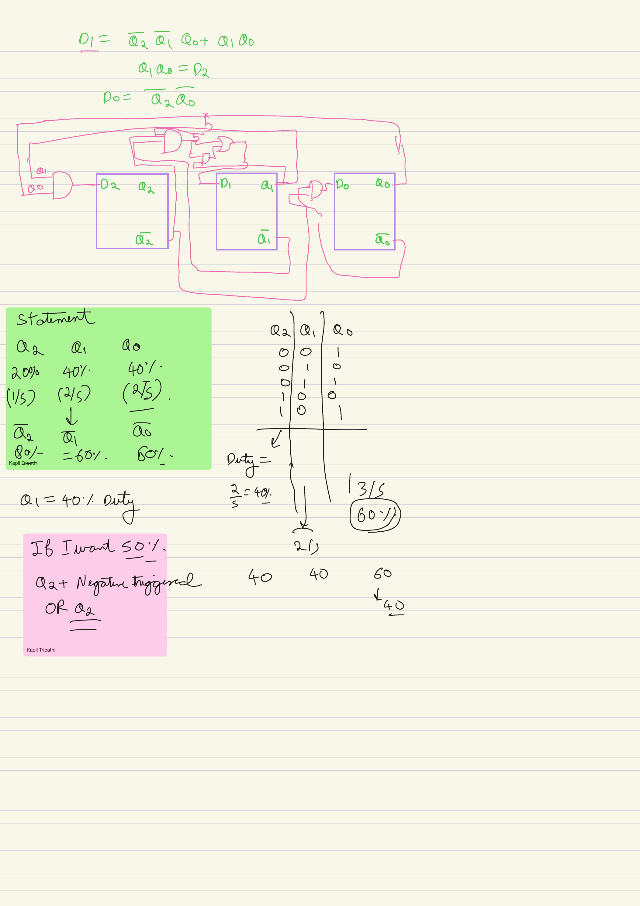

### Checking the drawn modulo-5 circuit

The three DFFs share one common clock, so this is a synchronous counter. Its combinational equations are

$$
D_2=Q_1Q_0,
$$

$$
D_1=Q_1\oplus Q_0,
$$

$$
D_0=\overline{Q_2}\,\overline{Q_0}.
$$

Substitution reproduces the intended sequence:

| Present state | $D_2D_1D_0$ | Next state |
|---:|---:|---:|
| 000 | 001 | 001 |
| 001 | 010 | 010 |
| 010 | 011 | 011 |
| 011 | 100 | 100 |
| 100 | 000 | 000 |

The unused states also recover:

$$
101\rightarrow010,
\qquad
110\rightarrow010,
\qquad
111\rightarrow100.
$$

So the minimized implementation does not lock permanently in an illegal state.

### Duty cycles of the counter bits

Across the five used states $000,001,010,011,100$:

| Signal | HIGH states | HIGH count | Duty cycle |
|---|---|---:|---:|
| $Q_2$ | 100 | 1 of 5 | 20% |
| $Q_1$ | 010, 011 | 2 of 5 | 40% |
| $Q_0$ | 001, 011 | 2 of 5 | 40% |
| $\overline{Q_2}$ | all except 100 | 4 of 5 | 80% |
| $\overline{Q_1}$ | 000, 001, 100 | 3 of 5 | 60% |
| $\overline{Q_0}$ | 000, 010, 100 | 3 of 5 | 60% |

Every listed waveform has fundamental repetition frequency $f_{in}/5$, but none has 50% duty because five full input periods cannot be divided into two equal integer groups.

### Correction to the 50% note

To create a 50% divide-by-5 waveform by half-cycle extension, begin with a signal that is already HIGH for **two consecutive input periods**, namely 40% of the five-period output cycle. $Q_1$ is the clean choice because it is HIGH in adjacent states $010$ and $011$.

Sample $Q_1$ on the falling edge and OR the two versions:

$$
Y_{50}=Q_1+Q_{1,fall}.
$$

The falling-edge copy extends the contiguous $2T_{in}$ HIGH interval by $0.5T_{in}$:

$$
T_{HIGH}=2.5T_{in},
\qquad
T_{out}=5T_{in},
$$

so

$$
\mathcal D=\frac{2.5}{5}=50\%.
$$

**Do not use $Q_2$ for this extension.** $Q_2$ is only 20% duty. Extending its one-period pulse by half a period gives $1.5/5=30\%$, not 50%. Also, $Q_0$ has two HIGH states that are not contiguous in the cyclic ordering used here, so simply extending it does not form one clean 2.5-period HIGH interval.

Texas Instruments' [CD74HC390 datasheet](https://www.ti.com/lit/ds/symlink/cd74hc390.pdf) is a useful hardware reference showing separately clocked divide-by-2 and divide-by-5 counter sections. That commercial part is a ripple structure; the notebook derivation here is a synchronous modulo-5 state machine.

### Active recall

Which modulo-5 bit has the contiguous 40% pulse needed for half-cycle extension, and why does extending $Q_2$ fail to produce 50% duty?

## Page 07 - Solved Q10: divide by 2 with 50% and 25% duty

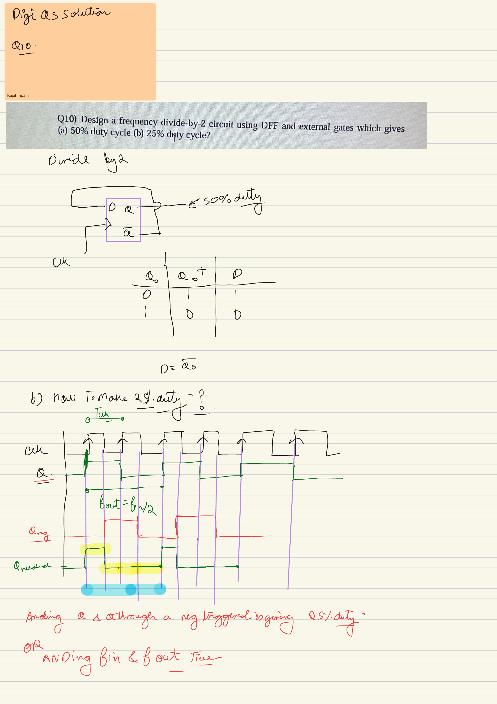

### Question

Design a frequency divide-by-2 circuit using a DFF and external gates that gives:

1. 50% duty cycle.
2. 25% duty cycle.

### Part (a): 50% duty

Configure the DFF as a toggler:

$$
D=\overline Q.
$$

Then

$$
Q^{+}=\overline Q,
$$

and the output sequence is

$$
0\rightarrow1\rightarrow0\rightarrow1\rightarrow\cdots.
$$

Thus,

$$
T_Q=2T_{in},
\qquad
f_Q=\frac{f_{in}}{2},
\qquad
\mathcal D_Q=50\%.
$$

### Part (b): 25% duty

An $f_{in}/2$ output has period $2T_{in}$. For 25% duty, the required HIGH time is

$$
T_{HIGH}=0.25(2T_{in})=\frac{T_{in}}{2}.
$$

One clean conceptual implementation is

$$
Y_{25}=Q\,\overline{CLK}.
$$

$Q$ selects one of every two input periods, while $\overline{CLK}$ restricts the HIGH interval to the low half of that selected period. Therefore,

$$
f_Y=\frac{f_{in}}{2},
\qquad
T_{HIGH}=\frac{T_{in}}{2},
\qquad
\mathcal D_Y=25\%.
$$

Using the low half-cycle is preferable to directly writing $Q\cdot CLK$ for this positive-edge toggler: $Q$ changes just after the rising edge, so gating the same rising edge can create a shortened or runt pulse. During the low half-cycle, $Q$ has already settled.

An edge-registered alternative is:

1. Toggle $Q_p$ on the positive edge.
2. Sample it into $Q_n$ on the negative edge.
3. Form

$$
Y_{25}=Q_p\,\overline{Q_n}.
$$

This signal is HIGH only between the positive edge that raises $Q_p$ and the following negative edge that raises $Q_n$, once every two input periods.

### FPGA warning

These gate-level constructions are appropriate for waveform reasoning and external pulse generation. Do not route a LUT-gated waveform as an ordinary FPGA clock. Keep the original clock and use a periodic clock-enable, or use dedicated clock-control resources.

### Active recall

Why must a 25%-duty divide-by-2 output be HIGH for only $T_{in}/2$, and why can directly ANDing a positive-edge-changing $Q$ with $CLK$ create a runt pulse?

## Page 08 - Solved Q11 and Q12(a): pulse cutting and divide by 3

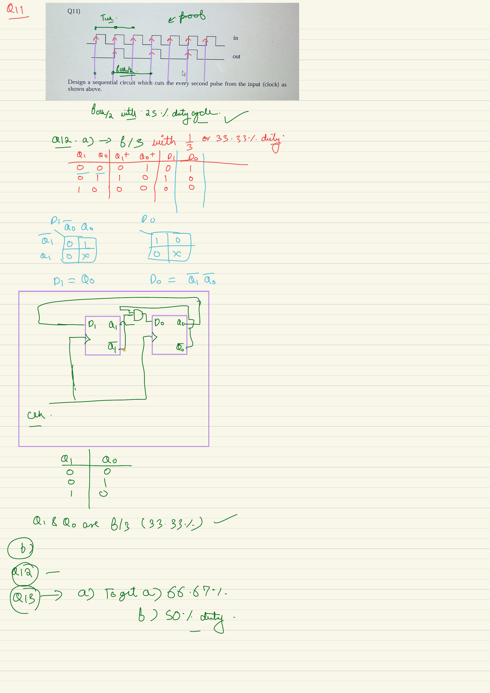

### Q11: cut every second input pulse

The required output passes one complete clock pulse, blocks the next, and repeats. For a 50% input clock:

- repetition period: $2T_{in}$;
- repetition frequency: $f_{in}/2$;
- HIGH duration: $T_{in}/2$;
- duty cycle relative to the output period: 25%.

A safe conceptual gate-level solution toggles an enable on each **falling edge**:

$$
E^{+}=\overline E
\quad\text{at }negedge\ CLK,
$$

then

$$
Y=CLK\cdot E.
$$

Updating $E$ while $CLK=0$ ensures that $E$ is stable before the next rising edge. Therefore, a selected clock pulse is passed from its beginning to its end instead of being chopped after it starts.

If the requirement is only “perform an operation once every two clocks,” the preferable synchronous implementation is a positive-edge counter that produces a **clock enable**, not a gated clock:

~~~systemverilog
logic phase;

always_ff @(posedge clk or negedge rst_n) begin
    if (!rst_n)
        phase <= 1'b0;
    else
        phase <= ~phase;
end

assign enable_every_second_cycle = phase;
~~~

Registers using this condition still receive the original clock.

### Q12(a): divide by 3 with 33.33% duty

Use the page-4 modulo-3 sequence:

$$
00\rightarrow01\rightarrow10\rightarrow00.
$$

The truth table is

| $Q_1Q_0$ | $Q_1^{+}Q_0^{+}$ | $D_1$ | $D_0$ |
|---:|---:|---:|---:|
| 00 | 01 | 0 | 1 |
| 01 | 10 | 1 | 0 |
| 10 | 00 | 0 | 0 |

and the minimized equations are

$$
D_1=Q_0,
$$

$$
D_0=\overline{Q_1}\,\overline{Q_0}.
$$

Both $Q_1$ and $Q_0$ are HIGH in one of the three states, so either is an $f_{in}/3$ output with 33.33% duty.

### Notes leading into Q12(b)

The complements are HIGH in two states:

$$
\mathcal D_{\overline{Q_1}}
=\mathcal D_{\overline{Q_0}}
=\frac23=66.67\%.
$$

The page correctly identifies that 66.67% is obtained by output polarity, whereas 50% requires the extra falling-edge timing developed on page 9.

### Active recall

Why should the pulse-cutting enable change while $CLK$ is LOW, and why do $Q_1$ and $\overline{Q_1}$ have the same frequency but different duty cycles?

## Page 09 - Q12(b) 66.67% and 50%, then Q15 divide-by-4 recognition

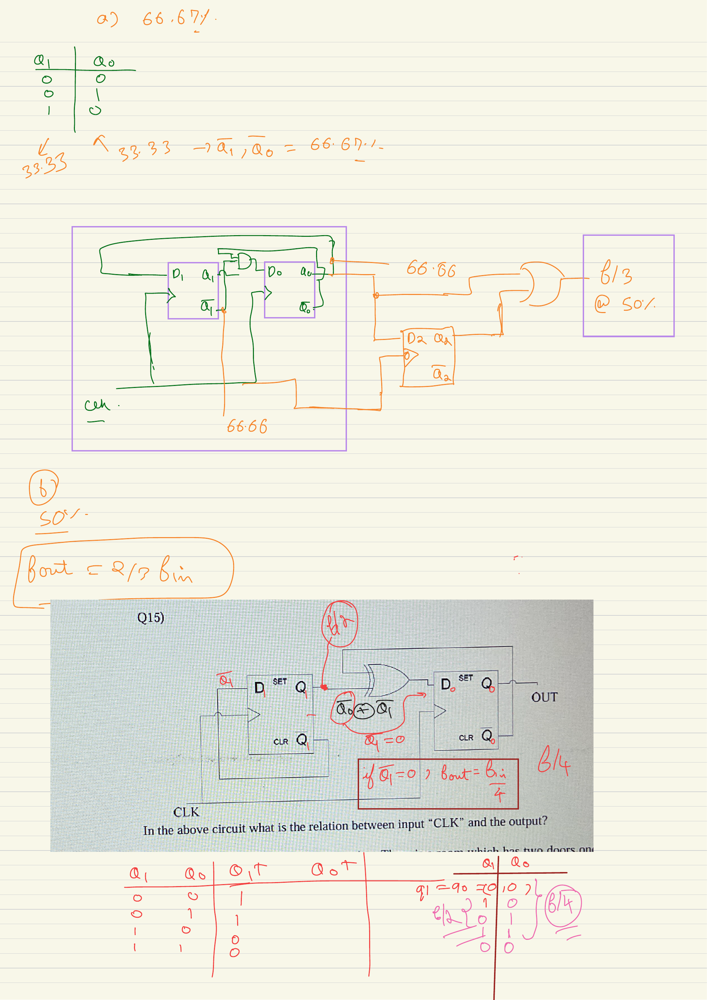

### Q12(b): $f_{in}/3$ with 66.67% duty

The modulo-3 sequence contains three equally long states:

$$
00,\ 01,\ 10.
$$

$Q_1$ has the value sequence

$$
0,\ 0,\ 1,
$$

so its duty cycle is $1/3$. Its complement has

$$
1,\ 1,\ 0,
$$

and therefore

$$
\mathcal D_{\overline{Q_1}}=\frac23=66.67\%.
$$

The same argument applies to $Q_0$ and $\overline{Q_0}$. Complementing a waveform does not change its period, so the frequency remains $f_{in}/3$.

### Q12(b): $f_{in}/3$ with 50% duty

Let $P$ be either 33.33% waveform, and let a falling-edge DFF produce $P_f$. Use

$$
P_f^{+}=P
\quad\text{at each falling edge},
$$

$$
Y=P+P_f.
$$

The direct pulse supplies $T_{in}$ of HIGH time, and the falling-edge copy supplies another $T_{in}/2$. Thus

$$
T_{HIGH}=1.5T_{in}
=\frac{3T_{in}}{2}
=\frac{T_{out}}{2}.
$$

The output is a true 50% divide-by-3 waveform in the ideal timing model. Real propagation delays make the exact duty cycle depart slightly from 50%; a production clock circuit must account for the positive-edge and negative-edge path delays.

Odd-ratio 50% division genuinely requires duty-cycle correction rather than a simple state decode. A published example is [Byun, Son, and Kim's odd-number divider with a duty-cycle trimming circuit](https://pure.dongguk.edu/en/publications/simple-odd-number-frequency-divider-with-50-duty-cycle/).

### Q15: determine the relation between CLK and OUT

The printed circuit uses two positive-edge DFFs. Reading the feedback gives

$$
D_1=\overline{Q_1},
$$

$$
D_0=Q_0\oplus Q_1.
$$

Therefore,

$$
Q_1^{+}=\overline{Q_1},
\qquad
Q_0^{+}=Q_0\oplus Q_1.
$$

Starting from $Q_1Q_0=00$:

| Present $Q_1Q_0$ | Next $Q_1Q_0$ |
|---:|---:|
| 00 | 10 |
| 10 | 01 |
| 01 | 11 |
| 11 | 00 |

The bit named $Q_1$ here is the least-significant counting bit: it toggles every clock and has frequency $f_{in}/2$. $Q_0$ has sequence

$$
0,\ 0,\ 1,\ 1,\ 0,\ldots
$$

so it completes one cycle every four input periods:

$$
f_{OUT}=f_{Q_0}=\frac{f_{in}}{4}.
$$

The unusual bit labels can hide the familiar circuit. Structurally, it is a synchronous two-bit binary counter with the toggling bit drawn on the left.

### Active recall

Why can the complement change duty cycle without changing frequency, and which state bit in Q15 is actually the least-significant bit?

## Page 10 - What divide by 1.5 really means

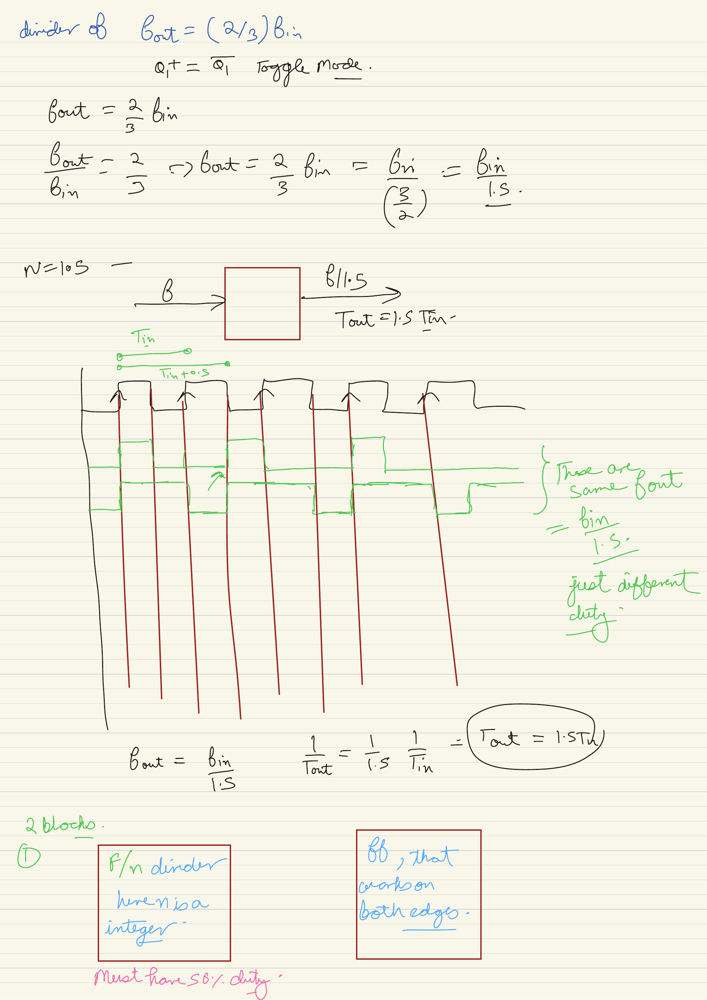

### Correct ratio conversion

Divide by 1.5 means

$$
f_{out}=\frac{f_{in}}{1.5}
=\frac{2}{3}f_{in},
$$

not $1.5f_{in}$. In period form,

$$
T_{out}=\frac{1}{f_{out}}
=1.5T_{in}.
$$

So the output repeats every one and a half input-clock periods.

### Why a positive-edge-only counter is insufficient

A state machine clocked only on rising edges can change its registered output at

$$
0,\ T_{in},\ 2T_{in},\ 3T_{in},\ldots
$$

But a divide-by-1.5 waveform needs corresponding events at

$$
0,\ 1.5T_{in},\ 3T_{in},\ 4.5T_{in},\ldots
$$

The events at $1.5T_{in}$ and $4.5T_{in}$ lie on falling edges of the original clock. Therefore, the design needs access to both edge phases, a clock running at $2f_{in}$, or a dedicated PLL/frequency-synthesis resource.

### Interpreting the three green waveforms

The waveforms can share the same repetition period

$$
T_{out}=1.5T_{in}
$$

while having different HIGH widths. Frequency measures repetition, not pulse width. For example:

| HIGH time | Duty cycle for $T_{out}=1.5T_{in}$ |
|---:|---:|
| $0.5T_{in}$ | $1/3=33.33\%$ |
| $0.75T_{in}$ | $1/2=50\%$ |
| $1.0T_{in}$ | $2/3=66.67\%$ |

However, if the circuit can change output only on input rising and falling edges, its timing grid is $0.5T_{in}$. It can readily create 33.33% or 66.67% duty, but not the $0.75T_{in}$ HIGH and LOW intervals required for exact 50% duty. Exact 50% needs finer phase resolution or a clocking resource that directly synthesizes the requested frequency.

### Two conceptual solution families

The blocks at the bottom anticipate two approaches:

1. Generate a 50% integer-divided precursor, then create a pulse on both its rising and falling transitions. This doubles its transition-event rate.
2. Treat both edges of the input clock as state-machine events. The effective event clock is then $2f_{in}$, and a modulo-3 sequence produces $2f_{in}/3$.

These methods naturally produce a pulse train. Whether that pulse train is allowed to become a real clock is a separate implementation question.

### Terminology correction

“Multiply by 2” on the following pages means doubling the number of useful output events per precursor cycle. It does not mean doubling voltage, and it does not mean that arbitrary XOR logic is a safe clock multiplier.

### Active recall

Why must every alternate divide-by-1.5 event fall on the negative edge of the input, and why is exact 50% duty not available on a half-period timing grid?

## Page 11 - Divide by 1.5 using a 50% divide-by-3 precursor and edge detection

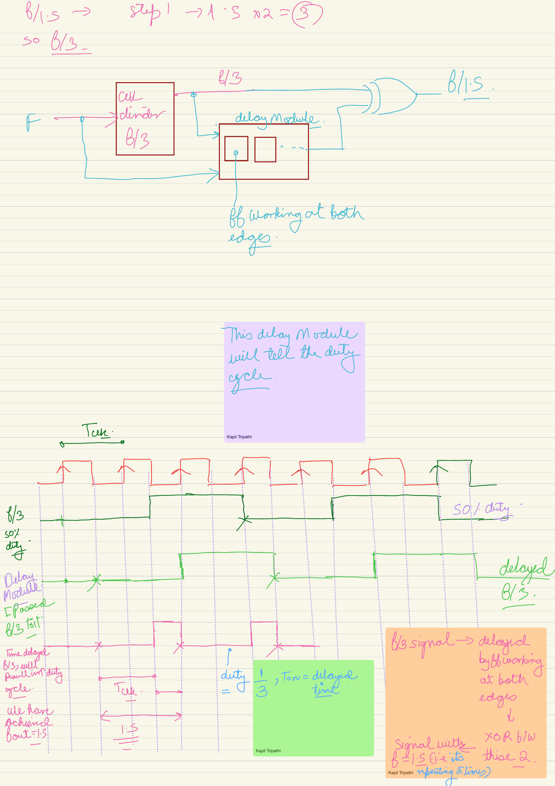

### Reading the block diagram

The first block generates a divide-by-3 waveform $A$ with 50% duty:

$$
f_A=\frac{f_{in}}{3},
\qquad
T_A=3T_{in}.
$$

Because $A$ is 50% duty, its rising and falling transitions are evenly spaced:

$$
\frac{T_A}{2}=1.5T_{in}.
$$

That transition spacing is exactly the required period for an $f_{in}/1.5$ pulse train.

### Why XOR with a delayed copy produces two pulses

Let $A_d$ be a delayed version of $A$:

$$
A_d(t)=A(t-\Delta).
$$

Form

$$
Y=A\oplus A_d.
$$

Immediately after either transition of $A$, the direct and delayed versions disagree for $\Delta$. The XOR is therefore HIGH for $\Delta$ after every rising edge and every falling edge of $A$. Since the two transitions of a 50% $f_{in}/3$ waveform are separated by $1.5T_{in}$, the output pulses also repeat every $1.5T_{in}$:

$$
f_Y=\frac{1}{1.5T_{in}}
=\frac{f_{in}}{1.5}
=\frac{2}{3}f_{in}.
$$

### Duty cycle of the pulse train

The delay controls pulse width:

$$
\mathcal D_Y=\frac{\Delta}{1.5T_{in}}.
$$

For the page's half-input-period delay,

$$
\Delta=\frac{T_{in}}{2},
$$

so

$$
\mathcal D_Y
=\frac{T_{in}/2}{1.5T_{in}}
=\frac13
=33.33\%.
$$

The complement has 66.67% duty and the same frequency.

### Why the precursor must be 50% duty

Suppose $A$ were not 50% duty. Its rising-to-falling interval and falling-to-rising interval would differ. The edge-detector pulses would then occur at alternating spacings, so the result would have the correct **average number of pulses** but not one uniform period of $1.5T_{in}$. A 50% precursor makes both half-cycle intervals equal.

### What can implement the delay?

The “delay module” cannot be treated as an arbitrary untimed buffer chain:

- In an ASIC, a deliberate opposite-edge register or characterized delay/phase circuit can create $\Delta$.
- In an FPGA, use dedicated DDR, PLL, or clock-control resources when an edge-aligned output is required.
- A fabric delay chain changes with placement and PVT and is not a portable frequency-divider design.

AMD's [ODDR primitive documentation](https://docs.amd.com/r/2020.2-English/ug953-vivado-7series-libraries/ODDR) is an example of a dedicated resource whose output can change on both clock edges. This is fundamentally different from asking ordinary RTL fabric registers to respond to both edges.

### Clock versus pulse output

The XOR result is best described as a periodic pulse train. If it is only an enable or external waveform, that may satisfy the requirement. If it will clock internal registers, use a dedicated clocking solution and describe the relationship to STA as a generated clock.

### Active recall

Why does the XOR produce a pulse after both transitions of $A$, and what goes wrong with uniform output spacing if $A$ is not 50% duty?

## Page 12 - General half-integer method and divide by 2.5

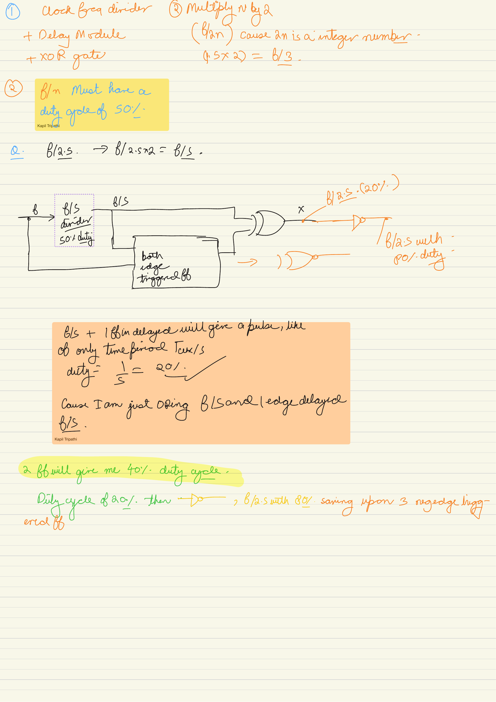

### Turning a half-integer divisor into an odd integer

A half-integer divisor can be written as

$$
N=\frac{M}{2},
$$

where $M=2N$ is an odd integer. Then

$$
\frac{f_{in}}{N}
=\frac{f_{in}}{M/2}
=\frac{2f_{in}}{M}.
$$

This suggests the page's two-step method:

1. Generate a 50% divide-by-$M$ precursor.
2. Produce one output event on both the rising and falling transitions, doubling the event rate.

The phrase “multiply by 2” refers to this doubled transition-event rate.

### Applying the method to divide by 2.5

For

$$
N=2.5=\frac52,
$$

first generate

$$
f_A=\frac{f_{in}}{5}
$$

with 50% duty. Its rising and falling edges are separated by

$$
\frac{T_A}{2}
=\frac{5T_{in}}{2}
=2.5T_{in}.
$$

That is exactly the desired output period. Edge detection on both transitions therefore produces

$$
f_Y=\frac{1}{2.5T_{in}}
=\frac{f_{in}}{2.5}
=\frac{2}{5}f_{in}.
$$

### Why the divide-by-5 precursor must be 50%

If the precursor HIGH and LOW intervals are unequal, its rising and falling edges are not equally spaced. Edge detection would create alternating short and long output intervals. The average event rate might still be $2f_{in}/5$, but the result would not be a uniform periodic divider waveform.

The 50% divide-by-5 construction from pages 5-6 supplies equally spaced transitions every $2.5T_{in}$.

### Explaining the XOR and 20% duty result

Let $A_d$ delay the 50% $f_{in}/5$ precursor by

$$
\Delta=\frac{T_{in}}{2}.
$$

With

$$
Y=A\oplus A_d,
$$

each output pulse lasts $\Delta$, while pulses repeat every $2.5T_{in}$. Therefore,

$$
\mathcal D_Y
=\frac{T_{in}/2}{2.5T_{in}}
=\frac15
=20\%.
$$

Inverting the pulse train gives

$$
\mathcal D_{\overline Y}=1-\frac15=\frac45=80\%.
$$

The 20% and 80% waveforms have the same fundamental frequency $f_{in}/2.5$.

### General duty-cycle result for the shown delay

For $N=M/2$ and $\Delta=T_{in}/2$,

$$
T_{out}=\frac{M}{2}T_{in},
$$

so

$$
\mathcal D
=\frac{T_{in}/2}{(M/2)T_{in}}
=\frac1M.
$$

Thus:

- $M=3$ gives divide by 1.5 with $1/3=33.33\%$ duty.
- $M=5$ gives divide by 2.5 with $1/5=20\%$ duty.

The complement gives $(M-1)/M$ duty.

### Correction about “both-edge-triggered FF”

A generic RTL DFF is normally sensitive to one clock edge, not both. If a design needs output activity on both edges:

- use a dedicated dual-edge/DDR primitive;
- use coordinated positive-edge and negative-edge registers with careful timing; or
- generate a $2f_{in}$ clock using a PLL and keep the divider itself single-edge synchronous.

Do not infer a portable FPGA design by writing one ordinary register that changes on both edges.

### Active recall

Why does divide by 2.5 begin with divide by 5, and why does a half-input-period XOR delay produce 20% rather than 50% duty?

## Page 13 - Divide by 1.5 as a both-edge state machine, with RTL

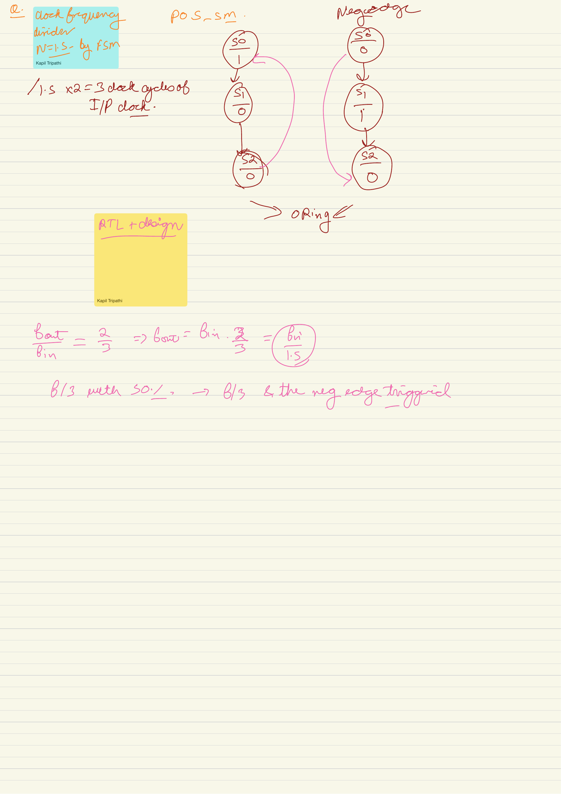

### Interpreting the positive-edge and negative-edge state diagrams

The page's core insight is that both clock edges can be treated as a sequence of equally spaced timing events:

$$
posedge,\ negedge,\ posedge,\ negedge,\ldots
$$

These events occur every

$$
\frac{T_{in}}{2},
$$

so the effective event rate is

$$
f_{event}=2f_{in}.
$$

A modulo-3 machine operating on that event stream has

$$
f_{out,event}
=\frac{2f_{in}}{3}
=\frac{f_{in}}{1.5}.
$$

Use the three-state sequence

$$
S_0\rightarrow S_1\rightarrow S_2\rightarrow S_0
$$

on consecutive half-cycle events. If the Moore output is 1 only in $S_0$:

| State | Output | Duration |
|---|---:|---:|
| $S_0$ | 1 | $T_{in}/2$ |
| $S_1$ | 0 | $T_{in}/2$ |
| $S_2$ | 0 | $T_{in}/2$ |

The waveform repeats after three half-cycles:

$$
T_{out}=3\left(\frac{T_{in}}{2}\right)=1.5T_{in},
$$

and its duty cycle is

$$
\mathcal D
=\frac{T_{in}/2}{1.5T_{in}}
=\frac13.
$$

### What the ORing on the page requires

The two drawn FSMs represent positive-edge and negative-edge activity that must be coordinated into one logical modulo-3 sequence. Their outputs cannot simply be generated by two independent counters with arbitrary reset states and then ORed. Incorrect initialization can cause overlapping pulses, missing pulses, or alternating periods.

A correct split-edge implementation must define:

- which global state is owned or updated at each edge;
- the reset phase of both halves;
- how state information crosses between the two edge domains;
- whether the OR output can glitch during unequal clock-to-Q delays; and
- how STA constrains every positive-edge-to-negative-edge and negative-edge-to-positive-edge path.

This is why the mathematical both-edge FSM is simpler than its physical implementation.

### Recommended synthesizable RTL approach

If the platform can supply a dedicated clock at

$$
f_{2x}=2f_{in},
$$

use an ordinary single-edge synchronous modulo-3 counter. The following produces a pulse train at $f_{in}/1.5$ with 33.33% duty:

~~~systemverilog
module divide_by_1p5_pulse (
    input  logic clk_2x,
    input  logic rst_n,
    output logic pulse_out
);
    logic [1:0] state;

    always_ff @(posedge clk_2x or negedge rst_n) begin
        if (!rst_n)
            state <= 2'd0;
        else if (state == 2'd2)
            state <= 2'd0;
        else
            state <= state + 2'd1;
    end

    assign pulse_out = (state == 2'd0);
endmodule
~~~

Verification:

$$
f_{pulse}
=\frac{f_{2x}}{3}
=\frac{2f_{in}}{3}
=\frac{f_{in}}{1.5}.
$$

The pulse width is one $clk\_2x$ period:

$$
T_{HIGH}=\frac{1}{2f_{in}}=\frac{T_{in}}{2}.
$$

### Why not write a normal two-edge always block?

Code that updates the same ordinary register on both $posedge\ clk$ and $negedge\ clk$ is useful as a behavioral thought model but is not portable synthesis RTL. Standard FPGA fabric flip-flops are single-edge devices. If a real output pin must change on both edges, instantiate the device's DDR output primitive. If a real internal clock at $2f_{in}/3$ is needed, use a PLL or dedicated clock-management resource.

### 50% duty reminder

A 50% waveform at $f_{in}/1.5$ would require transitions every

$$
\frac{T_{out}}{2}=0.75T_{in}.
$$

Neither the original full-cycle grid nor its half-cycle edge grid contains every $0.75T_{in}$ boundary. Exact 50% duty therefore needs finer phase resolution or direct clock synthesis; the modulo-3 both-edge design naturally gives 33.33% or, after inversion, 66.67%.

### Active recall

Why does a modulo-3 machine clocked at $2f_{in}$ implement divide by 1.5, and what makes this implementation safer than combining two independent opposite-edge FSMs in ordinary logic?

## Points to remember

- Division ratio is a period relationship: $T_{out}=N T_{in}$.
- For $S$ binary-encoded states, the minimum state memory is $m=\lceil\log_2 S\rceil$ flip-flops; equivalently, choose the smallest $m$ satisfying $2^m\ge S$.
- Duty cycle is a separate requirement: $\mathcal D=T_{HIGH}/T_{out}$.
- One toggling flip-flop divides by 2 because one output cycle requires two state changes.
- A synchronous counter gives every state register the original clock; a ripple counter clocks later stages from earlier outputs.
- Modulo-3 equations for the chosen encoding are $D_1=Q_0$ and $D_0=\overline{Q_1}\,\overline{Q_0}$.
- Modulo-5 equations are $D_2=Q_1Q_0$, $D_1=Q_1\oplus Q_0$, and $D_0=\overline{Q_2}\,\overline{Q_0}$.
- Direct state decoding gives $1/N$, $2/N$, and similar whole-state duty cycles.
- A 50% odd divider needs a half-cycle or other phase correction.
- Edge detection doubles transition-event rate, not voltage.
- A fractional divider pulse train is not automatically a safe internal clock.
- On an FPGA, prefer a clock enable, PLL, dedicated clock network, or DDR primitive as appropriate.
- An actual derived clock must be routed and constrained as a generated clock.

## Reference checks

The page explanations and corrections were cross-checked against:

- [UMBC Lab 10: finite-state-machine design](https://userpages.cs.umbc.edu/phatak/212/labs-s21/lab10/index.html) for the $\lceil\log_2 S\rceil$ binary state-register rule and flip-flop excitation tables.
- [University of Iowa finite-state-machine notes](https://homepage.divms.uiowa.edu/~dwjones/arch/notes/04fsm.html) for the equivalent state-count rule and the two-state/one-flip-flop example.
- [Texas Instruments SN74LVC1G80-Q1 datasheet](https://www.ti.com/lit/ds/symlink/sn74lvc1g80-q1.pdf) for the DFF feedback divide-by-2 application.
- [Texas Instruments CD74HC390 datasheet](https://www.ti.com/lit/ds/symlink/cd74hc390.pdf) for practical divide-by-2 and divide-by-5 counter sections.
- [Nexperia 74HC4040/74HCT4040 counter reference](https://www.nexperia.com/products/analog-logic-ics/logic/flip-flops-latches-registers-counters-dividers/binary-counters-timers/series/74HC4040-74HCT4040.html) for binary counter use in frequency division.
- [NJIT Digital Systems Laboratory: Counters](https://web.njit.edu/~gilhc/ECE394/ECE394-VII.htm) for the structural distinction between common-clock synchronous counters and cascaded ripple counters.
- [Intel/Altera: Avoid Asynchronous Clock Division](https://docs.altera.com/r/docs/683323/18.1/intel-quartus-prime-standard-edition-user-guide-design-recommendations/avoid-asynchronous-clock-division) and [Avoid Ripple Counters](https://docs.altera.com/r/docs/683323/18.1/intel-quartus-prime-standard-edition-user-guide-design-recommendations/avoid-ripple-counters) for FPGA clock-divider architecture.
- [Intel/Altera: Basic Clock Divider Using divide_by](https://docs.altera.com/r/docs/683081/22.2/quartus-prime-timing-analyzer-cookbook/basic-clock-divider-using-divide_by) for generated-clock timing constraints.
- [AMD ODDR primitive documentation](https://docs.amd.com/r/2020.2-English/ug953-vivado-7series-libraries/ODDR) for dedicated FPGA output changes on opposite clock edges.
- [Byun, Son, and Kim: Simple odd number frequency divider with 50% duty cycle](https://pure.dongguk.edu/en/publications/simple-odd-number-frequency-divider-with-50-duty-cycle/) for the need for explicit duty-cycle correction in odd-ratio dividers.
