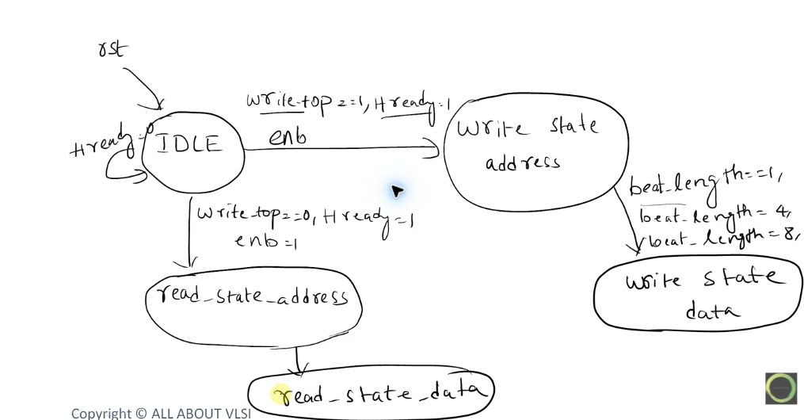
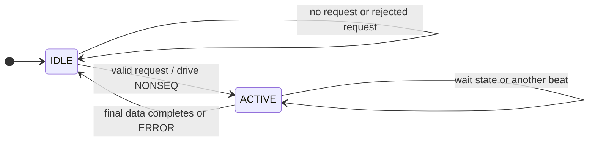

# AHB Manager FSM - Lecture Version and Corrected Version

[Back to AHB](../README.md) | [Code guide](README.md)

## What the lecture draws

The screenshot below is from the playlist's
[FSM Design for AHB Master in Verilog](https://www.youtube.com/watch?v=DmYdSlO2MiE)
lecture. It is saved as evidence of the teaching model, not treated as the
protocol authority.

The lecture uses five conceptual states:

- `IDLE`
- `write_state_address`
- `write_state_data`
- `read_state_address`
- `read_state_data`

That decomposition is understandable for a first sketch: the request direction
chooses the read or write branch, then the design appears to move from an
address state to a data state. It also introduces useful local inputs such as a
start/enable flag, starting address, write/read selection, beat length, and wrap
selection.

## The important correction

AHB address and data phases are pipelined, so they are not always mutually
exclusive time slots. While beat 0 is in its data phase, beat 1 can already be
in its address phase. A literal five-state implementation can accidentally
serialize those phases and lose the defining AHB overlap.

The code therefore uses only two ownership states and two phase counters:

On the `ACTIVE` self-loop, `HREADY=0` holds every phase register and bus
output. When `HREADY=1` and another address remains, the manager advances the
pipeline and drives SEQ. The transition back to `IDLE` produces `done`; an
ERROR response also produces `error`.

`ACTIVE` does not mean that only one phase exists. The registers below record
which beat occupies each overlapping phase:

| Register | Meaning |
|---|---|
| `addr_index_q` | Beat whose address/control phase is currently driven on `HADDR` and related signals |
| `data_index_q` | Earlier beat whose read/write data phase is currently completing |
| `data_valid_q` | Confirms that an accepted address phase has created a real data phase |

The separation is the key design idea. The state says whether the manager owns
an active command; the indices say which pipeline stage each beat occupies.

## Lecture model versus corrected behavior

| Topic | Lecture sketch/code direction | Corrected rule used here |
|---|---|---|
| Request start | Tests request direction together with `HREADY` in `IDLE` | Accept the local request when `req_valid && req_ready`; `HREADY` controls AHB phase advancement after a transfer is presented |
| Address to data | Moves to a distinct data state | Keeps the command `ACTIVE` and tracks address/data beats independently so they can overlap |
| Wait state | Checks `HREADY` mainly around data work | Holds address, control, beat indices, and write data whenever `HREADY=0` |
| Idle outputs | Shows `X`/don't-care values for fields such as `HSIZE` and `HBURST` | Drives deterministic legal defaults; simulation `X` is for finding unknown state, not a normal bus value |
| First/later beat | The diagram does not make NONSEQ versus SEQ central | Drives NONSEQ for beat 0 and SEQ for later beats of the same burst |
| Wrap decision | Treats wrap as a branch selected inside data handling | Calculates every next address from the current address, transfer size, and 16-byte WRAP4 boundary |
| Completion | Returns to `IDLE` after read/write work | Returns only when the final outstanding data phase completes with `HREADY=1` |

## Exact phase trace

For an INCR4 write beginning at `0x20`, the active pipeline looks like this:

| Completion edge | Address accepted on this edge | Data completed on this edge | Next visible address |
|---:|---|---|---|
| 1 | beat 0, `0x20`, NONSEQ | none | beat 1, `0x24`, SEQ |
| 2 | beat 1, `0x24`, SEQ | beat 0 data | beat 2, `0x28`, SEQ |
| 3 | beat 2, `0x28`, SEQ | beat 1 data | beat 3, `0x2C`, SEQ |
| 4 | beat 3, `0x2C`, SEQ | beat 2 data | IDLE |
| 5 | none | beat 3 data | command completes |

When `HREADY=0`, no row advances. This is more precise than saying only “the
data waits,” because the pipelined address phase is also prevented from being
accepted.

## RTL variable dictionary

| Name | Use |
|---|---|
| `req_valid` | Local controller says the command fields are valid |
| `req_ready` | Manager is idle and able to accept one command |
| `req_write` | HIGH for write, LOW for read |
| `req_burst` | Small local encoding for SINGLE, INCR4, or WRAP4 |
| `req_addr` | Starting byte address; must be word-aligned in this design |
| `req_wdata` | Four packed possible write beats, with beat 0 in bits `[31:0]` |
| `write_q` | Captured direction, stable for the entire command |
| `burst_q` | Captured burst kind used for `HBURST`, beat count, and next address |
| `write_data_q` | Captured write-data pack so the caller may change its inputs after handshake |
| `addr_index_q` | Current address-phase beat number |
| `data_index_q` | Current data-phase beat number |
| `data_valid_q` | There is an accepted address whose data phase is now outstanding |
| `rsp_rdata` | Packed completed read beats in the same ordering as `req_wdata` |
| `done` | One-clock pulse after the final data phase or local request rejection |
| `error` | One-clock pulse for an invalid local request or an AHB ERROR response |

## Recall test

1. Why can `write_state_address -> write_state_data` be a misleading physical timeline for AHB?
2. During the data phase of beat 1, which beat's address can be on `HADDR`?
3. Which three registers let the two-state implementation remember both phases?
4. Why is the final `done` pulse one clock later than acceptance of the final address?
