# AHB Lecture and Handwritten Atlas

[Back to AHB](../README.md) | [Back to AMBA](../../README.md)

This atlas follows the order requested for revision: first inspect the lecture
frame, then explain what happens on the bus, then read the corresponding
original handwritten page and correct or deepen it. The notebook scans and the
later iPad annotations are kept separate because they show two different stages
of the same learning process.

The protocol authority used throughout is Arm's
[AMBA AHB Protocol Specification, ARM IHI 0033C](../sources/ARM-IHI-0033C-AMBA-AHB-Protocol-Specification.pdf).
The playlist is used for its teaching sequence and waveform examples, not as a
replacement for the specification.

## How to read every waveform

Do not read an AHB waveform one vertical line at a time. At each rising edge,
ask two questions:

1. Which transfer is in its **address phase**?
2. Which earlier transfer is in its **data phase**, and does `HREADY` complete
   that phase?

This matters because AHB is pipelined. Address/control for transfer $N+1$ can
appear while data for transfer $N$ is being completed. A LOW `HREADY` extends
the current data phase and also prevents the next address phase from advancing.
That one rule explains most of the timing diagrams in these notes
([Arm IHI 0033C, §§3.1 and 3.7](../sources/ARM-IHI-0033C-AMBA-AHB-Protocol-Specification.pdf)).

### A protocol-wide reasoning model

For every AHB signal, separate four questions that are easy to mix together:

| Question | What to determine | AHB example |
|---|---|---|
| Who owns it? | Which component is allowed to drive the signal? | The manager drives `HADDR`; the selected subordinate path drives `HRESP`. |
| Which phase uses it? | Is it describing an address phase or carrying a data-phase result? | `HWRITE` describes the address phase; `HWDATA` belongs to the later write data phase. |
| Which transfer owns it? | Which labeled transfer does the value belong to in a pipelined cycle? | While address B is visible, `HRDATA` can still be the result of transfer A. |
| Which edge accepts it? | What condition makes the information take effect? | Address/control advance and the current data phase completes on an edge with `HREADY=1`. |

This gives two different meanings to the word **current**. The current value on
the address bus describes the candidate next transfer, while the current data
phase is the older transfer awaiting completion. `HREADY` couples them: when it
is LOW, the older data phase remains unfinished and the valid next address phase
normally cannot advance. Thinking in these two lanes is more reliable than
memorizing isolated waveforms
([Arm IHI 0033C, §§2.2-2.5 and 3.1](../sources/ARM-IHI-0033C-AMBA-AHB-Protocol-Specification.pdf)).

In RTL, the same model becomes two groups of state. Address-generation state
holds the next `HADDR` and address controls; data-phase state remembers the
older transfer whose read result, write data, and response are still active.
The protocol is not merely a set of wires - it is a rule for when these two
groups may advance.

## Source-page map

| Notebook page | Main idea | Related iPad page |
|---:|---|---:|
| 1 | AMBA and AHB introduction | - |
| 2 | SoC hierarchy and AHB-to-APB bridge | - |
| 3 | Manager, subordinate, and interconnect | - |
| 4 | Manager-side interface signals | - |
| 5 | `HTRANS` encodings and a single transfer | 3 |
| 6 | Address and data phases | 2 |
| 7 | Read transfer without waits | - |
| 8 | Write transfer, `HREADY`, and `HRESP` | 1 |
| 9 | Transfer types and `HSIZE` | 3 |
| 10 | Burst/size controls and packet addresses | 4-8 |
| 11 | Burst addresses and boundaries | 4-6 |
| 12 | `HBURST` encodings and readiness | 6 |
| 13 | Waited transfers and BUSY | 1, 10 |
| 14 | INCR, BUSY, and IDLE behavior | 7, 9, 10 |
| 15 | First manager FSM sketch | - |
| 16 | SINGLE-transfer implementation exercise | - |
| 17 | Manager module ports | - |
| 18 | Internal registers/data-phase draft | - |

## 1. Bus purpose, components, and ownership

### Lecture frame: the manager starts the transfer

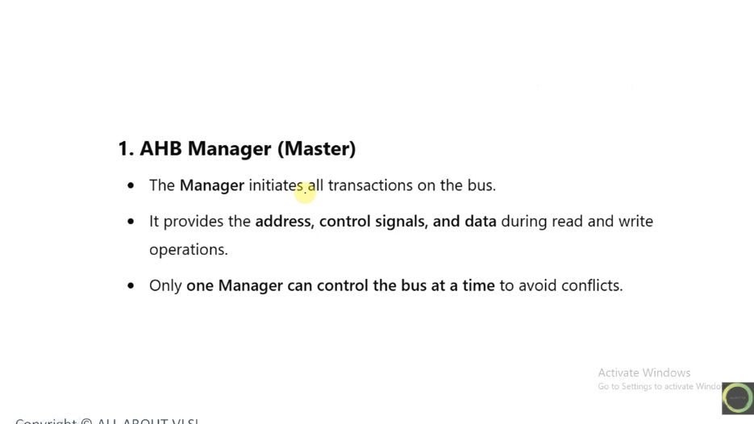

The frame places the manager on the initiating side of the bus. A manager does
more than place an address: it drives the address-phase control that describes
the transfer. The selected subordinate later finishes that transfer by driving
read data or accepting write data and returning completion/response signals.
An interconnect can decode the address and route those signals, but it does not
change the basic manager-to-subordinate contract.

Follow one transfer through the blocks. First, the manager describes the
operation with address and control. Second, the decoder converts the address
into one `HSELx`. Third, that subordinate performs the requested operation in
the data phase. Finally, the response multiplexer returns that same
subordinate's `HRDATA`, `HREADYOUT`, and `HRESP` as the manager-facing
`HRDATA`, `HREADY`, and `HRESP`. The response path must therefore be selected
using the transfer's data-phase identity, not by blindly decoding whichever new
address is visible one cycle later
([Arm IHI 0033C, §§1.1.1-1.1.3 and 4.3](../sources/ARM-IHI-0033C-AMBA-AHB-Protocol-Specification.pdf)).

The manager owns initiation, but it does not own completion. Once a valid
transfer has commenced, the subordinate decides whether it finishes now,
waits, or reports an error. That division of responsibility is why a correct
manager advances on `HREADY`, not on an internally assumed one-cycle latency.

### Original notebook page 1: AMBA and AHB introduction

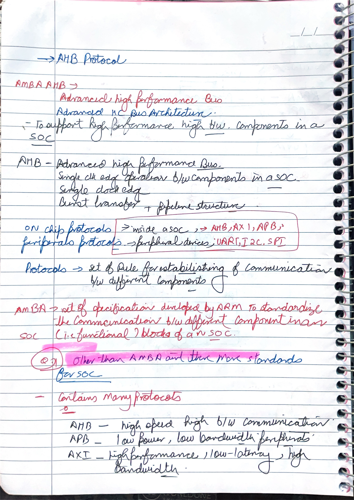

The page correctly treats AMBA as an Arm bus architecture used to connect
reusable IP inside a system-on-chip. The important refinement is that **AMBA is
a protocol family**, while AHB is one member of that family. AHB is intended
for higher-bandwidth communication and supports pipelined transfers and
bursts. APB is a different member optimized for simple peripherals.

The handwritten phrase “high performance” should be connected to mechanisms,
not treated as a label. AHB overlaps one transfer's data phase with the next
transfer's address phase, supports related addresses as bursts, uses one clock
edge for sampling, and avoids internal tri-state buses. Pipelining improves
**throughput** after the pipeline fills; it does not mean every subordinate
returns data in one cycle. A slow memory can still insert wait states
([Arm IHI 0033C, §1.1](../sources/ARM-IHI-0033C-AMBA-AHB-Protocol-Specification.pdf)).

The note that a protocol defines communication is the right starting point. In
hardware, that means every endpoint agrees on signal ownership, what each
encoding means, and at which clock edge information is accepted. Two blocks
with matching signal widths are not interoperable unless they obey the same
timing rules.

That contract is what makes reusable IP possible. A memory controller designed
by one team and a processor interface designed by another team can connect
because both know, for example, that `HTRANS=NONSEQ` begins a new transfer,
that address/control are sampled only when the bus can advance, and that a LOW
`HREADY` means the operation is not complete. The protocol specifies observable
behavior; it does not require both blocks to use the same internal FSM.

The page also mentions low power and reuse. These are consequences of
standardization and architecture choices, not extra AHB signal meanings. Reuse
reduces custom glue logic, while choosing APB for simple register peripherals
avoids forcing every low-bandwidth block to implement the higher-throughput AHB
transfer machinery.

### Original notebook page 2: SoC hierarchy and bridge

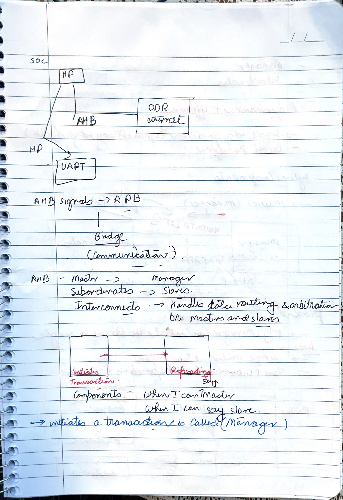

The drawing shows a useful architecture: higher-performance initiators and
memory live on AHB, while a bridge converts selected accesses into APB
transactions for lower-bandwidth peripherals such as UARTs. This is a
**protocol conversion**, not merely a wire connection. The bridge accepts an
AHB transfer, decodes and buffers its information, performs the APB SETUP and
ACCESS phases, and eventually completes the AHB side.

The bridge may therefore hold AHB with `HREADY=0` while the APB peripheral is
still completing its access. This relationship is the practical reason to
study AHB and APB together while keeping their timing diagrams separate.

Trace an AHB write to an APB UART register. The bridge first accepts the AHB
address, `HWRITE`, size, and later write data. It must remember that request
because APB cannot start and finish in the same cycle. The bridge then drives
an APB SETUP cycle with `PSEL=1`, `PENABLE=0`, followed by one or more ACCESS
cycles with `PENABLE=1`. Only when the APB completer finishes with `PREADY=1`
can the simple non-posted bridge finish the upstream AHB transfer. If APB is
still waiting, the bridge applies backpressure by keeping the AHB-side
completion LOW.

For a read, the direction reverses only for the payload: the bridge still sends
the APB address and control, but it captures `PRDATA` from the peripheral and
returns it as the AHB read result. For either direction, an APB `PSLVERR` is
mapped to AHB `HRESP`. The bridge therefore stores request context, translates
phase timing, and translates the response; it is not a combinational bundle of
wires
([Arm IHI 0033C, §1.1](../sources/ARM-IHI-0033C-AMBA-AHB-Protocol-Specification.pdf);
[Arm IHI 0024E, §§1.1 and 3.4.3](../../02%20APB/sources/ARM-IHI-0024E-AMBA-APB-Protocol-Specification.pdf)).

This also explains why the low-bandwidth peripheral does not directly reduce
the clock rate of the entire design. Both interfaces remain synchronous to
their own specified timing; the bridge converts a longer APB operation into an
extended AHB data phase. Latency is communicated by the ready signals rather
than by guessing how long the peripheral will take.

### Original notebook page 3: manager, subordinate, and interconnect

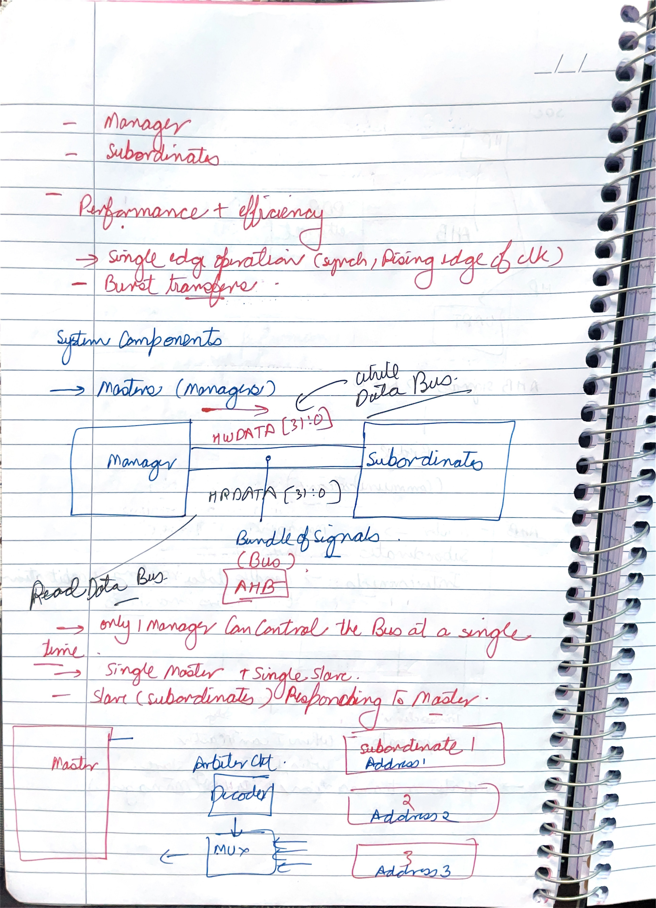

The page's request/response picture is conceptually correct. The manager
initiates; the subordinate responds. On AHB-Lite there is one manager, so the
learning design does not need arbitration between competing managers. In a
larger AHB system, address decoding and response multiplexing can sit in the
interconnect.

Use the current terms **manager** and **subordinate**. The older master/slave
terms visible in the notes and videos refer to the same protocol roles. A
manager does not decide that a transfer completed merely because it issued a
request: completion occurs only on a rising edge at which the current data
phase sees `HREADY=1`.

The interconnect is active protocol logic. During the address phase it decodes
`HADDR` and asserts one `HSELx`. During the later data phase it must return the
selected subordinate's read data and response. Because the bus is pipelined,
the selection used by the response multiplexer must be delayed so it still
refers to the older transfer. Using the new address directly would connect the
manager to the wrong subordinate's response
([Arm IHI 0033C, §§4.2-4.3](../sources/ARM-IHI-0033C-AMBA-AHB-Protocol-Specification.pdf)).

The complete responsibility split is:

| Component | Decides or drives | Must not assume |
|---|---|---|
| Manager | Address, direction, transfer type, size, burst, and write data | That issuing a transfer means it completed |
| Decoder/interconnect | Which subordinate receives the request and which response returns | That the address-phase and data-phase selections are from the same cycle |
| Subordinate | Read data or write acceptance, wait extension, and OKAY/ERROR result | That every visible address is valid; `HTRANS` and `HREADY` qualify it |

In AHB-Lite there is one manager, so arbitration is removed, but decoding,
response routing, pipelining, and wait-state behavior still remain. “Lite” does
not mean the transfer timing rules are optional.

### Original notebook page 4: interface direction in context

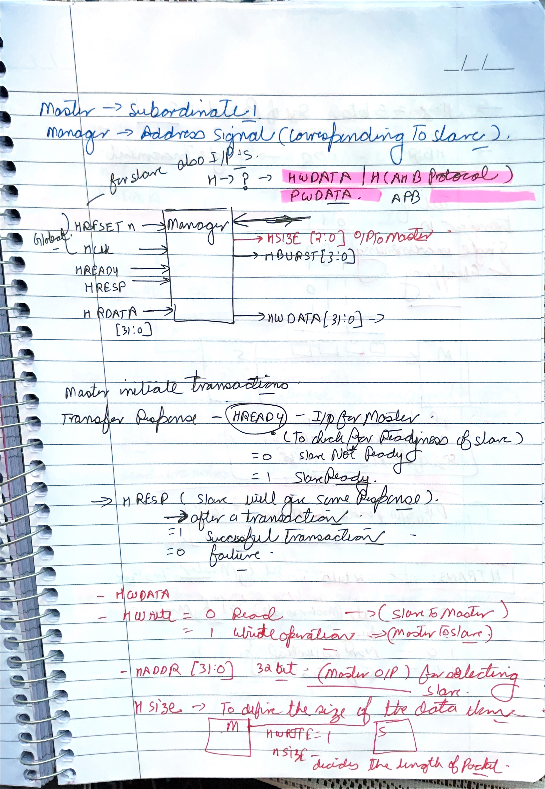

This page is most useful when read as signal ownership around one transaction.
During the address phase, the manager drives `HADDR`, `HTRANS`, `HWRITE`,
`HSIZE`, `HBURST`, and protection/control information. For a write, it drives
`HWDATA` in the following data phase. The subordinate path returns `HRDATA`,
`HREADY`, and `HRESP`.

Group the signals by the information they carry, because that reveals which
ones must be registered together:

| Information | Signals on this page | Timing meaning |
|---|---|---|
| Transfer identity | `HADDR`, `HTRANS`, `HWRITE`, `HSIZE`, `HBURST`, `HPROT` | Address-phase description generated by the manager |
| Write payload | `HWDATA` | Data for an earlier accepted write address |
| Read payload | `HRDATA` | Data from the selected subordinate for the current read data phase |
| Completion/status | `HREADY`, `HRESP` | Whether the current data phase finishes and whether it succeeds |
| Selection | `HSELx` | Decoder output that identifies the addressed subordinate |

`HREADYOUT` and `HREADY` are related but are not always the same physical
wire. Each subordinate produces its own `HREADYOUT`; the interconnect selects
the active subordinate's value and returns the manager-facing `HREADY`.
Similarly, it multiplexes `HRDATA` and `HRESP`. This distinction matters when
there is more than one subordinate
([Arm IHI 0033C, §§2.3-2.5](../sources/ARM-IHI-0033C-AMBA-AHB-Protocol-Specification.pdf)).

Two corrections prevent common RTL mistakes:

- `HRESP` is a subordinate response received by the manager, not a manager
  output.
- `HREADY` qualifies the **current data phase**. The address/control visible at
  the same time normally describes the next pipelined transfer.

Clock and reset are infrastructure signals; they do not belong to only one
transaction. `HSEL` is normally produced by address decoding for a subordinate
and is not a manager's completion indication.

At a rising edge, a subordinate accepts its address phase only when its
`HSELx` is asserted, `HTRANS` describes a valid NONSEQ/SEQ transfer, and
`HREADY` is HIGH. `HSELx` alone is insufficient because it can remain or become
asserted while an earlier transfer is extending the pipeline. This is why
direction tables are useful, but timing qualification is the part that turns a
list of ports into a functioning protocol
([Arm IHI 0033C, §§2.4 and 4.2](../sources/ARM-IHI-0033C-AMBA-AHB-Protocol-Specification.pdf)).

## 2. Basic transfer phases

### Lecture frame: read without wait states

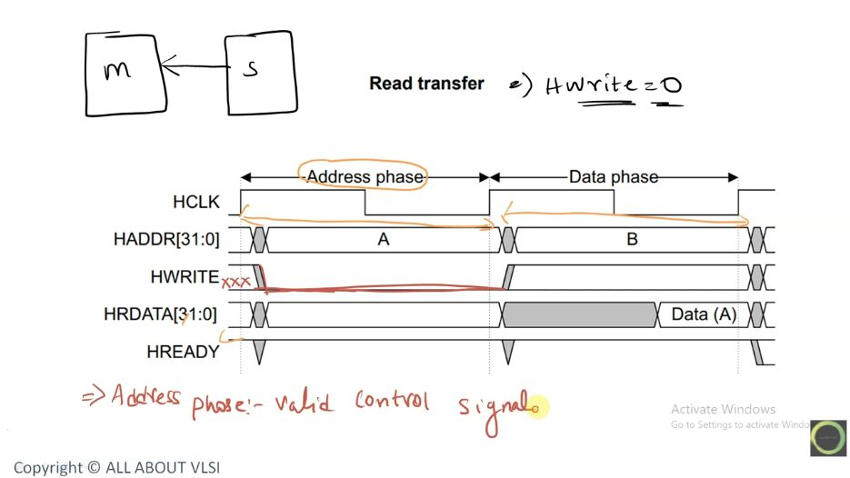

For read transfer A, the manager presents address/control in one cycle. In the
next cycle the selected subordinate returns A's `HRDATA`. Because `HREADY`
remains HIGH, the read completes on that next rising edge. Notice that another
address can already be present while A's data is returning; the data belongs to
A, not to the address currently visible.

Read the no-wait case edge by edge:

| Interval | Address-phase lane | Data-phase lane |
|---|---|---|
| Before edge 1 | The manager drives A with `HWRITE=0` and valid `HTRANS`. | An older transfer, if any, is finishing. |
| Edge 1 | A is accepted because `HREADY=1`. | The subordinate now has the registered identity of A. |
| Before edge 2 | The manager may already drive address B. | The selected subordinate drives `HRDATA(A)`. |
| Edge 2 | B can be accepted. | A completes and the manager samples `HRDATA(A)`. |

“No wait” means the data phase uses its minimum one cycle. It does not collapse
the address and data phases into one cycle. This exact two-lane sequence is the
official basic-transfer model
([Arm IHI 0033C, §3.1](../sources/ARM-IHI-0033C-AMBA-AHB-Protocol-Specification.pdf)).

### Original notebook page 5: `HTRANS` makes a transfer valid

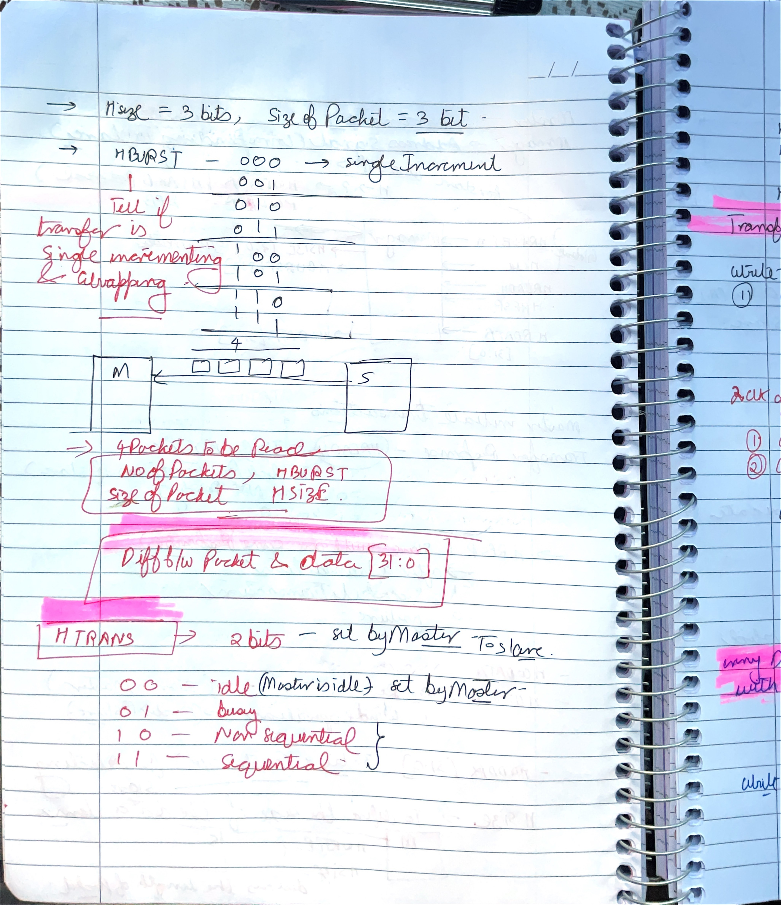

The page records the four `HTRANS` values. Interpret them in the waveform, not
as an isolated list:

- `IDLE (00)` means no data transfer is required for that address phase.
- `BUSY (01)` lets a manager delay the next beat of a burst without terminating
  the burst.
- `NONSEQ (10)` starts a transfer unrelated to the preceding transfer, so it is
  used for a SINGLE or the first beat of a burst.
- `SEQ (11)` continues the current burst.

Only encodings with `HTRANS[1]=1` describe valid transfers. `HTRANS` belongs to
the address phase and is accepted only when `HREADY` permits that phase to
advance ([Arm IHI 0033C, §3.2](../sources/ARM-IHI-0033C-AMBA-AHB-Protocol-Specification.pdf)).

`HTRANS` exists because a physical address value can be present even when no
transfer is intended. The subordinate must not infer validity from `HADDR`
alone. NONSEQ or SEQ says “this address phase requests a data phase”; IDLE or
BUSY says “do not create a data transfer from this address phase.” This is why
the high bit, `HTRANS[1]`, is a useful valid-transfer test.

The two non-data encodings have different meanings. IDLE says there is no
active sequence to preserve. BUSY says a burst is still active, and its address
and control must describe the next beat even though the subordinate ignores the
BUSY transfer itself. Both IDLE and BUSY receive a zero-wait OKAY response, but
data visible in the same cycle can still belong to the preceding valid beat.
Therefore, “BUSY transfers no new data” does not mean “nothing is happening on
the data bus” ([Arm IHI 0033C, §3.2](../sources/ARM-IHI-0033C-AMBA-AHB-Protocol-Specification.pdf)).

For the SINGLE sketch on this page, the one useful address phase must be
NONSEQ. The following address phase can be IDLE if no command follows, or a new
NONSEQ if another unrelated command starts. It cannot be SEQ because a SINGLE
has no continuation beat.

### Original notebook page 6: one transfer, two phases

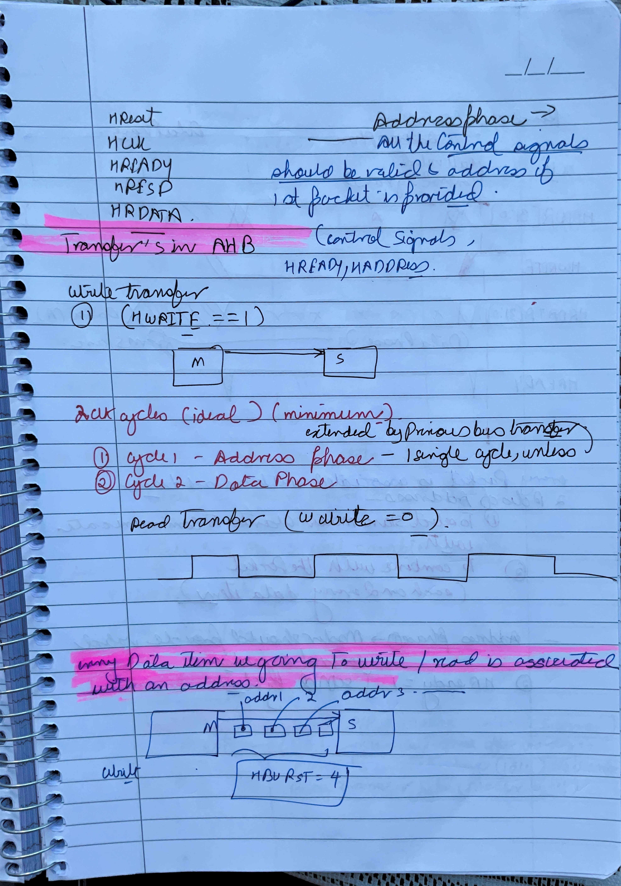

The page correctly separates address/control from data. The deeper point is
that the phases can overlap with neighboring transfers:

```text
Cycle             C1               C2               C3
Address bus       A                B                C
Data bus          -                data(A)          data(B)
```

For a write, the manager must keep A's write data valid through A's entire data
phase. For a read, the subordinate must provide A's read data by the edge that
completes A. `HREADY=0` stretches C2; it does not create a new transfer.

The overlap creates an important storage requirement. At the edge that accepts
address A, the selected subordinate and interconnect must remember enough of A
to complete its later data phase. At the same time, the manager may prepare B.
The wires do not carry an explicit transaction tag, so clocked phase alignment
is what keeps `data(A)` associated with address A.

Now extend A's data phase for one wait cycle:

```text
Cycle             C1               C2               C3               C4
Address bus       A                B                B                C
Data phase        -                A(wait)          A(done)          B
HREADY            1                0                1                1
```

B remains visible across C2-C3 because the pipeline cannot accept a different
valid next address while A is incomplete. For a write A, `HWDATA(A)` also
remains stable across the wait. For a read A, `HRDATA(A)` only has to be valid
in the final cycle in which `HREADY=1`
([Arm IHI 0033C, §§3.1 and 6.1](../sources/ARM-IHI-0033C-AMBA-AHB-Protocol-Specification.pdf)).

### Original notebook page 7: read transfer without a wait

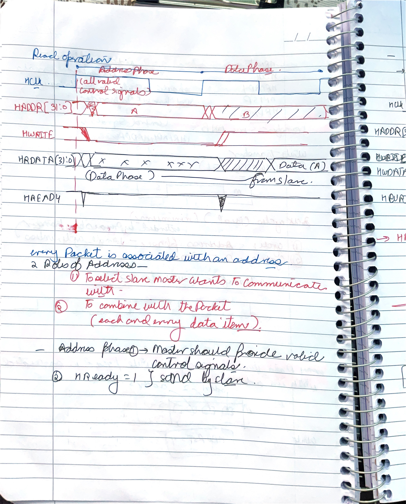

The page's read waveform should be traced from the rising edge where address A
and `HWRITE=0` are accepted. A's `HRDATA` is sampled one cycle later while
`HREADY=1`. The manager must never sample read data in the address phase simply
because an address is visible there.

If an error response were returned, the response would belong to the same data
phase as `HRDATA`. A no-wait example is therefore the minimum-latency case, not
a different kind of read.

The page's two labels, A for address and data, describe one transaction across
two cycles. A correct read path therefore needs three decisions:

1. Decode A during its accepted address phase.
2. Select the addressed storage/register and prepare its data.
3. Present the value on `HRDATA` and assert completion in A's data phase.

The manager samples the payload only on A's completion edge. `HRDATA` may have
some electrical value earlier, but the protocol does not make that value the
read result. If a subordinate extends the transfer, it may continue calculating
and need only provide valid read data in the final cycle
([Arm IHI 0033C, §§3.1 and 6.1.2](../sources/ARM-IHI-0033C-AMBA-AHB-Protocol-Specification.pdf)).

This also explains why the next address B does not select B's data too early.
The response multiplexer is controlled by the remembered data-phase selection
for A. The decoder can simultaneously examine B for the next address phase.

### Lecture frame: write without wait states

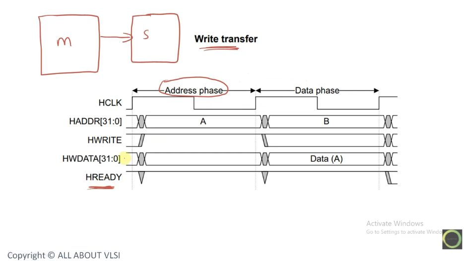

The waveform shows address A first and `HWDATA(A)` in the following cycle. This
one-cycle displacement is essential: write data belongs to the data phase and
must not be paired with whichever later address happens to share the wires at
that moment.

At the edge accepting A, the manager must save or already possess A's payload.
During the next cycle it drives that payload on `HWDATA`, while `HADDR` may
describe B. The selected subordinate accepts the write only when A's data phase
finishes with `HREADY=1`. This is why a design that drives `HWDATA` directly
from the “current address command” often shifts every payload by one transfer.

No-wait timing gives one accepted write per cycle after the pipeline is full,
but the first write still has one address cycle followed by its data cycle.
Throughput and single-transfer latency are different quantities.

### Original notebook page 8: write completion and response

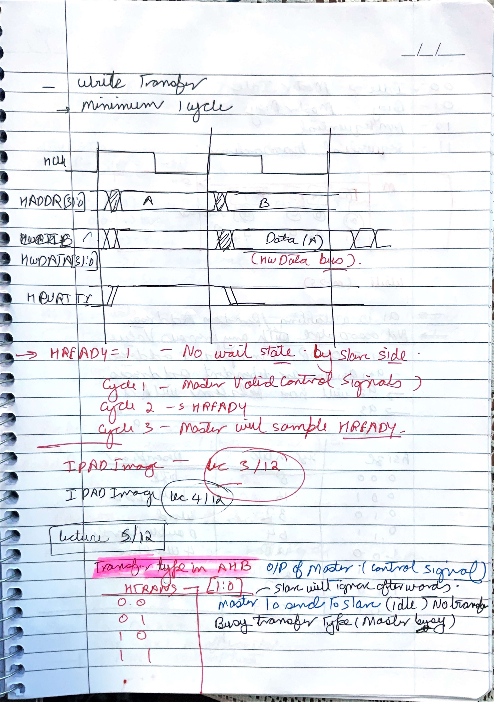

The notes associate `HREADY` with wait insertion and `HRESP` with success or
error. In the AHB-Lite response encoding used here, `HRESP=0` is OKAY and
`HRESP=1` is ERROR. Read the two together at completion: a manager consumes
the response for the current data phase when `HREADY=1`.

For a write, the subordinate accepts `HWDATA` only when that write's data phase
completes. If `HREADY=0`, the manager must keep the data stable; incrementing a
counter or replacing `HWDATA` each clock would corrupt the transaction.

The complete response is the pair `HRESP` plus readiness, not `HRESP` alone:

| `HRESP` | `HREADY` | Meaning for the current data phase |
|---:|---:|---|
| `0` | `0` | Transfer pending; the subordinate needs another cycle |
| `0` | `1` | Successful completion, OKAY |
| `1` | `0` | First cycle of the required two-cycle ERROR response |
| `1` | `1` | Final ERROR cycle; the failed transfer completes |

During ordinary wait states the subordinate keeps the response at OKAY and
uses readiness to say “pending.” An AHB ERROR is deliberately two cycles so the
manager has time to cancel the already-pipelined next address by changing its
transfer type to IDLE. Therefore, “`HRESP=1` means error” is correct but
incomplete unless it is interpreted with `HREADY`
([Arm IHI 0033C, §§5.1.1-5.1.3](../sources/ARM-IHI-0033C-AMBA-AHB-Protocol-Specification.pdf)).

For RTL, a useful write-completion enable is conceptually
`data_phase_valid && HREADY`. On that edge the design can retire the write,
inspect `HRESP`, and advance its command bookkeeping. Before that edge, all
state needed for the write remains live.

## 3. Pipelining and multiple transfers

### Lecture frame: address/data overlap

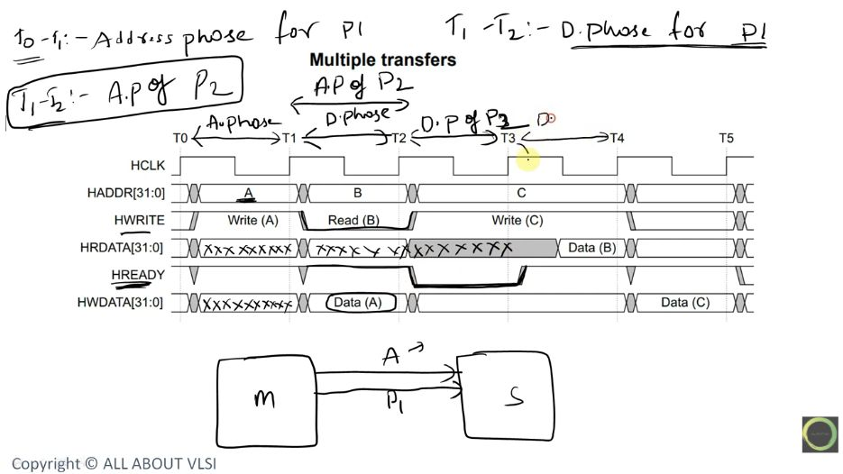

The frame demonstrates the throughput benefit of AHB. After the pipeline is
filled, one transfer can complete per clock even though each individual
transfer has two phases. At a given cycle, label the address and data rows with
different transfer letters before interpreting any data value.

Pipelining improves steady-state throughput by doing two different jobs in the
same clock interval: decode the next address and complete the previous data.
It does not duplicate the bus or let responses return out of order. If transfer
B waits, the address phase of C is extended too, so the single pipeline remains
ordered ([Arm IHI 0033C, §§3.1 and 3.7](../sources/ARM-IHI-0033C-AMBA-AHB-Protocol-Specification.pdf)).

### iPad page 2: annotated multiple-transfer waveform

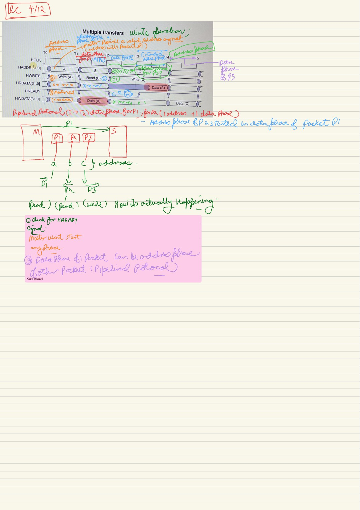

The colored A, B, C, and D annotations correctly show that an address appears
one cycle before its associated data. The page also captures the practical
reason for pipelining: address decoding for the next access overlaps the data
movement of the current access.

Do not say that AHB has several outstanding transactions in this simple sense.
The pipeline overlaps phases, but transfer ordering remains defined and the
current `HREADY` governs advancement.

Use the page's letter annotations as a bookkeeping table:

| Cycle | Address lane | Data lane | Event at the ending edge |
|---:|---|---|---|
| 1 | A | - | Accept address A |
| 2 | B | A | Complete A and accept B |
| 3 | C | B | Complete B and accept C |
| 4 | D | C | Complete C and accept D |
| 5 | IDLE/new work | D | Complete D |

Each row can advance only if `HREADY=1`. If it becomes LOW in cycle 3, the B
data phase and C address phase stay in the same row for another cycle. This is
the exact operational meaning of the handwritten pipeline arrows.

The hardware implication is that control for A cannot be discarded when B
appears on `HADDR`. At minimum, the data-phase logic retains A's direction and
any local metadata until A completes. That is phase overlap, not a pool of
independently reorderable transactions
([Arm IHI 0033C, §3.1](../sources/ARM-IHI-0033C-AMBA-AHB-Protocol-Specification.pdf)).

### Lecture frame: all four transfer types in time

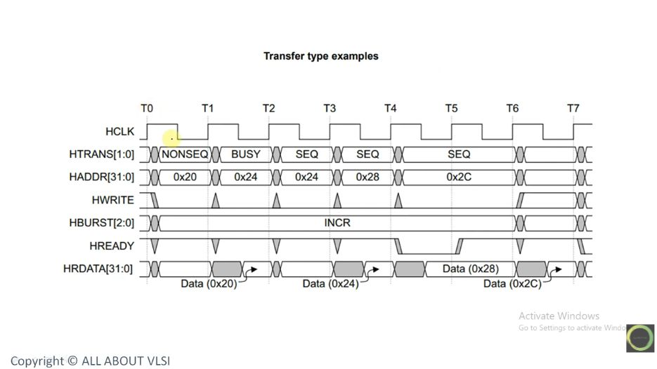

Here `NONSEQ` begins useful work, `SEQ` continues a burst, `BUSY` creates a gap
without abandoning that burst, and `IDLE` means no useful transfer is
requested. A BUSY address/control phase is ignored by the subordinate, but the
data phase occurring simultaneously may still belong to the previous valid
beat and must still complete correctly.

For example, when a BUSY address phase is visible while the first read beat is
in its data phase, the subordinate ignores BUSY as a new request but still
returns the first beat's `HRDATA`. When the manager later changes BUSY to SEQ,
that SEQ address phase creates the next data beat. The address and data rows
must always be interpreted independently before combining them.

### Original notebook page 9: transfer type and size belong to a beat

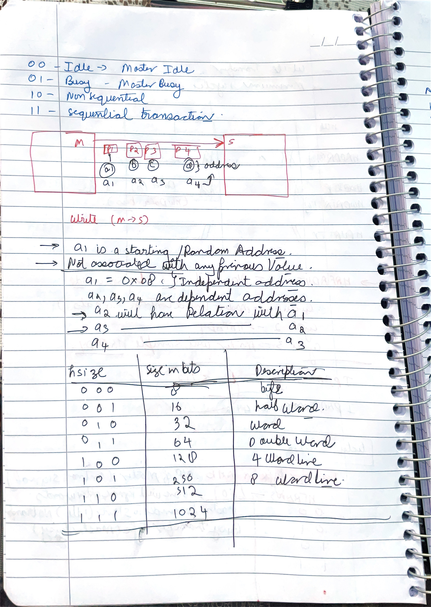

The page combines `HTRANS` with the `HSIZE` encoding. `HSIZE` says how many
bytes the current beat transfers: byte, halfword, word, and so on. For the
32-bit word examples, `HSIZE=3'b010`, so successive incrementing addresses are
four bytes apart.

The next address step is therefore not always `+1` and not always `+4`; it is

$$
S=2^{\texttt{HSIZE}}\text{ bytes}.
$$

The transfer address must be aligned to that size. A word transfer needs
`HADDR[1:0]=2'b00` ([Arm IHI 0033C, §3.4](../sources/ARM-IHI-0033C-AMBA-AHB-Protocol-Specification.pdf)).

`HSIZE` answers “how many bytes are meaningful in this beat,” while the data
bus width answers “how many bits are physically available.” A 32-bit bus can
carry byte, halfword, or word transfers; it cannot legally carry a wider beat.
For a narrow transfer, `HADDR` and `HSIZE` together identify the active byte
lanes. The address still represents a byte address.

For the page's sequence starting at `0x20`:

| `HSIZE` | Bytes per beat | First four incrementing addresses |
|---:|---:|---|
| `000` byte | 1 | `0x20, 0x21, 0x22, 0x23` |
| `001` halfword | 2 | `0x20, 0x22, 0x24, 0x26` |
| `010` word | 4 | `0x20, 0x24, 0x28, 0x2C` |

All three begin at an address aligned to their transfer size. `HSIZE` remains
constant for every beat of one burst, because changing the step mid-burst would
destroy the meaning of SEQ
([Arm IHI 0033C, §§3.2 and 3.4](../sources/ARM-IHI-0033C-AMBA-AHB-Protocol-Specification.pdf)).

### iPad page 3: SINGLE versus INCR4

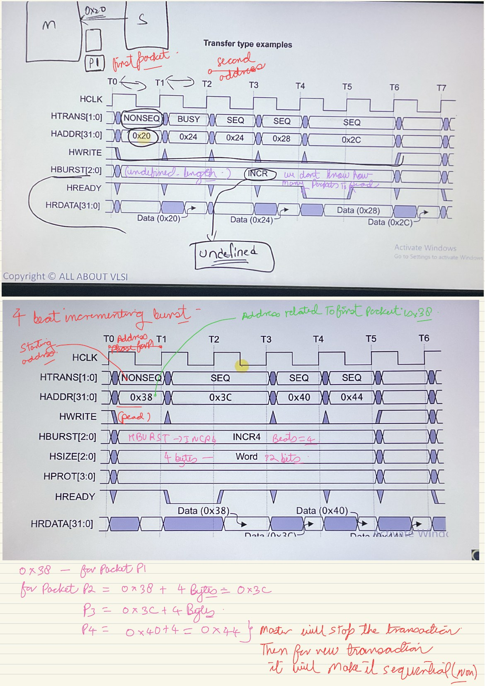

The upper example uses a single `NONSEQ` transfer. The lower example starts an
INCR4 burst with `NONSEQ` and follows with three `SEQ` beats. That is why a
manager cannot drive `SEQ` as the first beat: the subordinate needs `NONSEQ` to
recognize a new address sequence.

The handwritten address sequence `0x38, 0x3C, 0x40, 0x44` is correct for four
word beats. `HBURST` identifies the burst form; `HSIZE` supplies the step.

The fixed-length INCR4 promise is more than an address pattern. Once the first
NONSEQ beat is accepted, three actual SEQ beats must complete unless an allowed
early-termination condition such as an ERROR occurs. BUSY can delay a beat, but
BUSY is not counted as one of the four data transfers. Likewise, wait cycles
extend one beat and do not increase the beat count.

A safe manager updates the address and accepted-beat count only when the data
pipeline advances. For a valid burst beat, the conceptual enable is
`HTRANS[1] && HREADY`; the next address is then current address plus four bytes
for this word example. This connects the annotations directly to the RTL
counter rather than leaving them as waveform labels
([Arm IHI 0033C, §§3.2 and 3.6](../sources/ARM-IHI-0033C-AMBA-AHB-Protocol-Specification.pdf)).

## 4. Burst length, size, and wrapping

### Lecture frame: an INCR4 word burst

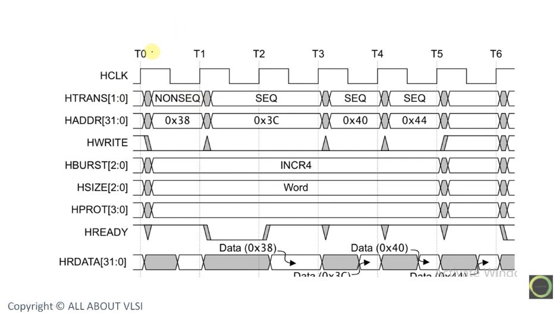

This frame should be read beat by beat. `HBURST=INCR4` fixes four beats,
`HSIZE=word` fixes four bytes per beat, and `HTRANS` changes from NONSEQ to SEQ.
`HBURST` and `HSIZE` remain constant through the burst; only the address and
beat-related data advance on accepted transfers.

For the word-address sequence shown, the address phases are accepted as
NONSEQ `0x38`, then SEQ `0x3C`, `0x40`, and `0x44`. The corresponding data
phases appear one cycle later. If the first data phase waits, the second address
remains held; the sequence does not skip to `0x40`. A fixed burst counts four
accepted valid transfers, not four elapsed clocks
([Arm IHI 0033C, §§3.6 and 3.6.3](../sources/ARM-IHI-0033C-AMBA-AHB-Protocol-Specification.pdf)).

Throughout one burst, `HWRITE`, `HSIZE`, and the address-control description
remain consistent. `HTRANS` is the part that distinguishes the first beat from
continuations: NONSEQ opens the sequence and SEQ says the new address is
related to the previous beat.

### Original notebook page 10: controls determine the packet addresses

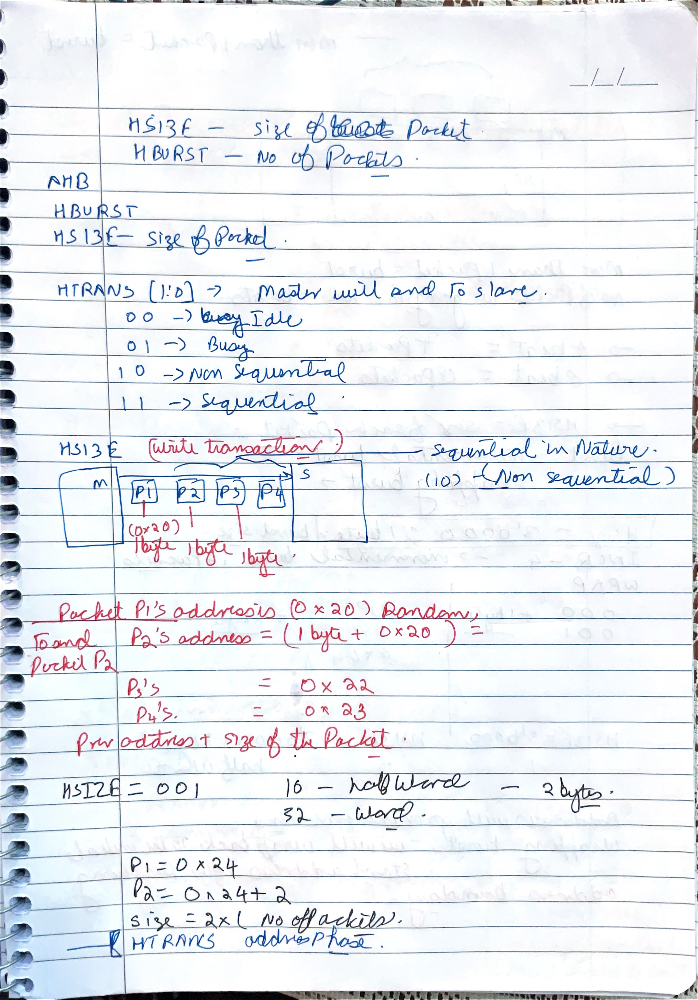

The page brings `HSIZE`, `HBURST`, and `HTRANS` together. This is the correct
way to calculate addresses. For a fixed-length burst:

$$
\text{payload bytes}=N_{\text{beats}}\times 2^{\texttt{HSIZE}}.
$$

Here $N_{\text{beats}}$ is the number of data transfers encoded by `HBURST`,
and $2^{\texttt{HSIZE}}$ is the number of bytes in each beat.

That product is also the wrap-region size for a wrapping burst. It is **not**
the address step: the step remains one beat, $2^{\texttt{HSIZE}}$ bytes.

The three controls answer different questions and must not be collapsed into
one “burst” signal:

| Control | Question answered | Word INCR4 example |
|---|---|---|
| `HSIZE` | How many bytes are in each beat? | `010` means 4 bytes |
| `HBURST` | How many beats and increment or wrap? | `011` means 4 incrementing beats |
| `HTRANS` | Is this address the first beat, a continuation, or no beat? | NONSEQ, then SEQ, SEQ, SEQ |

For an INCR4 word burst starting at `0x20`, the four addresses are `0x20`,
`0x24`, `0x28`, and `0x2C`. The payload is 16 bytes, but the address advances
by 4 bytes per beat. For WRAP4 with the same size, the payload is still 16
bytes, but an address that would leave the aligned 16-byte region wraps to its
base. `HBURST` decides which of those two address rules applies
([Arm IHI 0033C, §§3.2, 3.4, and 3.6](../sources/ARM-IHI-0033C-AMBA-AHB-Protocol-Specification.pdf)).

The manager normally computes the next address only after the current address
phase is accepted. This prevents a LOW `HREADY` from causing repeated internal
increments while the external bus still shows the same beat.

### Original notebook page 11: boundary grows with size and beat count

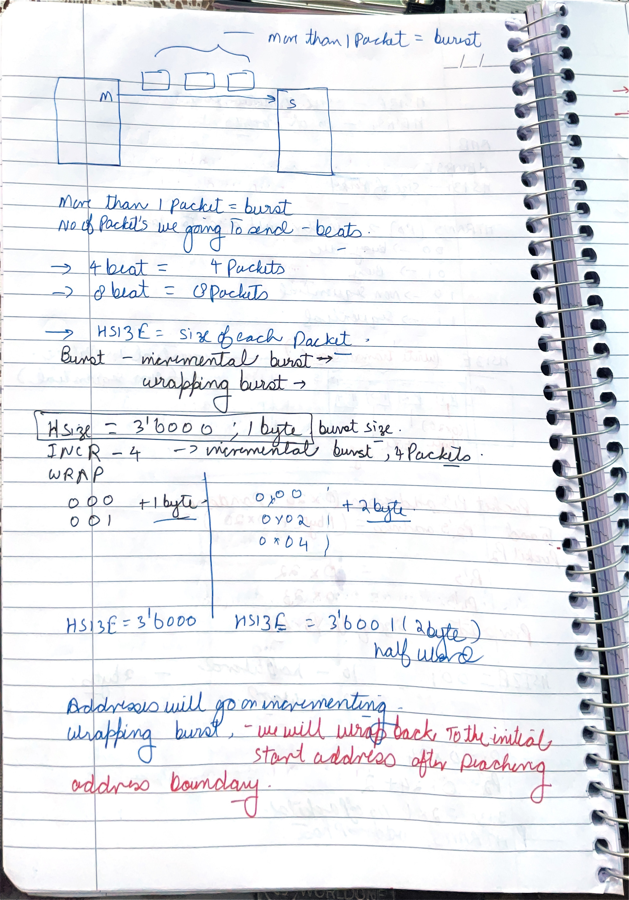

The examples compare bursts using different transfer sizes. They are useful
because the same number of beats can cover different byte ranges. Four byte
beats cover four bytes, four halfword beats cover eight bytes, and four word
beats cover sixteen bytes.

There are two alignment requirements to keep separate:

1. Every transfer address is aligned to the transfer size.
2. A wrapping burst wraps inside a region aligned to the complete wrap size.

The start address may be any size-aligned address inside that wrap region; it
does not have to be the lowest address in the region.

Use the page's byte, halfword, and word cases as a two-step calculation. First
calculate the step $S=2^{\texttt{HSIZE}}$. Then multiply by the encoded beat
count to get the wrap-region width:

| WRAP4 size | Step $S$ | Region width | Required beat alignment |
|---|---:|---:|---|
| Byte | 1 byte | 4 bytes | Address can end in any bit pattern |
| Halfword | 2 bytes | 8 bytes | `HADDR[0]=0` |
| Word | 4 bytes | 16 bytes | `HADDR[1:0]=00` |

For a WRAP4 word burst beginning at `0x38`, the aligned 16-byte region is
`0x30-0x3F`. Incrementing gives `0x38`, `0x3C`, then the candidate `0x40` lies
outside the region, so it wraps to `0x30`, followed by `0x34`. The starting
address is legal because it is word-aligned even though it is not the region
base.

Do not confuse this local wrap region with the 1-KiB system rule. AHB allocates
subordinate address regions on 1-KiB boundaries, so incrementing bursts must
not cross such a decode boundary. The 16-byte WRAP4-word region instead defines
the order of addresses inside that burst
([Arm IHI 0033C, §§3.6 and 4.2](../sources/ARM-IHI-0033C-AMBA-AHB-Protocol-Specification.pdf)).

### Original notebook page 12: `HBURST` and the completion gate

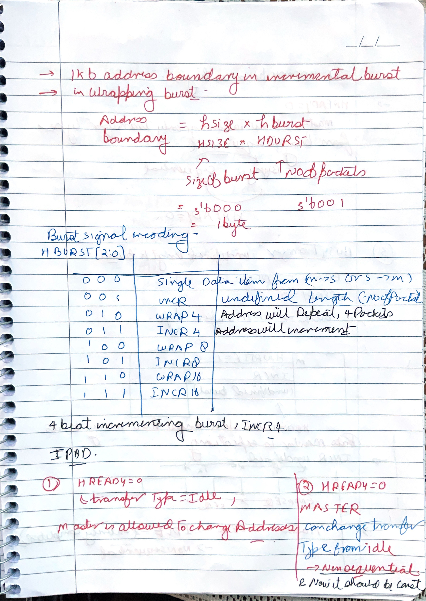

The fixed burst encodings distinguish SINGLE, INCR, WRAP4/8/16, and
INCR4/8/16. These encodings set the expected sequence, but they do not override
`HREADY`. A beat counter advances only when a valid beat completes. If a
four-beat burst sees two wait cycles, it is still a four-beat burst; the wait
cycles are extensions, not extra beats.

The specification also requires incrementing bursts not to cross a 1-KiB
address boundary. That system-level rule is separate from a WRAP4 word burst's
16-byte wrap region ([Arm IHI 0033C, §3.6](../sources/ARM-IHI-0033C-AMBA-AHB-Protocol-Specification.pdf)).

`HBURST` also creates an obligation. A fixed INCR4, WRAP4, INCR8, WRAP8,
INCR16, or WRAP16 burst cannot simply stop with BUSY; its last actual beat is a
SEQ transfer. SINGLE has one NONSEQ beat and cannot be followed by BUSY. An
undefined INCR is different because no fixed final count was promised
([Arm IHI 0033C, §§3.6.1-3.6.2](../sources/ARM-IHI-0033C-AMBA-AHB-Protocol-Specification.pdf)).

The page's `HREADY` note should become two separate RTL enables:

- address-issued state advances when a valid address phase is accepted;
- data-completed state advances when the registered valid data phase sees
  `HREADY=1`.

Those events can occur on the same clock for different beats. A single counter
can be used in a deliberately small design, but only if its meaning is defined
clearly. Counting raw clock edges will miscount every waited transfer.

### Lecture frame: mixed transfers in an undefined INCR sequence

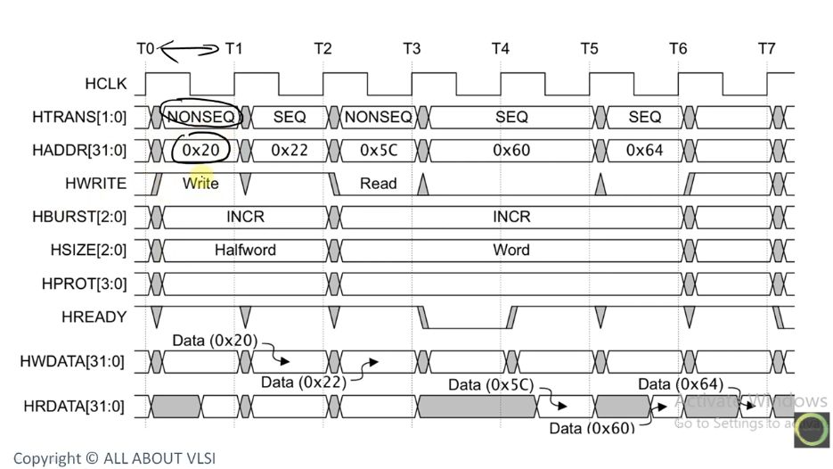

An undefined-length INCR burst has no fixed beat count encoded in `HBURST`.
That makes its termination rules different from a fixed INCR4. The waveform
can insert BUSY and later end the sequence with IDLE or begin unrelated work
with NONSEQ. It must still keep one `HSIZE` value throughout the burst.

The subordinate does not need an internal “remaining beats” count for undefined
INCR. It recognizes the first NONSEQ beat and then treats accepted SEQ beats as
continuations. BUSY says the manager intends to continue but is not issuing a
data beat now. An accepted IDLE ends useful activity; an accepted NONSEQ starts
an unrelated sequence. Thus the transfer-type stream carries the burst's
continuation information
([Arm IHI 0033C, §§3.2 and 3.6.3](../sources/ARM-IHI-0033C-AMBA-AHB-Protocol-Specification.pdf)).

### iPad page 4: WRAP4 word boundary

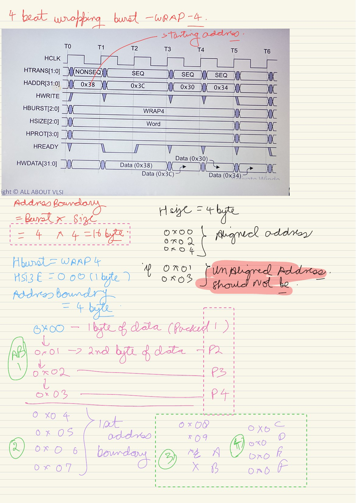

The page identifies the correct product for a four-beat word burst:

$$
B_{\text{wrap}}=4\text{ beats}\times4\text{ bytes}=16\text{ bytes}.
$$

The note calling addresses such as `0x01`, `0x02`, and `0x03` unaligned for a
word transfer is correct. A starting address such as `0x04` is word-aligned,
even though it is not the base of the 16-byte wrap region. Alignment to the
beat size and membership in the wrap region are different tests.

For the word case, the low two address bits choose a byte inside a word and
must be `00`. The next two bits choose one of four word positions inside the
16-byte wrap region. The higher bits identify the region and stay unchanged
for the entire WRAP4 burst. This is why wrapping changes a bounded group of low
address bits instead of clearing the whole address.

Starting at `0x0C` makes the distinction visible. It is word-aligned, so it is a
legal first beat. Adding four produces `0x10`, which exits the aligned
`0x00-0x0F` region, so the next beat wraps to `0x00`; the sequence continues
`0x04`, `0x08`. The protocol preserves four unique word locations inside one
region
([Arm IHI 0033C, §3.6](../sources/ARM-IHI-0033C-AMBA-AHB-Protocol-Specification.pdf)).

### iPad page 5: wrapping from a non-base start address

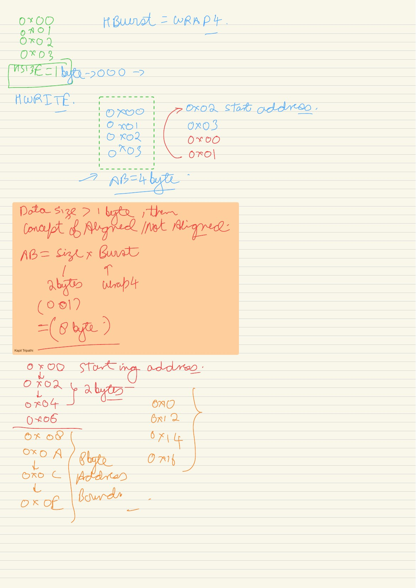

For a WRAP4 halfword burst, each beat is two bytes and the wrap region is eight
bytes. Starting at `0x04` produces `0x04, 0x06, 0x00, 0x02` inside the aligned
`0x00-0x07` region. Starting at `0x0A` uses the aligned `0x08-0x0F` region and
produces `0x0A, 0x0C, 0x0E, 0x08`.

The general calculation is:

$$
A_{k+1}=A_{\text{base}}+
\left((A_k-A_{\text{base}}+S)\bmod B_{\text{wrap}}\right),
$$

where $A_k$ is the current beat address, $A_{k+1}$ is the next beat address,
$S$ is bytes per beat, $B_{\text{wrap}}$ is the wrap-region width in bytes,
and $A_{\text{base}}$ is the start of that aligned region.

For start `0x0A`, compute the quantities explicitly. `HSIZE=halfword` gives
$S=2$ bytes. WRAP4 gives $B_{\text{wrap}}=4\times2=8$ bytes. Clearing the low
three address bits of `0x0A` gives region base `0x08`. The addresses then walk
through offsets `2, 4, 6, 0`, producing `0x0A, 0x0C, 0x0E, 0x08`.

This method is safer than memorizing a sample sequence because it works for any
legal starting point. It also supplies two verification checks: every address
must remain halfword-aligned, and every address must remain between the same
region base and base plus seven
([Arm IHI 0033C, §§3.4 and 3.6](../sources/ARM-IHI-0033C-AMBA-AHB-Protocol-Specification.pdf)).

### iPad page 6: WRAP4 and WRAP8 use different regions

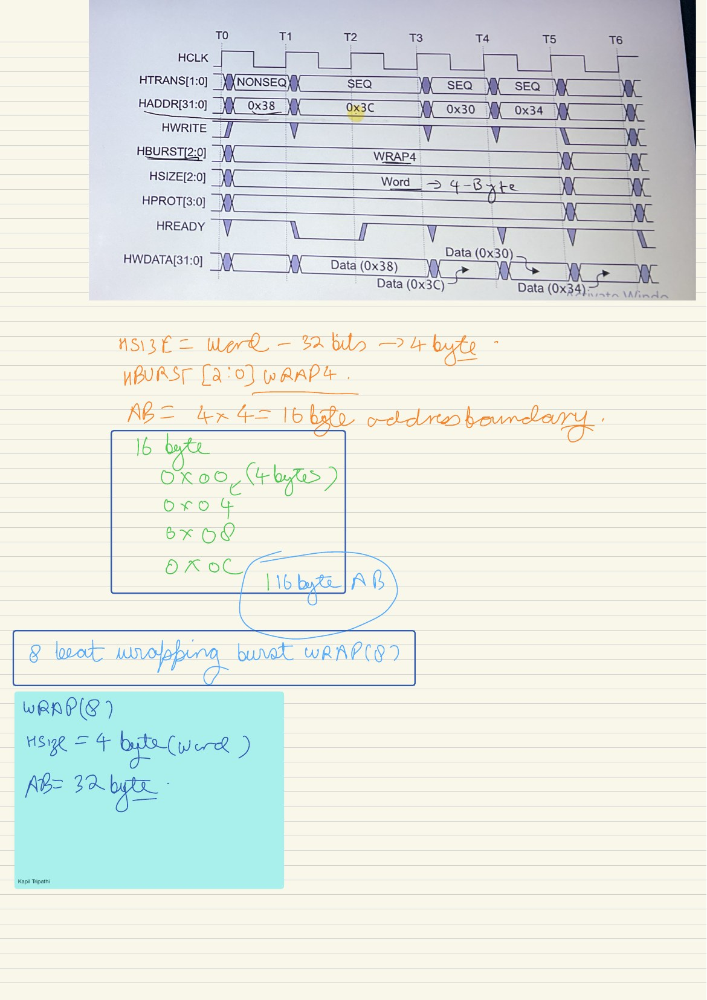

The WRAP4 word example uses a 16-byte region. A WRAP8 word burst uses a
32-byte region because $8\times4=32$ bytes. This is why RTL must derive the
mask or modulo boundary from both `HBURST` and `HSIZE`; a hard-coded four-bit
mask works only for the WRAP4-word case.

For power-of-two boundaries, the number of low address bits participating in
the wrap is $\log_2(B_{\text{wrap}})$. WRAP4 words use 4 low bits because the
region is 16 bytes; WRAP8 words use 5 low bits because the region is 32 bytes.
The low two bits still remain zero for word alignment, while the remaining low
region bits select the beat position.

In hardware, compute or decode the region width once from `HBURST` and `HSIZE`,
retain the upper region bits, and update the lower offset modulo the boundary.
This directly implements the annotated boxes on this page and avoids a special
case tied to one starting address
([Arm IHI 0033C, §3.6](../sources/ARM-IHI-0033C-AMBA-AHB-Protocol-Specification.pdf)).

### iPad page 7: undefined-length INCR

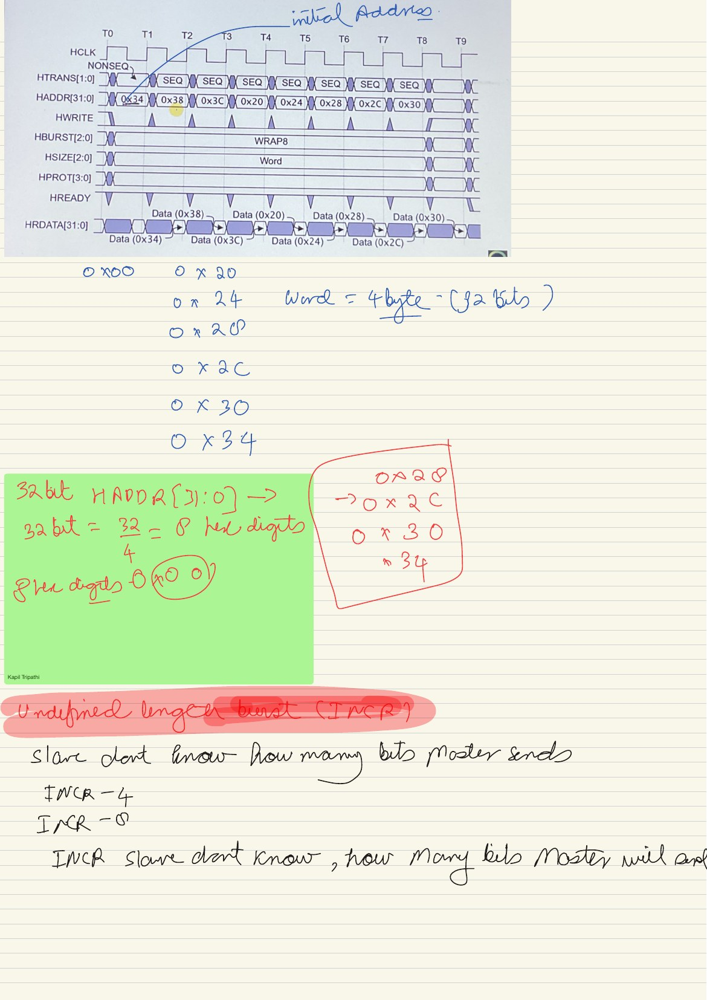

The page's key idea is that the subordinate does not know the final beat count
of an undefined INCR burst from `HBURST`. It observes transfer types. Continued
`SEQ` beats remain part of the burst; an accepted IDLE or NONSEQ ends that
sequence. BUSY may create a temporary gap without itself moving data.

The page is showing a difference in **knowledge**. With INCR4, both sides know
that four data beats are intended. With undefined INCR, only the manager knows
when it will stop. The subordinate learns continuation from each accepted
`HTRANS` value. It must therefore handle any legal number of SEQ beats rather
than assuming a hidden fixed count.

If BUSY is visible while `HREADY=0`, undefined INCR permits the manager to
change BUSY to SEQ, IDLE, or NONSEQ. SEQ continues the old burst; IDLE or NONSEQ
terminates it. Once a valid replacement such as NONSEQ is presented, it must
remain stable until the bus advances
([Arm IHI 0033C, §§3.6.1 and 3.7.1](../sources/ARM-IHI-0033C-AMBA-AHB-Protocol-Specification.pdf)).

### iPad page 8: transfer size is stable within a burst

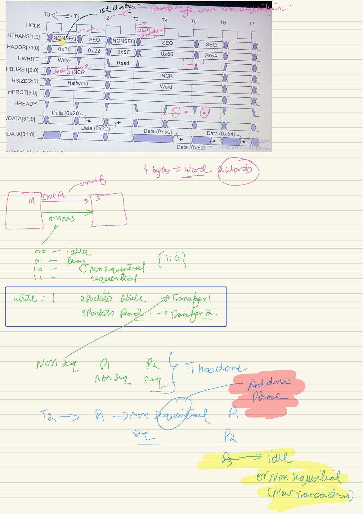

The notes correctly flag that beat size cannot be changed halfway through a
burst. The manager chooses `HSIZE` in the first NONSEQ address phase and keeps
it for the remaining SEQ beats. A new size requires a new transfer sequence,
normally beginning with NONSEQ.

The reason is not just simpler counting. SEQ means its address and control are
related to the previous beat: the next address equals the previous address plus
the same transfer size, subject to wrapping. If `HSIZE` changed, neither the
address relation nor the wrap boundary would remain well-defined. The official
rule therefore requires `HSIZE` to remain constant throughout the burst
([Arm IHI 0033C, §§3.2 and 3.4](../sources/ARM-IHI-0033C-AMBA-AHB-Protocol-Specification.pdf)).

To perform a word access followed by a halfword access, end the first sequence
and start a new NONSEQ transfer with the new `HSIZE`. The visible size change
then has an unambiguous boundary: it belongs to a new transaction sequence, not
to a continuation beat.

## 5. Wait states, IDLE, and BUSY

### Lecture frame: read with two wait states

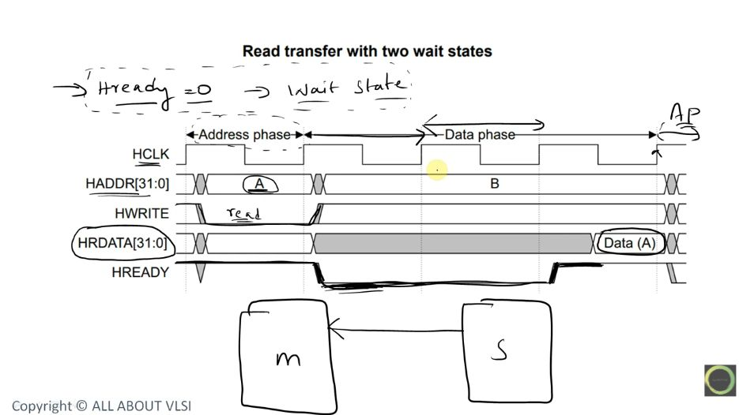

The read's data phase lasts until the final HIGH `HREADY`. During the LOW
cycles, the subordinate has not completed the transfer and the manager must
not sample `HRDATA` as final. Address/control for the pipelined next transfer
also remains held.

Suppose A is the read in its data phase and B is the valid next address. During
each LOW-ready cycle, A is still the same unfinished read and B is still the
same unaccepted next address. The subordinate may change `HRDATA(A)` while it
is working; the manager samples only the value presented in the final cycle
where `HREADY=1`. By contrast, B's valid address/control must remain stable
because accepting a different B on each wait cycle would lose transaction
identity
([Arm IHI 0033C, §§3.1 and 6.1.2](../sources/ARM-IHI-0033C-AMBA-AHB-Protocol-Specification.pdf)).

Two wait states add two cycles to latency but add zero transfers. The completion
event occurs once, at the final HIGH-ready edge. Any `read_valid` or local
response pulse should therefore be generated once from that edge, not once per
cycle that the data-phase register is occupied.

### Lecture frame: write with one wait state

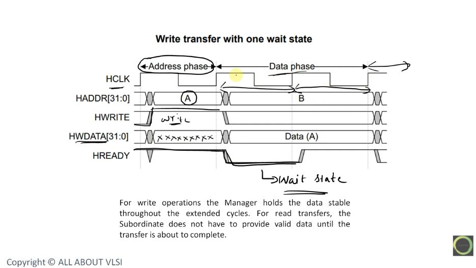

For a waited write, both the address/control for the next transfer and the
current write's `HWDATA` remain stable. The held address and held write data can
belong to different transfers because of the pipeline; annotate transfer names
before checking stability.

If write A is waiting while address B is visible, the manager holds
`HWDATA(A)` because A has not been accepted by the subordinate, and it holds
the valid address/control for B because the pipeline has not advanced. These
values are stable for different reasons and belong to different transfers.
Labeling both as merely “the current transaction” hides the pipeline error the
waveform is meant to teach.

When `HREADY` finally rises, two things can happen on that same edge: A's write
data is accepted and B's address phase is accepted. Only after that edge may
the manager drive the payload for B and a new address C
([Arm IHI 0033C, §§3.1 and 6.1.1](../sources/ARM-IHI-0033C-AMBA-AHB-Protocol-Specification.pdf)).

### iPad page 1: writing through a wait state

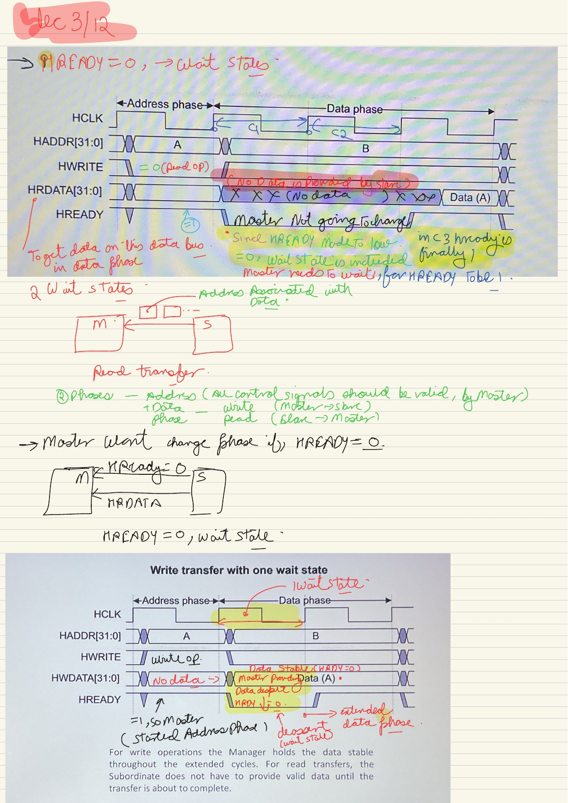

The page correctly emphasizes that a manager cannot change phase while
`HREADY=0`. More precisely, it holds the current data-phase information and the
next address-phase information. When `HREADY` returns HIGH, the current data
phase completes and the pipelined address may advance together on that edge.

The write-data annotation is valuable: data A remains on `HWDATA` across the
wait. Data B cannot replace it until A's data phase has completed.

Translate the annotated waveform into retained state:

| State item | Why it is held while `HREADY=0` |
|---|---|
| A's `HWDATA` | The subordinate has not yet accepted write A |
| A's data-phase-valid bit | The manager still expects completion/response for A |
| B's `HADDR` and control | B's address phase has not yet been accepted |
| Burst position | No actual beat completed, so the sequence cannot move |

The manager does not need to “repeat” A as a new transfer on every wait cycle.
It simply leaves the existing data phase active. This distinction prevents a
peripheral from seeing multiple writes when it intended to delay one write.
Arm defines stability at sampled rising edges across an extended transfer
([Arm IHI 0033C, §§3.1 and 7.1.1](../sources/ARM-IHI-0033C-AMBA-AHB-Protocol-Specification.pdf)).

### Original notebook page 13: waits do not change burst length

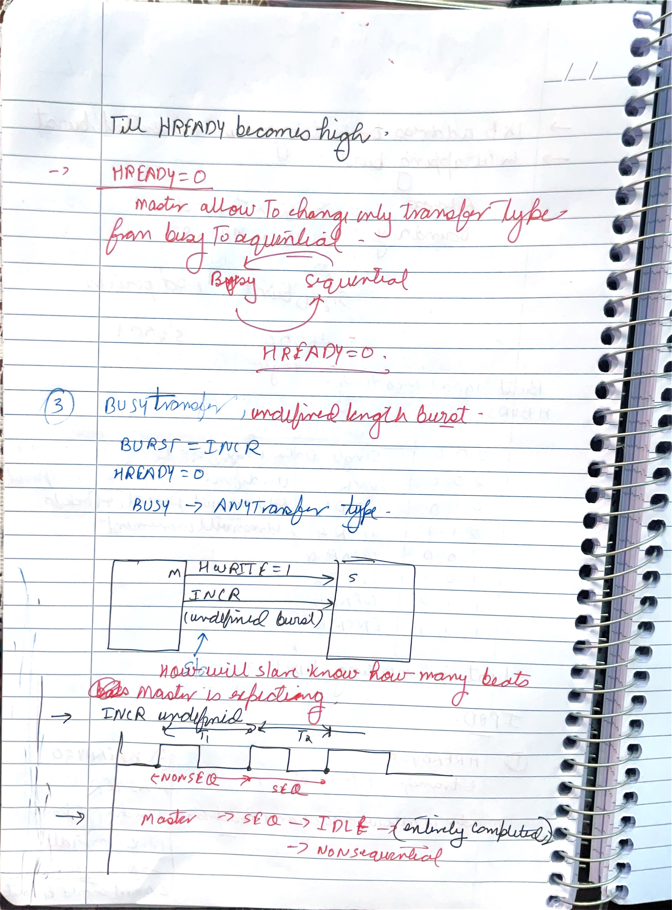

The page says to wait until `HREADY` becomes HIGH. Convert that sentence into
an RTL enable:

```verilog
if (HREADY) begin
    // complete the current data phase and advance accepted state
end
```

A LOW cycle is not a beat and must not increment the address or beat counter.
BUSY is also not a data beat, but it has a different purpose: BUSY preserves a
burst context when the manager is temporarily unable to issue its next beat.

The page puts wait states and BUSY close together, so separate them carefully:

| Situation | Who requests the delay? | `HREADY` | Does a new data beat exist? |
|---|---|---:|---|
| Wait state | Subordinate needs more time for the current data phase | `0` | No; the existing beat is extended |
| BUSY address phase | Manager is not ready to issue the next burst beat | Normally zero-wait OKAY | No; BUSY is ignored as a transfer |

They can also overlap: the manager can be showing BUSY for its next address
phase while the subordinate extends the previous valid data phase. The data
phase must still complete, and the legality of changing BUSY while waiting then
depends on whether the burst is fixed length or undefined INCR.

For counters, distinguish events explicitly:

```verilog
address_accepted = HREADY && HTRANS[1];
data_completed   = HREADY && data_phase_valid;
```

The first event admits the visible NONSEQ/SEQ address into the pipeline; the
second retires the older registered transfer. On a full-throughput cycle both
can be true for different beats. This is more precise than enabling every
register with `HREADY` alone
([Arm IHI 0033C, §§3.1, 3.2, and 3.7](../sources/ARM-IHI-0033C-AMBA-AHB-Protocol-Specification.pdf)).

### Lecture frame: IDLE during a waited transfer

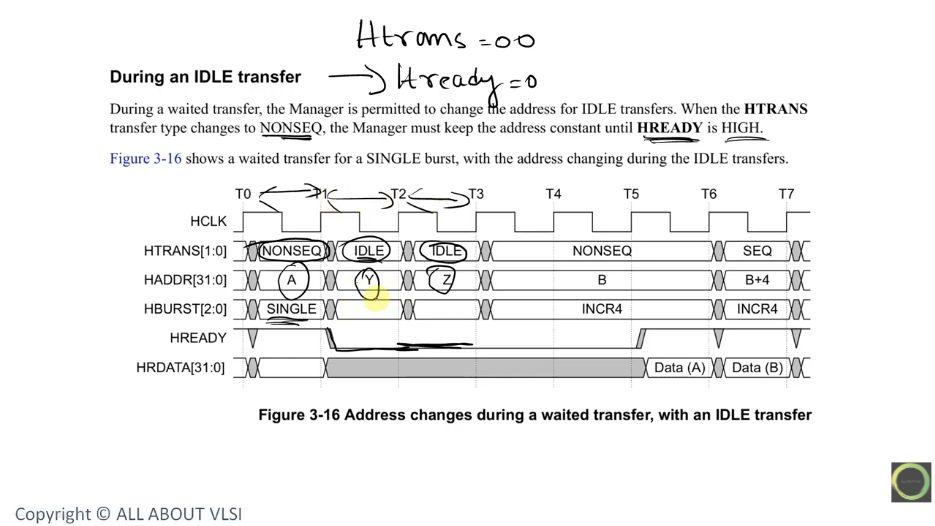

This is a subtle specification case. While the extended address phase remains
IDLE, the manager may change its address because no real transfer is requested.
It may also change `HTRANS` once from IDLE to NONSEQ; after doing so, it must
hold that transfer type and address until `HREADY=1`. Information for the valid
data phase underneath it must still remain correct. This exception must not be
generalized to an already-valid NONSEQ or SEQ address phase.

Arm's example shows why the exception is safe. While the next lane is IDLE, an
address can move from Y to Z without asking any subordinate to perform an
operation. The manager can then present NONSEQ address B even though the older
data phase is still waiting. Once it has changed IDLE to valid NONSEQ, B must
remain fixed until the older transfer completes and the bus can finally accept
B ([Arm IHI 0033C, §§3.7.1-3.7.2](../sources/ARM-IHI-0033C-AMBA-AHB-Protocol-Specification.pdf)).

The visible address during IDLE is therefore a don't-use value for transfer
purposes; the `HTRANS` encoding prevents it from becoming a request. The valid
data phase underneath the IDLE lane remains real and is not relaxed.

### Original notebook page 14: synchronization through transfer types

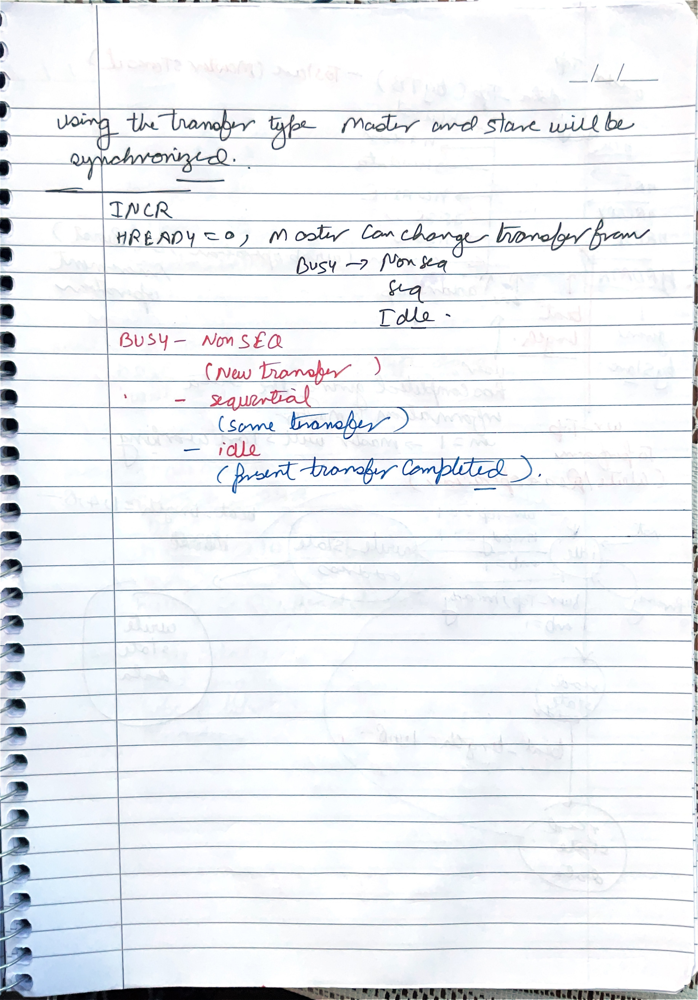

The page links transfer types to manager/subordinate synchronization. Refine
the rule by considering the current extended address phase:

- Valid NONSEQ or SEQ address/control must remain stable while `HREADY=0`.
- While `HTRANS=IDLE`, the address can change. The manager may change IDLE to
  NONSEQ once, after which transfer type and address must remain fixed until
  `HREADY=1`.
- BUSY behavior depends on the burst. For a fixed-length burst, an extended
  BUSY must be followed by SEQ when the bus advances. For undefined INCR, the
  manager may change from BUSY to another transfer type while waiting.

These are the exceptions illustrated in Arm's wait-state examples
([Arm IHI 0033C, §3.7](../sources/ARM-IHI-0033C-AMBA-AHB-Protocol-Specification.pdf)).

The synchronization can be summarized as a legal-change table:

| Address phase while waiting | Change allowed before `HREADY=1` | Meaning |
|---|---|---|
| NONSEQ | No further change once presented | Preserve a new valid transfer |
| SEQ | No change | Preserve the next beat of the burst |
| IDLE | Address may change; IDLE may change once to NONSEQ | No request exists until NONSEQ is presented |
| BUSY in fixed burst | May change to SEQ; then hold | Resume the promised fixed burst |
| BUSY in undefined INCR | May change to SEQ, IDLE, or NONSEQ; then obey that type's rule | Continue or terminate the open-ended burst |

This is not an arbitrary list. It protects every valid request from changing
before acceptance while allowing a manager to prepare useful work in address
phases that currently request no data transfer.

### iPad page 9: response and IDLE are separate ideas

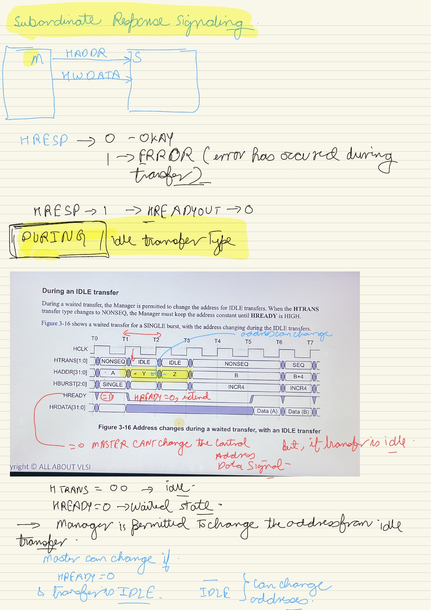

The top of the page correctly assigns `HRESP` to the subordinate. The bottom
shows why IDLE may change during waits. Keep the two lanes separate: `HRESP`
describes the valid transfer in its data phase, while an IDLE `HTRANS` may be
visible for a later address phase that requests no transfer.

An ERROR response belongs to the transfer completing in the data phase. It is
not an error on the IDLE address merely because both values appear in the same
clock column.

The response path also explains the two ready names. The active subordinate
drives its local `HREADYOUT` and `HRESP`; the interconnect returns the selected
values as manager-facing `HREADY` and `HRESP`. A manager interprets the final
pair for the data-phase transfer. It does not look at the response from whichever
subordinate the IDLE address happens to decode to
([Arm IHI 0033C, §§2.3-2.5 and 4.3](../sources/ARM-IHI-0033C-AMBA-AHB-Protocol-Specification.pdf)).

If the current data phase receives ERROR, the first ERROR cycle has
`HREADY=0`, and the second has `HREADY=1`. The extra cycle lets the manager
cancel the pipelined next request. This is why the response annotation belongs
to the lower, older lane of the waveform.

### iPad page 10: BUSY during a wait

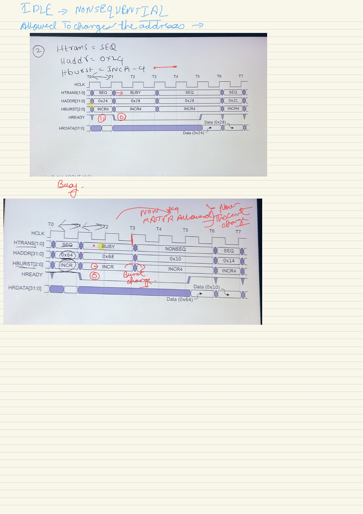

This page captures a case that is easy to memorize incorrectly. BUSY says the
burst is still conceptually active but no data beat is requested for that
address phase. If BUSY is extended by `HREADY=0`, fixed-length bursts preserve
the promise to continue with SEQ. Undefined INCR is allowed more freedom to
change the transfer type before the wait ends.

For a fixed INCR4/8/16 or WRAP4/8/16 burst, BUSY is only a pause between real
beats. The manager has already promised a fixed number of beats, so it resumes
with SEQ and eventually ends with SEQ. For undefined INCR, BUSY can lead to
SEQ, which continues, or to IDLE/NONSEQ, which ends the old sequence. In either
case BUSY itself does not increment the address or completed-beat count
([Arm IHI 0033C, §§3.6.1 and 3.7.1](../sources/ARM-IHI-0033C-AMBA-AHB-Protocol-Specification.pdf)).

The wait-state nuance is that the change can be prepared before `HREADY` rises,
but once a valid replacement transfer is presented, it is held. The manager is
not repeatedly changing its decision on every LOW-ready edge.

## 6. From protocol timing to an RTL manager

### Original notebook page 15: first FSM sketch

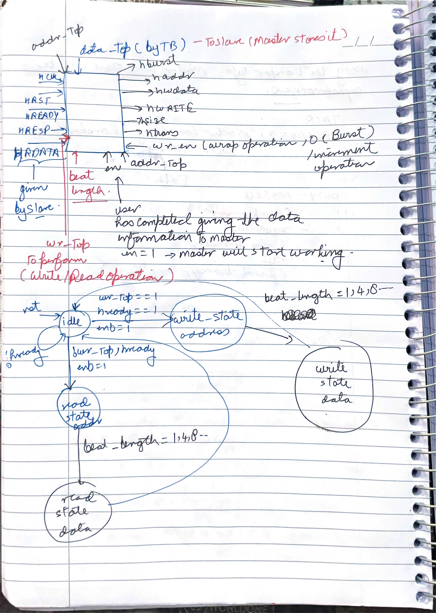

The sketch separates idle/start, address, and data/wait ideas. That is a useful
reasoning model, but a literal one-state-per-drawing implementation can hide
the AHB pipeline. Address phase $N+1$ and data phase $N$ coexist, so the RTL
usually needs registers that separately remember the accepted data-phase
transfer and the next address-phase command.

The cleaned comparison is in the
[FSM and lecture correction](../code/FSM.md). The decisive transition is not
simply “one clock passed”; it is “the current data phase completed with
`HREADY=1`.”

The page's states become clearer when separated into control responsibilities:

| Responsibility | State/register needed | Advance condition |
|---|---|---|
| Accept a local command | Command-valid or busy state | Local request accepted while manager is available |
| Drive an address phase | Address, `HTRANS`, size, burst, direction | Hold until `HREADY=1` accepts it |
| Remember a data phase | Registered valid, direction, and write payload/context | Clear or replace when that phase completes |
| Generate burst addresses | Current address and beat position | Advance for accepted valid burst beats only |
| Report completion | Done/error/read-data register or pulse | Registered data phase completes with `HREADY=1` |

This can be implemented with an FSM plus registers, but the register enables
are more fundamental than the state names. A state called DATA must not block
the simultaneous next address phase, and a state called ADDRESS must not make
the design forget an older waited data phase
([Arm IHI 0033C, §§3.1 and 3.7](../sources/ARM-IHI-0033C-AMBA-AHB-Protocol-Specification.pdf)).

### Original notebook page 16: SINGLE-transfer exercise

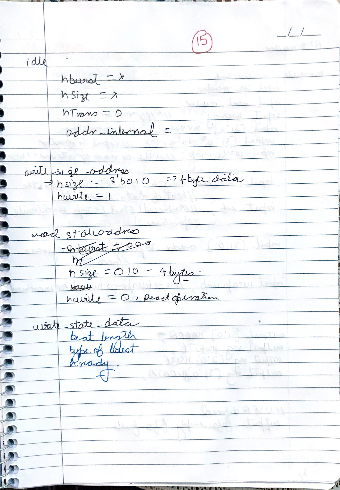

The page lists an example command and expected control values. A word SINGLE
should use `HBURST=3'b000`, `HSIZE=3'b010`, and `HTRANS=NONSEQ` while its
address phase is valid. IDLE is driven after the one address phase unless a new
unrelated command begins.

The implementation must still retain the command's direction and write data
for the data phase. Clearing the command as soon as its address is issued loses
the information required if the subordinate inserts a wait.

Trace a SINGLE word write from a local command:

| Clock interval | Bus action | Internal information that must survive |
|---|---|---|
| Command capture | Latch address, write direction, and payload | Entire local command |
| Address phase | Drive `HTRANS=NONSEQ`, `HBURST=SINGLE`, `HSIZE=word` | Payload is still needed for the next phase |
| Data phase | Drive the saved `HWDATA`; normally drive IDLE on the next address lane | Data-phase-valid, payload, and response context |
| Wait extension | Keep the same write data and valid context | Nothing retires while `HREADY=0` |
| Completion edge | Accept write, sample `HRESP`, pulse local done | Context can now be cleared |

For a SINGLE read, the address controls are the same except `HWRITE=0`; the
manager captures `HRDATA` on the completion edge instead of driving a payload.
The page's control encodings therefore describe only the address phase. The
local command/result storage completes the full transaction
([Arm IHI 0033C, §§3.1-3.2](../sources/ARM-IHI-0033C-AMBA-AHB-Protocol-Specification.pdf)).

### Original notebook page 17: module ports

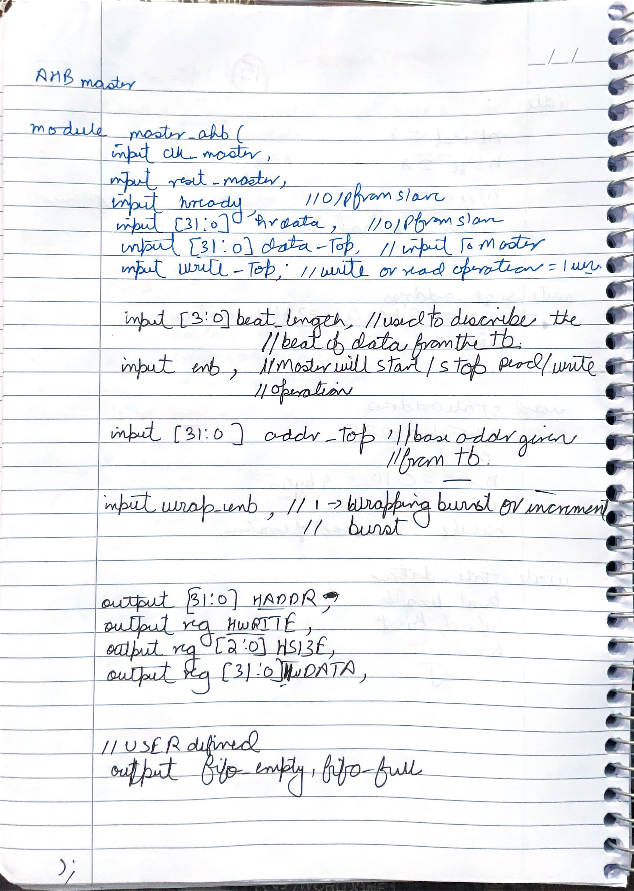

The handwritten Verilog outline is an interface draft. Categorize ports by
ownership before coding:

- command inputs come from local logic;
- AHB address/control and `HWDATA` are manager outputs;
- `HRDATA`, `HREADY`, and `HRESP` are manager inputs;
- completion/result outputs report the accepted outcome back to local logic.

Avoid driving protocol outputs to `X` in ordinary functional RTL. Unknowns can
hide bugs in simulation and do not represent a usable bus value in hardware.
Drive an explicit legal idle value instead.

The port list needs both a bus-side contract and a local-side contract. On the
bus side, output direction follows signal ownership from the specification. On
the local side, the module needs an unambiguous rule such as “accept `cmd_*`
when `cmd_valid && cmd_ready`,” and later produce one completion indication.
Without a local acceptance rule, the same command can be captured twice or be
overwritten while AHB is waiting.

The important direction check is:

| Manager port direction | Signals |
|---|---|
| Outputs to AHB | `HADDR`, `HTRANS`, `HWRITE`, `HSIZE`, `HBURST`, `HWDATA` |
| Inputs from AHB response path | `HREADY`, `HRESP`, `HRDATA` |
| Local command inputs | Address, direction, size/burst choice, write payload, command valid |
| Local result outputs | Command ready/busy, completion, error, and read result |

Reset should drive legal protocol values, especially `HTRANS=IDLE`. Arm also
requires manager address/control outputs to be at valid logic levels during
reset; using `X` conflicts with that observable contract
([Arm IHI 0033C, §§2.2 and 7.1.2](../sources/ARM-IHI-0033C-AMBA-AHB-Protocol-Specification.pdf)).

### Original notebook page 18: data-phase registers

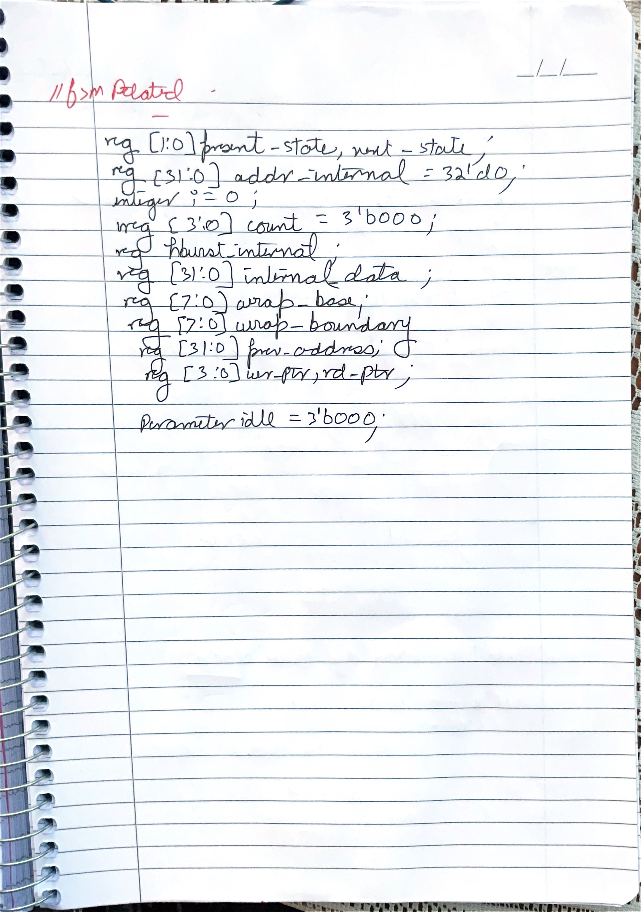

This page begins the essential register split. The RTL needs remembered state
for any transfer whose data phase is not yet complete: direction, write data,
possibly local response bookkeeping, and burst position. `burst_count` must
advance only for accepted data beats, not on every clock and not for BUSY/IDLE.

Address progression must be derived from `HSIZE` and `HBURST`. For the current
learning RTL the supported set is deliberately smaller—SINGLE, INCR4, and
WRAP4 word transfers—so the legality checks and counters can be explicit. See
the [code guide](../code/README.md) for the implemented version.

Map each handwritten register to the protocol fact it preserves:

| Register concept | What it remembers | When it changes |
|---|---|---|
| `addr_q` | Address currently offered or next burst address | On reset, new command, or accepted address advancement |
| `data_valid_q` | Whether an older transfer occupies the data phase | Set by accepted NONSEQ/SEQ; cleared/replaced on completion |
| `data_write_q` | Direction of that older data phase | When its address phase is accepted |
| `wdata_q` | Payload for a write that has not completed | Capture before its data phase; hold through waits |
| `beat_q` | Accepted position within the supported fixed burst | Advance for accepted data beats, never for waits/BUSY/IDLE |
| `error_q` or done pulse | Result returned to local logic | On the completion edge after sampling `HRESP` |

The key is that `data_write_q` and `wdata_q` can describe transfer A while
`addr_q` already describes transfer B. Combining them into one undifferentiated
“current command” register usually destroys pipelining or associates the wrong
payload with an address.

For the limited word-only design, a next INCR address adds four and a next
WRAP4 address increments modulo sixteen within the saved region. If broader
`HSIZE` or `HBURST` support is later added, those constants must be derived
from the controls rather than copied from one example. That keeps the register
draft faithful to the protocol rules visible on pages 10-12
([Arm IHI 0033C, §§2.2, 3.6, and 6.1](../sources/ARM-IHI-0033C-AMBA-AHB-Protocol-Specification.pdf)).

## Corrections worth memorizing

- `HREADY` completes the current **data phase** and gates pipeline advancement.
- `HWDATA` belongs to the previous accepted write address, not necessarily the
  address currently visible.
- Wait cycles are not beats. Increment address and counters only on accepted
  valid beats.
- `HSIZE` sets bytes per beat; `HBURST` sets burst form/length. A wrap boundary
  is their product.
- BUSY preserves a burst but transfers no data; IDLE requests no transfer.
- AHB's 1-KiB crossing rule is different from a wrapping burst's local wrap
  boundary.
- Current terminology is manager/subordinate; older lecture labels describe
  the same roles.

## Active-recall pass

1. In a cycle showing address B and write data A, which transfer does
   `HREADY` complete?
2. Why can an AHB pipeline complete one transfer per cycle without having the
   address and data of the same transfer in one cycle?
3. What freezes when `HREADY=0`, and exactly what may change while the next
   address phase is IDLE?
4. Generate WRAP4 halfword addresses from `0x0A` without looking back.
5. Explain why a beat counter enabled directly by the clock is incorrect.
6. Compare BUSY in a fixed-length burst with BUSY in undefined INCR.

## Lecture source register

| Topic | Lecture |
|---|---|
| Introduction and bus roles | [AHB lecture 1](https://www.youtube.com/watch?v=dxKE1wHvHCg&list=PLqPfWwayuBvNX_IQPBHGJn8YFkvI86lr9) |
| Read/write without waits | [AHB lecture 2](https://www.youtube.com/watch?v=3SFTy4on9sc&list=PLqPfWwayuBvNX_IQPBHGJn8YFkvI86lr9) |
| Transfers with wait states | [AHB lecture 3](https://www.youtube.com/watch?v=-EbEzAacqoQ&list=PLqPfWwayuBvNX_IQPBHGJn8YFkvI86lr9) |
| Multiple pipelined transfers | [AHB lecture 4](https://www.youtube.com/watch?v=M4CxmSdoSzA&list=PLqPfWwayuBvNX_IQPBHGJn8YFkvI86lr9) |
| `HTRANS` and bursts | [AHB lecture 5](https://www.youtube.com/watch?v=v2EcFDnWIrw&list=PLqPfWwayuBvNX_IQPBHGJn8YFkvI86lr9) |
| Wrapping bursts | [AHB lectures 6-7](https://www.youtube.com/watch?v=1or91qL6bds&list=PLqPfWwayuBvNX_IQPBHGJn8YFkvI86lr9) |
| Transfer types during waits | [AHB lecture 8](https://www.youtube.com/watch?v=39QRExXRBSs&list=PLqPfWwayuBvNX_IQPBHGJn8YFkvI86lr9) |
| Manager FSM and RTL | [AHB lectures 9-12](https://www.youtube.com/watch?v=DmYdSlO2MiE&list=PLqPfWwayuBvNX_IQPBHGJn8YFkvI86lr9) |
