# APB Lecture and Handwritten Atlas

[Back to APB](../README.md) | [Back to AMBA](../../README.md)

This atlas follows each lecture waveform with its explanation and then the
corresponding original notebook or iPad page. The authority for corrections is
Arm's
[AMBA APB Protocol Specification, ARM IHI 0024E](../sources/ARM-IHI-0024E-AMBA-APB-Protocol-Specification.pdf).

## Source-page map

| Notebook page | Main idea | Related capture |
|---:|---|---|
| 19 | APB overview and AHB-to-APB bridge | Bridge role |
| 20 | Core APB interface signals | Transfer phases |
| 21 | SETUP/ACCESS and write transfer | Write, no wait |
| 22 | Wait states and stability | Write, with waits |
| 23 | Read timing and `PSLVERR` | Read wait/error |
| 24 | Write wait states and controller FSM | State diagram |

The separate iPad APB page revisits the waited-write case after the notebook
sequence.

## 1. Why APB exists

### Lecture frame: a bridge reaches simple peripherals

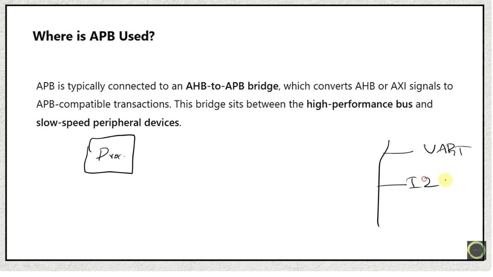

The frame places APB behind a system-bus bridge. High-performance traffic can
remain on AHB or another AMBA system bus, while the bridge converts a selected
register access into APB's simpler SETUP/ACCESS sequence. The peripheral sees
only the APB transaction; it does not need to understand the pipelined AHB
transaction that caused it.

The bridge also absorbs the latency difference. If the APB completer holds
`PREADY=0`, the bridge keeps APB stable and delays completion on its upstream
interface.

### Original notebook page 19: overview and bridge

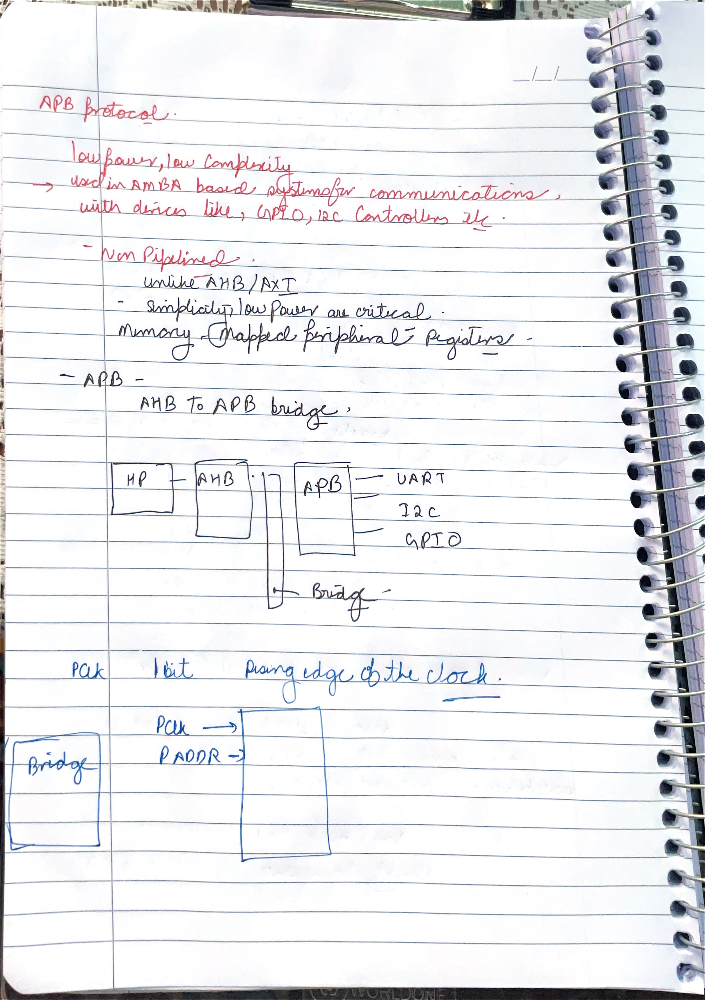

The page correctly describes APB as low-bandwidth, low-complexity peripheral
communication and draws an AHB/APB bridge. The term “low power” is best
understood as an architectural goal enabled by a small, non-pipelined
interface—not as a promise that every APB implementation automatically
consumes little power.

The UART example is appropriate. A processor may read a UART status register
through the bridge; APB transports the register access, while the UART's serial
behavior remains internal to the peripheral.

## 2. The phase contract

### Original notebook page 20: signals as one transaction

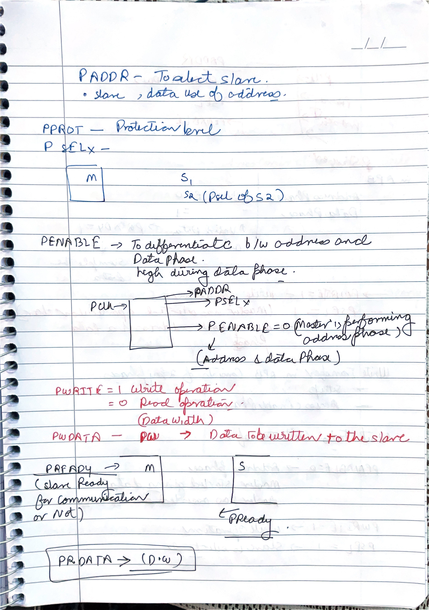

Read the listed signals in the order of an access. The requester first asserts
the target's `PSEL`, drives `PADDR`, selects read/write with `PWRITE`, and drives
`PWDATA` for a write. In the next cycle it asserts `PENABLE`. The completer uses
`PREADY` to say when ACCESS can finish, supplies `PRDATA` for a read, and may
assert `PSLVERR` for an error.

`PENABLE` is not a separator that switches the bus from “address” to “data.”
Address, direction, select, and write data are already valid in SETUP and stay
valid through ACCESS completion. `PENABLE` identifies that the transfer has
moved from SETUP into ACCESS
([Arm IHI 0024E, Chapter 3](../sources/ARM-IHI-0024E-AMBA-APB-Protocol-Specification.pdf)).

### Lecture frame: write with no wait state

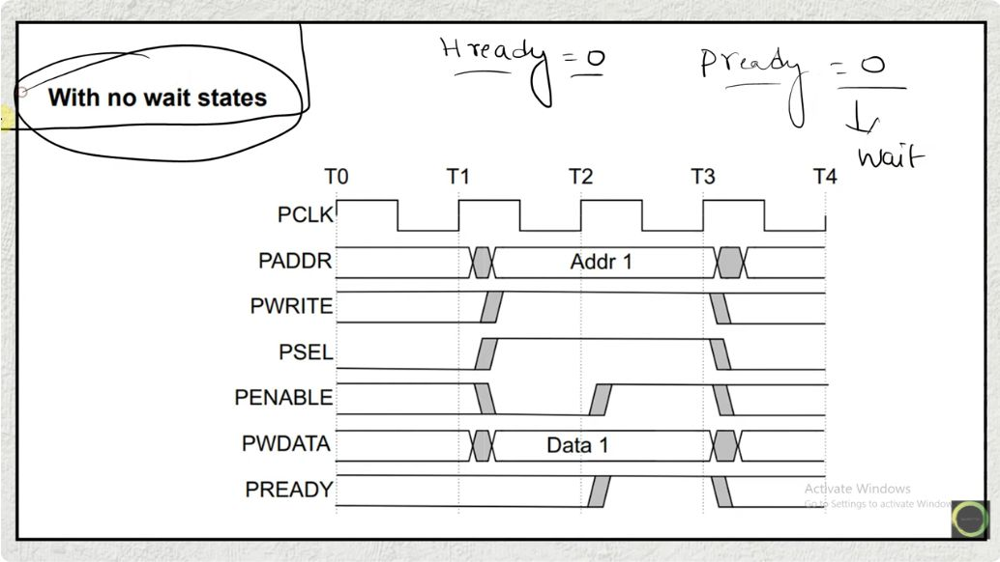

At the first rising edge, the requester enters SETUP: `PSEL=1`, `PENABLE=0`,
and address/write data are valid. At the next rising edge it enters ACCESS by
asserting `PENABLE`. Because `PREADY=1`, that first ACCESS cycle is also the
final cycle. The completer accepts the write at its ending edge.

The minimum access is therefore two cycles. `PREADY` being HIGH early does not
remove the mandatory SETUP phase.

### Original notebook page 21: SETUP then ACCESS

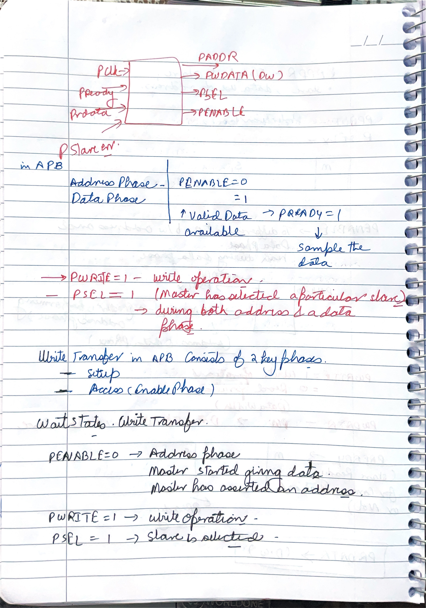

The page's phase split is correct. `PSEL=1, PENABLE=0` identifies SETUP, and
`PSEL=1, PENABLE=1` identifies ACCESS. The write data is not newly introduced
only in ACCESS; it must be valid from SETUP and remain stable until the write
completes.

For back-to-back transfers, the controller leaves ACCESS and enters SETUP for
the next access. It may keep `PSEL` HIGH if the same peripheral remains
selected, but it must deassert `PENABLE` for that intervening SETUP cycle.

## 3. Wait states mean “hold ACCESS”

### Lecture frame: write with wait states

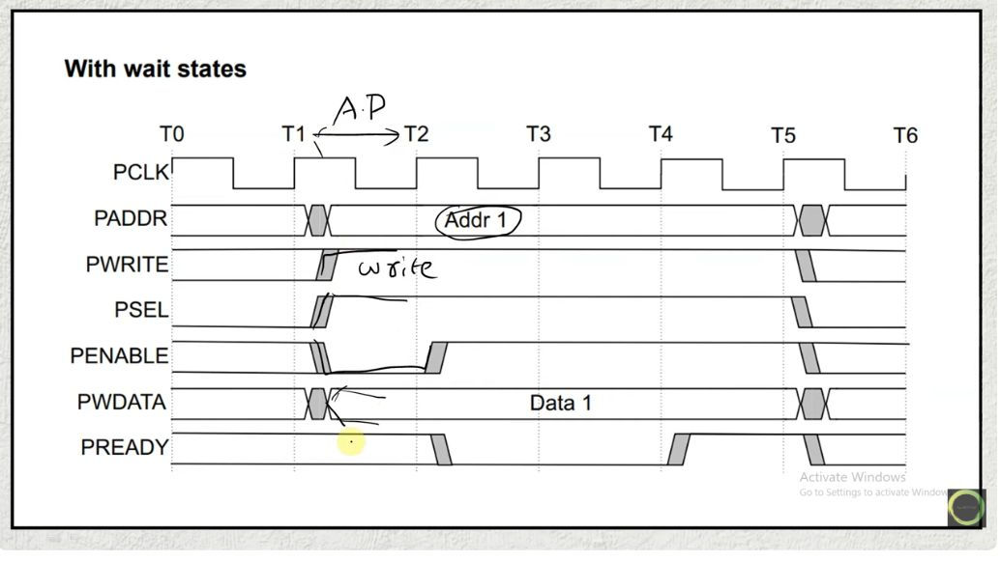

This waveform starts exactly like the no-wait write. The difference occurs
after `PENABLE` rises: `PREADY=0` keeps the controller in ACCESS. `PSEL` and
`PENABLE` stay HIGH, while address, direction, write data, and applicable
control signals remain unchanged. The write completes at the ACCESS edge where
`PREADY` finally becomes HIGH.

Wait cycles do not create extra transfers and the controller does not return to
SETUP between them.

### Original notebook page 22: stability through waits

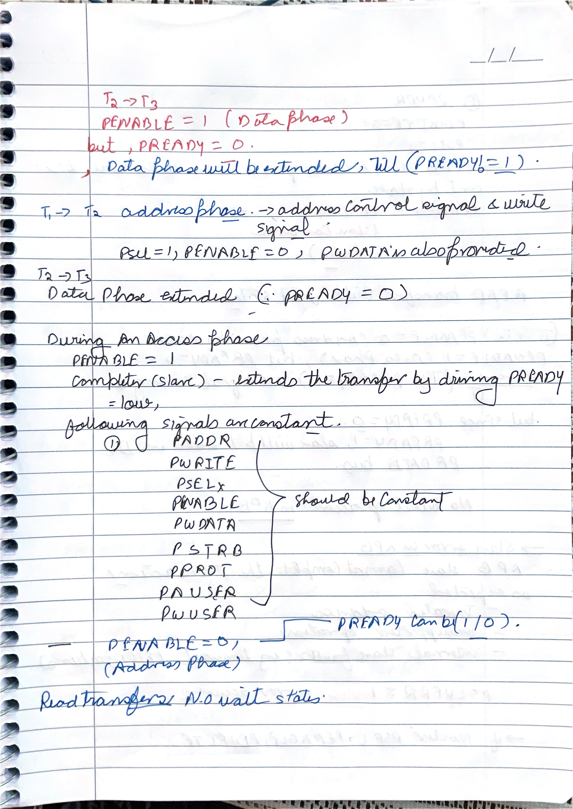

The page correctly states that a LOW `PREADY` extends the data/access phase.
Make the stability rule precise: during all extended ACCESS cycles, the
requester holds `PADDR`, `PWRITE`, `PSEL`, `PENABLE`, `PWDATA`, and the other
request controls stable. This lets a slow peripheral take as many cycles as it
needs without seeing a changing request.

The completer is allowed to take zero or more wait cycles. “Zero wait” means
`PREADY` is HIGH in the first ACCESS cycle, not that the two-phase protocol has
been reduced to one cycle.

### iPad page: annotated waited write

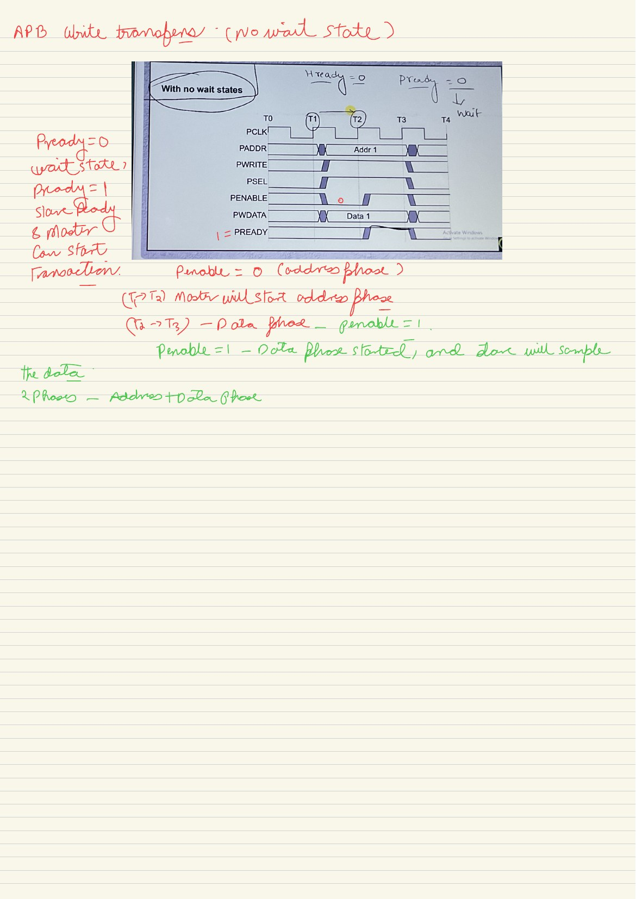

The iPad annotation says `PREADY=0` holds the data phase and the requester does
not sample/complete. That is the right operational model. Add one detail:
APB calls this the ACCESS phase, and both request and write data are held. The
write is accepted only at the final edge where `PSEL`, `PENABLE`, and `PREADY`
are all HIGH.

## 4. Read timing

### Lecture frame: read with no wait state

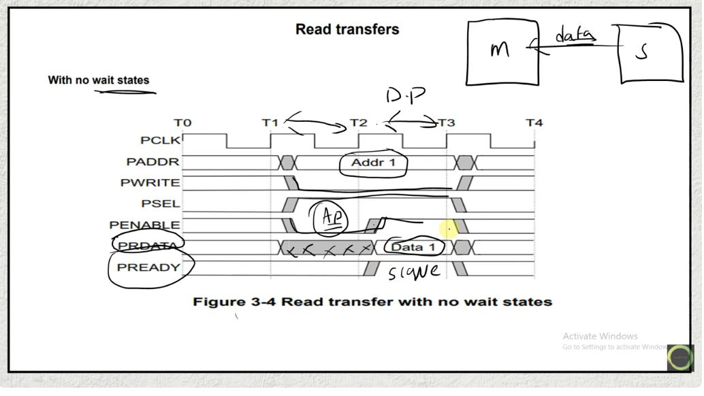

A read uses the same phase sequence as a write, with `PWRITE=0`. The requester
drives the address in SETUP. The completer supplies `PRDATA` so that it is valid
by the ending edge of the final ACCESS cycle. The requester samples it only
when `PREADY=1` completes the transfer.

### Lecture frame: read with wait states

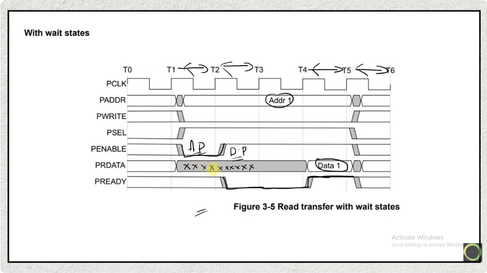

The request side stays stable while `PREADY=0`. Unlike requester-owned address
and control, `PRDATA` is a completer output and can settle during the wait; it
must be valid at the final completion edge. A requester must not consume an
earlier provisional value.

### Original notebook page 23: read completion and error context

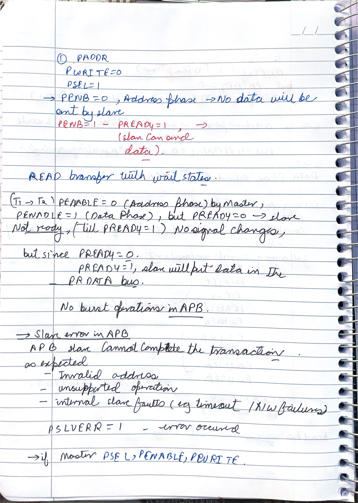

The page correctly separates read data from readiness. `PRDATA` provides the
value, while `PREADY` says when that value can be accepted. If the read is
extended, address and request controls are stable through every wait cycle.

The notes also introduce `PSLVERR`. It is not a general level that should be
sampled continuously. It is valid only in the final ACCESS cycle, alongside
`PSEL=1`, `PENABLE=1`, and `PREADY=1`. Outside that cycle the specification
recommends driving it LOW.

## 5. Error timing

### Lecture frame: write error

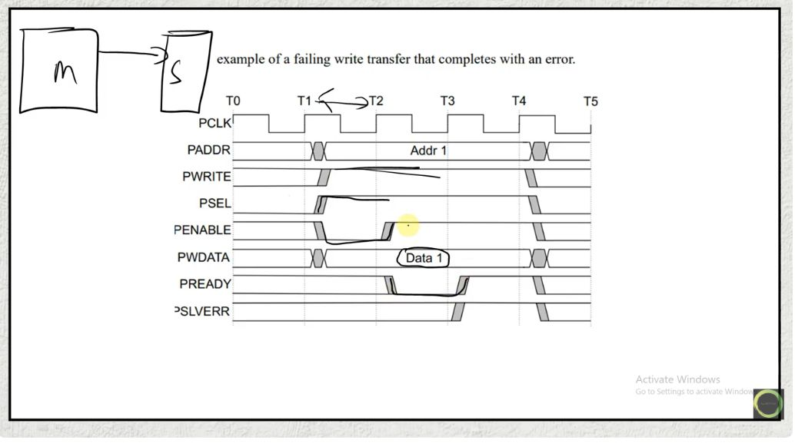

The write follows normal SETUP and ACCESS timing. `PSLVERR` is asserted only
when the final ACCESS edge completes the write. A wait-state cycle cannot be a
completed error response because `PREADY=0` says the transfer has not finished.

### Lecture frame: read error

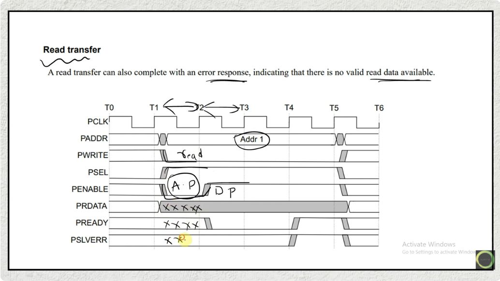

The same timing rule applies to a read. Although a value may be visible on
`PRDATA`, the requester must not treat data from an errored access as valid
payload. The error and completion handshake are interpreted together.

This is the concise validity condition:

$$
\texttt{PSLVERR valid}\iff
\texttt{PSEL}\land\texttt{PENABLE}\land\texttt{PREADY}.
$$

`PSLVERR=0` at that edge means a normal completion; `PSLVERR=1` means an error
completion ([Arm IHI 0024E, §3.4](../sources/ARM-IHI-0024E-AMBA-APB-Protocol-Specification.pdf)).

## 6. Controller state machine

### Lecture frame: IDLE, SETUP, and ACCESS

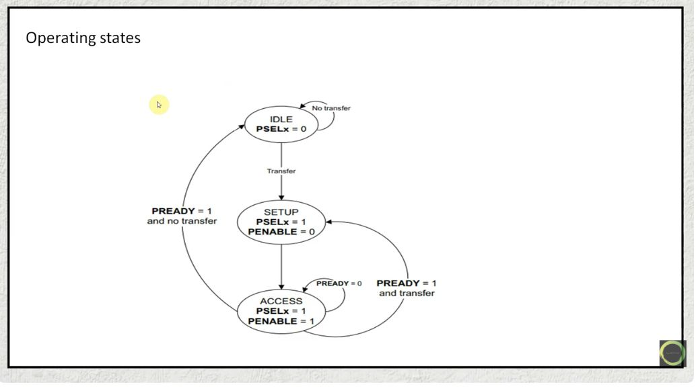

The state diagram is a direct encoding of the protocol:

- **IDLE:** no transfer is active; `PSEL=0`.
- **SETUP:** one mandatory cycle; `PSEL=1`, `PENABLE=0`.
- **ACCESS:** `PSEL=1`, `PENABLE=1`; remain here while `PREADY=0`.

When ACCESS completes, go to IDLE if no request is pending or SETUP if another
request is pending. Never transition directly from one ACCESS transfer into the
ACCESS phase of the next transfer.

### Original notebook page 24: waited write and FSM draft

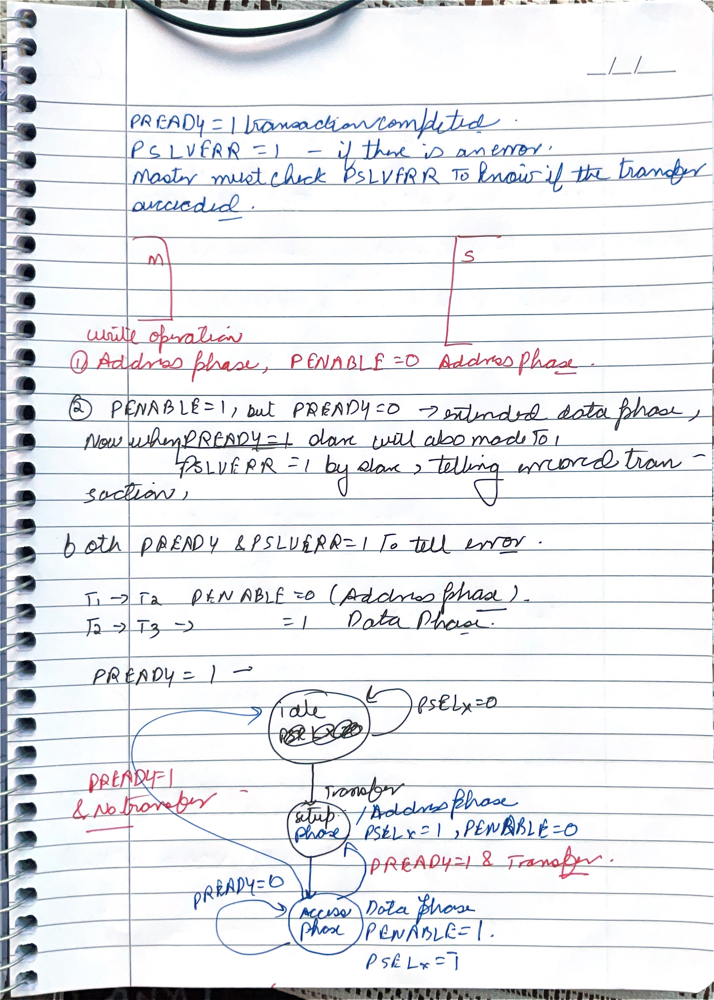

The upper timing notes correctly hold `PENABLE` HIGH while `PREADY` is LOW.
The lower circles are the beginning of the three-state controller. The clean
transition conditions are:

```text
IDLE   --request--> SETUP
SETUP  ----------> ACCESS
ACCESS --!PREADY-> ACCESS
ACCESS --PREADY and next request--> SETUP
ACCESS --PREADY and no request----> IDLE
```

Outputs should come from the protocol state and registered request, not from an
unqualified combinational request that might change during a wait. Registering
the request before SETUP makes the required ACCESS stability straightforward.

## AHB versus APB after reading both notebooks

| Question | AHB | APB |
|---|---|---|
| Can phases overlap? | Yes. Next address can overlap current data. | No. SETUP then ACCESS for each transfer. |
| Completion signal | `HREADY` completes the current data phase. | `PREADY` completes only an ACCESS phase. |
| Wait behavior | Holds the current data phase and normally the pipelined next address. | Holds the one request in ACCESS. |
| Burst description | `HTRANS`, `HBURST`, and `HSIZE`. | No burst protocol in core APB. |
| Error response | `HRESP`. | Optional `PSLVERR`, valid only at final ACCESS. |

## Corrections worth memorizing

- SETUP is always exactly one cycle; ACCESS is one or more cycles.
- `PENABLE` indicates ACCESS. It does not replace address with data.
- The requester holds address, control, and write data stable during waits.
- `PREADY` matters for completion only during ACCESS.
- `PSLVERR` is meaningful only on the final ACCESS cycle.
- Back-to-back transfers still require a SETUP cycle between ACCESS cycles.

## Active-recall pass

1. Draw a no-wait write and mark the exact accepting edge.
2. Extend it by two wait cycles without changing any requester-owned signal.
3. Explain why `PREADY=1` in SETUP does not complete a transfer.
4. Show the transition after a completed ACCESS when another request is ready.
5. Explain why `PRDATA` can settle during a wait but `PADDR` cannot change.

## Lecture source register

| Topic | Lecture |
|---|---|
| APB purpose and interface | [APB lecture 1](https://www.youtube.com/watch?v=MIjXS7ap0Hk&list=PLqPfWwayuBvPpjwnJsJ7qSQAXh7NQFMzO) |
| Read/write transfers and waits | [APB lecture 2](https://www.youtube.com/watch?v=MThzJkZeVDI&list=PLqPfWwayuBvPpjwnJsJ7qSQAXh7NQFMzO) |
| `PSLVERR` | [APB lecture 3](https://www.youtube.com/watch?v=q3jmUDlo94I&list=PLqPfWwayuBvPpjwnJsJ7qSQAXh7NQFMzO) |
| State machine and RTL | [APB lecture 4](https://www.youtube.com/watch?v=WFYG1ST5pko&list=PLqPfWwayuBvPpjwnJsJ7qSQAXh7NQFMzO&index=4) |
