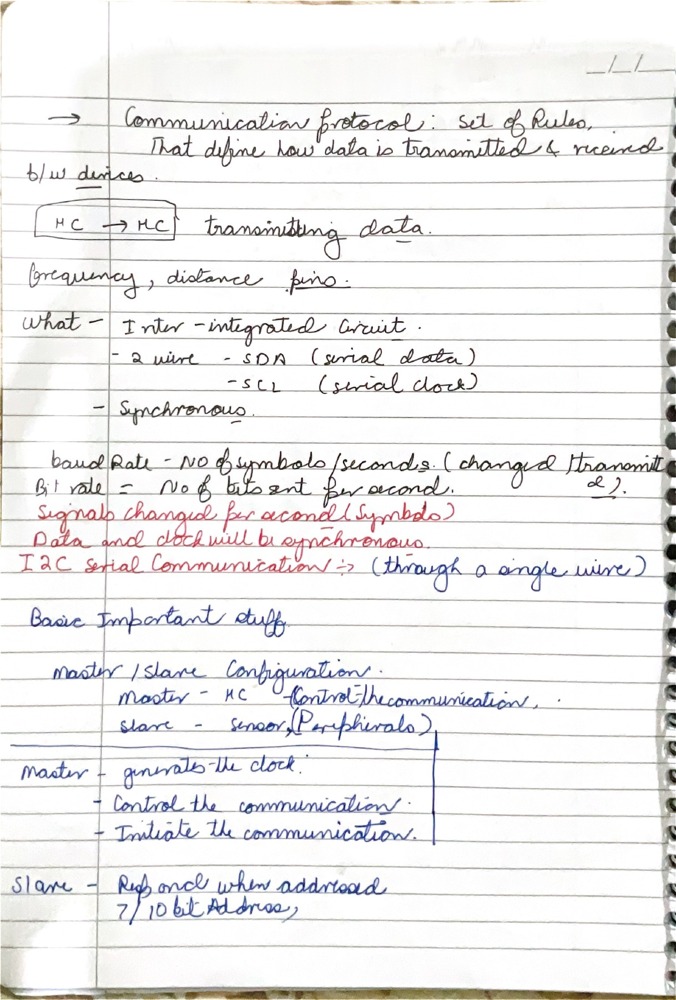
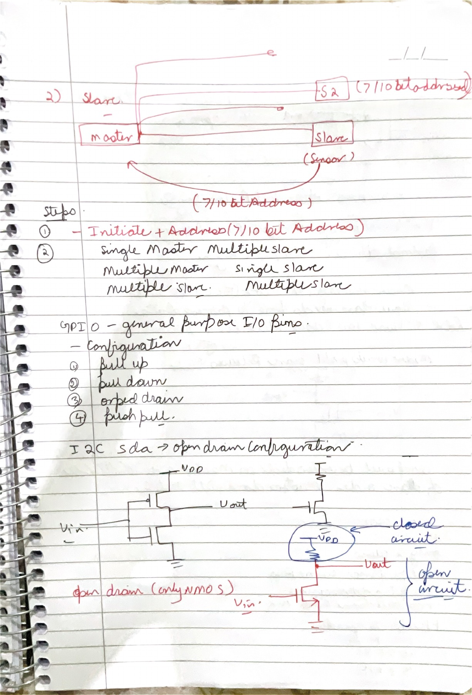
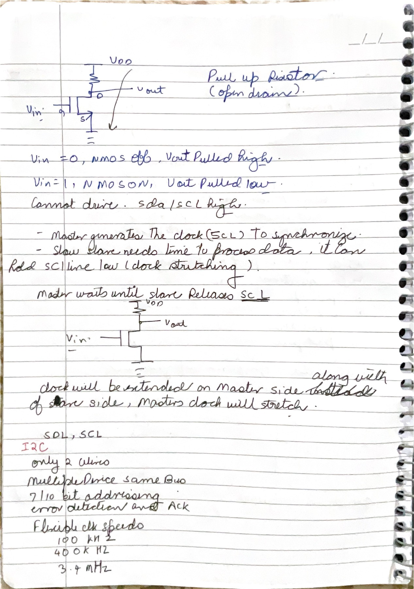
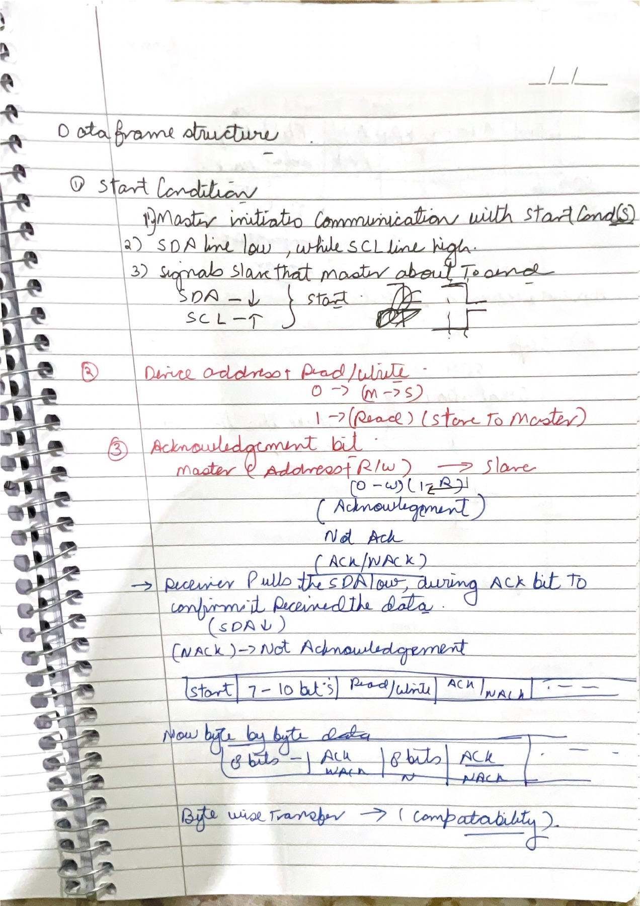
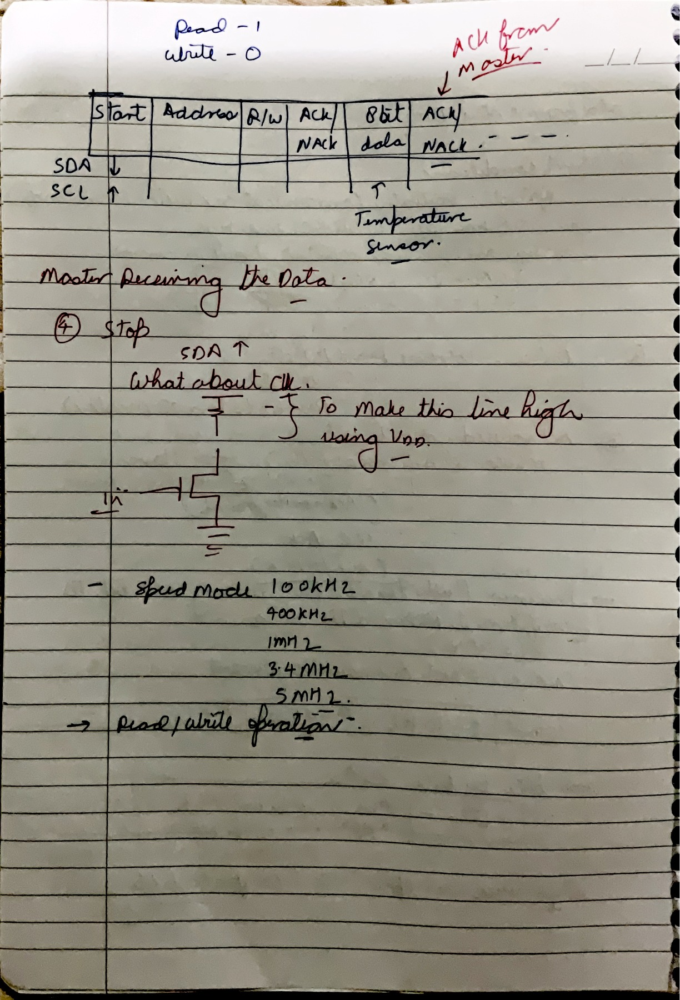

# 01 - I2C

These five pages build I2C from the purpose of a protocol, through its open-drain electrical layer, to complete addressed byte transfers. The explanation keeps the notes' sequence while correcting places where a useful shortcut would become unsafe in a real implementation.

## Page map

| Page | Revision focus |
|---:|---|
| [01](#page-01) | Protocol rules, synchronous transfer, roles, addressing, and rate terminology |
| [02](#page-02) | Addressed bus topology, GPIO output styles, and the open-drain circuit |
| [03](#page-03) | Wired-AND behavior, pull-ups, clock stretching, and official speed modes |
| [04](#page-04) | START, address plus direction, ACK/NACK, and byte framing |
| [05](#page-05) | Read ownership, final NACK, STOP, and complete transaction reasoning |

## Page 01 - What a protocol defines and why I2C is synchronous

### Technical discussion

The opening definition establishes a communication protocol as the set of rules that gives electrical activity an agreed meaning. A physical connection alone is insufficient. Both ICs must use compatible voltage levels, signal directions, timing rules, frame boundaries, bit ordering, response behavior, and bus-ownership procedures.

The microcontroller-to-microcontroller sketch introduces chip-to-chip transfer, but frequency, distance, and pin count are design constraints rather than the complete definition of a protocol. I2C solves a particular local-board problem using two shared signal lines: SDA carries serial data and SCL carries the serial clock. Because a clock is transferred with the data, I2C is synchronous: receivers use SCL edges and levels to decide when SDA is valid. Power and ground still need a common electrical reference; “two-wire” counts the two bus signals, not every physical conductor in the system.

The controller/target distinction explains authority during a transaction. A controller generates START, supplies SCL, sends an address, and determines when the transaction ends. The addressed target participates as transmitter or receiver according to the direction bit. The notes use the older terms “master/slave”; current NXP documentation uses **controller/target**. I2C can support multiple controllers as well as multiple targets, so “one master, many slaves” is a common topology, not the definition of the bus.

The rate terms at the center distinguish two quantities. Bit rate counts bits per second, whereas baud rate counts symbols per second. If each symbol carries exactly one binary bit, the numerical values are equal. This condition holds for basic binary serial signaling but is not a universal identity.

### Technical corrections and qualifications

- **Correct:** SDA, SCL, synchronous timing, controller-generated clock, and 7-bit or 10-bit target addressing are central I2C features.
- **Clarify:** `I2C` means **Inter-Integrated Circuit**, not “through a single wire.” SDA and SCL form a two-wire bus.
- **Clarify:** an address identifies a target on the shared bus. A target does not merely “respond when addressed”; it first recognizes a legal START and address byte, then acknowledges if it can participate.
- **Correct:** baud rate and bit rate are equal only in the one-bit-per-symbol case.

The [NXP I2C specification](https://www.nxp.com/docs/en/user-guide/UM10204.pdf) defines SDA/SCL, controller/target relationships, 7-bit and 10-bit addressing, arbitration, and the supported transfer modes.

### Active recall

State four independent agreements required beyond the physical connection, then explain why I2C is synchronous even though SDA carries serial data.

## Page 02 - Addressed topology and the reason for open-drain outputs

### Technical discussion

The upper sketch represents one controller and several targets connected in parallel to the same SDA and SCL lines. After issuing a START condition, the controller begins the address phase by placing the target address on SDA while generating the clock on SCL. Because the lines are shared, every target samples the same address bits. Device selection is therefore performed by address decoding: targets that do not match remain electrically released, while the addressed target participates in the acknowledge and data phases.

With 7-bit target addressing, the first transmitted byte has the format `A6 A5 A4 A3 A2 A1 A0 R/W`, sent most-significant bit first. `R/W = 0` selects a controller-write transfer and `R/W = 1` selects a controller-read transfer. A target that recognizes the seven-bit address pulls SDA LOW during the ninth SCL pulse to generate the address ACK; non-addressed targets leave SDA released.

A 10-bit target address is formed from the first two bytes following START or repeated START. The first byte is `11110 A9 A8 R/W`, and the second byte carries `A7 A6 A5 A4 A3 A2 A1 A0`. During the initial write-form address sequence, more than one 10-bit target can acknowledge the first byte if its two most-significant address bits match `A9:A8`; only the target that also matches the second byte acknowledges that byte and remains selected. A 10-bit read first completes this two-byte selection with `R/W = 0`, then uses a repeated START and retransmits the first address byte with `R/W = 1`. Thus, 10-bit addressing is a defined multi-byte procedure, not a ten-bit field substituted directly for the seven-bit field. Devices using 7-bit and 10-bit addresses may coexist on the same bus. These formats and acknowledgement rules follow Sections 3.1.10 and 3.1.11 of the [NXP I2C-bus specification, UM10204](https://www.nxp.com/docs/en/user-guide/UM10204.pdf).

The GPIO list then moves from logical protocol to electrical implementation. A push-pull output actively drives both HIGH and LOW. An open-drain output contains only the pull-down device: it can assert LOW or release the line, but it cannot actively drive HIGH. An external pull-up resistor creates the HIGH level when every attached device releases the line. This shared “LOW or release” rule is what lets many devices connect safely without one device forcing HIGH while another forces LOW.

The lower nMOS circuit has two operating states. With the gate LOW, the transistor is off; the output is electrically released and the resistor pulls it toward $V_{DD}$. With the gate HIGH, the nMOS conducts and sinks current, producing a LOW. The output is logically inverted relative to the nMOS control signal, while the bus-relevant property is that HIGH is passive and LOW is dominant.

Open-drain behavior enables three later I2C mechanisms: ACK, where a receiver pulls SDA LOW; arbitration, where a controller notices that another controller overruled its attempted HIGH; and clock stretching, where a target can keep SCL LOW. The electrical layer therefore creates protocol features rather than merely saving a transistor.

### Technical corrections and qualifications

- **Correct:** pull-up, pull-down, open-drain, and push-pull are valid GPIO output styles, but standard I2C SDA/SCL use open-drain or open-collector behavior.
- **Clarify:** a device “sending 1” releases SDA; it does not drive a HIGH voltage. A device sending 0 actively sinks the line.
- **Clarify:** the resistor and total bus capacitance form an RC rise. A smaller resistance rises faster but draws more LOW-state current; a larger resistance saves current but may violate rise-time limits.
- **Correct:** multiple-controller/multiple-target operation exists, but arbitration and software policy are needed. The diagram alone does not settle ownership.

### Active recall

Suppose device A releases SDA while device B pulls it LOW. What voltage appears on the bus, and how does that single fact enable both ACK and arbitration?

## Page 03 - Wired-AND behavior, clock stretching, and I2C speed modes

### Technical discussion

The first circuit completes the open-drain truth table. If the nMOS is off, the pull-up charges the line HIGH. If the nMOS is on, it provides a low-resistance path to ground and the line becomes LOW. When several such outputs share one line, the result behaves as wired-AND in positive logic: the bus is HIGH only if **all** devices release it; any device can make it LOW.

This dominance rule requires normal I2C participants to avoid a push-pull HIGH drive on SDA or SCL. A push-pull driver opposing another device's LOW creates direct output contention and prevents wired-AND arbitration. Accordingly, each participant may pull the line LOW or release it; the common pull-up establishes the HIGH state.

The middle diagram applies the same rule to clock stretching. A controller releases SCL expecting it to rise. A target that needs more processing time may keep SCL LOW. The controller must observe the actual SCL line, not merely its internal drive state, and wait until the target releases it. When SCL rises, the current bit can continue. Clock stretching extends the LOW period; it does not alter SDA arbitrarily or create a separate clock source.

The final list records the major bidirectional I2C rates: Standard-mode up to 100 kbit/s, Fast-mode up to 400 kbit/s, Fast-mode Plus up to 1 Mbit/s, and High-speed mode up to 3.4 Mbit/s. The official specification also defines a special Ultra Fast-mode up to 5 Mbit/s, but it is unidirectional and changes the electrical/acknowledgment model, so it must not be treated as an ordinary faster setting for the same bidirectional bus.

### Technical corrections and qualifications

- **Correct:** target clock stretching is implemented by holding SCL LOW while the controller has released it.
- **Clarify:** not every controller peripheral or target device supports stretching; system design must check the individual data sheets.
- **Corrected:** ACK/NACK is byte-level handshaking, not general error detection. A corrupted byte can still be ACKed. Robust payload checking needs a higher-level checksum, CRC, retry, or device-specific mechanism.
- **Corrected:** use `1 Mbit/s`, not `1 MHz`, when naming Fast-mode Plus data rate. SCL frequency and bit transfer rate are closely related here, but the quantities should remain explicit.

The official limits and the special status of Ultra Fast-mode are specified in [NXP UM10204](https://www.nxp.com/docs/en/user-guide/UM10204.pdf).

### Active recall

Why must a controller read the physical SCL pin after releasing it, and why would a push-pull HIGH driver make that mechanism unsafe?

## Page 04 - START, address direction, and the ninth ACK clock

### Technical discussion

The waveform applies the electrical rules to an addressed transaction. In the idle state, both SDA and SCL are released HIGH. A controller creates START by driving SDA from HIGH to LOW while SCL remains HIGH. Ordinary data must remain stable while SCL is HIGH, so this transition is distinguishable from a data-bit transition and is interpreted as a control condition.

After START, the controller sends the address and direction. For a 7-bit transfer, the address occupies the first seven bit positions and the eighth bit is `0` for controller write or `1` for controller read. “Write” and “read” are named from the controller's viewpoint: write means controller-to-target payload; read means target-to-controller payload.

Every eight-bit field is followed by a ninth SCL pulse reserved for acknowledgment. The byte transmitter releases SDA during that clock. The byte receiver owns SDA for the acknowledgment slot: pulling it LOW produces ACK; leaving it released produces NACK. After the address byte, an ACK means a target recognized the address and is willing to continue. After a write-data byte, it normally means the receiver accepted that byte. A NACK can mean no device matched, the receiver is busy or unable to accept more, or—during a read—the controller intentionally wants to end the transfer.

The lower waveform repeats the defined sequence `8 data bits + ACK/NACK`. I2C is byte-oriented, but a transaction may contain multiple bytes. The controller continues generating clock pulses until the message is complete, then issues STOP or a repeated START.

### Technical corrections and qualifications

- **Correct:** START is SDA falling while SCL is HIGH; STOP is the opposite transition, SDA rising while SCL is HIGH.
- **Clarify:** the address and direction occupy one eight-bit byte only for 7-bit addressing. Ten-bit addressing has a defined two-byte sequence.
- **Clarify:** ACK is not “from the target” in every case. It comes from whichever side received the preceding byte.
- **Corrected:** a transfer is **byte-oriented**, not necessarily “byte-wise for compatibility.” The ninth acknowledgment clock is part of the bus protocol.

### Active recall

For each field in `START → address+W → ACK → data → ACK`, state which participant drives SDA and which participant generates SCL.

## Page 05 - Read ownership, final NACK, and STOP

### Technical discussion

The top frame switches the direction bit to read. The controller still creates START, transmits the target address, sets the direction bit to `1`, and supplies SCL. The target acknowledges that address. Ownership of SDA then changes: the target becomes the byte transmitter and places sensor data on SDA, while the controller becomes the byte receiver.

That ownership reversal explains the red annotation “ACK from master.” After each data byte in a read, the controller controls the ninth clock's SDA level. It sends ACK by pulling SDA LOW when it wants another byte. For the last wanted byte, it sends NACK by leaving SDA HIGH. That NACK tells the target to stop driving further data so the controller can safely issue STOP or a repeated START. Thus NACK is not always a failure; at the end of a read it is the normal termination handshake.

STOP occurs when SDA changes LOW-to-HIGH while SCL is HIGH. To reach that condition, the controller first holds SDA LOW, releases SCL and waits until it is actually HIGH, then releases SDA. As with every bus HIGH, the pull-up resistor performs the voltage transition. The lower transistor sketch is therefore relevant, but “make the line high” should be interpreted as **turn off the pull-down and allow the pull-up to charge the bus**.

The repeated speed-mode list relates SCL rate to transaction throughput. Each data byte consumes nine SCL pulses when its ACK/NACK slot is included, while address bytes and control conditions add further overhead. Therefore an SCL rate of 400 kHz cannot produce 400 kB/s of application payload.

### Technical corrections and qualifications

- **Correct:** direction bit `0` means controller write and `1` means controller read.
- **Correct:** the controller-receiver ACKs intermediate read bytes and NACKs the last wanted byte.
- **Clarify:** the final NACK is followed by STOP **or** a repeated START, depending on the combined transaction.
- **Clarify:** STOP is defined by the SDA transition while SCL is HIGH, not merely by “SDA = 1.”
- **Corrected:** 5 Mbit/s is Ultra Fast-mode and is not the same bidirectional, open-drain transaction style explained on these pages.

### Active recall

Trace a two-byte sensor read and identify SDA ownership for the address byte, address ACK, first data byte, first ACK, second data byte, final NACK, and STOP.

## Module checkpoint

Revision criterion: derive the complete transaction from the electrical rule that no normal participant actively drives HIGH, LOW is dominant, the byte transmitter releases SDA for the ninth clock, and the byte receiver determines ACK or NACK.
