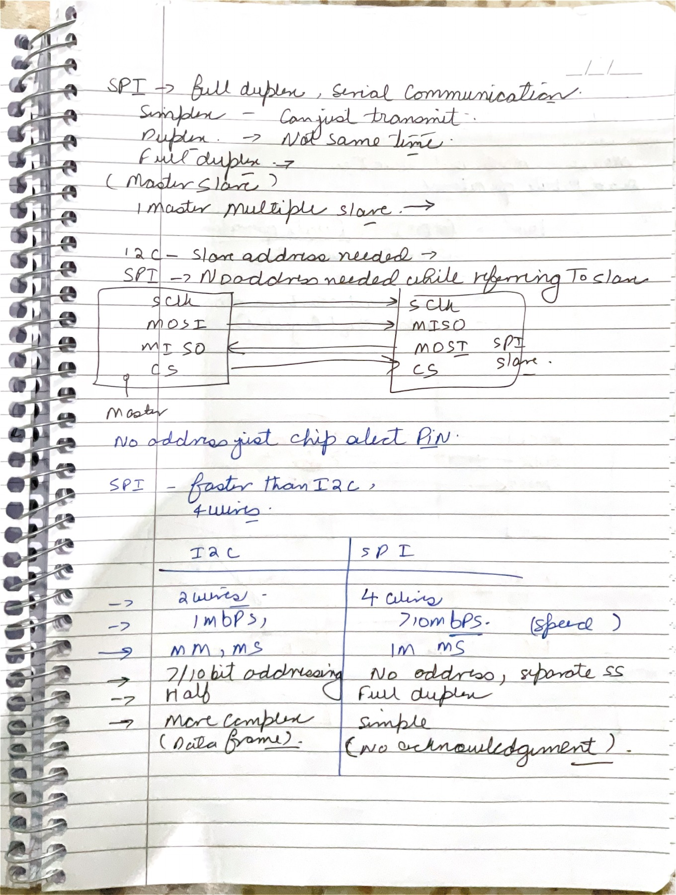
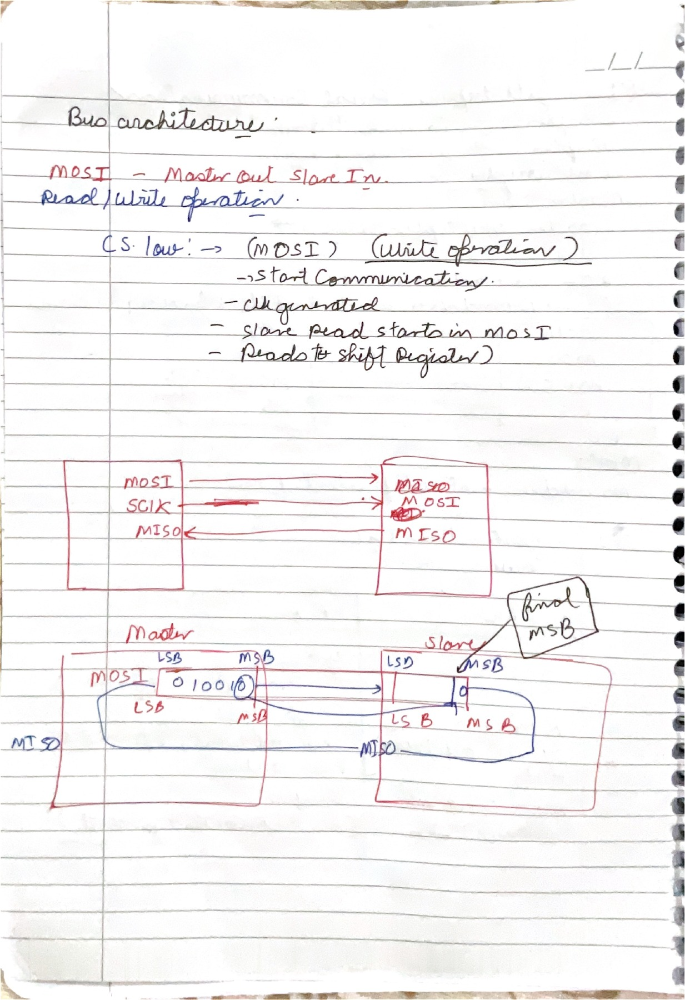
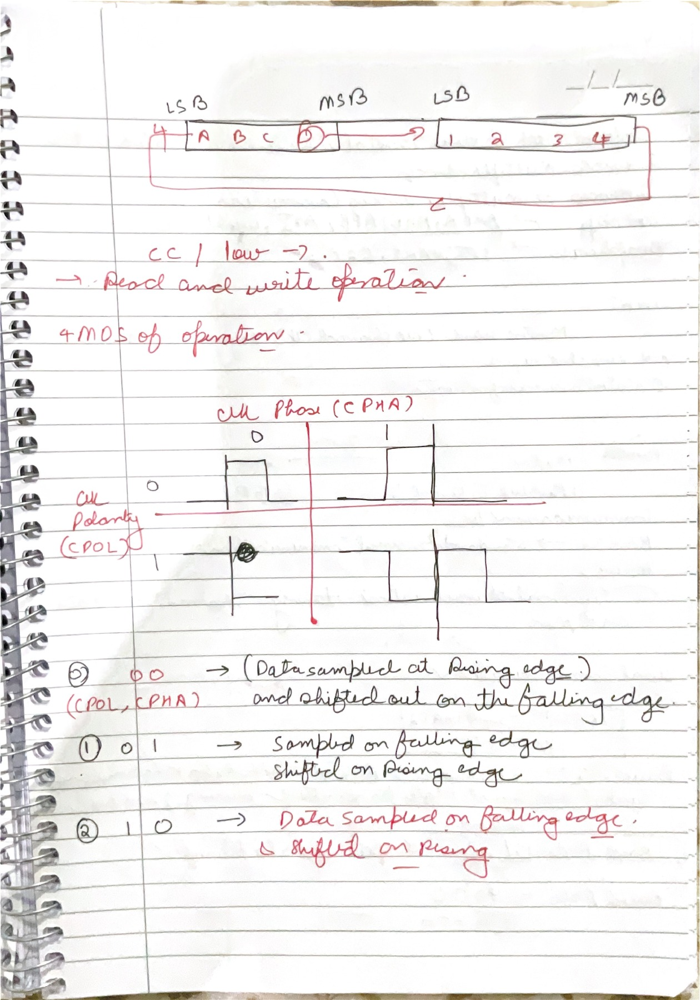

# 02 - SPI

These three pages move from the SPI wiring model to simultaneous shift-register transfer and finally to the four clock modes. SPI is simple at the wire level, but that simplicity means many details are device conventions rather than guarantees of one universal SPI standard.

## Page map

| Page | Revision focus |
|---:|---|
| [06](#page-06) | Full-duplex wiring, chip select, and a careful I2C comparison |
| [07](#page-07) | MOSI/MISO ownership and the two coupled shift registers |
| [08](#page-08) | Bit order plus CPOL/CPHA timing modes |

## Page 06 - SPI wiring and what “full duplex” means

### What this page is doing

The page introduces SPI as a synchronous serial interface normally organized around one controller and one or more peripherals. The controller provides SCK, asserts a chip-select line for the intended peripheral, and shifts bits through two directional data lines. `MOSI` carries controller-out/peripheral-in data; `MISO` carries peripheral-out/controller-in data. Because these two paths are separate, one bit can travel in each direction during the same SCK cycle. That is the precise meaning of full duplex.

Full duplex does not mean that every device always has useful data in both directions. A register read often begins with the controller sending a command or address while the peripheral returns placeholder bits; later clock cycles carry the requested value back while the controller sends dummy bits. SPI has no separate read/write phase on the wires—the meaning comes from the selected device's command format.

The four-signal drawing is the common single-peripheral arrangement: SCK, MOSI, MISO, and active-low chip select. With several independent peripherals, SCK/MOSI/MISO may be shared, but each peripheral usually needs its own chip-select. Some devices support daisy chaining, and some transfers are transmit-only or receive-only, so “four wires” is a useful default rather than an absolute rule.

The comparison table captures the broad trade-off. I2C uses fewer signal pins and has addressing, acknowledgment, arbitration, and defined bus electrical behavior. SPI usually spends more pins to obtain simpler framing and simultaneous data paths. SPI does not define an in-band address field or universal ACK/NACK bit; chip select performs out-of-band device selection, and command/status conventions belong to the peripheral.

### Clarity / correction / improvement

- **Correct:** conventional SPI is synchronous and can be full duplex through simultaneous MOSI and MISO shifting.
- **Clarify:** “no address” means no universal address field. A particular peripheral may still require register or memory addresses inside its command bytes.
- **Corrected:** SPI is not guaranteed to exceed 10 Mbit/s. Maximum SCK depends on controller, peripheral, voltage, loading, routing, and timing requirements.
- **Corrected:** I2C is not inherently half duplex in the same sense as one shared bidirectional data wire; direction changes over time on SDA. SPI has separate simultaneous data directions.
- **Clarify:** standard SPI provides no universal acknowledgment or integrity check. A device-specific status byte, parity, CRC, or readback can add those properties.

### Active recall

During an SPI register read, why must the controller continue transmitting bits even after it has already sent the read command?

## Page 07 - Two shift registers coupled into one transfer

### What this page is doing

The upper block diagram fixes the direction of each signal relative to the controller. MOSI and SCK travel from controller to peripheral; MISO travels back. Chip select, though not drawn in the upper box, determines whether the peripheral should react to those clocks. In the common active-low convention, asserting $\overline{CS}$ starts a framed exchange and deasserting it ends or commits that exchange, but the exact framing rules remain device-specific.

The lower diagram contains the most useful mental model for SPI: connect two shift registers in a ring. On every designated shift edge, the controller shifts one outgoing bit onto MOSI and the peripheral shifts that bit into its register. At the same time, the peripheral shifts one outgoing bit onto MISO and the controller captures it. After eight clock cycles, each side has received the byte that was in the other side's shift path.

This model explains why there is no separate physical “read operation.” A read is a full-duplex exchange in which the controller's transmitted bits are command/address/dummy bits and the peripheral's transmitted bits eventually become meaningful return data. A write is the same shift mechanism with useful controller-to-peripheral data and often unimportant return bits.

The page labels LSB and MSB around the registers, but bit order is not globally fixed by SPI. A device may shift most-significant bit first or least-significant bit first. Both sides must agree, and the controller must load and shift its register consistently. Similarly, the first valid output bit may need to be present before the first clock edge or may be launched by that edge; CPHA on the next page selects between those timing families.

### Clarity / correction / improvement

- **Correct:** MOSI and MISO names are defined from the controller's viewpoint, not from whichever block is currently sending useful payload.
- **Clarify:** a peripheral generally shifts data on every active SCK cycle while selected, even if one direction contains dummy data.
- **Clarify:** the drawing's final-MSB arrow is only correct for an MSB-first convention. Always check the peripheral data sheet.
- **Improvement:** for RTL, separate the parallel holding register from the serial shift register if software may write the next byte while the current byte is still transferring.

### Active recall

Start with controller byte `0xA5` and peripheral byte `0x3C`. After exactly eight agreed shift/sample cycles, what byte should each side's receive register contain, and why?

## Page 08 - CPOL, CPHA, and the four SPI modes

### What this page is doing

The top sketch continues bit-order reasoning; the rest of the page addresses the central timing question: on which SCK edge is data captured, and on which edge is it allowed to change? SPI uses two configuration bits to answer it.

`CPOL` selects the idle level of SCK. With `CPOL = 0`, SCK idles LOW, so the leading edge is rising and the trailing edge is falling. With `CPOL = 1`, SCK idles HIGH, so the leading edge is falling and the trailing edge is rising. “Leading” therefore means the first transition away from idle, not always a rising edge.

`CPHA` selects the sampling phase. With `CPHA = 0`, receivers sample on the leading edge and transmitters change or prepare the next bit on the trailing edge. The first data bit must already be stable before the first leading edge. With `CPHA = 1`, transmitters launch/change data on the leading edge and receivers sample it on the trailing edge. Sampling and shifting occur on opposite edges so the signal has roughly half a clock period to settle.

Together these choices make four modes:

| Mode | CPOL | CPHA | Leading edge | Trailing edge |
|---:|---:|---:|---|---|
| 0 | 0 | 0 | Rising: sample | Falling: change/setup |
| 1 | 0 | 1 | Rising: change/setup | Falling: sample |
| 2 | 1 | 0 | Falling: sample | Rising: change/setup |
| 3 | 1 | 1 | Falling: change/setup | Rising: sample |

The controller and selected peripheral must use the same mode. A polarity or phase mismatch often produces a one-bit shift or captures data near a transition, where setup/hold time is worst.

### Clarity / correction / improvement

- **Correct:** the page's `(CPOL, CPHA)` descriptions for modes 0, 1, and 2 follow the standard leading/trailing-edge interpretation.
- **Complete the missing case:** mode 3 is `(1,1)`: change/setup on the falling leading edge, sample on the rising trailing edge.
- **Clarify:** say **sample** and **change/setup**, not simply “read” and “write.” Both MOSI and MISO are sampled during the same edge.
- **Clarify:** for `CPHA = 0`, chip select normally becomes active early enough for the first bit to settle before the first sampling edge.

The edge table matches [Microchip's SPI transfer-mode documentation](https://onlinedocs.microchip.com/oxy/GUID-A299F4E7-F38C-4DF5-96C0-A87B9F519156-en-US-4/GUID-8A5B8750-B99E-4176-834E-E44E98F4A098.html).

### Active recall

For mode 2, state the idle clock level, the first edge after chip-select assertion, which edge captures data, and which edge launches the next bit.

## Module checkpoint

You understand SPI when you can treat every clock as a simultaneous exchange, derive physical edges from CPOL/CPHA instead of memorizing four unrelated pictures, and keep protocol-specific commands separate from the universal wire-level mechanism.
