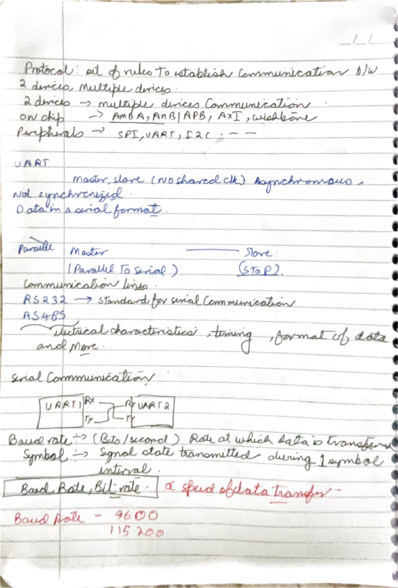
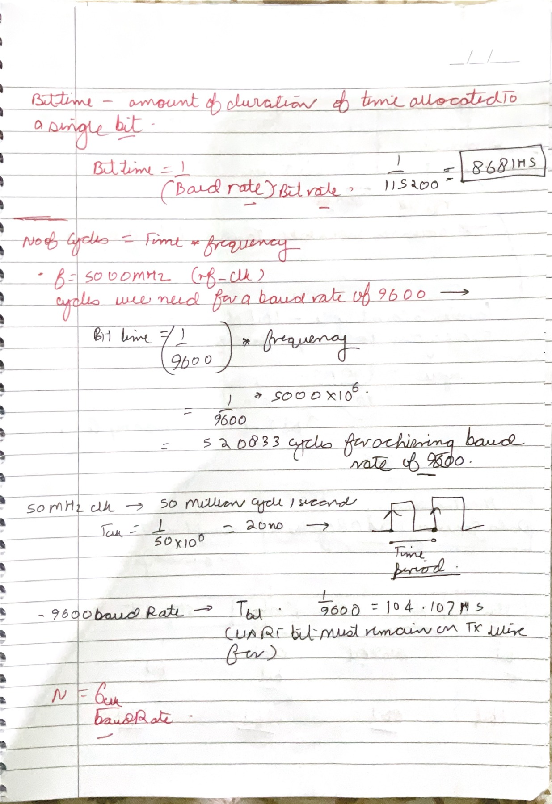
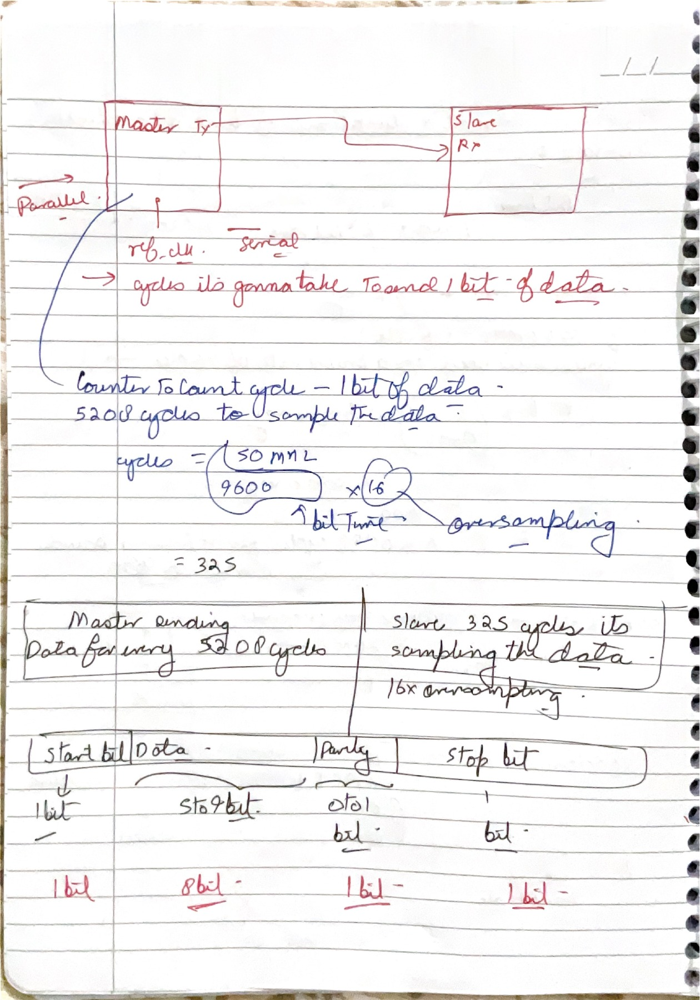
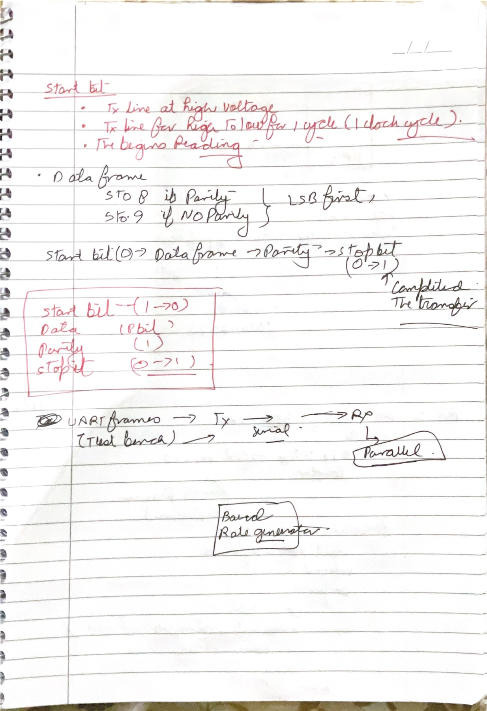
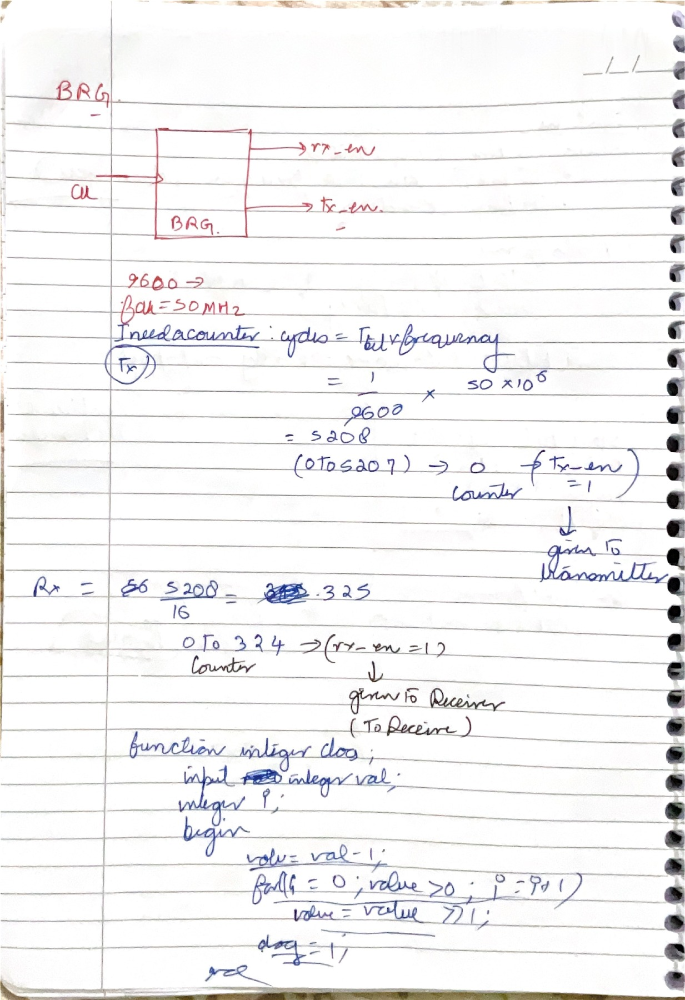
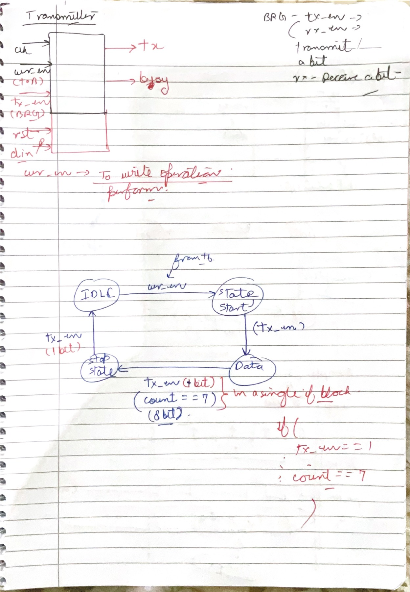
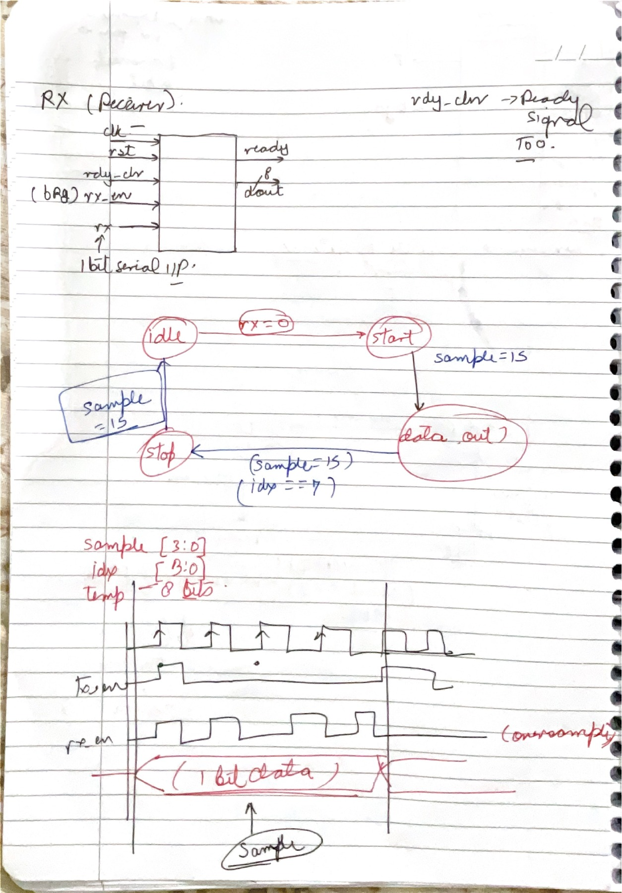
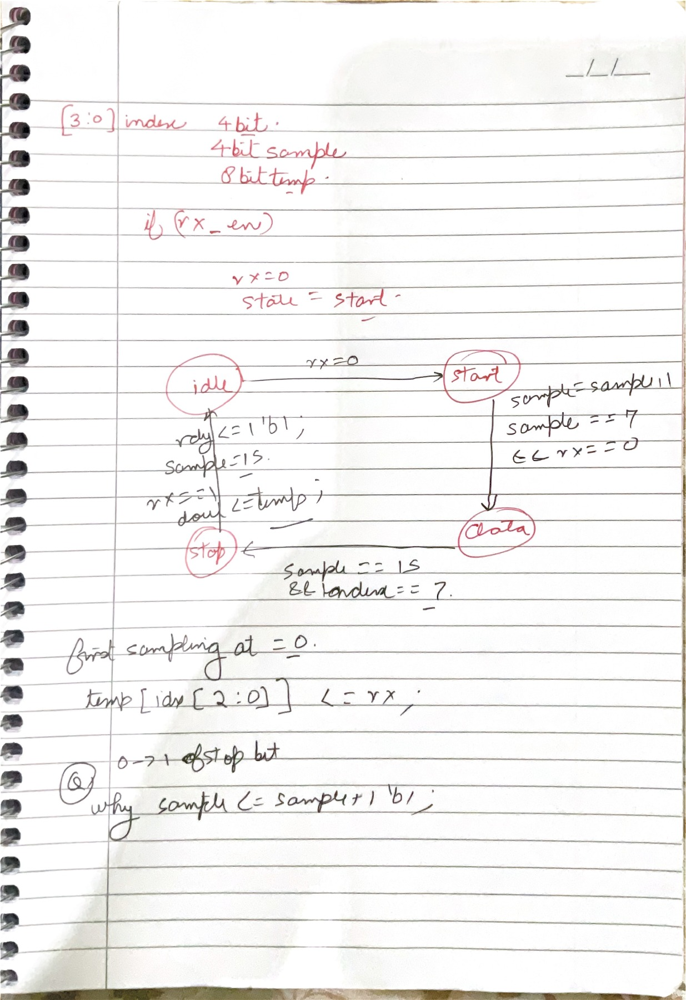

# 03 - UART

These eight pages progress from asynchronous serial communication into an RTL-oriented UART design. The central discipline is to keep four time scales separate: the FPGA/system clock, the baud-rate bit interval, the receiver's oversampling tick, and the frame-level transmitter/receiver state machines.

## Page map

| Page | Revision focus |
|---:|---|
| [09](#page-09) | UART purpose, asynchronous links, electrical standards, baud and bit rate |
| [10](#page-10) | Bit time and the system-clock divider calculation |
| [11](#page-11) | 16x oversampling and UART frame length |
| [12](#page-12) | Idle, START, data, optional parity, STOP, and conversion direction |
| [13](#page-13) | Baud-rate generator pulses, counter ranges, and width calculation |
| [14](#page-14) | Transmitter interface and FSM |
| [15](#page-15) | Receiver interface, mid-bit sampling, and counters |
| [16](#page-16) | Receiver pseudocode, STOP validation, and nonblocking assignments |

<a id="page-09"></a>
## Page 09 - UART as asynchronous framed serial communication



### What this page is doing

The page first separates on-chip interconnects such as AMBA/APB/AXI from peripheral serial interfaces such as SPI, UART, and I2C. That is a useful architectural boundary. A processor may write a UART's control and data registers over APB or AXI, while the UART independently converts those parallel register values into a timed serial waveform at its external TX pin.

UART stands for Universal Asynchronous Receiver/Transmitter. “Asynchronous” means the endpoints do not share a continuously transferred clock line. Each side generates its own timing from a configured baud rate. The receiver regains frame timing from the idle-to-START transition and samples later bits near their centers. The endpoints are therefore peers—transmitter and receiver—not an I2C-style controller and target.

The TX/RX drawing shows full-duplex UART wiring: A.TX connects to B.RX, B.TX connects to A.RX, and both sides share a ground reference. Either direction can operate independently. A one-wire or single-direction system can be simplex; a shared direction-controlled physical layer may be half duplex; the UART logic itself commonly provides independent transmit and receive paths.

RS-232 and RS-485 should be kept distinct from UART framing. UART defines the character timing and logical bits. RS-232 defines a point-to-point, single-ended electrical interface with voltage inversion/levels unlike FPGA GPIO. RS-485 defines differential drivers/receivers and supports multidrop physical networks. A UART core may feed either through the appropriate transceiver, but it cannot usually connect directly to an RS-232 cable.

The bottom correctly identifies common rates such as 9600 and 115200. Baud is symbols per second; bit rate is bits per second. For ordinary binary NRZ UART, each symbol interval carries one bit, so the values coincide numerically. That equality comes from the modulation, not from the definitions.

### Clarity / correction / improvement

- **Correct:** UART is serial and asynchronous, normally using separate TX and RX paths.
- **Corrected:** UART does not use a protocol-level controller/target or master/slave relationship.
- **Clarify:** RS-232 and RS-485 are electrical-layer standards that can transport UART-style framed data; they are not alternate names for UART.
- **Corrected:** baud rate and bit rate are equal for ordinary binary UART, but not as a universal communication rule.

### Active recall

If UART has no shared clock, what event gives the receiver a timing reference, and why must the two endpoints still configure nearly equal baud rates?

<a id="page-10"></a>
## Page 10 - Bit time and the divider from a 50 MHz clock



### What this page is doing

The first equation turns baud rate into time. For one-bit-per-symbol UART,

$$
T_{bit}=\frac{1}{B}
$$

where $B$ is the baud rate. At 115200 baud,

$$
T_{bit}=\frac{1}{115200}=8.68056\ \mu\text{s}.
$$

At 9600 baud, the result is instead

$$
T_{bit}=\frac{1}{9600}=104.1667\ \mu\text{s}.
$$

The next step relates that external bit interval to a 50 MHz system clock. One system-clock period is

$$
T_{clk}=\frac{1}{50\times10^6}=20\ \text{ns}.
$$

The ideal number of system-clock cycles per UART bit is

$$
N_{bit}=\frac{f_{clk}}{B}=\frac{50\times10^6}{9600}=5208.333\ldots
$$

This non-integer result is the key implementation issue. An integer divider cannot generate exactly 9600 baud from exactly 50 MHz. A fixed divider of 5208 cycles produces about 9600.614 baud; 5209 cycles produces about 9598.77 baud. Either error is tiny for ordinary UART. A fractional accumulator can alternate interval lengths and make the long-term average still closer.

The waveform at the bottom distinguishes clock period from bit period. The 20 ns system clock keeps running; a counter converts thousands of those cycles into a one-cycle `baud_tick`. The transmitter changes to the next framed bit only at that enable. It is usually cleaner to keep one system clock and use clock-enable pulses than to create a fabric-derived clock.

### Clarity / correction / improvement

- **Correct:** $T_{bit}=1/B$ for ordinary UART and the 115200-baud value $8.68\ \mu\text{s}$ is correct.
- **Corrected:** $50\ \text{MHz}/9600=5208.333\ldots$, not 520833. Keep the units visible to catch the factor-of-100 error.
- **Clarify:** $N=f_{clk}/B$ is a divider ratio, not itself a frequency.
- **Improvement:** define acceptable baud error and calculate the actual baud after rounding the divider.

### Active recall

From a 50 MHz clock, calculate the ideal cycles per bit at 115200 baud and explain what an RTL design must do because the answer is not an integer.

<a id="page-11"></a>
## Page 11 - Why the receiver uses 16x oversampling



### What this page is doing

The upper diagram correctly separates a parallel system-side interface from a serial wire. The transmitter accepts a byte in parallel and emits one framed bit at a time. The receiver watches the serial input and rebuilds a parallel byte. The system clock is much faster than the wire rate, so counters generate timing enables.

For transmission, one `baud_tick` per bit is enough. At 50 MHz and 9600 baud, that tick occurs after approximately $5208.333$ system-clock cycles. Reception benefits from a faster internal timing grid. With 16x oversampling, the receiver creates

$$
f_{sample}=16B=153600\ \text{samples/s}
$$

and the ideal divider is

$$
N_{sample}=\frac{50\times10^6}{16\times9600}=325.520833\ldots
$$

system clocks per sample enable. Sixteen sample intervals then span one nominal UART bit. The receiver detects the falling edge into START, waits toward the center of that bit, verifies that the line is still LOW, and then advances one full bit time between data samples. Sampling near the center maximizes margin against edge uncertainty, skew, and noise. Some UARTs also majority-vote three central samples; TI documents, for example, a 16x mode that votes samples 7, 8, and 9.

The frame sketch shows 1 START bit, 8 data bits, an optional parity bit, and at least 1 STOP bit. A common `8-N-1` frame therefore occupies 10 bit intervals: 1 START + 8 data + 1 STOP. With parity it occupies 11. This distinction matters when turning baud rate into payload throughput: 9600 baud with 8-N-1 carries at most about 960 payload bytes/s before any higher-level gaps.

### Clarity / correction / improvement

- **Correct:** 16x oversampling provides a timing grid for robust receive sampling.
- **Corrected:** the ideal sample divider is $325.5208\ldots$, not exactly 325. An integer choice changes the actual receive timing slightly.
- **Clarify:** oversampling does not mean the transmitter sends a bit 16 times. It means the receiver inspects the line on a clock-enable grid 16 times faster than the baud rate.
- **Clarify:** call the remote block a peer transmitter/receiver rather than a master or slave.

See [Microchip's clock-recovery description](https://onlinedocs.microchip.com/oxy/GUID-84570A8E-125A-4027-9491-9B22A292E347-en-US-5/GUID-34FF3967-6C5B-4AF9-94C0-97078652CF5C.html) and [TI's majority-voting behavior](https://software-dl.ti.com/msp430/esd/MSPM0-SDK/latest/docs/english/driverlib/mspm0l11xx_l13xx_api_guide/html/group___u_a_r_t.html).

### Active recall

Why is a sample enable at 16 times the baud rate useful if the design ultimately stores only one value for each received bit?

<a id="page-12"></a>
## Page 12 - Reading the UART frame from idle through STOP



### What this page is doing

The page reads the UART waveform in time order. The un-driven logical UART line is normally HIGH, called the marking or idle state. A frame begins when the transmitter holds TX LOW for one complete bit interval: the START bit. That falling transition lets an asynchronous receiver align its local timing to the new character.

Data follows immediately. UART hardware commonly supports 5 to 9 data bits, and the widespread convention is least-significant bit first. For an 8-bit value, the wire order is therefore $d_0,d_1,\ldots,d_7$, not the visual order used when writing a hexadecimal number. Both endpoints must use the same word length.

An optional parity bit follows the data. Even parity chooses the parity bit so the total number of ones across data plus parity is even; odd parity makes it odd. Parity detects every odd number of bit inversions, including a single-bit error, but it cannot correct the data and misses even-numbered error patterns. It is not a substitute for a stronger packet CRC.

One or more STOP bit intervals follow and must be HIGH. STOP is a level and duration requirement, not necessarily a LOW-to-HIGH edge: if the last data/parity bit is already HIGH, no transition occurs at the STOP boundary. A receiver that samples LOW where STOP should be HIGH reports a framing error. After STOP, the next START may begin immediately or the line may remain idle.

The lower diagram correctly associates parallel-to-serial conversion with TX and serial-to-parallel conversion with RX. The baud generator supplies bit timing; the state machines decide which frame field is active.

### Clarity / correction / improvement

- **Correct:** the line idles HIGH, START is LOW, data is usually LSB-first, parity is optional, and STOP is HIGH.
- **Corrected:** STOP should not be defined as a `0 → 1` transition. It is a HIGH bit interval; a transition may or may not occur.
- **Clarify:** START lasts one **bit interval**, which contains many system-clock cycles.
- **Clarify:** a common 8-N-1 frame has 10 total bit intervals, not 8.

The field order and levels match [Microchip's USART frame definition](https://onlinedocs.microchip.com/oxy/GUID-A9964E93-D46C-42E6-98D2-4ED783ABB2CE-en-US-2/GUID-7BA3A2AA-EFBF-4C3A-BB96-17B8A413DE69.html).

### Active recall

Write the exact wire-level sequence for transmitting `0xA6` as 8-N-1, including idle, START, all eight data bits in transmission order, and STOP.

<a id="page-13"></a>
## Page 13 - Baud-rate generator pulses and counter widths



### What this page is doing

The BRG block converts a fast clock into timing enables for both sides of the UART. A good RTL implementation normally emits one-system-clock-wide pulses such as `tx_en` and `rx_en`; downstream logic remains clocked by the main `clk` and advances only when its enable is asserted. This avoids creating uncontrolled derived clocks in FPGA fabric.

For a 50 MHz, 9600-baud transmitter, the ideal interval is $5208.333$ clocks. If the integer interval is chosen as 5208 clocks, a zero-based counter must visit values 0 through 5207. On the cycle where the old count equals 5207, the logic emits `tx_en` and returns the counter to zero. The number of states is therefore 5208, not 5207.

For a nominal 16x receiver tick, the ideal interval is $325.5208$ clocks. A fixed counter could alternate or approximate with 325/326-clock intervals. A phase accumulator is more systematic: add $16B$ to an accumulator each system cycle and emit a tick on overflow relative to $f_{clk}$. The average frequency can then closely track 153.6 kHz without creating a fractional counter limit.

The handwritten `integer clog` fragment is aiming at counter-width calculation. A counter that must represent 0 through 5207 requires

$$
W=\lceil\log_2(5208)\rceil=13
$$

bits, because $2^{12}=4096$ is too small and $2^{13}=8192$ is sufficient. A synthesizable SystemVerilog design can use `$clog2(DIVISOR)` with care for the special case `DIVISOR <= 1`; a Verilog helper function can repeatedly right-shift `value - 1` and count the shifts.

### Clarity / correction / improvement

- **Correct:** separate transmit-bit and receive-sample enables are useful because their target frequencies differ by the oversampling factor.
- **Corrected:** if `rx_en` is the 16x sample tick, it must pulse about every $325.52$ clocks, not every 325 clocks exactly.
- **Clarify:** `tx_en` and `rx_en` are better named `baud_tick` and `sample_tick`; `tx_start` should be a separate request input.
- **Improvement:** parameterize $f_{clk}$, baud, and oversampling rate, and calculate/report the actual generated rates.

AMD's [UART baud-rate generator description](https://docs.amd.com/r/en-US/ug585-zynq-7000-SoC-TRM/Baud-Rate-Generator) likewise separates a high-rate sample enable from the final TX/RX baud enables.

### Active recall

Why does a divide-by-5208 counter compare against 5207, and how many bits must that counter contain?

<a id="page-14"></a>
## Page 14 - Building the transmitter as a timed FSM



### What this page is doing

The top block identifies the transmitter's responsibilities: accept an 8-bit parallel value, observe a send request, serialize the frame on `tx`, and expose whether it is busy. The handwritten `tx_en` is overloaded between “start transmission” and “advance one bit.” A clean interface separates them:

- `start_tx`: a one-cycle request from the user logic.
- `data_in[7:0]`: the byte captured when an idle transmitter accepts the request.
- `baud_tick`: the BRG's one-cycle timing enable.
- `tx`: the registered serial output, HIGH while idle.
- `busy`: HIGH from acceptance of the request until the STOP interval completes.

The FSM then becomes deterministic. In `IDLE`, hold `tx = 1` and `busy = 0`. When `start_tx` is accepted, copy `data_in` into an internal holding/shift register and enter `START`; do not depend on `data_in` remaining unchanged afterward. On the next relevant baud interval, drive START LOW. In `DATA`, output bits $d_0$ through $d_7$ in order, advancing an index only on `baud_tick`. After the eighth data interval, enter `STOP`, drive HIGH for one full bit interval, then return to `IDLE`.

The transition label `count == 7` means the current data bit is the eighth bit because counting begins at zero. The comparison and the output timing must refer to the same old-state values in sequential logic; otherwise the last bit can be skipped or held for two intervals. A waveform-based self-check should verify the exact durations of START, each data bit, and STOP.

Reset should put the transmitter into an electrically safe state: `tx = 1`, `busy = 0`, state `IDLE`, and counters/indexes zero. New requests while `busy = 1` need a defined policy—ignore them, queue them in a FIFO, or expose `ready` so the caller never asserts them.

### Clarity / correction / improvement

- **Correct:** `IDLE → START → DATA → STOP → IDLE` is the right minimal 8-N-1 state sequence.
- **Corrected:** do not use one `tx_en` signal for both a user request and a baud tick; their meanings and time scales differ.
- **Clarify:** START and STOP must each persist for a whole baud interval, not one 50 MHz clock.
- **Improvement:** latch the input byte at request acceptance and define behavior for a request while busy.

### Active recall

If `start_tx` arrives halfway between baud ticks, when should the transmitter latch the byte, when should TX first go LOW, and when should `busy` clear?

<a id="page-15"></a>
## Page 15 - Receiver timing and why sampling moves to bit centers



### What this page is doing

The receiver block watches a one-bit asynchronous input and produces an 8-bit parallel byte plus a readiness indication. Because `rx` is asynchronous to `clk`, production RTL should first pass it through a two-flip-flop synchronizer. The synchronized signal feeds edge detection and the receiver FSM. The synchronizer reduces metastability risk; oversampling solves the separate problem of choosing a robust sampling instant.

In `IDLE`, the line should be HIGH. A detected LOW begins a candidate START bit. The receiver does not immediately accept data bit 0. With a 16x sample tick, it waits roughly half a bit—commonly 7 or 8 sample intervals—and checks that RX remains LOW. This midpoint check rejects a short LOW glitch that looked like a START edge.

Once the START midpoint is confirmed, the receiver waits 16 more sample ticks to reach the center of data bit 0, stores that value, and repeats every 16 ticks for bits 1 through 7. This is what the waveform's arrows are trying to show: the first alignment delay is half a bit, while subsequent sample-to-sample spacing is a full bit. A robust implementation may majority-vote several center samples instead of using only one.

The counters at the bottom have different jobs. A 16x phase counter needs 4 bits and represents positions 0 through 15. An 8-bit data index needs only 3 bits and represents 0 through 7. The temporary receive byte needs 8 bits. Reusing a single `sample` count for both bit phase and data index makes the code hard to reason about and often creates off-by-one errors.

After the last data bit, the FSM waits another full bit interval and checks STOP. A HIGH STOP sample completes a valid byte and should create a one-cycle `data_valid` pulse or set a level-valid flag until acknowledged. A LOW STOP sample is a framing error; blindly declaring ready would hide a baud mismatch or corrupted frame.

### Clarity / correction / improvement

- **Correct:** detect the idle-HIGH to START-LOW transition, sample near centers, and rebuild the byte LSB-first.
- **Corrected:** a 4-bit `sample` phase counter and a 3-bit `bit_index` are sufficient; both need not be 4 bits.
- **Clarify:** the first center is half a bit after START detection; data centers are then one bit apart.
- **Improvement:** synchronize RX, reject false STARTs, validate STOP, and define whether `ready` is a pulse or a held handshake flag.

### Active recall

Starting from the first detected LOW sample in 16x mode, describe when the receiver validates START and when it captures data bits 0 and 1.

<a id="page-16"></a>
## Page 16 - Receiver pseudocode and nonblocking-assignment timing



### What this page is doing

The final page turns the receiver diagram into sequential-logic conditions. It proposes a 4-bit sample counter, an index, and an 8-bit temporary register. The core idea is sound, but the state transitions must align precisely with the counter definition.

One consistent convention is: on each `sample_tick`, inspect the **old** phase counter, perform any midpoint action, then explicitly wrap or increment it. In `START`, when the chosen midpoint count is reached, confirm `rx == 0`; otherwise abort to `IDLE` as a false start. Reset the phase to zero before entering `DATA`. In `DATA`, every time the full-bit terminal count is reached, capture `rx` into `temp[bit_index]`, reset phase, and either increment the index or move to `STOP` after index 7. In `STOP`, wait another full-bit interval, require `rx == 1`, publish `temp`, and assert `data_valid`.

The circled question asks why code can write `sample <= sample + 1'b1` while also comparing `sample` in the same clocked block. With Verilog nonblocking assignments, every right-hand side and condition is evaluated using values from just before the clock edge. The new assignments are committed together after the block finishes. Therefore:

```verilog
sample <= sample + 1'b1;
if (sample == 4'd15) begin
    sample <= 4'd0;
    // sample one UART bit here
end
```

tests the old value. If old `sample` is 15, both assignments schedule updates to the same register; the later executed assignment to zero wins. This coding style is legal, but an explicit `if/else` is clearer and avoids relying on assignment priority.

The handwritten condition `sample == 15 && index == 7` correctly identifies the eighth data-bit sampling event if the phase counter's terminal value corresponds to one full bit. It should then transition to `STOP`, not immediately declare a complete byte. STOP must be sampled HIGH one bit later. Also remember that `temp[index] <= rx` updates after the edge; if `data_out <= temp` occurs on the same edge as the last-bit capture, `data_out` receives the old `temp` unless bit 7 is inserted explicitly or publication is delayed until STOP.

### Clarity / correction / improvement

- **Answer to the handwritten question:** `sample <= sample + 1'b1` is a scheduled nonblocking update; the same block's comparisons see the pre-edge value.
- **Corrected:** validate START at its midpoint before entering DATA, then capture data bits one full bit apart.
- **Corrected:** after bit index 7, enter STOP and verify HIGH before asserting `ready`/`data_valid`.
- **Important RTL pitfall:** publishing `temp` on the same edge as its final nonblocking bit write can omit the newest bit.
- **Improvement:** use explicit defaults and `if/else` priority, clear a pulse-style `data_valid` every cycle by default, and provide separate framing-error status.

### Active recall

If old `sample` equals 15, what values do an `if (sample == 15)` condition and the expression `sample + 1'b1` use? Then explain which assignment wins if the block schedules both increment and reset.

## Module checkpoint

You understand these pages when you can derive all counters from $f_{clk}$ and baud, explain why START gives timing alignment, place every data sample at a bit center, and predict old-versus-new values in nonblocking sequential logic without trial and error.
