# Static Timing Analysis (STA)

[Back to Subjects](../README.md) | [Original 24-page scan](sources/sta-handwritten-notes-pages-01-24.pdf) | [Original extra page](sources/sta-handwritten-notes-page-25.jpeg)

This subject pillar turns 25 handwritten pages into one source-linked revision room. The notes begin with transmission gates, latches, and flip-flops, then build the setup/hold equations, arrival and required time, slack, clock skew, maximum frequency, negative timing parameters, and worked register-to-register examples.

The source image for every page appears immediately before its explanation. Red writing, pink highlights, circled doubts, questions, and corrected calculations are treated as questions to answer - not as decoration to transcribe.

## Core term dictionary

The definitions below use the path model documented by [Synopsys](https://www.synopsys.com/glossary/what-is-static-timing-analysis.html), the terminology and constraint model in the [Intel Timing Analyzer guide](https://www.intel.com/content/www/us/en/docs/programmable/683243/24-1/timing-analysis-basic-concepts.html), and the report fields in [AMD Vivado UG906](https://docs.amd.com/r/en-US/ug906-vivado-design-analysis/Timing-Path-Summary).

| Term | Precise meaning | Practical meaning |
|---|---|---|
| **STA — Static Timing Analysis** | Constraint-driven analysis that decomposes a design into timing paths, calculates propagation bounds, and checks them against timing requirements without applying a time-ordered functional stimulus sequence ([Synopsys STA definition](https://www.synopsys.com/glossary/what-is-static-timing-analysis.html)). | STA asks whether enabled paths can meet timing in the specified modes/corners. It does not prove the logic function. |
| **Timing netlist / timing graph** | A timing representation whose nodes are pins/ports and whose directed arcs model valid propagation or sequential timing relationships. Intel’s guide separates the timing netlist, timing paths, and clock analysis ([Intel basic concepts](https://www.intel.com/content/www/us/en/docs/programmable/683243/24-1/timing-analysis-basic-concepts.html)). | The analyzer propagates early/late numbers through this graph rather than simulating every Boolean vector. |
| **Timing arc** | A characterized input-to-output, clock-to-output, or constraint relationship for a cell, port, or interconnect element. | An arc says which transition can affect which other pin and with what delay/requirement under the selected condition. |
| **Timing path** | A valid chain from a startpoint, through combinational cell/net arcs, to an endpoint. Synopsys defines the path elements as startpoint, combinational network, and endpoint ([Synopsys STA definition](https://www.synopsys.com/glossary/what-is-static-timing-analysis.html)). | A schematic may contain many topological routes; constraints and timing sense determine which are analyzed. |
| **Startpoint / endpoint** | A startpoint launches data or defines its external availability; an endpoint captures data or defines where it must be available. Common examples are input/register-clock startpoints and register-data/output endpoints ([Synopsys STA definition](https://www.synopsys.com/glossary/what-is-static-timing-analysis.html)). | These are the boundaries of one timing question, not simply the first and last gate drawn on a page. |
| **Arrival time** | The calculated time at which a transition can reach a timing node, propagated from its launch/reference event through clock-to-Q, cell, and net delay. | Setup uses the relevant late arrival; hold uses the relevant early arrival. |
| **Required time** | The latest legal arrival for a maximum-delay/setup check or the earliest legal arrival boundary for a minimum-delay/hold check, derived from clocks, I/O constraints, uncertainty, and cell requirements. | It is the deadline/window boundary created by the specification, not another measured data-path delay. |
| **Slack** | Margin between calculated arrival and required time. In this README’s convention, setup slack is `required − arrival`, while hold slack is `arrival − required`; positive is margin and negative is violation. Intel describes timing analysis as checking arrival times against required times ([Intel timing overview](https://www.intel.com/content/www/us/en/support/programmable/support-resources/design-guidance/quartus-support.html)). | Slack combines the complete check into one pass/fail number, but its meaning depends on whether the check is maximum delay or minimum delay. |
| **Setup time** | Minimum interval for which capture data must already be stable before the active capture edge; it creates a maximum-delay requirement ([Synopsys STA definition](https://www.synopsys.com/glossary/what-is-static-timing-analysis.html)). | Latest data is dangerous. A longer clock period can normally provide more setup time. |
| **Hold time** | Minimum interval for which capture data must remain stable after the active capture edge; it creates a minimum-delay requirement ([Synopsys STA definition](https://www.synopsys.com/glossary/what-is-static-timing-analysis.html)). | Earliest new data is dangerous. Reducing clock frequency normally does not repair a same-edge hold violation. |
| **Clock-to-Q delay (`t_cq`)** | Delay from the active launch-clock transition at a flip-flop to the resulting valid transition at its Q output. | It belongs to the launched data path even though its cause is a clock edge. Maximum `t_cq` is used for setup and minimum `t_cq` for hold. |
| **Clock latency** | Delay from a clock definition/source to the clock pin of a sequential element. | Different launch and capture latencies create skew. Equal absolute latency can be large without creating local skew. |
| **Clock skew** | Difference between capture- and launch-clock arrival times for a timing relationship. With this README’s convention, `S = L_C − L_L`. | Positive skew helps setup but hurts hold for the same register-to-register relationship. |
| **Clock uncertainty** | Margin used to account for imperfect knowledge of clock-edge timing, including specified jitter and modeling variation. | It reduces usable timing margin; it is not automatically identical to measured jitter. |
| **Jitter** | Variation of clock-edge position over time relative to an ideal timing reference. | Jitter is a physical/source behavior; uncertainty is the analysis margin applied to cover this and other effects. |
| **PVT corner** | A selected process, supply-voltage, and temperature condition used to characterize or analyze delays. | Slow/low-voltage/hot is not universally worst for every check; setup and hold need the appropriate early/late combinations. |
| **Maximum-delay / minimum-delay analysis** | Maximum-delay analysis checks the latest propagation against setup-like deadlines; minimum-delay analysis checks the earliest propagation against hold-like boundaries. Synopsys notes that STA uses longest and shortest path delays for the two purposes ([Synopsys STA definition](https://www.synopsys.com/glossary/what-is-static-timing-analysis.html)). | “Critical path” must be qualified: the worst late path and the worst early path are different problems. |
| **MCMM — Multi-Corner Multi-Mode analysis** | Concurrent timing verification across multiple operating modes and PVT/variation corners; Intel’s Timing Analyzer documentation includes multicorner timing analysis in its core model ([Intel basic concepts](https://www.intel.com/content/www/us/en/docs/programmable/683243/24-1/timing-analysis-basic-concepts.html)). | A design is not signed off because one functional mode at one corner passes. |
| **False path** | A topological path that cannot or must not be sensitized in the intended operating modes and is therefore excluded only through a justified exception ([Synopsys STA definition](https://www.synopsys.com/glossary/what-is-static-timing-analysis.html)). | An incorrect false-path constraint hides a real requirement; it is not a command for silencing an inconvenient report. |
| **Multicycle path** | A path whose intended capture relationship allows more than the default one cycle, expressed through paired setup/hold exception reasoning ([Synopsys STA definition](https://www.synopsys.com/glossary/what-is-static-timing-analysis.html)). | The architecture grants extra cycles; the exception does not make slow logic functionally correct by itself. |
| **Timing signoff** | Final evidence that all intended paths, modes, corners, constraints, and exceptions meet the required timing criteria with an accepted analysis methodology. | Clean slack is meaningful only if clocks, I/O delays, CDC policy, exceptions, libraries, and parasitics are complete. |

## Why static timing analysis instead of dynamic timing simulation?

| Question | Static timing analysis | Dynamic timing simulation |
|---|---|---|
| What drives the analysis? | Timing graph, libraries, parasitics, clocks, constraints, modes, and corners | A time-ordered testbench stimulus plus logic/delay models |
| Which paths are checked? | Every enabled path represented by the constrained timing graph | Only paths sensitized and transitioned by the applied vectors |
| What does it prove? | Timing compliance for the modeled paths/views | Circuit behavior for the simulated sequences; with delays, timing effects on those sequences |
| Main strength | Broad, vectorless path coverage and scalable min/max analysis | Functional sequence, state, protocol, pulse, and unknown-value behavior |
| Main limitation | Cannot prove intended functionality; bad or missing constraints create bad coverage | Cannot practically exhaust every path, data sequence, mode, and PVT combination |

It is therefore not “STA **or** simulation.” STA is used because timing coverage cannot depend on inventing vectors that sensitize every path; simulation or formal verification is still needed for function. Synopsys explicitly contrasts STA’s path coverage with vector-dependent dynamic simulation and states that STA checks timing, not functionality ([Synopsys STA definition](https://www.synopsys.com/glossary/what-is-static-timing-analysis.html)).

**Interview form:** Static timing analysis checks all constrained timing paths mathematically without applying input vectors, so it is faster and more complete for setup/hold coverage than dynamic timing simulation. It is called static because it does not simulate a time sequence of logic vectors—not because signals are constant. We still need simulation or formal verification for functionality.

## How to revise STA

For every problem, draw the launch edge, capture edge, full clock paths, and full data path before substituting numbers. Write **arrival time** and **required time** as separate expressions, choose maximum delays for setup and minimum delays for hold, and only then calculate slack. After solving, explain why each term is added or subtracted and why changing frequency can or cannot repair the result. Use the global [revision plan](../../REVISION_PLAN.md) for scheduling.

## Page map

| Page | Revision focus | Page | Revision focus |
|---:|---|---:|---|
| [1](#page-01) | Why STA; transmission-gate operation | [14](#page-14) | Correct hold inequality; setup versus hold criticality |
| [2](#page-02) | 4:1 multiplexer using transmission gates | [15](#page-15) | Positive and negative clock skew |
| [3](#page-03) | Transmission-gate D latch and feedback | [16](#page-16) | Maximum frequency from flip-flop parameters |
| [4](#page-04) | Negative-edge master-slave flip-flop | [17](#page-17) | Testing candidate clock periods |
| [5](#page-05) | Active-low latch and internal setup path | [18](#page-18) | Frequency and hold-violation examples |
| [6](#page-06) | Physical meaning of hold time | [19](#page-19) | Clock latency equations; negative hold time |
| [7](#page-07) | Register-to-register setup derivation | [20](#page-20) | Effective and negative setup/hold times |
| [8](#page-08) | Full adder built from half adders | [21](#page-21) | Why data delay improves hold margin |
| [9](#page-09) | Required time, arrival time, and setup slack | [22](#page-22) | General setup/hold equations with clock delays |
| [10](#page-10) | Inequality equivalence; sticky-note correction | [23](#page-23) | Worked skew example and missing data-path delay |
| [11](#page-11) | Min/max delay tuples and path bookkeeping | [24](#page-24) | Three-register pipeline and symbolic $f_{max}$ |
| [12](#page-12) | Worst-case setup pairing and clock corners | [25](#page-25) | Final numerical problem, including red correction |
| [13](#page-13) | Hold analysis, min delays, and hold slack |  |  |

## The timing spine used throughout these pages

For one register-to-register path, define:

- $L_L$: launch-clock arrival time at the source flip-flop.
- $L_C$: capture-clock arrival time at the destination flip-flop.
- $S=L_C-L_L$: clock skew. With this convention, positive skew means the capture clock arrives later.
- $t_{cq,max}$ and $t_{cq,min}$: maximum and minimum clock-to-Q delay of the launch flip-flop.
- $t_{comb,max}$ and $t_{comb,min}$: maximum and minimum delay of the complete sensitized combinational data path.
- $t_{su}$ and $t_h$: setup and hold requirements of the capture flip-flop.

Ignoring uncertainty for the handwritten examples, the setup check is

$$
A_{setup}=L_L+t_{cq,max}+t_{comb,max},
$$

$$
R_{setup}=L_C+T_{clk}-t_{su},
$$

$$
Slack_{setup}=R_{setup}-A_{setup}.
$$

Therefore,

$$
T_{clk}\ge t_{cq,max}+t_{comb,max}+t_{su}-S.
$$

The hold check uses the earliest new data and the same-cycle capture edge:

$$
A_{hold}=L_L+t_{cq,min}+t_{comb,min},
$$

$$
R_{hold}=L_C+t_h,
$$

$$
Slack_{hold}=A_{hold}-R_{hold}.
$$

Therefore,

$$
t_{cq,min}+t_{comb,min}\ge t_h+S.
$$

These two equations are the reference frame for the rest of this file. A real signoff run also includes uncertainty, jitter, on-chip variation, rise/fall arcs, PVT corners, derates, and library constraints.

## Page 01 - Why STA exists, and how a transmission gate passes data

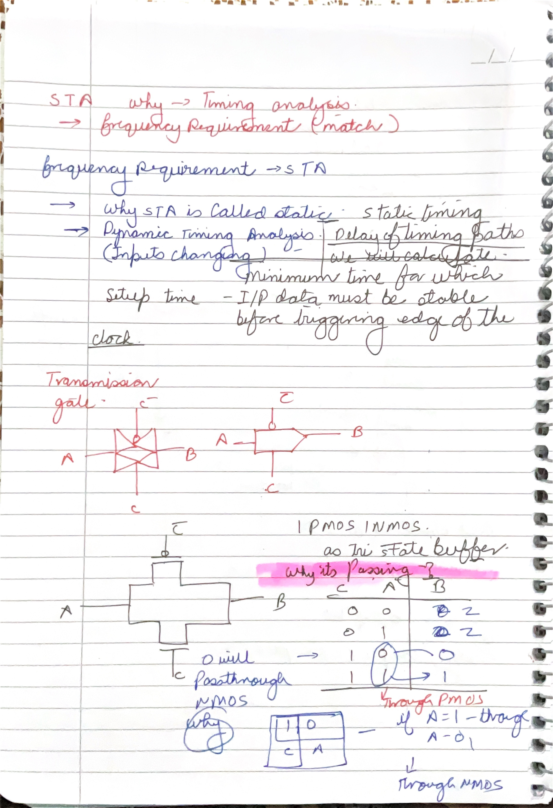

### What this page is doing

The opening page asks two definition-level questions: **what STA proves** and **why it is called static**. It then introduces the transmission gate that later forms the data and feedback paths inside the latches.

The handwritten phrase “frequency requirement” belongs primarily to the **setup** side of timing. Increasing frequency reduces the available clock period,

$$
T_{clk}=\frac{1}{f_{clk}},
$$

so late data eventually produces negative setup slack. Hold is different: it checks whether the earliest new data arrives too soon after the same capture edge. A longer clock period normally does not repair a hold violation. Therefore, STA is not merely a tool that calculates one maximum frequency; it verifies a set of maximum-delay, minimum-delay, clock, I/O, and sequential-cell timing requirements.

### Red-marker answers and corrections

#### Why do we need STA?

**Definition:** Static timing analysis is a constraint-driven method for verifying whether signals can travel through the implemented timing network and reach their endpoints within the required time windows.

The analyzer converts the netlist into a **timing graph**:

- Pins or ports become timing nodes.
- Valid cell and interconnect transitions become timing arcs.
- A timing path begins at a startpoint, such as an input port or launching register, and ends at an endpoint, such as a receiving register or output port.
- Library models and extracted interconnect provide delay values for the selected slew, load, PVT corner, and variation model.
- Clock definitions, I/O delays, uncertainty, exceptions, and sequential-cell constraints establish the required times.

For each applicable path and analysis view, STA propagates an **arrival time** and constructs a **required time**. Slack is the distance between those boundaries:

$$
Slack_{setup}=Required_{late}-Arrival_{late},
$$

$$
Slack_{hold}=Arrival_{early}-Required_{early}.
$$

The different signs are intentional. Setup passes when the latest data arrives no later than its deadline. Hold passes when the earliest new data arrives no earlier than the end of the hold window. Zero slack is the mathematical boundary; positive slack is margin; negative slack is a violation.

STA is needed because post-synthesis and post-layout timing is not a single logic-delay number. The analysis must account for cell delay, routed-net delay, clock-tree latency and skew, input slew, output load, jitter or uncertainty, process, voltage, temperature, and variation. Multiple operating modes and corners create multiple analysis views. A path that passes at one corner may fail at another: slow data is usually dangerous for setup, while fast data is usually dangerous for hold.

The [Intel Timing Analyzer overview](https://www.intel.com/content/www/us/en/programmable/quartushelp/15.1/analyze/sta/sta_about_sta.htm) describes this core operation as analyzing timing paths, calculating their propagation delay, checking constraints, and reporting slack. Intel's [timing-analysis terminology](https://www.intel.com/content/www/us/en/docs/programmable/683243/24-1/timing-analysis-basic-concepts.html) also defines arrival time, setup and hold constraints, timing paths, timing netlists, and multicorner analysis.

**Important correction to “STA finds the frequency”:** STA normally checks the clock period supplied by the constraints. The worst setup path tells us whether that period passes and, under the same assumptions, what minimum period or maximum frequency is possible. Hold is checked separately and is not made safe merely by reducing frequency.

**Important coverage limit:** “All paths” means all valid paths represented by the timing graph after clocks, constraints, case analysis, and timing exceptions are applied. STA cannot prove the intended behavior of the RTL, cannot repair an unconstrained interface, and can miss a real requirement if a false-path or multicycle exception is wrong. Constraint completeness is therefore part of timing signoff.

#### Why is it called *static*?

“Static” does **not** mean that the circuit signals are constant. It means the timing result is computed without running a time-ordered functional simulation using a chosen sequence of input vectors.

STA mathematically propagates early and late timing bounds through every enabled timing arc. It asks questions such as:

- What is the latest possible arrival at this endpoint for setup?
- What is the earliest possible arrival at this endpoint for hold?
- Does that arrival satisfy the required time derived from the clocks and constraints?

Dynamic timing simulation asks a different question: **what happens for this particular stimulus sequence?** A simulated path is checked only if the applied vectors sensitize it and create the relevant transition. STA is vectorless, so it can cover paths that a testbench never activates. [Synopsys' STA definition](https://www.synopsys.com/glossary/what-is-static-timing-analysis.html) explicitly contrasts path-based STA with vector-dependent dynamic simulation and also notes the crucial boundary: STA verifies timing, not logical functionality.

This wider path coverage can introduce pessimism. Some topological paths may be functionally impossible, mutually exclusive, or intentionally multicycle. They are removed or modified only through justified timing exceptions or mode constraints—not by hoping that simulation never activates them.

#### Why does the transmission gate pass the signal?

A CMOS transmission gate places one nMOS and one pMOS **in parallel between the same two signal nodes**. Their gates receive complementary enables:

| $C$ | $\overline C$ | nMOS | pMOS | Connection between $A$ and $B$ |
|---:|---:|---|---|---|
| 0 | 1 | OFF | OFF | Open/disconnected |
| 1 | 0 | ON | ON | Conducting in either direction |

When enabled, the devices do not calculate a Boolean expression such as $A\cdot C$. They create a finite-resistance electrical path:

$$
C=1:\quad A\leftrightarrow B.
$$

Calling one side “input” and the other “output” is only a circuit-use convention. At transistor level, either side can drive the other. This is why a transmission gate is a **bidirectional CMOS switch**.

The complementary transistor pair is needed for full-swing digital transfer:

- An nMOS passes a strong 0, but as it passes a rising voltage its overdrive decreases; by itself, its HIGH level can stop near a threshold below the positive rail.
- A pMOS passes a strong 1, but by itself it is poor at pulling a node completely to 0.
- In parallel, the pMOS supports the upper part of the voltage range and the nMOS supports the lower part, so the switch transfers both logic rails far better than either device alone.

The switch is not ideal: it has on-resistance, parasitic capacitance, charge injection, leakage, and a delay that depends on the driven load. “Passes both 0 and 1 strongly” means it avoids the first-order threshold-loss problem of a single pass transistor; it does not mean zero resistance or zero delay. The [UC Berkeley EECS 150 CMOS notes](https://www-inst.cs.berkeley.edu/~cs150/sp11/agenda/lec/lec08-cmos.pdf) summarize the same device roles—nFET for passing 0, pFET for passing 1—and explicitly identify the transmission gate as bidirectional. The transmission-gate discussion in [Harris and Harris, *Digital Design and Computer Architecture*, Chapter 1](https://pages.hmc.edu/harris/class/e85/old/spring18/01_Ch01.pdf) likewise explains that the parallel complementary pair passes both levels and has no preferred input or output side.

When disabled, the precise statement is **the transmission gate disconnects $A$ from $B$**. In a digital model, an otherwise undriven isolated terminal is represented as high impedance, $Z$. If another circuit is driving $B$, however, $B$ is not forced to $Z$; it simply no longer receives a drive through this transmission gate.

#### Is it a tri-state buffer?

The note “1 pMOS, 1 nMOS, so tri-state buffer” captures only the rough observation that the controlled connection can pass 0, pass 1, or disconnect. The circuit structures are not identical:

| Property | Transmission gate | Conventional tri-state buffer |
|---|---|---|
| Direction | Bidirectional | Unidirectional: input $\rightarrow$ output |
| Enabled action | Passively connects two nodes through transistor on-resistance | Actively drives and restores the output through pull-up/pull-down networks |
| Disabled action | Opens the connection | Places the output driver in high impedance |
| Logic inversion | None | Buffer is non-inverting; tri-state inverter is also possible |
| Typical use here | Data selection and latch feedback | Driving a shared bus from one directional source |

So the accurate description for the page is:

> **A transmission gate is a complementary, bidirectional CMOS pass switch. It has an enabled conducting state and a disabled high-impedance state, but it is not a conventional directional tri-state buffer.**

### Active recall

Why can STA analyze a path that a simulation testbench never activates, why does lowering frequency not normally fix hold, and which transistor prevents a degraded HIGH when the transmission gate is enabled?

## Page 02 - A 4:1 multiplexer made from transmission gates

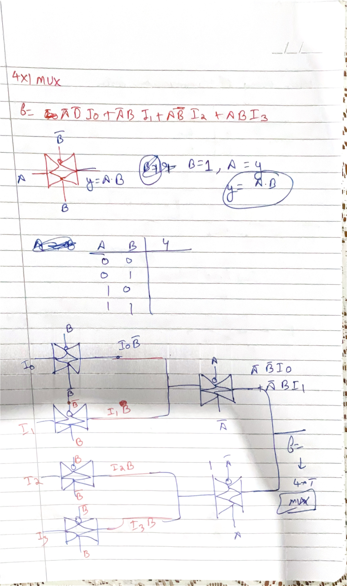

### What this page is doing

For select bits $A$ and $B$, a 4:1 multiplexer implements

$$
Y=\bar A\bar B I_0+\bar A B I_1+A\bar B I_2+AB I_3.
$$

The transmission-gate implementation realizes the same selection structurally. Four input switches feed one output node, but the control decoding must be one-hot: only the selected input's switch may conduct. The four enables are $\bar A\bar B$, $\bar A B$, $A\bar B$, and $AB$.

The two-stage sketch is another valid construction. First use $B$ to choose $I_0/I_1$ and $I_2/I_3$; then use $A$ to choose between those two intermediate nodes. With this convention, $A$ is the most-significant select bit and $B$ is the least-significant select bit.

Each transmission-gate symbol needs complementary controls. If an enable is $E$, the nMOS gate receives $E$ and the pMOS gate receives $\bar E$. Accidentally applying the same polarity to both transistors prevents them from switching together. Also, overlapping select enables can short two data sources together; real decoding must avoid contention.

### Correction

The small equation beside a single transmission gate should not be read as $Y=A\cdot B$ in the Boolean-gate sense. When enabled, the switch establishes $A\leftrightarrow Y$; in the intended signal direction this is written $Y\approx A$. When disabled, that particular switch contributes no drive and disconnects $A$ from $Y$. The shared node $Y$ is $Z$ only if no other selected transmission gate or circuit is driving it.

### Active recall

For $AB=10$, which input is selected, and what complementary control pair must its transmission gate receive?

## Page 03 - D latch: transparent path, closed feedback, and memory

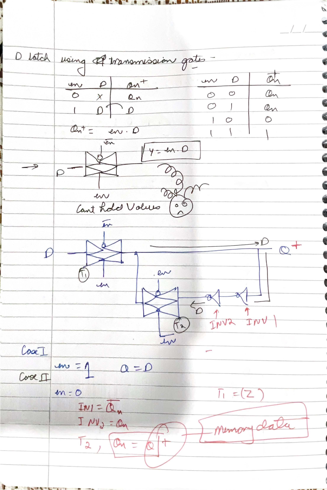

### What this page is doing

A single transmission gate can make $Q$ follow $D$ while enabled, but it cannot retain a logic value after isolation. Leakage would eventually discharge the floating capacitance. The second half of the page fixes that by adding a complementary feedback gate and two inverters.

For a conventional active-high latch,

$$
Q^{+}=EN\cdot D+\overline{EN}\cdot Q.
$$

When $EN=1$, input transmission gate $T_1$ is on and feedback gate $T_2$ is off; the latch is transparent, so after propagation delay $Q$ follows $D$. When $EN=0$, $T_1$ turns off and $T_2$ turns on. The two cascaded inverters have overall non-inverting polarity, so the feedback loop reinforces the stored bit instead of toggling it.

The page's labels appear to use the opposite external enable polarity in places. That is not a different memory mechanism; it only means the truth equation becomes

$$
Q^{+}=\overline{EN}\cdot D+EN\cdot Q
$$

for an active-low latch. Always infer polarity from which transmission gate is conducting, not only from the word `en`.

### Red-marker explanation

The red “memory data” marking is the key event: at the closing transition, the input path must disconnect before a new input can disturb the storage node, and the feedback path must connect soon enough to regenerate the old state. Setup and hold time arise from this internal handoff. Non-overlap avoids both gates being on together; excessive dead time risks leaving the storage node weakly floating.

### Active recall

Why are two inverters used in the feedback loop instead of one?

## Page 04 - Building a negative-edge flip-flop from two latches

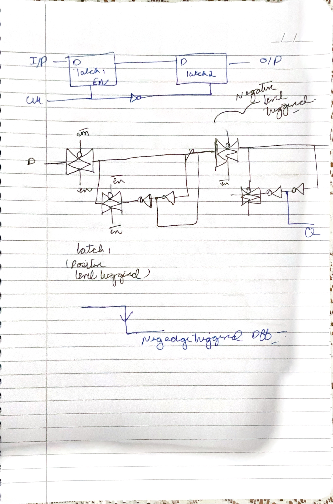

### What this page is doing

Two level-sensitive latches driven by complementary clock phases form a master-slave flip-flop. In the drawn negative-edge arrangement, latch 1 is transparent while $CLK=1$ and latch 2 is closed. Latch 1 tracks the input but the output stage remains isolated.

At the falling edge, latch 1 closes and traps the final input value. Simultaneously, latch 2 opens and transfers that trapped value to the output. During $CLK=0$, later input changes cannot pass through the closed master. At the next rising edge, the slave closes before the master begins tracking again. Ideally only the falling edge can transfer a new external value to $Q$.

The clock inverter shown at the top creates complementary latch enables. In a physical cell, inverter delay and clock overlap matter: if both latches are transparent together, data can race through from $D$ to $Q$; if both are closed too long, the intermediate node must retain charge reliably. Standard-cell designers characterize these internal effects into $t_{su}$, $t_h$, $t_{cq}$, and pulse-width constraints.

### Correction

“Positive level triggered” and “negative edge triggered” describe different objects. A latch is level-sensitive; a flip-flop is edge-triggered. Here latch 1 is positive-level-sensitive, latch 2 is negative-level-sensitive, and their pair is a negative-edge-triggered flip-flop.

### Active recall

Immediately after the falling edge, which latch is closed, which is open, and why can a later change on $D$ not reach $Q$?

## Page 05 - Active-low D latch and the internal origin of setup time

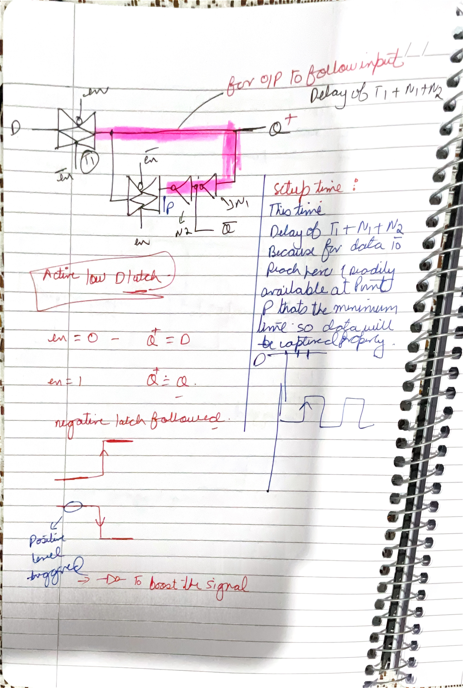

### What this page is doing

The highlighted path follows new data from $D$ through the input transmission gate toward $Q$ and through the inverter chain that prepares the feedback value. For the polarity drawn on this page, $EN=0$ makes the latch transparent and $EN=1$ makes it hold:

$$
EN=0:\ Q^{+}=D,
$$

$$
EN=1:\ Q^{+}=Q.
$$

Before the latch closes, the intended data must propagate far enough into the internal storage structure that closing the input gate cannot leave the regenerative loop with an ambiguous or old value. That is the physical origin of setup time. The marked $T_1+N_1+N_2$ path is a useful hand-analysis picture: $T_1$ is the input-switch delay and $N_1,N_2$ are inverter delays needed to establish a self-consistent state.

### Red-marker explanation and correction

The statement “setup time is the delay of $T_1+N_1+N_2$” must not be used as a universal cell formula. Setup time is a characterized relationship between the external D and clock pins, usually determined by sweeping D-to-clock separation until clock-to-Q degradation or metastability reaches a specified criterion. Internal parallel paths, clock-gate delay, transistor sizing, slope, load, voltage, and process can make the characterized value different from one simple path sum.

The bottom edge sketch should be interpreted using the active-low polarity: the relevant closing edge is the edge that changes the latch from transparent to hold. For this page that is the rising edge of $EN$.

### Active recall

Why can a path-delay sum explain the origin of setup time without being equal to the library's characterized $t_{su}$?

## Page 06 - Hold time is an endpoint stability requirement

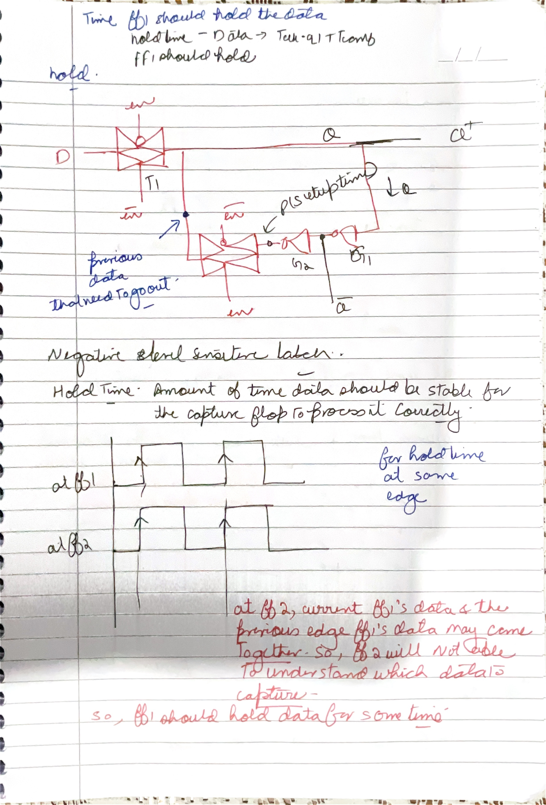

### What this page is doing

Hold time is the interval after the capture edge during which the receiving flip-flop's D pin must remain stable. Its internal clock-controlled devices take finite time to isolate the old input and establish the regenerative state. A change too soon after the edge can compete with the value being captured and cause the wrong value or metastability.

For a same-clock register path with no skew, the earliest new value from the launch flip-flop reaches the capture input after

$$
t_{cq,min}+t_{comb,min}.
$$

The safe hold condition is

$$
t_{cq,min}+t_{comb,min}\ge t_h.
$$

The bottom waveforms illustrate the race: both flip-flops see nominally the same edge. FF2 must capture FF1's old-cycle output. FF1's new-cycle output is allowed to begin changing only after $t_{cq,min}$, and the data path adds further minimum delay. If that sum is shorter than FF2's hold window, FF2 can see the new value during the same edge.

### Red-marker correction

It is imprecise to say “FF1 should hold the data.” FF1 is not commanded to extend its output; its minimum clock-to-Q delay is an inherent property. The formal requirement is that **FF2's D pin** remain unchanged through FF2's hold window. The launch element and data path jointly provide the minimum delay that protects this window.

### Active recall

Why do we use $t_{cq,min}$ and $t_{comb,min}$ for hold rather than their maximum values?

## Page 07 - Deriving the setup constraint

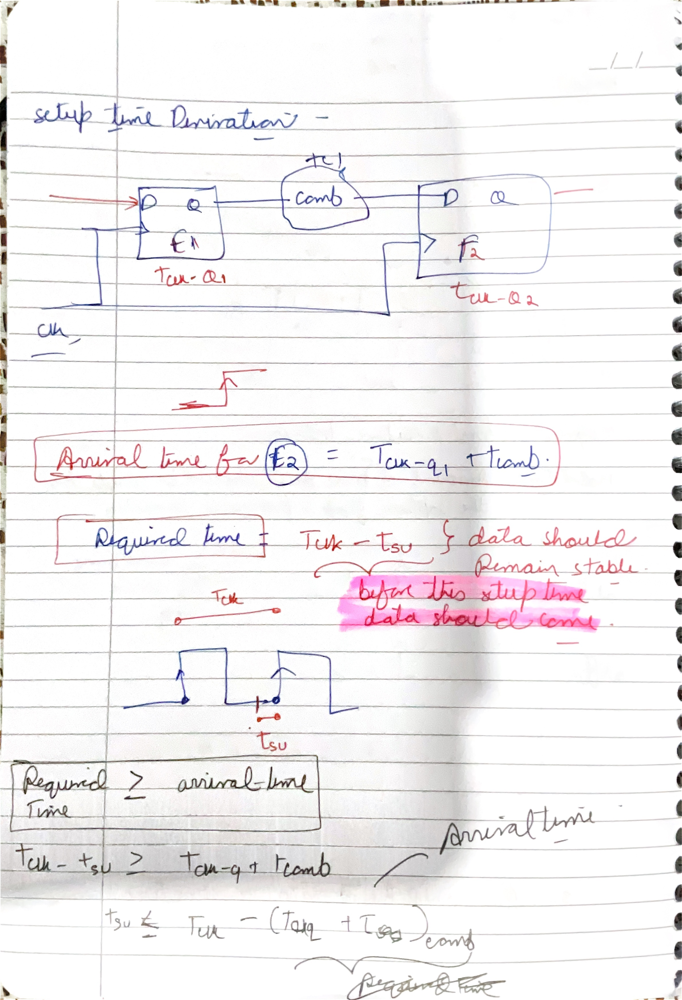

### What this page is doing

At the launch edge, FF1 begins producing new data. With ideal zero-skew clocks, the latest arrival at FF2 is

$$
A=t_{cq1,max}+t_{comb,max}.
$$

FF2 needs its input stable $t_{su2}$ before the next edge at $T_{clk}$, so the latest permitted arrival is

$$
R=T_{clk}-t_{su2}.
$$

Correct operation requires $R\ge A$:

$$
T_{clk}-t_{su2}\ge t_{cq1,max}+t_{comb,max},
$$

or

$$
T_{clk}\ge t_{cq1,max}+t_{comb,max}+t_{su2}.
$$

The derivation on the page rearranges this as an upper bound on allowed setup time. That algebra is valid, but in design work $t_{su2}$ is normally fixed by the chosen cell, while $T_{clk}$ or the data path is what the designer changes.

### Correction

The phrase “before this setup time data should come” is best stated as: the data must arrive no later than the **required-time boundary**, which is one setup interval before the capture edge. Setup time is a duration, not an absolute timestamp.

### Active recall

If $t_{cq,max}=0.8\,ns$, $t_{comb,max}=3.7\,ns$, and $t_{su}=0.5\,ns$, what is the minimum zero-skew clock period?

## Page 08 - Full adder from two half adders

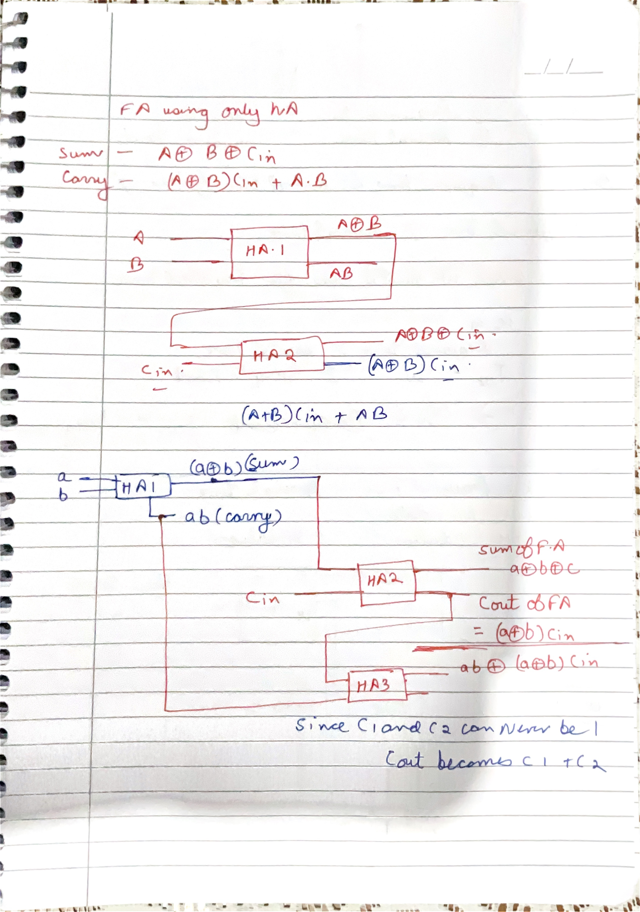

### What this page is doing

The first half adder receives $A,B$:

$$
S_1=A\oplus B,\qquad C_1=AB.
$$

The second receives $S_1,C_{in}$:

$$
Sum=S_1\oplus C_{in}=A\oplus B\oplus C_{in},
$$

$$
C_2=S_1C_{in}=(A\oplus B)C_{in}.
$$

The full-adder carry is

$$
C_{out}=C_1+C_2=AB+(A\oplus B)C_{in}.
$$

The page notes that $C_1$ and $C_2$ cannot both be 1. That is correct: $C_1=1$ requires $A=B=1$, which makes $A\oplus B=0$ and therefore $C_2=0$. Because the terms are mutually exclusive, OR and XOR produce the same value for these two signals:

$$
C_1+C_2=C_1\oplus C_2.
$$

### Correction

A standard implementation uses two half adders and one OR gate. A third half adder can supply the XOR of $C_1,C_2$, but its carry output is unused and the construction is unnecessarily large. The note's conclusion is logically valid only because the two carry terms are mutually exclusive.

### STA connection

The carry path and sum path have different logic depths. In a ripple-carry adder, the carry chain often becomes the setup-critical maximum-delay path, while a very short local path elsewhere may become hold-critical.

### Active recall

Prove in one line that $C_1C_2=0$ for every $A,B,C_{in}$.

## Page 09 - Arrival time, required time, and setup slack

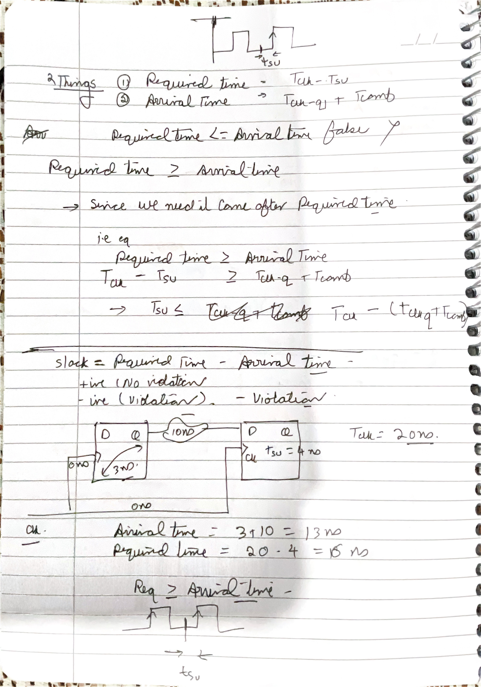

### What this page is doing

The page gives the two quantities used in a setup report:

$$
A_{setup}=t_{cq,max}+t_{comb,max},
$$

$$
R_{setup}=T_{clk}-t_{su}
$$

for ideal zero-skew clocks. The words matter:

- **Arrival time** is when the analyzer predicts the relevant data transition can reach the endpoint.
- **Required time** is the latest time that transition is allowed to reach the endpoint and still meet setup.

The valid setup relation is

$$
A_{setup}\le R_{setup}.
$$

The page's example uses $t_{cq}=3\,ns$, $t_{comb}=10\,ns$, $T_{clk}=20\,ns$, and $t_{su}=4\,ns$:

$$
A=3+10=13\,ns,
$$

$$
R=20-4=16\,ns.
$$

Thus,

$$
Slack_{setup}=R-A=16-13=3\,ns.
$$

Positive slack means the path meets setup by $3\,ns$. Zero slack is exactly on the boundary. Negative slack means the data is late by the magnitude of the slack.

### Correction

The line “nothing should come after required time” refers only to the data transition intended for that capture edge. Later data may of course occur for later cycles. Required time is a per-check boundary, not a permanent prohibition on endpoint switching.

### Active recall

For the page's example, how much could the combinational maximum delay increase before setup first fails?

## Page 10 - Equivalent inequalities, but different timing meanings

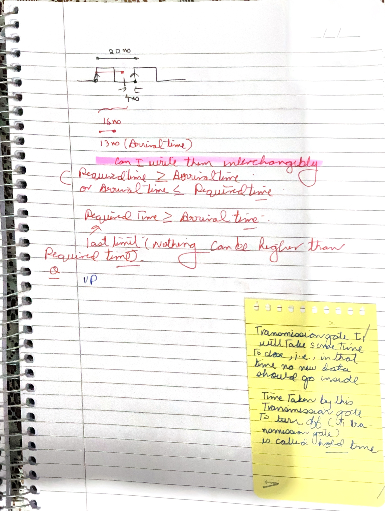

### Red-marker answer: can the inequalities be written interchangeably?

Yes, these two mathematical statements are identical:

$$
R\ge A
$$

and

$$
A\le R.
$$

But the quantities themselves are not interchangeable. $A$ is computed from a launch event and data path; $R$ is computed from a capture event and endpoint constraint. Swapping their names would reverse the meaning of slack.

For setup,

$$
Slack_{setup}=R-A.
$$

In the continued example, $A=13\,ns$ and $R=16\,ns$, so slack remains $+3\,ns$ whichever equivalent inequality is written.

### Sticky-note correction

The sticky note says the time taken for transmission gate $T_1$ to turn off is called hold time. That is a helpful transistor-level cause, but it is not the complete definition. Hold time is the external interval for which D must remain stable after the active clock edge so the sequential cell captures reliably. Its value includes the combined behavior of internal clock delay, input switching devices, regenerative feedback, slopes, loading, and characterization criteria.

An external data-path delay does not alter the library cell's intrinsic $t_h$. It changes **hold slack** by changing when new data reaches D.

### Active recall

Why is setup slack $R-A$, while hold slack later becomes $A-R$?

## Page 11 - Keeping min/max ranges and path components coherent

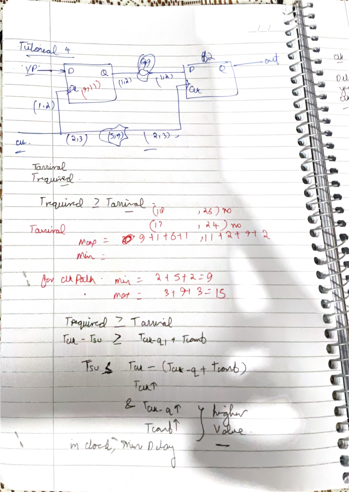

### What this page is doing

The diagram annotates path elements with pairs such as $(2,3)$ and $(5,9)$, meaning minimum and maximum delay. The clock path shown at the bottom contains three elements:

$$
L_{clk,min}=2+5+2=9\,ns,
$$

$$
L_{clk,max}=3+9+3=15\,ns.
$$

This is correct range propagation for a series path: sum all minimum values for the earliest event and all maximum values for the latest event.

The same discipline applies to data. The visible red sums are

$$
9+1+6+1=17\,ns
$$

and

$$
11+2+9+2=24\,ns.
$$

Those produce a data-arrival range $(17,24)\,ns$ if $9/11$, $1/2$, $6/9$, and $1/2$ are the selected series-element ranges. The separate handwritten pair $(10,26)\,ns$ is not derivable from the clearly visible sums and should not be used without identifying the extra endpoint or clock relationship that created it.

### How to avoid the common mistake

Write one row per timing quantity:

| Quantity | Early/min check | Late/max check |
|---|---:|---:|
| Launch clock latency | sum of launch-clock minima | sum of launch-clock maxima |
| Clock-to-Q | $t_{cq,min}$ | $t_{cq,max}$ |
| Data path | $t_{comb,min}$ | $t_{comb,max}$ |
| Capture clock latency | use the check's capture-clock corner | use the check's capture-clock corner |

Do not choose an isolated minimum or maximum just because it makes the inequality harder. Real STA pairs clock and data delays according to supported analysis corners and removes common-clock pessimism where appropriate.

### Correction

The bottom zero-skew equation is incomplete for this annotated clock network. Once launch and capture latencies differ, use

$$
L_C+T_{clk}-t_{su}\ge L_L+t_{cq,max}+t_{comb,max}.
$$

### Active recall

Why is $(2+9+2)\,ns$ not a valid minimum or maximum for the three-element clock path whose ranges are $(2,3)$, $(5,9)$, and $(2,3)$?

## Page 12 - Worst-case setup uses late data and an early capture boundary

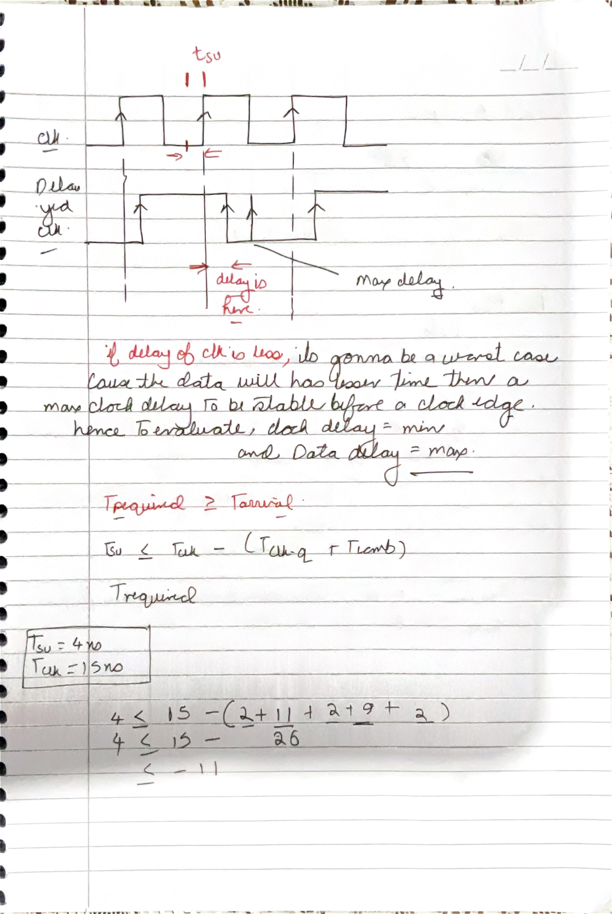

### What this page is doing

The waveform shows that clock edges and data delays are not single ideal numbers. For setup, failure occurs when new data arrives as late as possible while the capture boundary is as early as allowed. In the simple skew notation,

$$
Slack_{setup}=(L_C+T_{clk}-t_{su})-(L_L+t_{cq,max}+t_{comb,max}).
$$

This reveals the pessimistic directions:

- larger $L_L$ hurts setup because launch occurs later;
- larger $t_{cq,max}$ and $t_{comb,max}$ hurt setup because data arrives later;
- smaller $L_C$ hurts setup because the capture edge arrives earlier.

The sentence “clock delay = min and data delay = max” is therefore only partly complete. The **capture** clock is early, but the **launch** clock is late. There are two clock paths, and they push setup in opposite directions.

### Correction of the negative result

The bottom substitution gives

$$
4\le15-26=-11,
$$

which is impossible. That does not prove setup time can be $-11\,ns$; it proves the assumed $15\,ns$ period/check has a setup violation. The setup slack under those assumed absolute times is negative. The remedy is to increase the period, reduce maximum data delay, select faster cells, pipeline the logic, or beneficially rebalance clock skew.

Also, never add a complete clock-path latency into the data delay and then separately treat the period as if the clock were ideal. Keep $L_L$ and $L_C$ explicit so no delay is counted twice.

### Active recall

With $L_L=3\,ns$, $L_C=1\,ns$, $t_{cq,max}=2\,ns$, $t_{comb,max}=8\,ns$, and $t_{su}=1\,ns$, what minimum period meets setup?

## Page 13 - Hold analysis uses the earliest new data

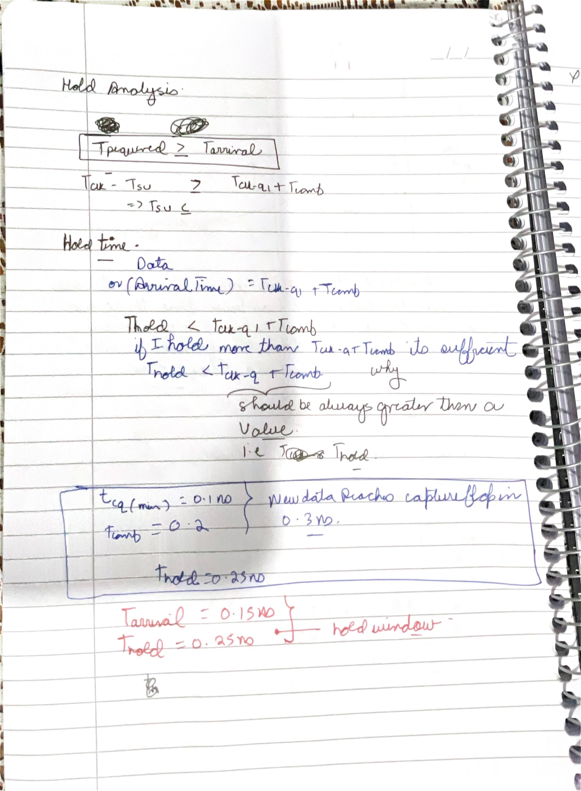

### What this page is doing

Unlike setup, hold is a same-edge minimum-delay check. With ideal equal clock arrival,

$$
A_{hold}=t_{cq,min}+t_{comb,min},
$$

$$
R_{hold}=t_h.
$$

New data must arrive after the hold boundary:

$$
A_{hold}\ge R_{hold},
$$

so

$$
Slack_{hold}=A_{hold}-R_{hold}.
$$

The boxed example gives $t_{cq,min}=0.1\,ns$, $t_{comb,min}=0.2\,ns$, and $t_h=0.25\,ns$:

$$
A_{hold}=0.1+0.2=0.3\,ns,
$$

$$
Slack_{hold}=0.3-0.25=+0.05\,ns.
$$

Therefore the path passes hold with only $50\,ps$ margin.

### Corrections

- The setup equation at the top is not a hold equation; the two checks use different edges and opposite slack definitions.
- The red note near the bottom appears to write an arrival value inconsistent with the blue component values. The component sum is $0.3\,ns$, not $0.15\,ns$.
- The strict sign $t_h<t_{cq}+t_{comb}$ is often drawn, but equality is a zero-slack pass in ideal arithmetic. Use $\le$ for the boundary.

### Active recall

If the minimum combinational delay shrinks from $0.2\,ns$ to $0.1\,ns$, what is the new hold slack?

## Page 14 - Why the hold equation needs min delays and clock skew

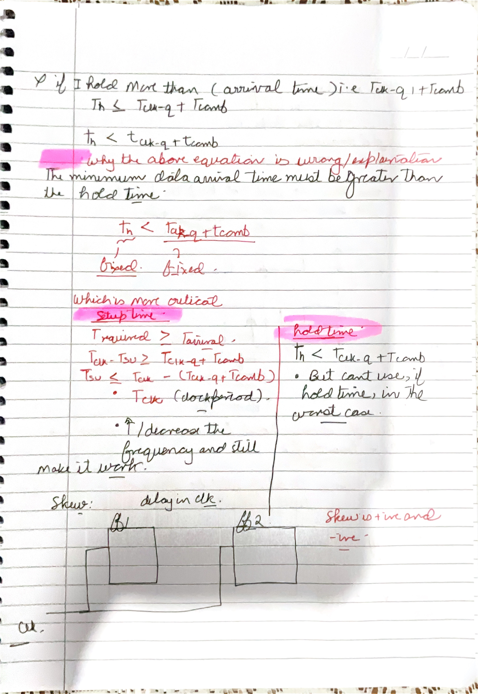

### Red-marker answer: why is the first equation wrong?

The page begins with an unqualified expression such as $t_h\le t_{cq}+t_{comb}$. It is incomplete because:

1. Hold must use $t_{cq,min}$ and $t_{comb,min}$, not unspecified or maximum delay.
2. If launch and capture clocks arrive at different times, clock skew must be included.
3. Uncertainty must be added in a signoff check.

Using $S=L_C-L_L$, the idealized hold condition is

$$
t_{cq,min}+t_{comb,min}\ge t_h+S.
$$

The cell's $t_h$ is fixed by library characterization, but path delays vary by route, PVT corner, transition, and load. The note marking $t_h$ “fixed” and the path sum “not fixed” is therefore directionally correct.

### Which is more critical: setup or hold?

Neither may be ignored. Setup limits the maximum clock frequency, and a small setup violation can often be removed by increasing $T_{clk}$. Hold is independent of the next cycle's period: slowing the clock does not move the same-edge hold boundary. A hold violation generally requires added minimum data delay, reduced positive skew, a different cell, or routing/clock-tree correction.

That makes hold more unforgiving as a silicon-correctness issue, while setup remains the dominant performance limiter. “Critical” depends on whether the goal is functional signoff or frequency closure.

### Skew preview

With $S>0$, capture is later. Setup gets an extra $S$ of time, but the capture hold boundary also moves later by $S$, reducing hold margin. The next page draws this trade-off.

### Active recall

Why can lowering clock frequency fix setup but not a same-cycle hold failure?

## Page 15 - Positive skew helps setup and hurts hold

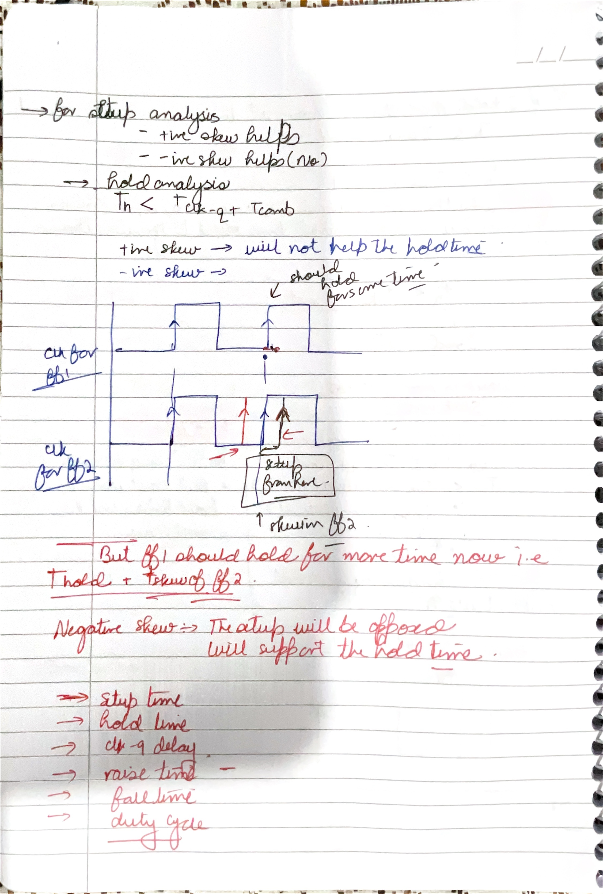

### What this page is doing

Let

$$
S=L_C-L_L.
$$

Positive skew means FF2's clock arrives later than FF1's. The setup condition becomes

$$
T_{clk}\ge t_{cq,max}+t_{comb,max}+t_{su}-S.
$$

Thus positive skew reduces the required period and helps setup. Negative skew increases the required period and hurts setup.

For hold,

$$
t_{cq,min}+t_{comb,min}\ge t_h+S.
$$

Thus positive skew makes hold harder because FF2 remains sensitive later, while negative skew moves its hold boundary earlier and helps hold.

### Correction of the red sentence

“FF1 should hold for more time” is a physical intuition, not the equation. Positive skew does not change FF1's clock-to-Q delay or FF2's intrinsic hold time. It increases the amount of **path minimum delay required** to prevent the new value reaching FF2 during the shifted hold window.

The page also lists rise time, fall time, and duty cycle. These matter because sequential cells have separate rising/falling timing arcs, minimum pulse-width requirements, and slew-dependent delays. Duty-cycle distortion is especially important for latches and opposite-edge paths, even when a same-edge flip-flop equation appears to use only the period.

### Active recall

If $S=+0.4\,ns$, by how much does ideal setup margin change, and by how much does ideal hold margin change?

## Page 16 - Maximum frequency cannot be assigned to one flip-flop in isolation

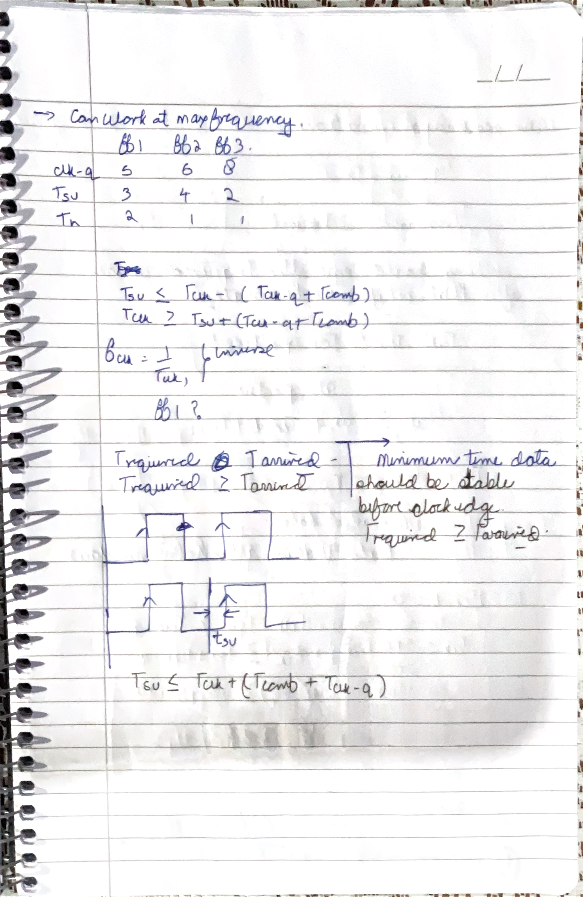

### What this page is asking

The table lists, in nanoseconds:

| Cell | $t_{cq}$ | $t_{su}$ | $t_h$ |
|---|---:|---:|---:|
| FF1 | 5 | 3 | 2 |
| FF2 | 6 | 4 | 1 |
| FF3 | 8 | 2 | 1 |

The universal path equation is

$$
T_{clk,min}=t_{cq,launch,max}+t_{comb,max}+t_{su,capture}-S.
$$

Therefore “which flip-flop can work at maximum frequency?” is under-specified until the launch cell, capture cell, combinational path, and skew are known.

### Two useful interpretations

If each cell launches into an identical copy of itself with $t_{comb}=0$ and $S=0$:

| Self path | $T_{min}$ | $f_{max}$ |
|---|---:|---:|
| FF1 $\rightarrow$ FF1 | $5+3=8\,ns$ | $125\,MHz$ |
| FF2 $\rightarrow$ FF2 | $6+4=10\,ns$ | $100\,MHz$ |
| FF3 $\rightarrow$ FF3 | $8+2=10\,ns$ | $100\,MHz$ |

Under this interpretation, FF1 supports the highest frequency.

If they form a zero-logic ring FF1 $\rightarrow$ FF2 $\rightarrow$ FF3 $\rightarrow$ FF1:

$$
T_{12}=5+4=9\,ns,
$$

$$
T_{23}=6+2=8\,ns,
$$

$$
T_{31}=8+3=11\,ns.
$$

The system period is the maximum, $11\,ns$, so $f_{max}\approx90.91\,MHz$.

### Correction

The bottom equation on the page has a plus sign where rearrangement requires subtraction. The correct zero-skew form is

$$
t_{su}\le T_{clk}-(t_{cq}+t_{comb}).
$$

Hold time does not directly determine $f_{max}$, but every selected path must separately satisfy its hold equation.

### Active recall

Why is the fastest individual self path not necessarily the path that determines the whole design's clock frequency?

## Page 17 - Testing candidate clock periods

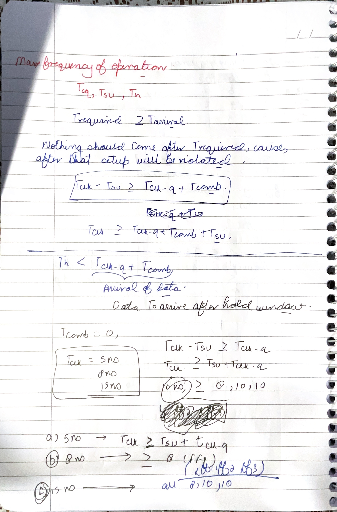

### What this page is doing

With $t_{comb}=0$ and zero skew, each path must satisfy

$$
T_{clk}\ge t_{cq,launch}+t_{su,capture}.
$$

The page tests candidate periods $5\,ns$, $8\,ns$, and $15\,ns$ against the values introduced on page 16.

- $5\,ns$ is too short even for FF1's $8\,ns$ self-path requirement.
- $8\,ns$ exactly meets FF1 $\rightarrow$ FF1, giving zero setup slack, but it does not meet the $10\,ns$ FF2 or FF3 self paths.
- $15\,ns$ meets all three self paths and also every path in the illustrative three-cell ring from page 16.

The corresponding frequencies are:

$$
T=5\,ns\Rightarrow f=200\,MHz,
$$

$$
T=8\,ns\Rightarrow f=125\,MHz,
$$

$$
T=15\,ns\Rightarrow f\approx66.67\,MHz.
$$

The fastest requested clock is not automatically valid; it is valid only if **all** path slacks remain non-negative.

### Hold reminder

The separate condition is

$$
t_{cq,min}+t_{comb,min}\ge t_h.
$$

Making the period $15\,ns$ instead of $8\,ns$ does not repair a failing hold path, because $T_{clk}$ is absent from this same-edge equation.

### Active recall

At $T_{clk}=8\,ns$, what is the setup slack of each self path in the page-16 table?

## Page 18 - Solving frequency and hold examples completely

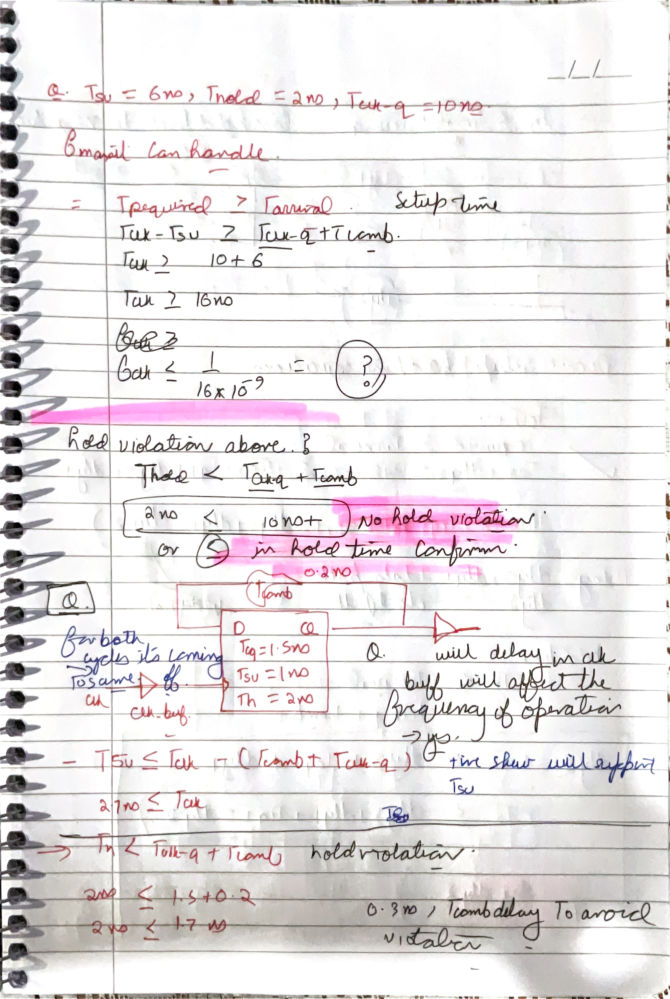

### First example

Given $t_{su}=6\,ns$, $t_h=2\,ns$, $t_{cq}=10\,ns$, and $t_{comb}=0$ with zero skew:

$$
T_{min}=t_{cq}+t_{su}=10+6=16\,ns.
$$

The circled frequency question is

$$
f_{max}=\frac{1}{16\times10^{-9}}=62.5\times10^6\,Hz=62.5\,MHz.
$$

For hold,

$$
t_{cq,min}+t_{comb,min}=10+0=10\,ns\ge2\,ns,
$$

so there is no hold violation. Assuming the given $10\,ns$ is also the minimum delay, hold slack is $8\,ns$.

### Lower self-loop example

The flip-flop is labeled $t_{cq}=1.5\,ns$, $t_{su}=1\,ns$, $t_h=2\,ns$, with a $0.2\,ns$ data-path delay.

Setup:

$$
T_{min}=1.5+0.2+1=2.7\,ns,
$$

$$
f_{max}\approx370.37\,MHz.
$$

Hold:

$$
1.5+0.2=1.7\,ns<2\,ns.
$$

There is a $0.3\,ns$ hold violation. At least $0.3\,ns$ additional **minimum data-path delay** is required for zero slack; practical design needs extra margin for variation and uncertainty.

### Red-marker clarification

A clock buffer common to both the launch and capture paths shifts both edges by the same amount and ideally cancels from skew. A data buffer changes both setup and hold: it helps hold by delaying earliest data, but hurts setup by delaying latest data. Beneficial clock skew is not a free fix because a direction that helps setup hurts hold.

### Active recall

After adding exactly $0.3\,ns$ minimum/maximum data delay to the self-loop, what are the new hold slack and zero-skew minimum period?

## Page 19 - General clock-latency equations and negative hold time

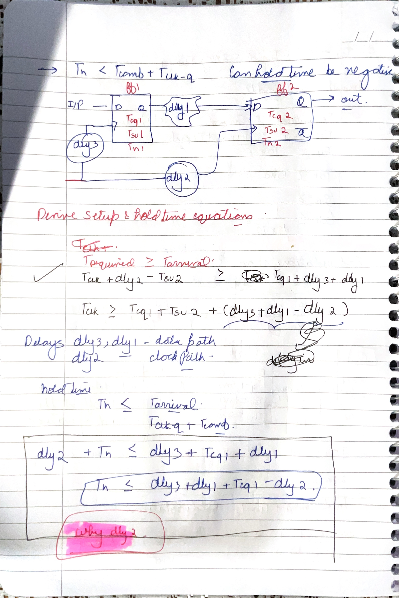

### What this page is doing

The common clock reaches FF1 through $dly3$ and FF2 through $dly2$. The data path from FF1 to FF2 has $dly1$. Thus

$$
L_L=dly3,\qquad L_C=dly2.
$$

For setup, latest data arrives at

$$
A_{setup}=dly3+t_{cq1,max}+dly1_{max},
$$

and is required by

$$
R_{setup}=T_{clk}+dly2-t_{su2}.
$$

Therefore,

$$
T_{clk}\ge t_{cq1,max}+dly1_{max}+t_{su2}+dly3-dly2.
$$

For hold,

$$
A_{hold}=dly3+t_{cq1,min}+dly1_{min},
$$

$$
R_{hold}=dly2+t_{h2},
$$

so

$$
dly3+t_{cq1,min}+dly1_{min}\ge dly2+t_{h2}.
$$

Rearranging gives the page's result:

$$
t_{h2}\le dly3+t_{cq1,min}+dly1_{min}-dly2.
$$

### Red-marker answer: why is $dly2$ subtracted?

$dly2$ is the capture-clock latency. A later capture edge moves FF2's hold window later. In the original inequality it belongs on the required-time side as $dly2+t_h$. When solving for allowable $t_h$, moving it to the other side produces $-dly2$. This is the algebraic form of “positive capture skew hurts hold.”

### Can hold time be negative?

Yes. A standard-cell library can characterize a negative external hold time when internal clock delay and input-data behavior allow D to begin changing slightly before the reference pin's clock edge without corrupting the sampled internal state. A negative library value does not mean hold analysis can be skipped. Path minimum delay, clock skew, uncertainty, and the actual library timing arc still determine hold slack.

### Active recall

If $dly3=0.4\,ns$ and $dly2=0.9\,ns$, what skew does the path have, and does that skew help setup or hold?

## Page 20 - Internal data/clock delays create effective timing parameters

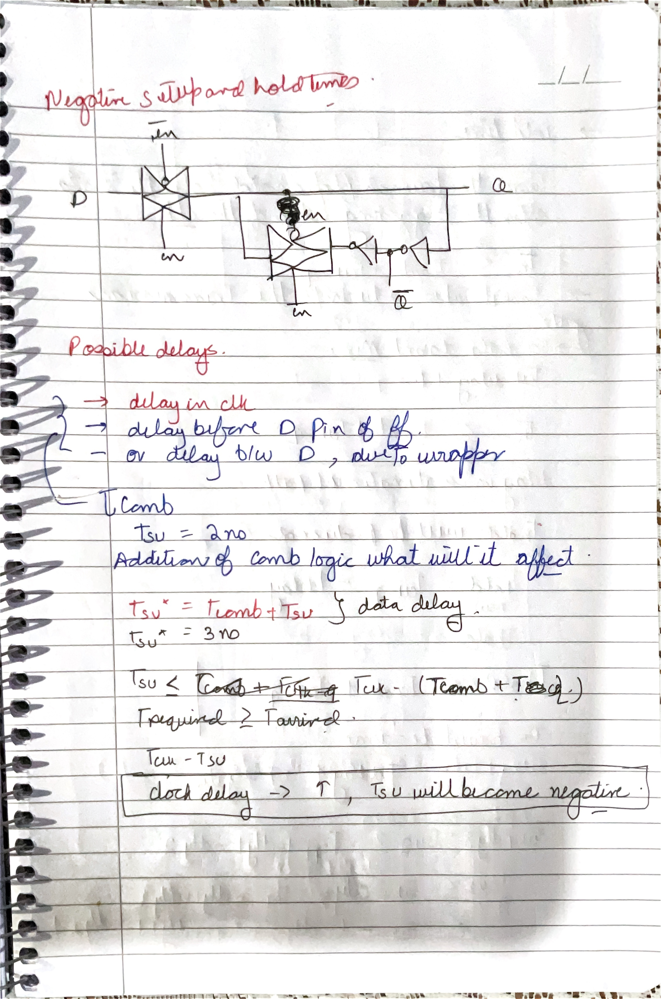

### What this page is doing

The page explores how logic or delay inside a wrapper changes the setup/hold requirement observed at the wrapper's external pins. Suppose an internal flip-flop has intrinsic $t_{su,int}$ and $t_{h,int}$. Let $d_D$ be delay from external D to the internal D pin and $d_C$ be delay from external clock to the internal clock pin.

The external setup requirement is

$$
t_{su,ext}=t_{su,int}+d_D-d_C.
$$

The external hold requirement is

$$
t_{h,ext}=t_{h,int}+d_C-d_D.
$$

Adding $1\,ns$ before D to a cell with $t_{su,int}=2\,ns$ gives

$$
t_{su,ext}=2+1=3\,ns
$$

when $d_C=0$, matching the note. That same data delay reduces the external hold requirement by $1\,ns$.

### Negative timing values

If internal clock delay exceeds the intrinsic setup plus internal data delay, $t_{su,ext}$ can become negative. This means the external D pin may change after the external clock reference while the change still reaches the internal sampling node in time. Conversely, large internal data delay can produce negative external hold time.

These are properties of the cell/wrapper reference pins. Adding an arbitrary delay to a real clock tree is not a general way to “make setup negative”: the resulting skew affects neighboring paths and pushes setup/hold in opposite directions.

### Correction

The page's boxed statement should read “increasing internal clock delay relative to internal data delay can reduce the **externally observed** setup time.” The intrinsic flip-flop setup requirement has not physically disappeared.

### Active recall

For $t_{su,int}=0.8\,ns$, $t_{h,int}=0.2\,ns$, $d_D=0.3\,ns$, and $d_C=1.2\,ns$, compute $t_{su,ext}$ and $t_{h,ext}$.

## Page 21 - Data delay improves hold slack; it does not change intrinsic hold time

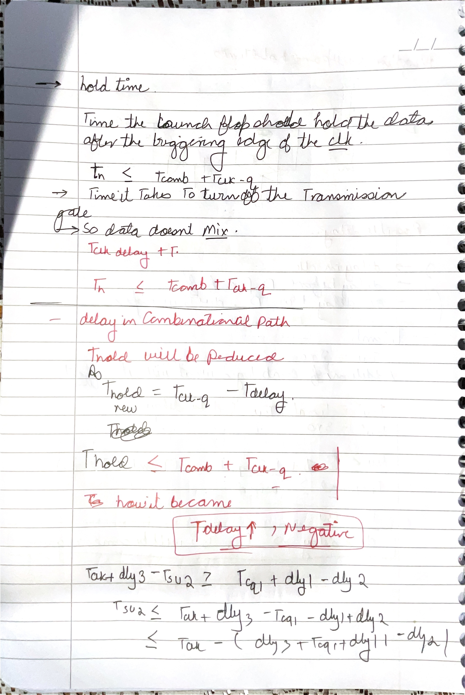

### What this page is doing

The page returns to the physical latch intuition: after the active edge, an internal transmission device needs finite time to isolate the input and secure the old value. At system level, however, the requirement is written at the destination D pin.

With no skew,

$$
Slack_{hold}=t_{cq,min}+t_{comb,min}-t_h.
$$

If extra minimum combinational delay $d$ is inserted,

$$
Slack_{hold,new}=Slack_{hold,old}+d.
$$

So increasing data-path delay improves hold slack one-for-one. The flip-flop's intrinsic $t_h$ does not decrease.

### Red-marker answer: how can effective hold become negative?

At an external wrapper boundary, added internal D-path delay gives

$$
t_{h,ext}=t_{h,int}+d_C-d_D.
$$

As $d_D$ increases, $t_{h,ext}$ can cross zero and become negative. The explanation is causal: even if the external input changes early, the added data delay postpones that change until after the internal hold window. This is an effective pin-to-pin parameter, not a claim that the storage element needs no stable interval.

### Setup trade-off

The same added data delay reduces setup slack:

$$
Slack_{setup,new}=Slack_{setup,old}-d_{max}.
$$

Hold-fixing buffers must therefore be added carefully so that a minimum-delay repair does not create a maximum-delay failure.

### Active recall

If a path has $-0.12\,ns$ hold slack and $+0.40\,ns$ setup slack, what happens ideally after adding a buffer with $0.15\,ns$ minimum and $0.22\,ns$ maximum delay?

## Page 22 - Clean setup and hold equations with launch/capture delays

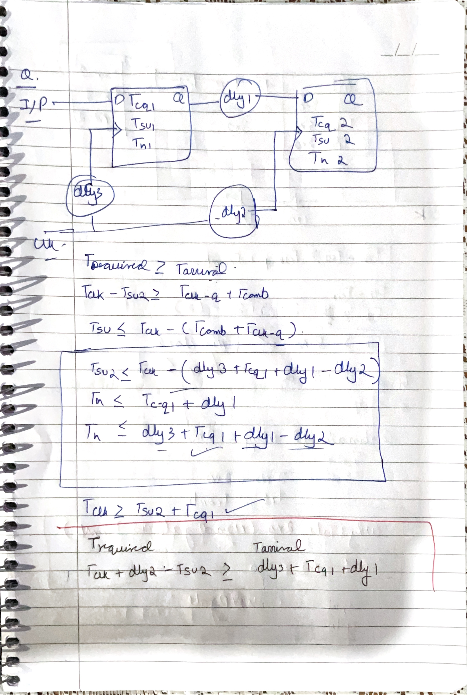

### What this page is doing

This page redraws the page-19 circuit more cleanly. Let launch clock latency be $dly3$, capture clock latency be $dly2$, and data-combinational delay be $dly1$.

Setup:

$$
T_{clk}+dly2-t_{su2}\ge dly3+t_{cq1,max}+dly1_{max},
$$

so

$$
t_{su2}\le T_{clk}-(dly3+t_{cq1,max}+dly1_{max}-dly2).
$$

Equivalently,

$$
T_{clk}\ge t_{cq1,max}+dly1_{max}+t_{su2}+dly3-dly2.
$$

Hold:

$$
dly3+t_{cq1,min}+dly1_{min}\ge dly2+t_{h2},
$$

so

$$
t_{h2}\le dly3+t_{cq1,min}+dly1_{min}-dly2.
$$

The page's middle line $t_h\le t_{cq1}+dly1$ is valid only after assuming $dly3=dly2$ and using minimum delays.

### One compact skew form

Since $S=dly2-dly3$:

$$
T_{clk}\ge t_{cq1,max}+dly1_{max}+t_{su2}-S,
$$

$$
t_{cq1,min}+dly1_{min}\ge t_{h2}+S.
$$

This pair makes the setup/hold skew trade-off immediately visible.

### Active recall

If launch latency and capture latency both increase by the same $0.7\,ns$, why do these ideal register-to-register checks not change?

## Page 23 - Worked skew example: include the entire data path

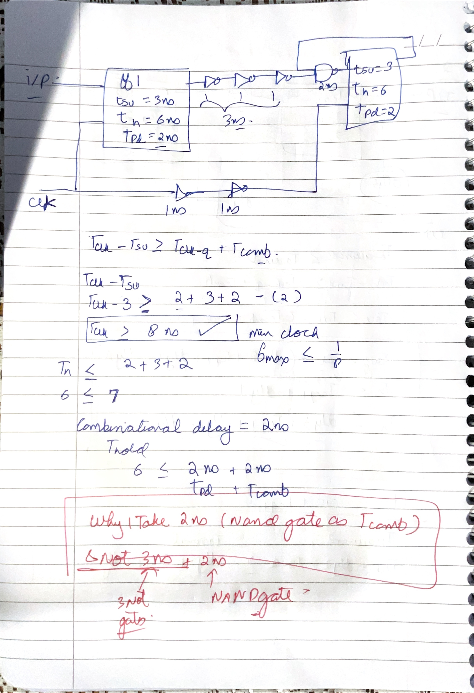

### Reading the diagram

Both flip-flops show $t_{su}=3\,ns$, $t_h=6\,ns$, and $t_{cq}=2\,ns$. The FF1-to-FF2 data path contains three $1\,ns$ inverters followed by a $2\,ns$ NAND gate:

$$
t_{comb}=1+1+1+2=5\,ns.
$$

The capture clock reaches FF2 through two $1\,ns$ clock inverters, while FF1 sees the undelayed reference:

$$
L_L=0,\qquad L_C=2\,ns,\qquad S=+2\,ns.
$$

### Setup solution

$$
T_{min}=t_{cq1}+t_{comb}+t_{su2}-S,
$$

$$
T_{min}=2+5+3-2=8\,ns.
$$

Therefore,

$$
f_{max}=\frac{1}{8\,ns}=125\,MHz.
$$

The page's $8\,ns$ setup result is correct because the $2\,ns$ positive skew cancels $2\,ns$ of the $10\,ns$ zero-skew requirement.

### Red-marker answer: why not use only the NAND's $2\,ns$ for hold?

You must use the delay of the **complete sensitized data path** from FF1 Q to FF2 D. If the three inverters are really in series on that path, $t_{comb,min}=3+2=5\,ns$, not $2\,ns$.

Using the shown values as minimum delays:

$$
A_{hold}=L_L+t_{cq,min}+t_{comb,min}=0+2+5=7\,ns,
$$

$$
R_{hold}=L_C+t_h=2+6=8\,ns.
$$

Thus,

$$
Slack_{hold}=7-8=-1\,ns.
$$

The path has a $1\,ns$ hold violation. The handwritten check $6\le2+2$ omits both the three data inverters and the $2\,ns$ positive capture skew, so it is not the correct endpoint check.

### Active recall

What happens to the setup and hold slacks if the two capture-clock inverters are removed?

## Page 24 - Three-register pipeline: $f_{max}$ is set by the worst stage

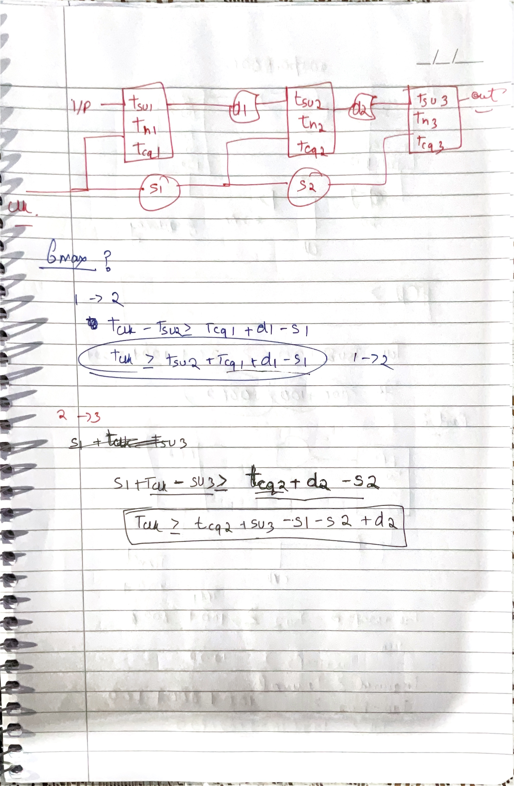

### What this page is doing

The pipeline has two data paths, FF1 $\rightarrow$ FF2 through $d_1$ and FF2 $\rightarrow$ FF3 through $d_2$. The maximum clock frequency is found by deriving one minimum-period constraint per stage and taking the largest.

Assume the clock arrival times are

$$
L_1=0,\qquad L_2=s_1,\qquad L_3=s_1+s_2,
$$

where $s_1$ and $s_2$ are incremental clock-tree delays drawn between successive taps.

For FF1 $\rightarrow$ FF2:

$$
T_{12}\ge t_{cq1,max}+d_{1,max}+t_{su2}-s_1.
$$

For FF2 $\rightarrow$ FF3, the skew is $L_3-L_2=s_2$:

$$
T_{23}\ge t_{cq2,max}+d_{2,max}+t_{su3}-s_2.
$$

Therefore,

$$
T_{min}=\max(T_{12},T_{23}),
$$

$$
f_{max}=\frac{1}{T_{min}}.
$$

### Important notation correction

If instead $s_1$ and $s_2$ mean **absolute** arrival times at FF2 and FF3, then the second-stage skew is $s_2-s_1$ and

$$
T_{23}\ge t_{cq2,max}+d_{2,max}+t_{su3}+s_1-s_2.
$$

The handwritten $-s_1-s_2$ term mixes these two conventions. State whether clock labels are incremental delays or absolute latencies before doing algebra.

The corresponding hold checks, for incremental delays, are

$$
t_{cq1,min}+d_{1,min}\ge t_{h2}+s_1,
$$

$$
t_{cq2,min}+d_{2,min}\ge t_{h3}+s_2.
$$

### Active recall

Why does the maximum of the stage periods, rather than their sum, determine the pipeline clock period?

## Page 25 - Final numerical clock-skew problem

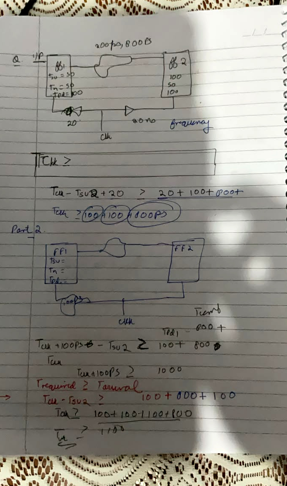

### Interpreting the readable values

The page uses picoseconds. The visible values are:

- FF1: $t_{su1}=50\,ps$, $t_{h1}=50\,ps$, $t_{cq1}=100\,ps$.
- FF2: $t_{su2}=100\,ps$, $t_{h2}=50\,ps$, $t_{cq2}=100\,ps$.
- Data path: approximately $(200,800)\,ps$ for minimum/maximum delay.

Only FF1's $t_{cq}$, the data-path delay, and FF2's setup/hold values enter the FF1-to-FF2 checks.

### Part 1 - equal $20\,ps$ clock-branch delays

Both launch and capture clock paths are marked $20\,ps$, so

$$
L_L=L_C=20\,ps,\qquad S=0.
$$

Setup required time and arrival time are

$$
R=T_{clk}+20-100,
$$

$$
A=20+100+800.
$$

Requiring $R\ge A$:

$$
T_{clk}+20-100\ge20+100+800,
$$

$$
T_{clk}\ge1000\,ps=1\,ns.
$$

Therefore,

$$
f_{max}=1\,GHz.
$$

The equal $20\,ps$ clock delays cancel; they shift launch and capture together without creating skew.

The hold check, using $t_{comb,min}=200\,ps$, is

$$
A_{hold}=20+100+200=320\,ps,
$$

$$
R_{hold}=20+50=70\,ps,
$$

so hold slack is $+250\,ps$.

### Part 2 - launch clock delayed by $100\,ps$

The second sketch places a $100\,ps$ delay only on the FF1 launch-clock branch, while FF2 receives the reference clock directly:

$$
L_L=100\,ps,\qquad L_C=0,
$$

$$
S=L_C-L_L=-100\,ps.
$$

Latest data arrival is now

$$
A=100+100+800=1000\,ps.
$$

Required time is

$$
R=T_{clk}-100\,ps.
$$

The red correction correctly insists on $R\ge A$:

$$
T_{clk}-100\ge1000,
$$

$$
T_{clk}\ge1100\,ps=1.1\,ns.
$$

Therefore,

$$
f_{max}\approx909.09\,MHz.
$$

### Red-marker answer

The extra $100\,ps$ cannot be dropped or placed on the required side with a helpful sign. It delays the launch edge, so FF1's output transition begins $100\,ps$ later. That delay belongs in arrival time. Negative skew hurts setup, exactly as the $1.0\,ns\rightarrow1.1\,ns$ period increase shows.

### Active recall

If the $100\,ps$ delay were moved from FF1's clock branch to FF2's clock branch, what would the minimum period become, and what new hold trade-off would appear?

## Points to remember

1. Setup is a maximum-delay, next-edge check; hold is a minimum-delay, same-edge check.
2. Setup passes when $R-A\ge0$; hold passes when $A-R\ge0$.
3. Positive skew $S=L_C-L_L>0$ helps setup and hurts hold.
4. The clock period can repair setup but does not repair hold.
5. A timing path includes the complete sensitized route from launch clock pin through $t_{cq}$ and combinational logic to the capture D pin.
6. Use $t_{comb,max}$ for setup and $t_{comb,min}$ for hold; do not reuse one nominal delay blindly.
7. Intrinsic library $t_{su}$/$t_h$ do not change when external delay is added. Path slack changes; an externally observed wrapper parameter may also change.
8. Common clock delay cancels ideally; only the launch/capture difference creates skew.
9. $T_{min}$ is the maximum of all setup path requirements, while every hold path must independently pass.
10. Negative setup or hold values are possible library/reference-pin properties, not permission to ignore timing analysis.

## Verification references

The timing definitions and corrections above were cross-checked against authoritative tool and university material:

- [Synopsys - What is Static Timing Analysis?](https://www.synopsys.com/glossary/what-is-static-timing-analysis.html) for the path-based definition of STA, vectorless coverage, setup/hold checks, and the boundary between timing and functional verification.
- [Intel - About TimeQuest Timing Analysis](https://www.intel.com/content/www/us/en/programmable/quartushelp/15.1/analyze/sta/sta_about_sta.htm) for timing-path traversal, propagation-delay calculation, constraint checking, and slack reporting.
- [Intel - Timing Analysis Basic Concepts](https://www.intel.com/content/www/us/en/docs/programmable/683243/24-1/timing-analysis-basic-concepts.html) for timing-path, netlist, setup/hold, arrival-time, and multicorner terminology.
- [Intel Timing Analyzer clock-analysis equations](https://www.intel.com/content/www/us/en/support/programmable/support-resources/design-examples/quartus/tq-clock.html) for setup/hold arrival time, required time, and the opposite slack equations.
- [AMD Vivado UG906 - Timing Path Summary](https://docs.amd.com/r/en-US/ug906-vivado-design-analysis/Timing-Path-Summary) for max-delay setup slack, min-delay hold slack, path skew, and clock/data path reporting.
- [AMD Vivado UG906 - Hold/Removal min-delay analysis](https://docs.amd.com/r/en-US/ug906-vivado-design-analysis/Hold/Removal-Min-Delay-Analysis) for legal min-delay corner pairings and why clock/data extremes cannot be mixed arbitrarily.
- [AMD Vivado UG906 - hold-fixing impact](https://docs.amd.com/r/2024.2-English/ug906-vivado-design-analysis/Determining-if-Hold-Fixing-is-Negatively-Impacting-the-Design) for the practical distinction that lowering frequency can help setup but not hold.
- [MIT 6.004 sequential logic notes](https://ocw.mit.edu/courses/6-004-computation-structures-spring-2017/pages/c5/c5s1/) for latch transparency, master-slave storage, and the pin-level definitions of setup and hold time.
- [UC Berkeley EECS 150 CMOS lecture](https://www-inst.cs.berkeley.edu/~cs150/sp11/agenda/lec/lec08-cmos.pdf) and [Harris and Harris, *Digital Design and Computer Architecture*, Chapter 1](https://pages.hmc.edu/harris/class/e85/old/spring18/01_Ch01.pdf) for the complementary and bidirectional operation of CMOS transmission gates.
- [Cornell ECE 4740 open course notes](https://ocw.ece.cornell.edu/ece-4740-course-details/ece-4740-lecture-notes-and-handouts/) for transmission gates, sequential circuits, latches, flip-flops, and adder circuits.
