# 01 - MOS Capacitor Fundamentals

[Back to MOSFET and CMOS](../README.md) | [Untouched source PDF](../sources/mos1.pdf)

This module builds the electrostatic picture beneath every MOSFET: choose energy references, align work functions, bend semiconductor bands with gate voltage, and convert the bending into depletion charge and width.

## Page map

| Page | Revision focus | Page | Revision focus |
|---:|---|---:|---|
| [1](#page-01) | MOS structure and work function | [13](#page-13) | Strong inversion |
| [2](#page-02) | Vacuum and Fermi references | [14](#page-14) | Surface potential classification |
| [3](#page-03) | Electron affinity and work-function difference | [15](#page-15) | Five surface conditions |
| [4](#page-04) | Ideal MOS assumptions | [16](#page-16) | Complementary n-type picture |
| [5](#page-05) | Flat-band condition | [17](#page-17) | p-substrate depletion width |
| [6](#page-06) | Blank source page | [18](#page-18) | n-substrate depletion width |
| [7](#page-07) | Accumulation | [19](#page-19) | Charge, field, and potential profiles |
| [8](#page-08) | From flat band to depletion | [20](#page-20) | Electric-field boundary condition |
| [9](#page-09) | Depletion charge and bands | [21](#page-21) | Potential distribution |
| [10](#page-10) | Band and carrier profiles | [22](#page-22) | Field-area method |
| [11](#page-11) | Deeper depletion | [23](#page-23) | Electrostatics numerical example |
| [12](#page-12) | Inversion begins | [24](#page-24) | Non-ideal work-function effect |

## Page 01 - MOS structure and the meaning of work function

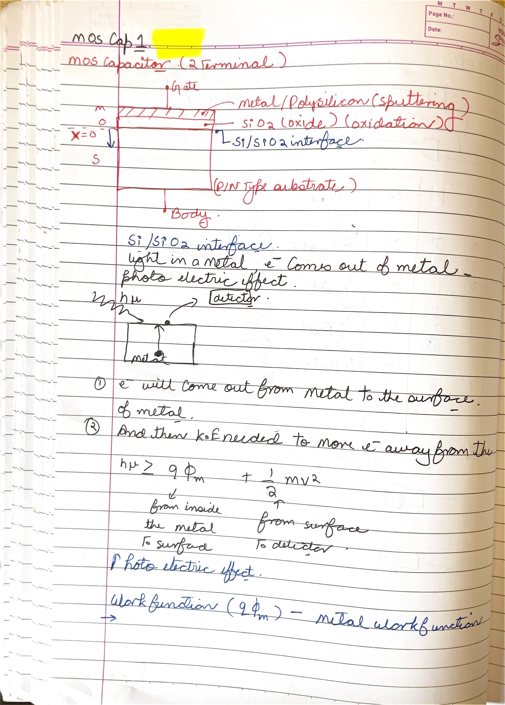

### What this page is doing

The page starts with the physical MOS stack: metal, SiO2, and silicon. The oxide makes the gate electrically insulated, so a DC gate voltage controls the semiconductor by electric field rather than by injecting charge through the oxide. The Si/SiO2 boundary is therefore the crucial surface at which accumulation, depletion, or inversion will later form.

The photoelectric-effect sketch motivates the metal work function. An electron at the Fermi level needs energy (q\Phi_m = E_{vac}-E_{Fm}) to reach the vacuum level. A photon can supply that energy; any excess appears as kinetic energy. Work function is thus an energy referenced to vacuum, not a voltage drop that already exists across the oxide.

### Clarity / improvement

The note `Si/SiO2 = metal/oxide/semiconductor` should be read as a stack description, not an equality between interfaces. Also keep `work function` separate from `electron affinity`: work function ends at the Fermi level, while electron affinity ends at the conduction-band edge.

### Active recall

Why can the gate change the surface charge even though ideal SiO2 blocks steady DC current?

## Page 02 - Absolute energy references and equilibrium

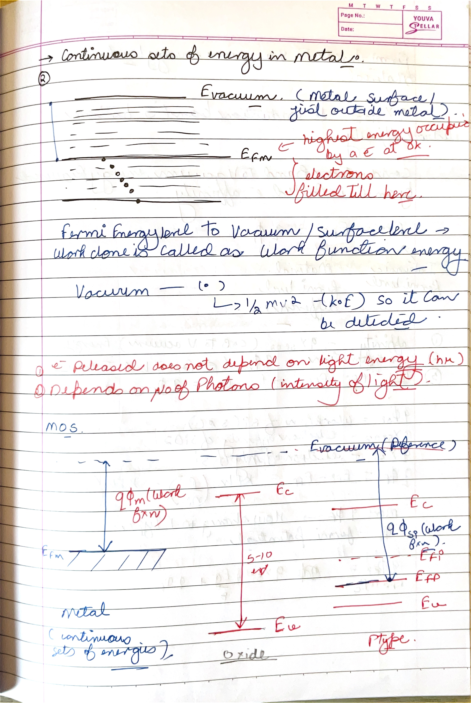

### What this page is doing

The upper diagram establishes a common energy ruler. The vacuum level is the energy of a free electron just outside the material; bound electron states sit below it. In a metal, the Fermi level marks the equilibrium electrochemical potential. At 0 K, states below it are occupied and states above it are empty; at ordinary temperature the transition is thermally broadened.

The lower diagram places metal, oxide, and semiconductor on the same vacuum reference before contact. This lets the work-function difference predict which way charge must redistribute when the materials are assembled. The oxide has a large band gap and high barriers, so it transmits electric field while suppressing carrier transport.

### Clarity / improvement

The statement about electrons being filled “till” the Fermi level is exactly true only at 0 K. At finite temperature, the Fermi-Dirac occupation changes smoothly around (E_F). The wave nature of an electron and photon absorption explain allowed states and excitation, but neither changes the definition of work function.

### Active recall

What common reference permits a metal work function and a semiconductor work function to be compared?

## Page 03 - Electron affinity, band gap, and work-function difference

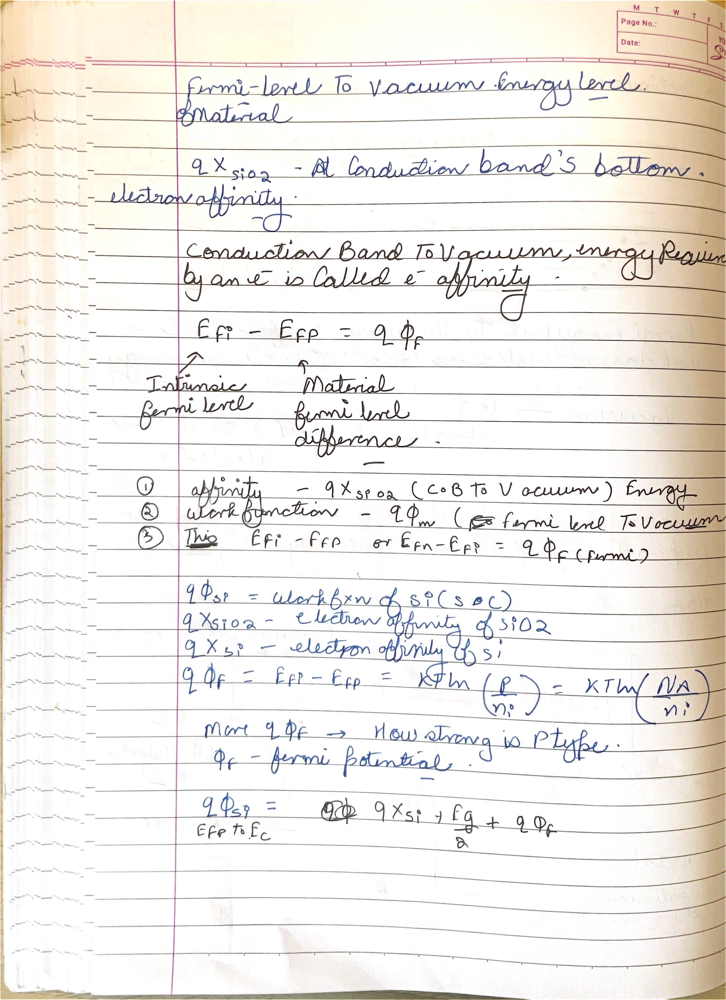

### What this page is doing

This page decomposes the semiconductor work function. Electron affinity is (q\chi = E_{vac}-E_C), the energy from the conduction-band edge to vacuum. The semiconductor work function is (q\Phi_s = E_{vac}-E_F = q\chi + (E_C-E_F)). Doping moves (E_F), so it changes (\Phi_s) even when the material's electron affinity and band gap remain essentially fixed.

The metal-semiconductor work-function difference is convention dependent. A common MOS convention is (\Phi_{ms}=\Phi_m-\Phi_s). It is this difference, together with oxide/interface charge, that determines the flat-band voltage. The drawn oxide conduction-band offset explains why the oxide behaves as an energy barrier.

### Clarity / improvement

Always write the chosen sign convention beside (\Phi_{ms}). Some notes use (\Phi_s-\Phi_m), which reverses later signs without changing the physics. Also distinguish energies such as (q\Phi) in eV or joules from potentials (\Phi) in volts.

### Active recall

If p-type doping is increased, which part of (\Phi_s=\chi+(E_C-E_F)/q) changes?

## Page 04 - Ideal MOS capacitor assumptions

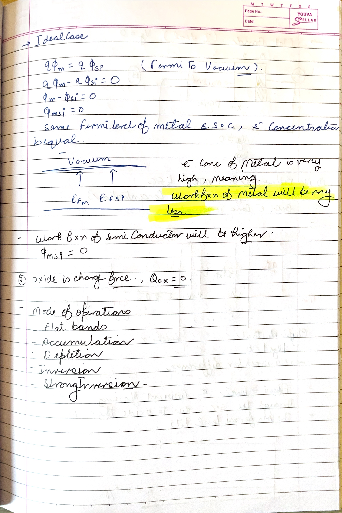

### What this page is doing

The ideal case removes built-in complications so gate bias is the only cause of band bending. The notes impose matched work functions, (\Phi_{ms}=0), and zero oxide/interface charge, (Q_{ox}=0). At (V_G=0), the semiconductor bands are flat and the surface carrier concentrations equal their bulk values.

The vacuum-referenced band sketch shows why a work-function mismatch would otherwise create an internal field even at zero applied voltage. The list at the bottom previews the operating sequence: flat band, accumulation, depletion, inversion, and strong inversion.

### Clarity / improvement

“Ideal” does not mean the oxide has zero thickness or infinite capacitance. It means no mobile/fixed oxide charge, no interface traps, and a deliberately neutral work-function condition for the introductory derivation.

### Active recall

Which two non-ideal effects must be set to zero before (V_G=0) automatically means flat band?

## Page 05 - Flat band as the electrostatic reference state

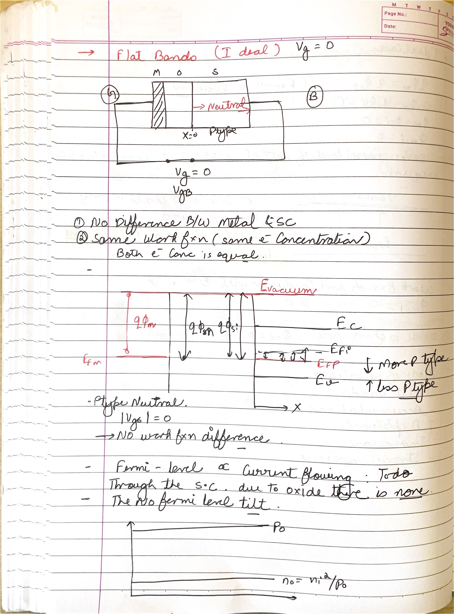

### What this page is doing

The capacitor sketch and band diagram define flat band: the semiconductor energy bands have no spatial slope, so (E=-d\psi/dx=0) inside the semiconductor and there is no space-charge region. The surface and bulk carrier concentrations are equal. In the ideal matched-work-function case, this occurs at (V_G=0); in a practical device it occurs at (V_G=V_{FB}).

The flat Fermi level describes equilibrium, not current flow through the oxide. A uniform equilibrium Fermi level means no electrochemical-potential gradient and therefore no net semiconductor current. The oxide prevents a DC conduction path between gate and body.

### Clarity / improvement

Flat **bands** and flat **Fermi level** are different statements. At thermal equilibrium (E_F) is flat even when (E_C) and (E_V) bend. Flat band is the stronger special condition in which the semiconductor band edges also stop bending.

### Active recall

Can an equilibrium MOS capacitor have a flat Fermi level but bent conduction and valence bands? Explain.

## Page 06 - Blank source page

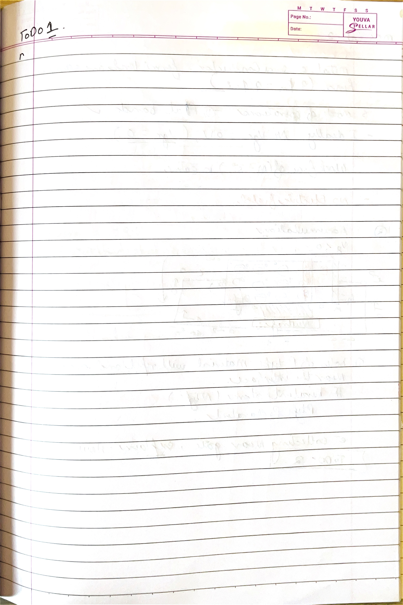

### What this page is doing

This source page is blank. It is intentionally retained so the rendered sequence stays one-to-one with `mos1.pdf`; nothing has been lost during extraction.

### Clarity / improvement

Use the blank as a recall divider: redraw the ideal MOS stack and write the meanings of (\Phi_m), (\Phi_s), (\chi), and (V_{FB}) from memory before starting the bias modes.

### Active recall

What changes at the semiconductor surface first when the gate moves away from flat band: carrier concentration, oxide current, or material band gap?

## Page 07 - Accumulation on a p-type substrate

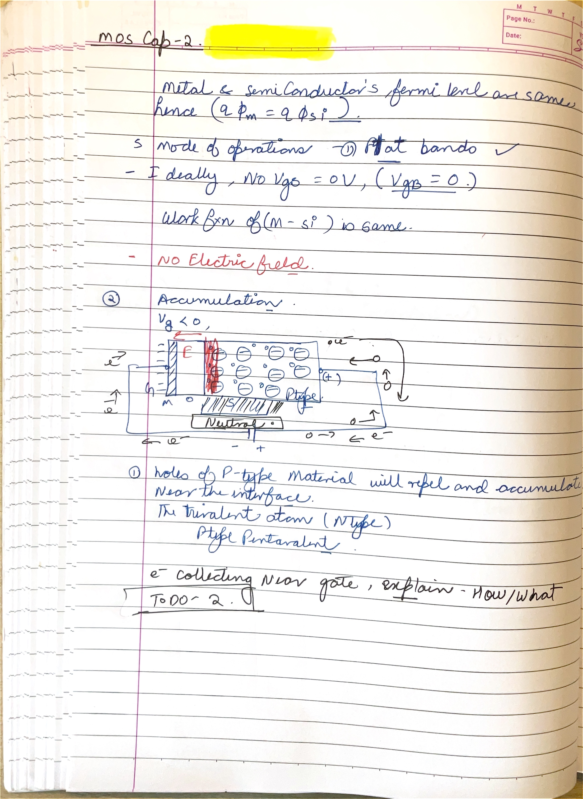

### What this page is doing

With a negative gate voltage, negative gate charge repels electrons and attracts positively charged holes toward the Si/SiO2 surface. Because holes are already the majority carriers of p-type silicon, their surface concentration rises above the bulk value: this is accumulation. The semiconductor charge is concentrated very close to the interface and is opposite to the gate charge.

The key causal chain is `negative gate -> electric field -> hole attraction -> increased surface hole concentration`. No hole crosses the oxide. Carriers rearrange within the semiconductor and through the body contact until electrostatic equilibrium is reached.

### Question / TODO acknowledged

The handwriting asks how p-type material moves from repulsion/depletion toward inversion and mentions electrons “colliding” near the gate. These are separate bias regimes. Negative gate bias accumulates holes. As the gate becomes positive, holes are repelled, leaving ionized acceptors (depletion); only at still larger positive bias do thermally generated or contact-supplied minority electrons dominate the surface (inversion). Inversion is an electrostatic redistribution, not an electron collision process at the oxide.

### Clarity / improvement

The note “no electric field” belongs to flat band, not accumulation. Accumulation requires an electric field and band bending; the field is what attracts majority carriers.

### Active recall

For p-type silicon, state the sign of gate charge, semiconductor charge, and mobile carrier that dominates in accumulation.

## Page 08 - Moving from flat band into depletion

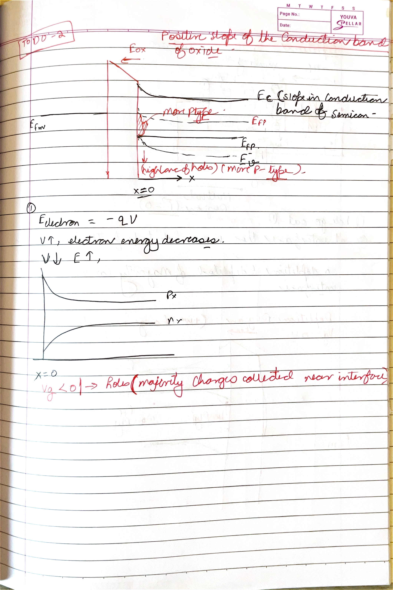

### What this page is doing

The page applies a small positive gate voltage to p-type silicon. Positive gate charge repels mobile holes from the surface. The uncovered acceptor atoms are negatively charged but immobile, so a depletion region appears. Because the electrostatic potential varies with depth, (E_C), (E_i), and (E_V) bend together while their energy separations remain fixed.

The electric-field plot is largest near the oxide interface and falls to zero at the depletion edge, where the semiconductor returns to neutral bulk behavior. As (V_G) increases, both the surface potential and depletion width increase.

### Clarity / improvement

Band edges do not bend because the band gap changes. They bend because electron potential energy shifts with electrostatic potential: (E_C(x)=E_{C0}-q\psi(x)), and similarly for (E_i) and (E_V).

### Active recall

Why does positive gate bias leave **negative** depletion charge in a p-type substrate?

## Page 09 - Depletion charge, width, and the band picture

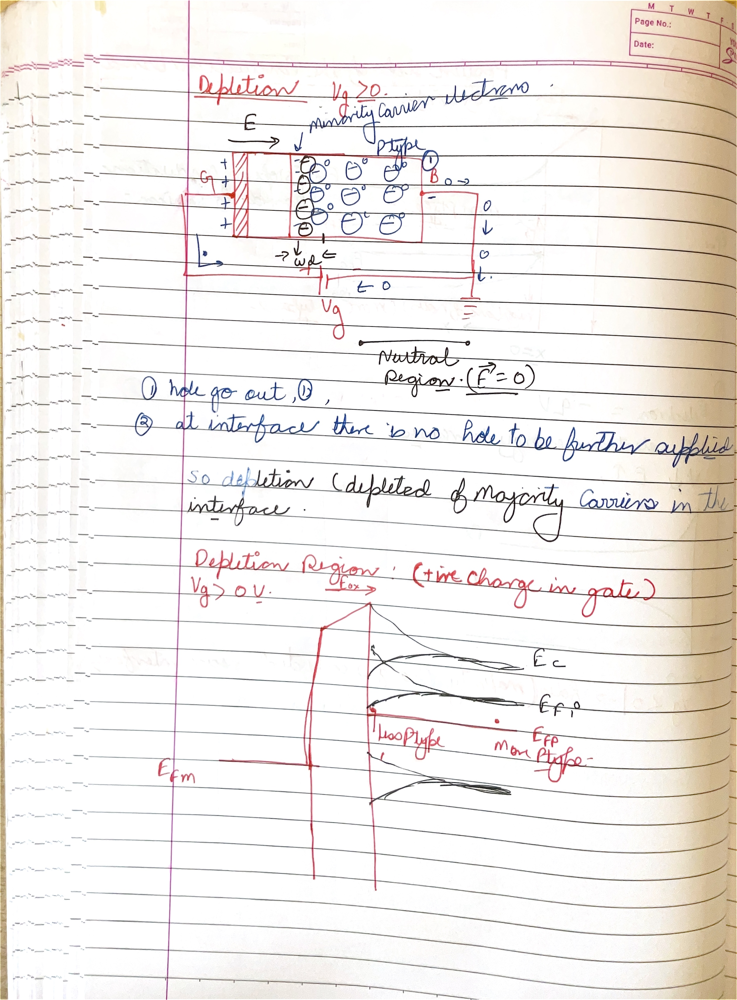

### What this page is doing

The cross-section marks the depletion width (W_d) and the uncovered ionized acceptors. Under the depletion approximation, mobile charge is neglected inside (0<x<W_d), so the volume charge density is approximately constant: (\rho=-qN_A). Beyond (W_d), charge neutrality returns and (\rho\approx0).

The corresponding band diagram bends progressively toward the interface. As gate voltage rises, (W_d) grows, the magnitude of depletion sheet charge (Q_d=-qN_AW_d) grows, and the surface intrinsic level approaches then crosses the Fermi level. That crossing is the visual signal that minority electrons are becoming important.

### Clarity / improvement

Depletion does not mean “no charge.” It means mobile majority carriers have been depleted, leaving a substantial fixed space charge from ionized dopants.

### Active recall

Under the depletion approximation, why is (\rho(x)) rectangular while (E(x)) is linear and (\psi(x)) is quadratic?

## Page 10 - Energy-band and carrier-concentration profiles

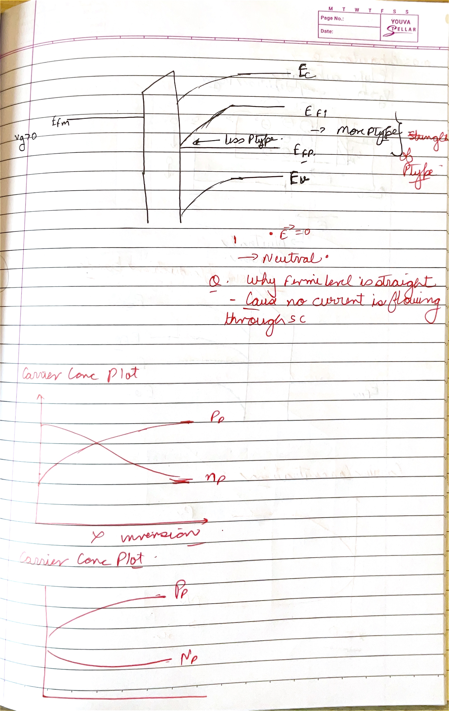

### What this page is doing

The upper sketch aligns (E_C), (E_i), (E_F), and (E_V) through the depleted surface. The lower plots translate energy bending into concentrations: (n(x)=n_i\exp[(E_F-E_i(x))/kT]) and (p(x)=n_i\exp[(E_i(x)-E_F)/kT]). When (E_i) bends below (E_F), electron concentration rises exponentially while hole concentration falls.

This page connects the visual band diagram to actual charge. A modest-looking energy shift of a few (kT) can produce orders-of-magnitude concentration change because the relation is exponential.

### Question / TODO acknowledged

The page asks why the Fermi level is straight and whether that means current flows. At thermal equilibrium, a flat Fermi level means the electrochemical potential is constant, so electron and hole drift and diffusion currents cancel and the net current is zero. A sloped Fermi or quasi-Fermi level, not a flat one, is associated with net carrier transport.

### Clarity / improvement

The gate and semiconductor can have different electrochemical potentials when an external voltage source biases them, because the oxide prevents equilibration by carrier exchange. Within the equilibrium semiconductor body, the Fermi level remains spatially flat.

### Active recall

If (E_i-E_F) decreases by several (kT) near the surface, what happens to (n) and (p)?

## Page 11 - Deeper depletion under increasing positive gate bias

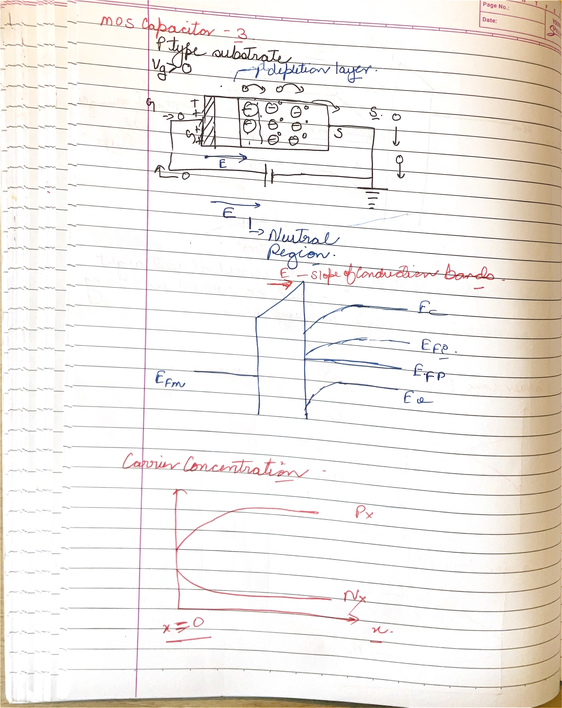

### What this page is doing

The cross-section, band diagram, and concentration curves show the same state three ways. More positive gate charge removes more holes, widens the depletion layer, increases downward band bending for the page's sign convention, and raises the minority-electron concentration at the surface.

The carrier plots are essential: the fixed depletion charge grows roughly with (\sqrt{\psi_s}), but the minority-carrier density grows exponentially with (\psi_s). This different growth rate is why depletion width eventually approaches a maximum while inversion charge later accepts most additional gate charge.

### Clarity / improvement

Say explicitly whether the vertical axis is electron energy or electrostatic potential. Energy bands and potential bend in opposite directions because electron potential energy is (-q\psi).

### Active recall

Why does inversion eventually dominate additional gate charge even though the depletion region forms first?

## Page 12 - The onset of inversion

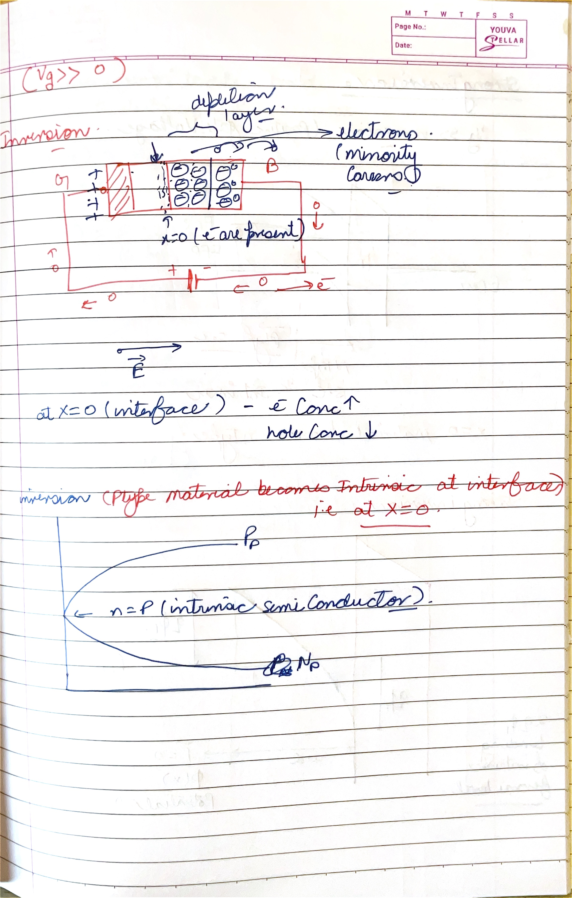

### What this page is doing

With a larger positive (V_G), the surface electron concentration becomes comparable to and then greater than the surface hole concentration. The silicon remains p-type in the bulk, but the very thin surface layer behaves n-type; that reversal of carrier dominance is inversion.

The page's concentration plot shows (n(x)) peaking at the interface while (p(x)) is suppressed there. The depletion charge still exists beneath the inversion sheet, so the surface structure is not merely “electrons instead of acceptors”; it is an inversion layer above a depletion region.

### Clarity / improvement

Weak inversion starts before the conventional threshold. Threshold is usually defined at strong inversion, when the surface potential reaches approximately (2\phi_F) for a p-type substrate under the usual magnitude convention.

### Active recall

What two charged regions coexist in the semiconductor once an n-type inversion layer forms on p-type bulk?

## Page 13 - Strong inversion and the (2\phi_F) criterion

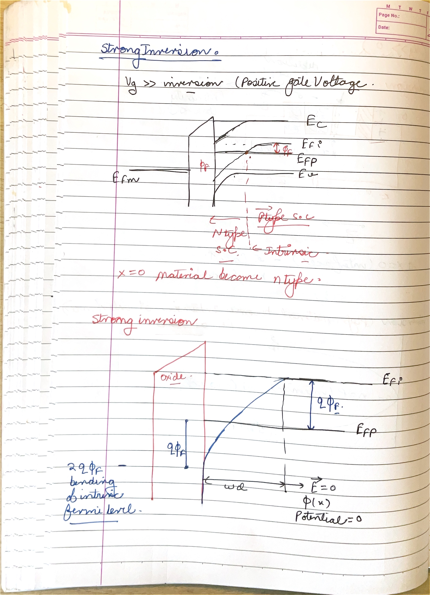

### What this page is doing

The page marks strong inversion when the surface intrinsic level has moved symmetrically past the Fermi level relative to its bulk position. For p-type bulk, (\phi_F=(kT/q)\ln(N_A/n_i)) as a positive magnitude, and the standard threshold condition is (\psi_s\approx2\phi_F).

At this point the surface minority-electron concentration equals the bulk majority-hole concentration: (n_s\approx p_0\approx N_A). Beyond threshold, (\psi_s) and (W_d) change comparatively slowly, while most added gate charge goes into the inversion sheet.

### Clarity / improvement

“Strong inversion at (2\phi_F)” is a conventional and extremely useful threshold definition, not a discontinuous physical switch. Carrier density changes continuously with voltage.

### Active recall

Show from the Boltzmann relations why (\psi_s=2\phi_F) gives (n_s\approx N_A).

## Page 14 - Surface potential as the mode classifier

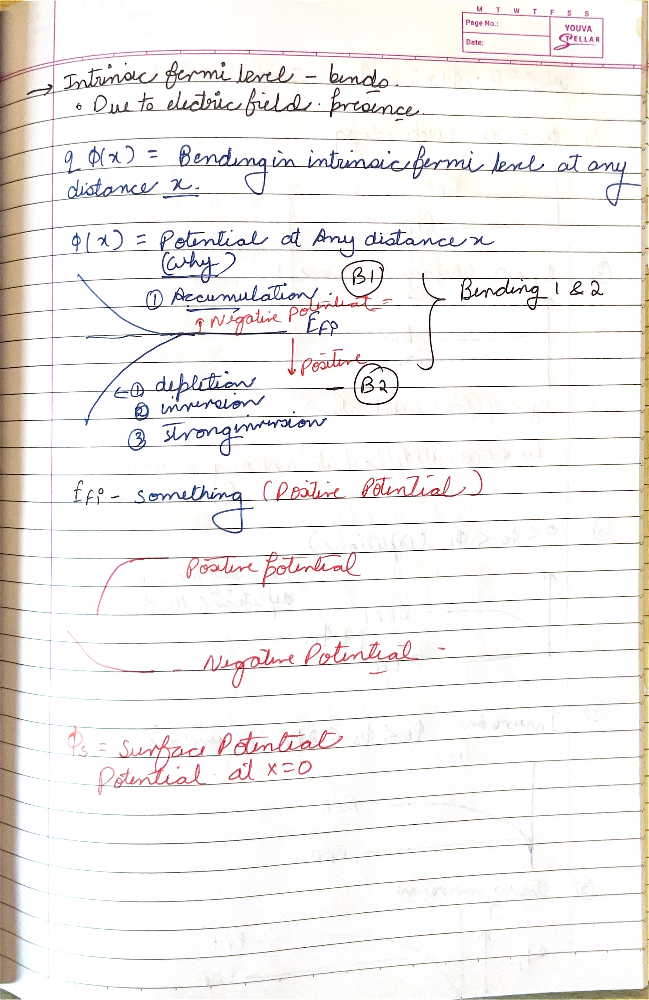

### What this page is doing

This page makes surface potential (\psi_s=\psi(0)-\psi(\text{bulk})) the single variable that classifies the surface state. For a p-type substrate under the usual sign convention: negative (\psi_s) gives accumulation, (\psi_s=0) gives flat band, (0<\psi_s<\phi_F) gives depletion, (\phi_F<\psi_s<2\phi_F) gives weak inversion, and (\psi_s\ge2\phi_F) gives strong inversion.

The polar-potential sketches are reminders that the electric potential in the semiconductor is not uniform once the bands bend. The gate voltage is divided between oxide drop, surface potential, and any work-function/fixed-charge offset.

### Clarity / improvement

The exact labels at (\phi_F) vary by text; the robust anchors are flat band at (0), intrinsic surface at approximately (\phi_F), and strong inversion at approximately (2\phi_F).

### Active recall

Why is (V_G) not generally equal to (\psi_s)? Name the other voltage contributions.

## Page 15 - Five surface conditions on one potential axis

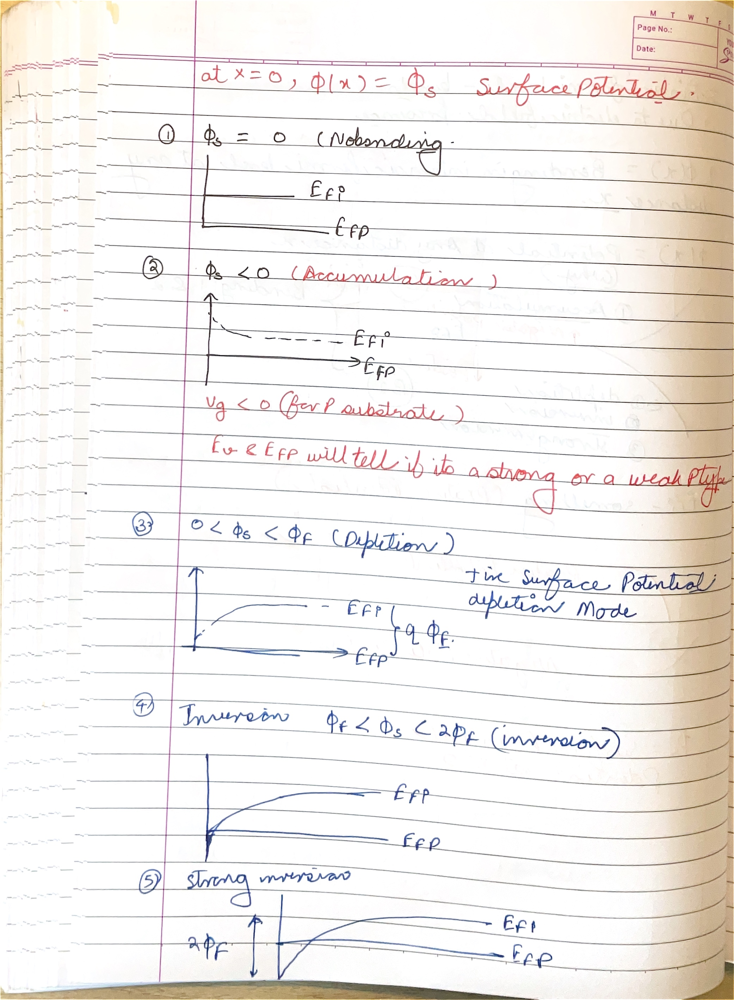

### What this page is doing

The five small sketches compress the entire p-type MOS-capacitor progression: flat band, accumulation, depletion, weak inversion, and strong inversion. Reading them together is more useful than memorizing five isolated diagrams because only the sign and magnitude of (\psi_s) change.

The band/potential separation between bulk and surface increases as bias moves toward inversion. At strong inversion it is approximately (2\phi_F). The charge response changes character along the way: mobile holes -> fixed acceptors -> mobile electrons.

### Clarity / improvement

Add a charge label under each sketch during revision: (Q_s>0) for hole accumulation, (Q_s<0) for depletion/inversion on p-type silicon. This prevents potential-sign memory from becoming detached from the physical carriers.

### Active recall

Without drawing bands, list the dominant surface charge for all five conditions in order.

## Page 16 - Complementary operation on n-type silicon

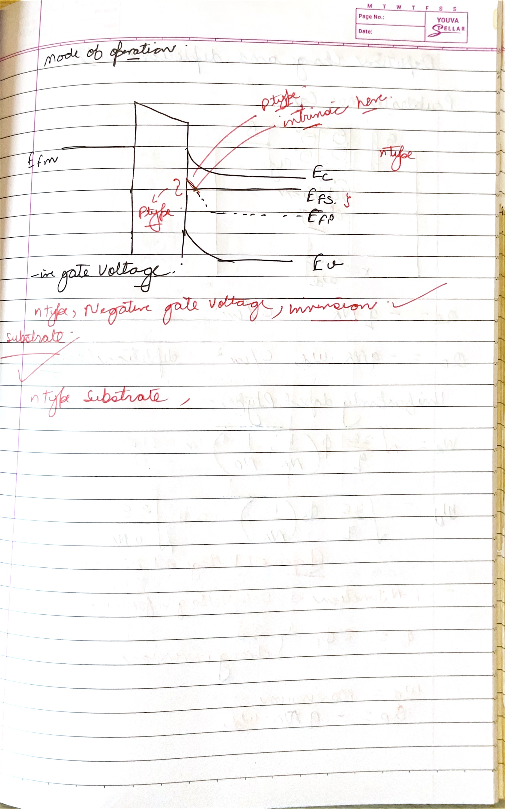

### What this page is doing

This page switches polarity to emphasize symmetry. On n-type silicon, positive gate bias accumulates electrons; negative gate bias first depletes electrons and then attracts holes to form p-type inversion. The band bending and voltage signs reverse relative to the p-type case.

The underlying logic does not change: a gate bias that repels the bulk majority carrier creates depletion, and a stronger bias of that same polarity attracts the opposite carrier into inversion.

### Clarity / improvement

Do not memorize “positive means inversion” without attaching the substrate type. Positive gate creates inversion on p-type material; negative gate creates inversion on n-type material.

### Active recall

What gate polarity creates strong inversion on n-type silicon, and which carrier forms the surface channel?

## Page 17 - Depletion charge and width for a p-type substrate

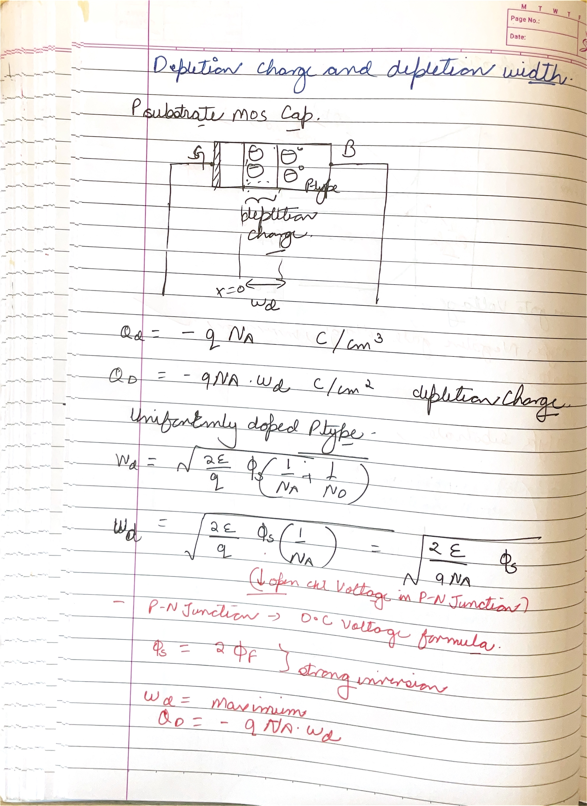

### What this page is doing

Using the depletion approximation, the page converts the rectangular charge density into sheet charge: (Q_d=-qN_AW_d). Solving Poisson's equation gives (W_d=\sqrt{2\varepsilon_{si}\psi_s/(qN_A)}) when (\psi_s) is taken as a positive depletion potential magnitude.

At strong inversion, set (\psi_s=2\phi_F): (W_{d,max}=\sqrt{4\varepsilon_{si}\phi_F/(qN_A)}). The maximum depletion sheet-charge magnitude is therefore

\[|Q_{d,max}|=qN_AW_{d,max}=\sqrt{4q\varepsilon_{si}N_A\phi_F}.\]

### Clarity / improvement

The sign of (Q_d) comes from the ionized dopant: acceptors are negative after losing their mobile holes. Width is always positive; put the sign in (Q_d), not in (W_d).

### Active recall

How does doubling (N_A) affect (W_d) and |(Q_d)| at a fixed surface potential?

## Page 18 - Depletion charge and width for an n-type substrate

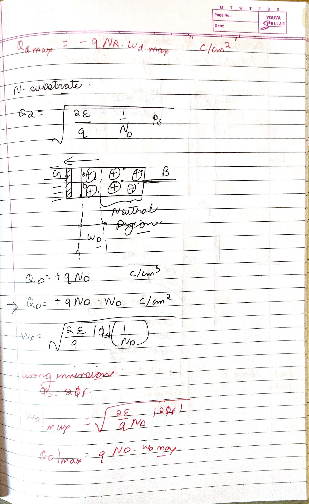

### What this page is doing

This is the n-type counterpart. Depleting electrons exposes positively charged ionized donors, so (Q_d=+qN_DW_d). The width follows (W_d=\sqrt{2\varepsilon_{si}|\psi_s|/(qN_D)}), with an absolute potential magnitude used to keep width real and positive.

At strong inversion, substitute (2|\phi_F|) to obtain the maximum width and charge. The formulas mirror the p-type case; only charge and bias signs reverse.

### Clarity / improvement

The note's square-root expression should include the full potential magnitude inside the radical. A quick units check helps: (\varepsilon\psi/(qN)) has units of length squared.

### Active recall

Why is n-substrate depletion charge positive even though the depleted mobile carrier is an electron?

## Page 19 - From charge density to field and potential

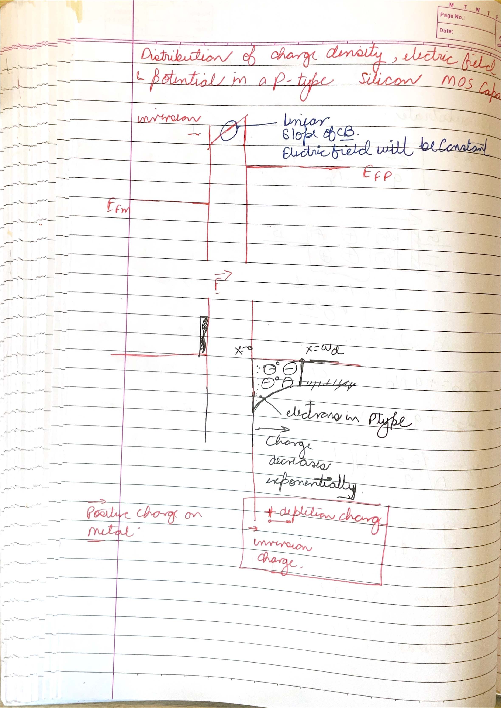

### What this page is doing

The page assembles the spatial profiles for a p-type capacitor near inversion. In the metal, gate charge is a surface sheet. In the oxide, ideal volume charge is zero, so the electric field is constant. In depleted silicon, (\rho=-qN_A), so Poisson's equation makes electric field linear and electrostatic potential quadratic until neutrality is recovered at (x=W_d).

This is the mathematical reason the three plots have different shapes: (dE/dx=\rho/\varepsilon) and (E=-d\psi/dx). A constant charge becomes a linearly varying field; integrating once more gives a parabola.

### Clarity / improvement

At strong inversion, add a very thin mobile-electron sheet at the interface in addition to the rectangular depletion charge. Omitting it is acceptable only while deriving the depletion component.

### Active recall

Sketch the expected shapes of (\rho(x)), (E(x)), and (\psi(x)) in oxide and depleted silicon without using the page.

## Page 20 - Electric field and dielectric boundary condition

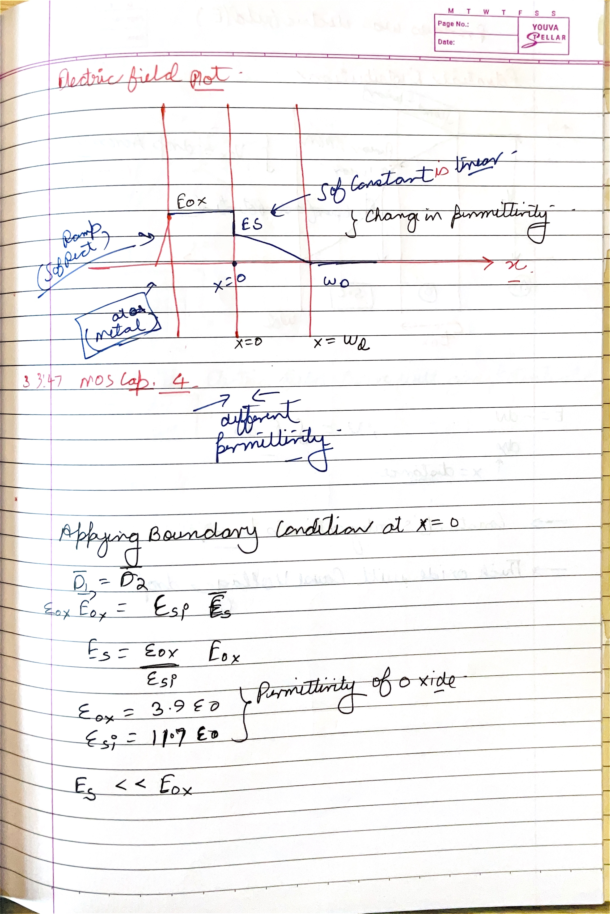

### What this page is doing

The electric-field plot is constant through charge-free oxide and decreases linearly through uniformly charged depletion silicon. At an ideal interface with no separate sheet charge, normal electric displacement is continuous: (\varepsilon_{ox}E_{ox}=\varepsilon_{si}E_{si}(0)).

Because (\varepsilon_{si}\) is roughly three times (\varepsilon_{ox}), the electric-field magnitude in the oxide is roughly three times the silicon surface field. This is why a physically thin oxide can still take a significant fraction of the gate voltage.

### Clarity / improvement

Electric field itself need not be continuous across two dielectrics; electric displacement is continuous when there is no interfacial free sheet charge. With interface charge, the displacement has a discontinuity equal to that sheet charge.

### Active recall

If (\varepsilon_{si}>\varepsilon_{ox}), which material has the larger field magnitude at an ideal interface carrying no sheet charge?

## Page 21 - Potential distribution across the MOS stack

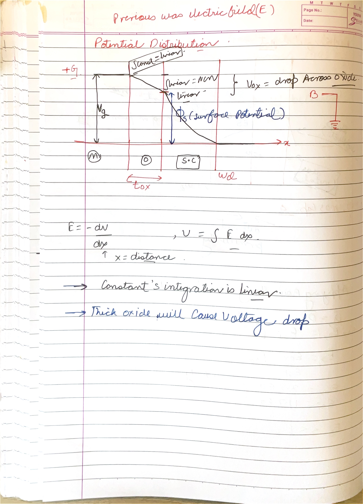

### What this page is doing

Integrating the electric field produces the potential distribution. A constant oxide field gives a linear oxide voltage drop (V_{ox}=E_{ox}t_{ox}). The linearly changing field in depleted silicon gives a quadratic potential, reaching the surface potential (\psi_s) at the interface and flattening in the neutral bulk.

Ignoring work-function and fixed-charge offsets for the ideal case, the applied gate voltage divides as (V_G=V_{ox}+\psi_s). In a real capacitor, the more complete bookkeeping is (V_G=V_{FB}+V_{ox}+\psi_s).

### Clarity / improvement

The potential graph is continuous across an ideal interface, while its slope changes because the field changes. Never draw a potential jump unless an ideal dipole/contact-potential model explicitly requires it.

### Active recall

Which part of the potential is linear and which part is parabolic, and what charge assumption causes each shape?

## Page 22 - Field-area method for voltage

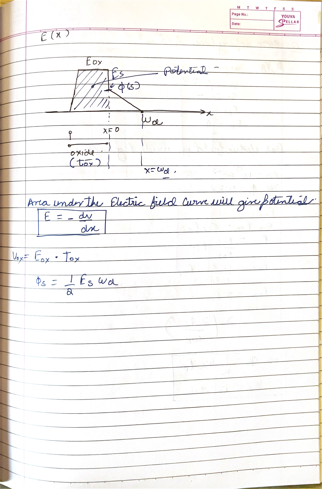

### What this page is doing

This page turns the field plot into a rapid calculation. Since voltage difference is minus the integral of electric field, the magnitude of the surface potential equals the triangular area under (E_{si}(x)): (\psi_s=\tfrac12 E_{s,max}W_d). The oxide drop is the rectangular area (V_{ox}=E_{ox}t_{ox}).

Combining (E_{s,max}=qN_AW_d/\varepsilon_{si}) with the triangular area directly reproduces (\psi_s=qN_AW_d^2/(2\varepsilon_{si})). This is a useful way to derive rather than memorize the depletion-width formula.

### Clarity / improvement

Use signed integrals when deriving directions, but use clearly labeled magnitudes for fast numerical work. Mixing a negative field with an unsigned graphical area is a common source of incorrect minus signs.

### Active recall

Derive (W_d(\psi_s)) using only the triangle area and Gauss's-law expression for the peak field.

## Page 23 - Numerical electrostatics example

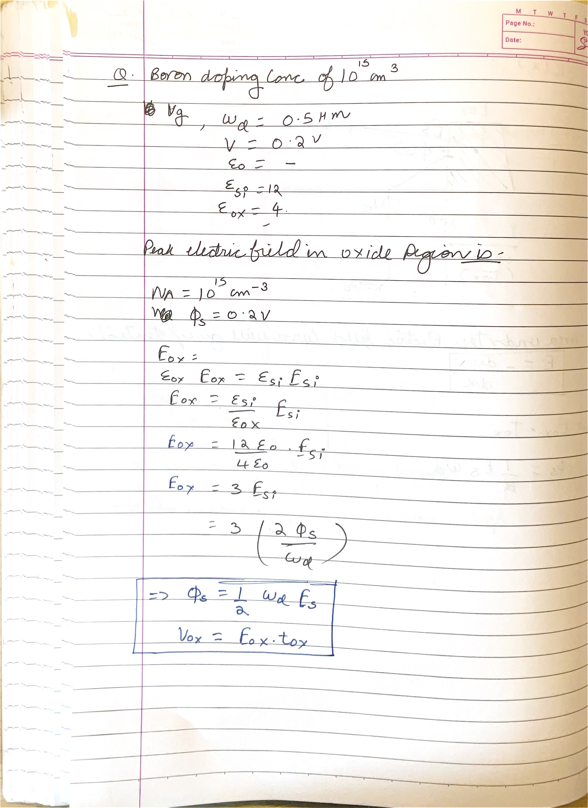

### What this page is doing

The problem supplies doping, depletion width, oxide thickness, and dielectric constants, then asks for the peak silicon field, oxide field, surface potential, and oxide voltage. The correct solution order is causal: calculate charge or (E_{si,max}=qN_AW_d/\varepsilon_{si}); apply (\varepsilon_{si}E_{si}=\varepsilon_{ox}E_{ox}); integrate the silicon triangle for (\psi_s); then multiply (E_{ox}) by (t_{ox}) for (V_{ox}).

The page's boxed relations capture that order. It is also a dimensional-analysis exercise: convert centimeters and nanometers consistently before inserting SI permittivities and charge density.

### Clarity / improvement

The drawn formula (\psi_s=\tfrac12W_dE_s) is correct for a linearly falling depletion field. The oxide drop is (V_{ox}=E_{ox}t_{ox}), not (E_{si}t_{ox}). Write field units explicitly to prevent a (10^2) or (10^9) conversion error.

### Active recall

Why must the oxide field be found through displacement continuity rather than assumed equal to the peak silicon field?

## Page 24 - Beginning the non-ideal MOS capacitor

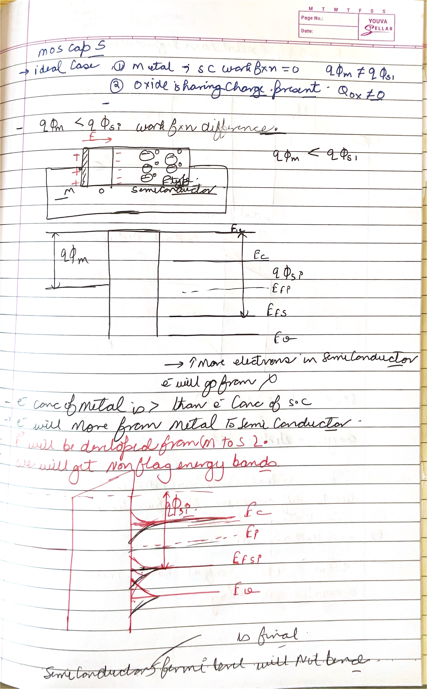

### What this page is doing

The final page removes the ideal assumption by allowing (\Phi_m\ne\Phi_s). When metal and semiconductor are connected externally, their equilibrium Fermi levels align, but a work-function difference is accommodated by charge redistribution and band bending. Thus (V_G=0) need not produce flat bands.

The diagrams compare the separated materials and assembled capacitor. The practical consequence is a flat-band-voltage shift: an external voltage must cancel the built-in work-function effect (and, later, oxide charge) before the semiconductor bands become flat.

### Clarity / improvement

The note's qualitative direction is correct, but the sign of (V_{FB}) depends on the declared (\Phi_{ms}) convention. Carry one convention consistently into Module 2 rather than memorizing a band-bending direction in isolation.

### Active recall

Why can a MOS capacitor have band bending at zero applied gate voltage without violating equilibrium?

## Module checkpoint

You are ready for Module 2 when you can derive this chain without notes:

`work-function/charge offset -> flat-band voltage -> surface potential -> depletion width -> depletion charge -> oxide drop -> threshold voltage`
