# 02 - Non-Ideal MOS and MOSFET Regions

[Back to MOSFET and CMOS](../README.md) | [Previous module](../01%20MOS%20Capacitor%20Fundamentals/README.md) | [Untouched source PDF](../sources/mos2.pdf)

This module turns ideal electrostatics into practical device equations. It explains why flat band and threshold shift, how MOS capacitance changes with bias, and how an inversion layer becomes a current-carrying MOSFET channel.

## Page map

| Page | Revision focus | Page | Revision focus |
|---:|---|---:|---|
| [1](#page-01) | Work-function-induced field | [13](#page-13) | Oxide-capacitance example |
| [2](#page-02) | Gate work-function engineering | [14](#page-14) | C-V and interface charge |
| [3](#page-03) | Oxide and interface charges | [15](#page-15) | Minimum-capacitance algebra |
| [4](#page-04) | Flat-band shift from charge | [16](#page-16) | Threshold numerical setup |
| [5](#page-05) | Practical flat-band voltage | [17](#page-17) | Enhancement MOSFET anatomy |
| [6](#page-06) | Device-data example | [18](#page-18) | Channel potential and body junctions |
| [7](#page-07) | Numerical flat-band solution | [19](#page-19) | Applying drain voltage |
| [8](#page-08) | Threshold-voltage components | [20](#page-20) | Output characteristics |
| [9](#page-09) | Depletion capacitance | [21](#page-21) | Pinch-off and $V_{DS,sat}$ |
| [10](#page-10) | MOS C-V curve | [22](#page-22) | Depletion-mode MOSFET |
| [11](#page-11) | Doping effect on threshold | [23](#page-23) | Linear and saturation equations |
| [12](#page-12) | Series dielectric model | [24](#page-24) | p-channel depletion device |

## Page 01 - Work-function mismatch creates a built-in field

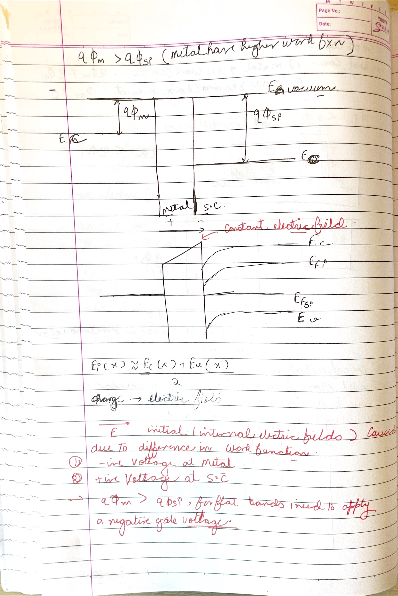

### What this page is doing

This continues the non-ideal case from Module 1. When metal and semiconductor work functions differ, connecting them through the external circuit transfers charge until the equilibrium Fermi levels align. Equal and opposite charge then appears across the oxide, producing an electric field and semiconductor band bending even at $V_G=0$.

To reach flat band, an applied voltage must cancel this built-in electrostatic effect. With the convention $\Phi_{ms}=\Phi_m-\Phi_s$, and before adding oxide charge, $V_{FB}=\Phi_{ms}$. The band diagram therefore encodes the sign of the required compensating voltage.

### Clarity / correction / improvement

Fermi-level alignment does not mean the conduction and valence bands must be flat. It only means equilibrium electrochemical potential is uniform within the connected system; electrostatic potential can still vary spatially.

### Active recall

What physical charge appears after dissimilar work functions equilibrate, and what externally measurable voltage does it shift?

## Page 02 - Engineering the gate work function

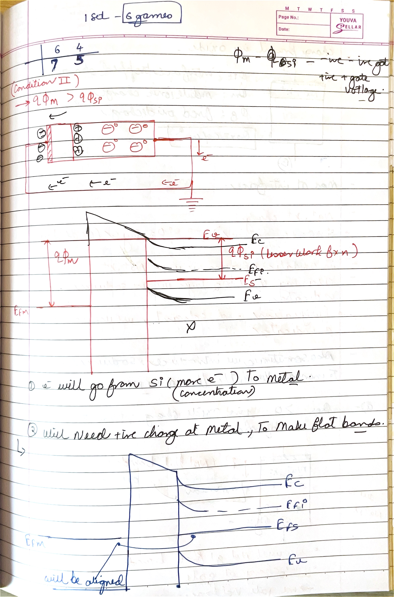

### What this page is doing

The notes compare work-function choices and show how a polysilicon gate can be heavily doped so its Fermi level lies near a band edge. An n+ polysilicon gate has a work function near the silicon electron affinity, while p+ polysilicon places the Fermi level near the valence band. This gives process designers a way to tune $\Phi_{ms}$ and hence $V_{FB}$ and $V_T$.

The sketches then show that a gate voltage can cancel the built-in band bending. At the correct external bias, semiconductor bands become flat even though the gate and substrate materials retain different intrinsic work functions.

### Question / TODO acknowledged

The handwriting asks whether silicon/gate material must be changed to make the bands flat. No. Changing gate material or gate doping is one design option, but during operation an applied $V_{FB}$ can cancel the work-function and fixed-charge offsets. Material choice changes the required voltage; it is not the only route to flat band.

### Clarity / correction / improvement

Modern processes may use metal gates rather than doped polysilicon, but the work-function logic is the same. Keep material engineering and external bias as two separate control mechanisms.

### Active recall

How does moving the gate Fermi level toward $E_C$ affect its work function?

## Page 03 - Mobile, fixed, and interface charge

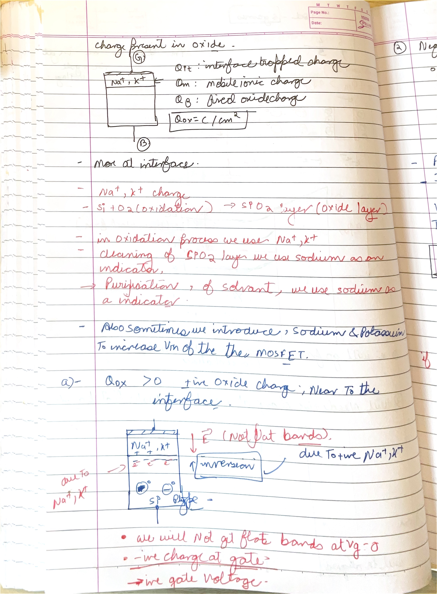

### What this page is doing

The page lists important departures from an ideal oxide. Mobile ionic charge, historically sodium or potassium contamination, can drift through SiO2 under field and temperature. Fixed oxide charge resides near the Si/SiO2 interface. Interface traps exchange charge with silicon depending on surface Fermi level and can distort both threshold voltage and measured C-V response.

Each charge source changes the gate voltage needed to obtain a chosen surface potential. A sheet charge $Q_{ox}$ introduces an oxide-voltage offset proportional to $Q_{ox}/C_{ox}$; mobile charge can additionally cause instability or hysteresis because its position changes.

### Clarity / correction / improvement

Do not merge all non-ideal charges into one physical mechanism. The compact $Q_{ox}$ term is useful for voltage bookkeeping, but interface traps can be bias- and frequency-dependent, while mobile ions can move with time.

### Active recall

Which oxide imperfection can produce time-dependent threshold drift, and which can respond to surface Fermi-level position?

## Page 04 - Oxide charge shifts flat-band voltage

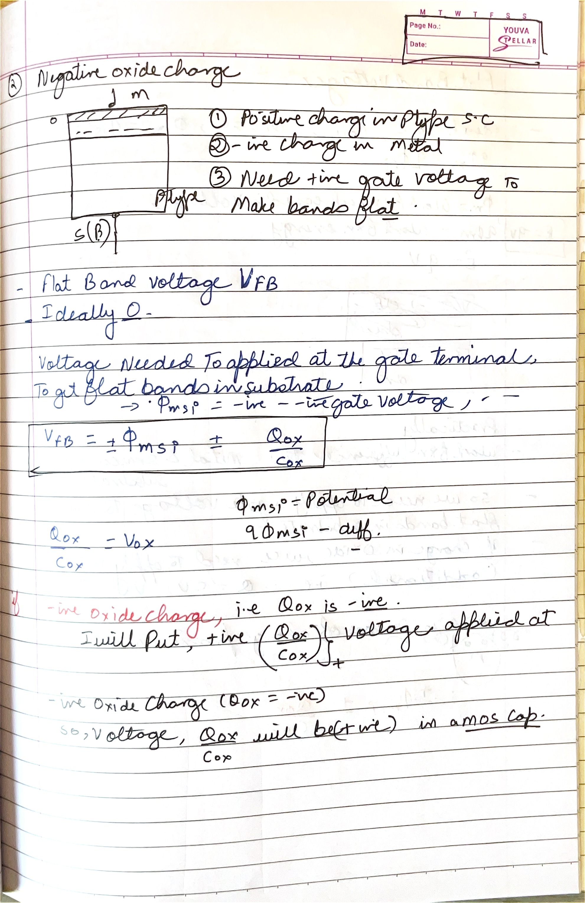

### What this page is doing

The page adds oxide charge to the flat-band equation. For the convention $\Phi_{ms}=\Phi_m-\Phi_s$ and an equivalent sheet charge near the interface,

$$
V_{FB}=\Phi_{ms}-\frac{Q_{ox}}{C_{ox}}.
$$
A positive $Q_{ox}$ therefore shifts $V_{FB}$ negative; a negative $Q_{ox}$ shifts it positive. Physically, the external gate must supply a voltage that cancels both the work-function-induced field and the field caused by trapped/fixed charge.

### Clarity / correction / improvement

If charge is distributed through the oxide, its voltage effect depends on position, so $Q_{ox}$ in the simple equation is an effective interface-referred charge. State this approximation when precision matters.

### Active recall

For matched work functions, what sign of gate voltage is required to cancel a positive fixed oxide charge?

## Page 05 - Practical meaning of flat-band voltage

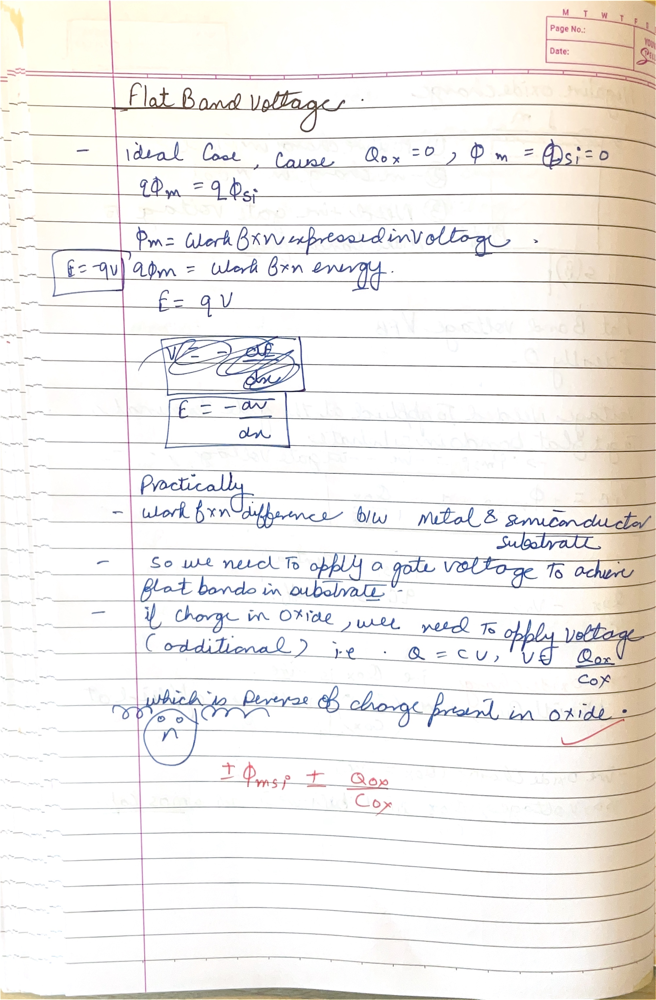

### What this page is doing

The page contrasts the ideal result $V_{FB}=0$ with a real MOS capacitor, where work-function difference and oxide charge usually make $V_{FB}\ne0$. The boxed relation expresses voltage as energy per unit charge, and the capacitor sketch emphasizes that the gate voltage controls charge through the oxide capacitance.

Flat band is still defined by $\psi_s=0$ and no semiconductor space charge. The required terminal voltage simply moves away from zero. This makes $V_{FB}$ a calibration point for the whole C-V curve.

### Clarity / correction / improvement

The page's sad/uncertain annotation is resolved by separating the **definition** from the **value**: flat band always means no band bending; only the voltage needed to obtain it changes in a practical structure.

### Active recall

Can $V_G=0$ and $\psi_s=0$ be treated as equivalent in a non-ideal device? Why not?

## Page 06 - Converting process data into band offsets

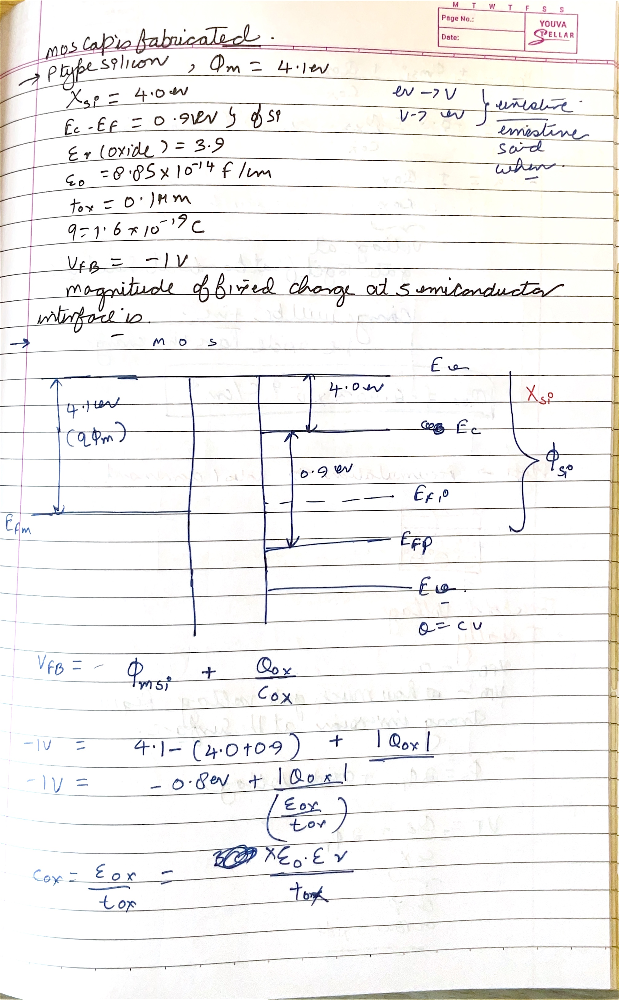

### What this page is doing

This numerical setup lists polysilicon-gate work function, silicon electron affinity, band gap, oxide thickness, oxide charge, doping, and temperature. The intended workflow is to locate the substrate Fermi level from doping, form the semiconductor work function, subtract it from the gate work function, calculate $C_{ox}=\varepsilon_{ox}/t_{ox}$, and then include $-Q_{ox}/C_{ox}$.

The band sketch prevents the calculation from becoming blind substitution: for p-type silicon, $E_F$ lies below $E_i$, increasing the energy from $E_F$ to $E_C$ and therefore increasing $\Phi_s$.

### Clarity / correction / improvement

Use either capacitance per unit area $C'_{ox}=\varepsilon_{ox}/t_{ox}$ with charge density in C/m2, or total capacitance $C_{ox}=\varepsilon_{ox}A/t_{ox}$ with total charge in C. Do not mix them.

### Active recall

In what order should doping, work function, oxide capacitance, and oxide charge be used to calculate $V_{FB}$?

## Page 07 - Flat-band numerical solution and threshold ingredients

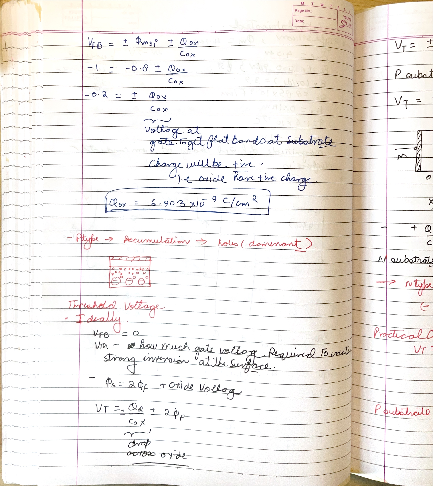

### What this page is doing

The arithmetic combines $\Phi_{ms}$ with the oxide-charge voltage. After finding $V_{FB}$, the page begins threshold analysis by identifying the gate voltage needed for strong inversion and the depletion charge present at that point.

The important structural relation is not the particular number but the decomposition

$$
V_T=V_{FB}+2\phi_F+\frac{|Q_{d,max}|}{C'_{ox}}
$$
for an nMOS built on p-type silicon with the usual positive-magnitude convention. It says the gate must first cancel non-ideal offsets, then bend the surface to strong inversion, then support the maximum depletion charge through the oxide.

### Clarity / correction / improvement

Keep the sign of $Q_d$ in electrostatic derivations, but use its magnitude only in a formula whose sign convention has already been declared. A copied $+Q_d/C_{ox}$ is unsafe when $Q_d$ itself is negative.

### Active recall

Name the three physically distinct voltage contributions inside $V_T$.

## Page 08 - Threshold voltage for nMOS and pMOS

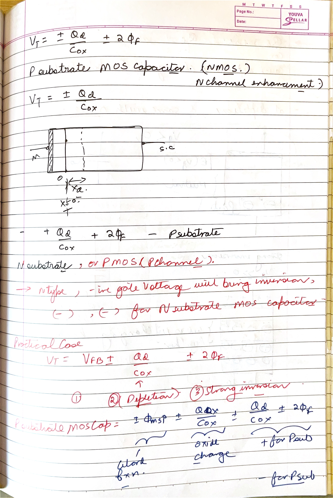

### What this page is doing

The page develops threshold as the gate voltage at strong inversion. For nMOS on a p-substrate, the threshold is typically positive and contains the flat-band term, $2\phi_F$, and a positive depletion-charge magnitude divided by oxide capacitance. For pMOS on an n-substrate the polarities reverse; its threshold is usually negative.

The oxide-voltage part follows directly from capacitor charge, while the $2\phi_F$ term is the semiconductor surface-potential requirement. This page is the bridge from MOS-capacitor electrostatics to a four-terminal transistor model.

### Clarity / correction / improvement

Threshold voltage is not simply the oxide drop and not simply $2\phi_F$. It is a terminal voltage containing work-function, fixed-charge, surface-potential, and depletion-charge effects; body bias later adds another shift.

### Active recall

Why does increasing $C'_{ox}$ reduce the depletion-charge contribution to threshold voltage?

## Page 09 - Depletion capacitance and sign discipline

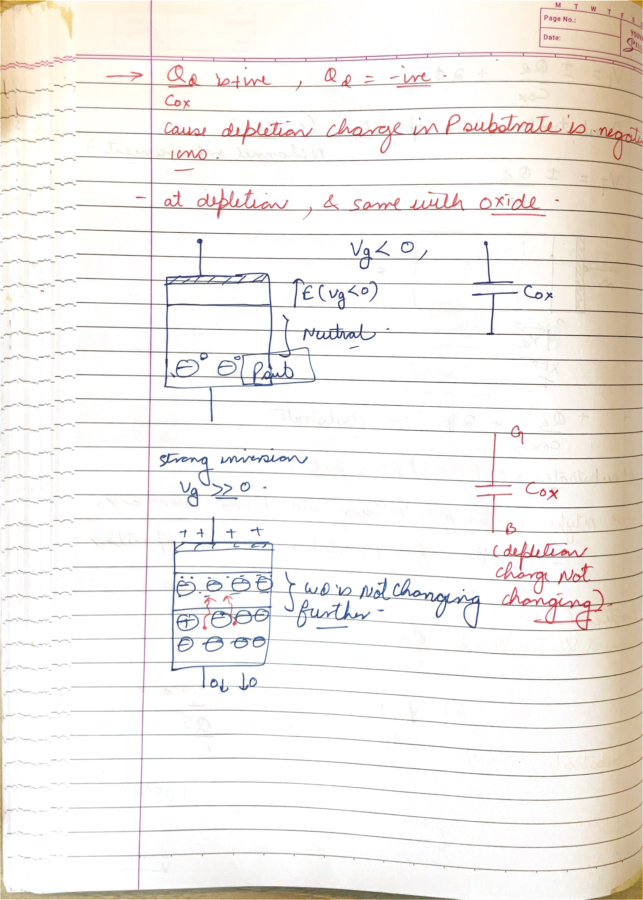

### What this page is doing

The page links the depletion region to an effective capacitance $C'_d=\varepsilon_{si}/W_d$. As depletion widens, $C'_d$ falls. From the gate, oxide capacitance and depletion capacitance appear in series, so the measured capacitance becomes smaller than $C'_{ox}$.

The charge drawings emphasize substrate-dependent sign: ionized acceptors in depleted p-type silicon give negative fixed charge, while ionized donors in depleted n-type silicon give positive fixed charge. The magnitude of the depletion width, not the charge sign, sets $C'_d$.

### Clarity / correction / improvement

Capacitance is positive in this small-signal model even when the underlying sheet charge is negative. Capacitance describes incremental charge magnitude per incremental voltage; do not give $C_d$ the sign of $Q_d$.

### Active recall

What happens to measured MOS capacitance as $W_d$ increases, and why?

## Page 10 - MOS C-V behavior and minimum capacitance

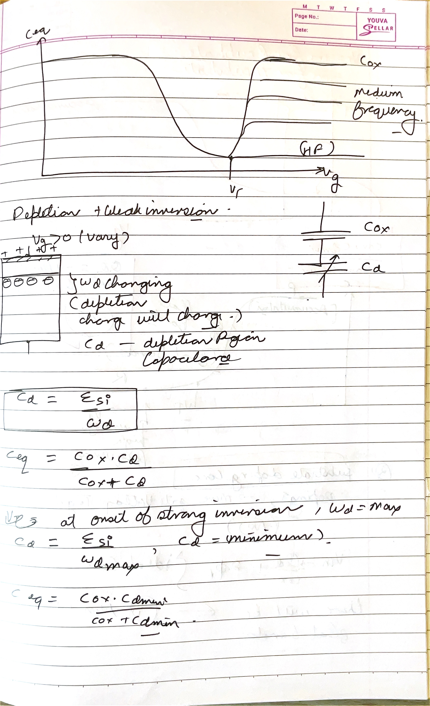

### What this page is doing

The C-V curve starts near $C'_{ox}$ in accumulation, drops as a depletion capacitance develops in series, and reaches $C'_{min}=C'_{ox}C'_{d,min}/(C'_{ox}+C'_{d,min})$ when depletion width is near its maximum. The page's sketches connect this curve to accumulation, depletion, and inversion charge distributions.

In high-frequency inversion, minority carriers cannot follow the small AC signal, so the measured capacitance stays near $C'_{min}$. In low-frequency or quasi-static measurement, inversion charge can respond and capacitance rises again toward $C'_{ox}$.

### Clarity / correction / improvement

Always label the C-V frequency regime. Without “high frequency” or “low frequency,” the inversion end of the curve is ambiguous and two apparently contradictory plots can both be correct.

### Active recall

Why does high-frequency inversion capacitance remain low even though a conducting inversion layer exists in DC?

## Page 11 - Threshold shift and substrate doping

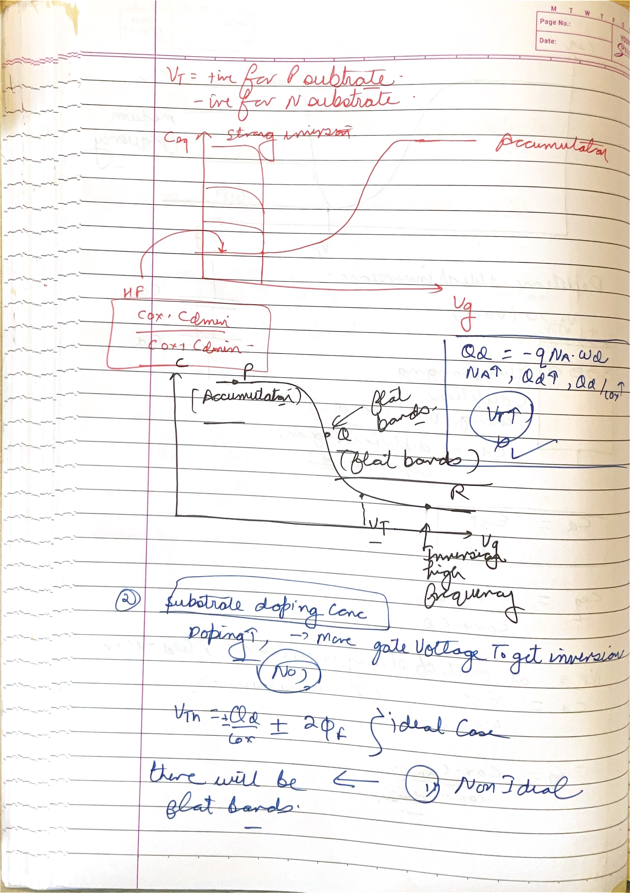

### What this page is doing

The red C-V sketches compare how process parameters move the curve. Increasing p-substrate doping raises $\phi_F$ and increases the maximum depletion-charge magnitude, so an nMOS generally requires a larger positive threshold voltage. Oxide charge mainly shifts the curve horizontally, while oxide thickness also changes its vertical capacitance scale.

The boxed threshold expression separates those effects. This is useful diagnostically: a parallel horizontal shift suggests a voltage offset; a different accumulation capacitance indicates changed $C_{ox}$; a changed depletion shape can indicate doping or interface-state effects.

### Clarity / correction / improvement

The note about doping should include both mechanisms: $\phi_F$ rises logarithmically with $N_A$, while $|Q_{d,max}|$ rises roughly as $\sqrt{N_A\phi_F}$. Threshold does not change only because “more charge exists.”

### Active recall

Which parts of $V_T$ change when substrate doping increases, and which part is unaffected in an ideal process?

## Page 12 - Series dielectrics and equivalent capacitance

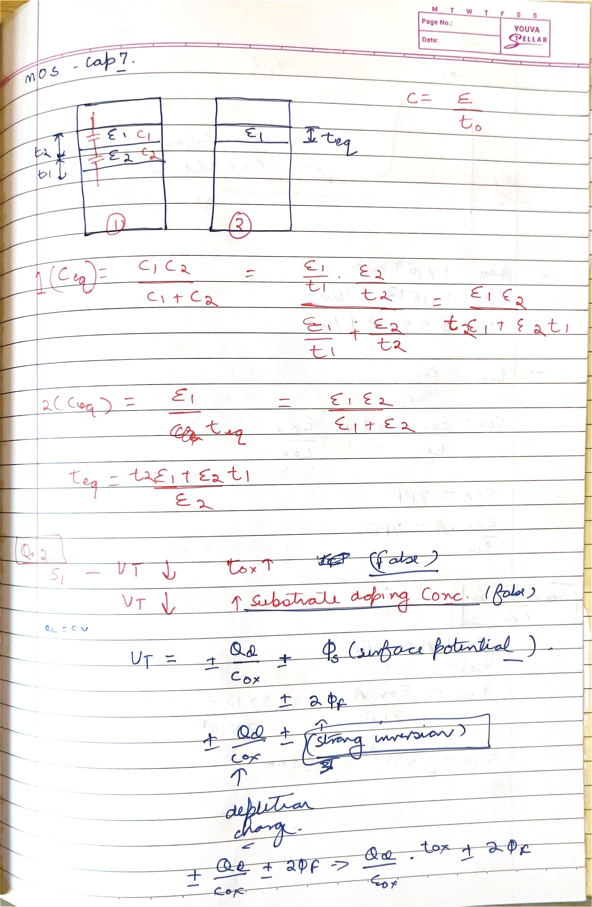

### What this page is doing

This page returns to $C=\varepsilon A/t$ and derives the series equivalent of oxide and depleted silicon. For equal area, inverse capacitances add, which is equivalent to adding dielectric thicknesses weighted by inverse permittivity.

The threshold expression beneath the capacitor algebra again shows that depletion charge creates an oxide drop. The circuit abstraction and the physical stack are the same model at two levels: oxide is a geometric capacitor; depleted silicon is a voltage-dependent capacitor because $W_d$ changes with bias.

### Clarity / correction / improvement

The depletion capacitance is not a literal deposited dielectric layer. It is an incremental representation of how space charge changes with surface potential, so it varies with bias.

### Active recall

Why is $C_d$ voltage-dependent while $C_{ox}$ is approximately constant?

## Page 13 - Calculating oxide capacitance from geometry

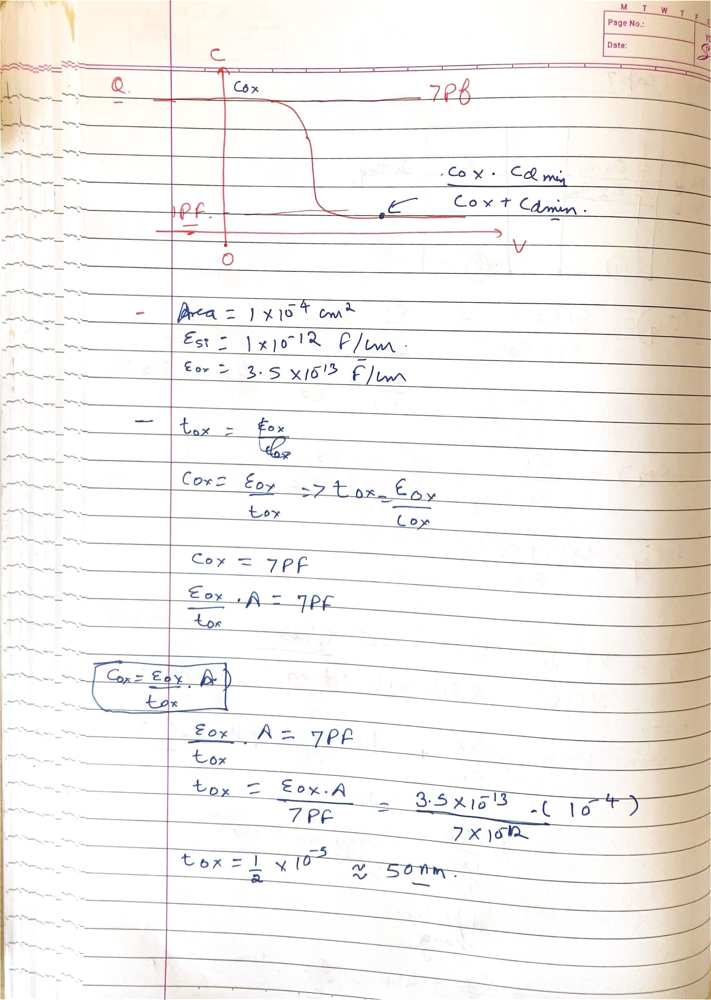

### What this page is doing

The numerical example calculates $C_{ox}=\varepsilon_{ox}A/t_{ox}$ and then rearranges the same relation to recover oxide thickness. The value is checked against nanometer-scale dimensions. This is a straightforward page, but it establishes the scale that converts charge into threshold-voltage shift.

The proportionalities are the main revision target: larger area raises total capacitance; thicker oxide lowers capacitance; larger dielectric permittivity raises capacitance. Per-unit-area capacitance removes the device area and is usually cleaner for device equations.

### Clarity / correction / improvement

Keep area in m2 and thickness in m when using $\varepsilon$ in F/m. A nanometer-to-meter mistake changes the answer by $10^9$, so write the conversion before arithmetic.

### Active recall

If oxide thickness is halved at fixed area, what happens to total oxide capacitance and to $Q/C_{ox}$?

## Page 14 - Minimum C-V capacitance and added oxide charge

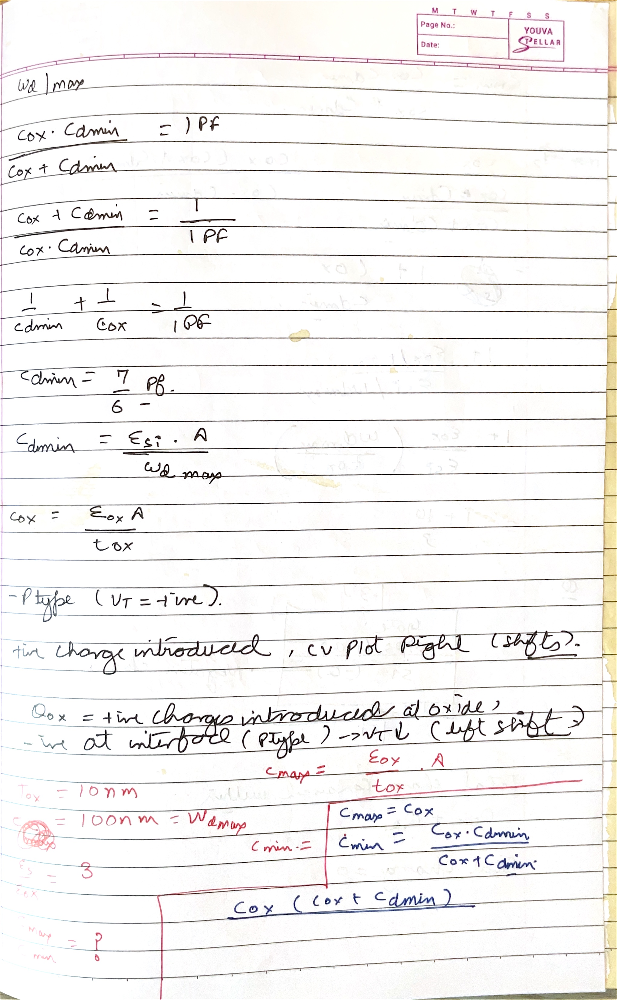

### What this page is doing

The upper algebra uses the minimum measured capacitance to infer the maximum depletion capacitance or width. The lower sketch introduces positive oxide charge and shows that charge neutrality requires compensating gate and semiconductor charge.

An oxide-charge sheet changes the voltage at which a given semiconductor state occurs. Ideally it produces a horizontal C-V shift by $-Q_{ox}/C_{ox}$. If the charge is mobile or interface traps respond, the curve may also stretch, distort, or show hysteresis rather than shift rigidly.

### Clarity / correction / improvement

The written `Qox = +1 nC` should be converted to charge density before using a per-area capacitance. The physical location of oxide charge also matters for exact voltage coupling.

### Active recall

How can a measured C-V curve distinguish changed oxide thickness from a fixed-charge voltage shift?

## Page 15 - Solving the minimum-capacitance relation

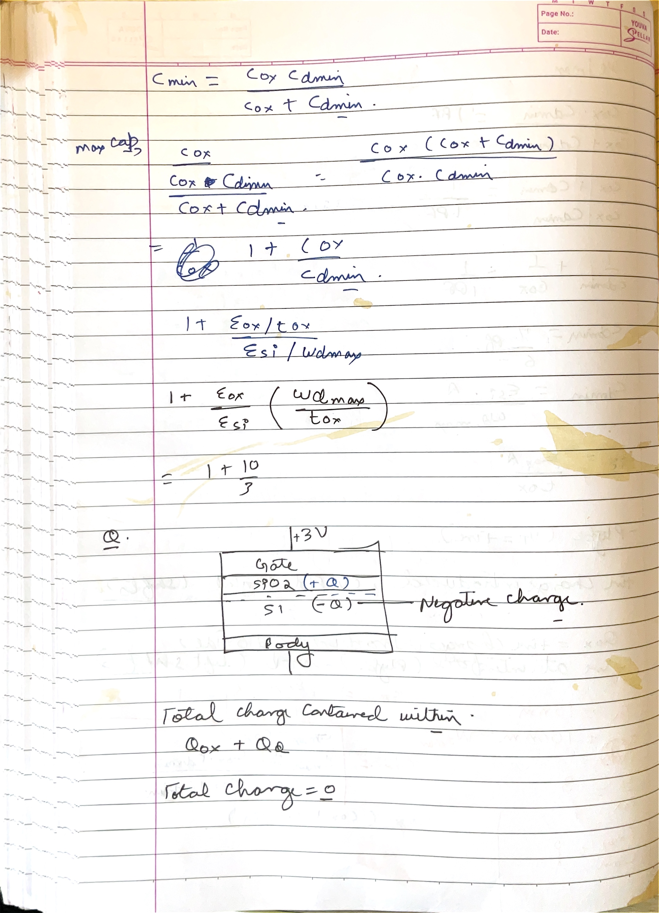

### What this page is doing

The page manipulates $C_{min}=C_{ox}C_{d,min}/(C_{ox}+C_{d,min})$ to solve for the unknown depletion capacitance, then relates that capacitance to $W_{d,max}$. This turns a terminal measurement into an estimate of a hidden semiconductor length scale.

The lower charge box enforces overall neutrality: ideal external fields vanish far from the structure, so total gate, oxide, depletion, and inversion charge must sum to zero with signs included.

### Clarity / correction / improvement

When using total charge, use total capacitances; when using C/m2, use capacitance per unit area. The series formula has the same algebra in either case, but a mixed calculation silently introduces area errors.

### Active recall

Given $C_{min}$ and $C_{ox}$, how would you extract $W_{d,max}$ without directly measuring depth?

## Page 16 - Threshold-voltage numerical problem

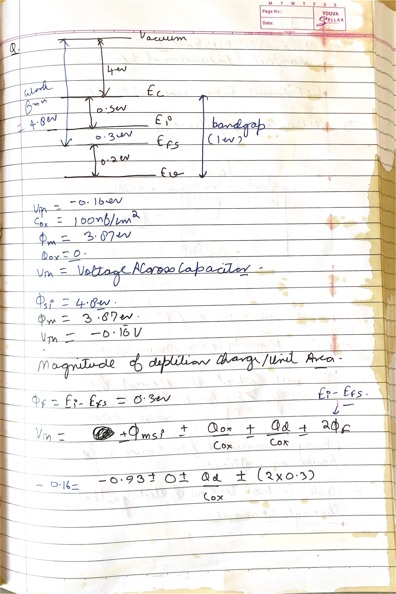

### What this page is doing

The page gathers vacuum-referenced work functions, silicon electron affinity, band gap, doping, oxide thickness, and oxide charge to calculate threshold. The robust sequence is: find $\phi_F$; construct $\Phi_s$; calculate $\Phi_{ms}$ and $V_{FB}$; calculate $C'_{ox}$; calculate $|Q_{d,max}|$; then add $2\phi_F$ and the oxide drop with the correct sign.

This page tests almost every concept from the first two modules. A wrong result is best debugged by checking the band-location/sign logic before checking multiplication.

### Clarity / correction / improvement

The handwritten sign chain is difficult to audit. Rewrite each intermediate quantity with units and a one-word meaning: `work function`, `flat band`, `surface bend`, `depletion drop`. That makes accidental double-negation visible.

### Active recall

Which intermediate value would you inspect first if the calculated nMOS threshold came out strongly negative for an ordinary p-substrate device?

## Page 17 - Enhancement MOSFET anatomy

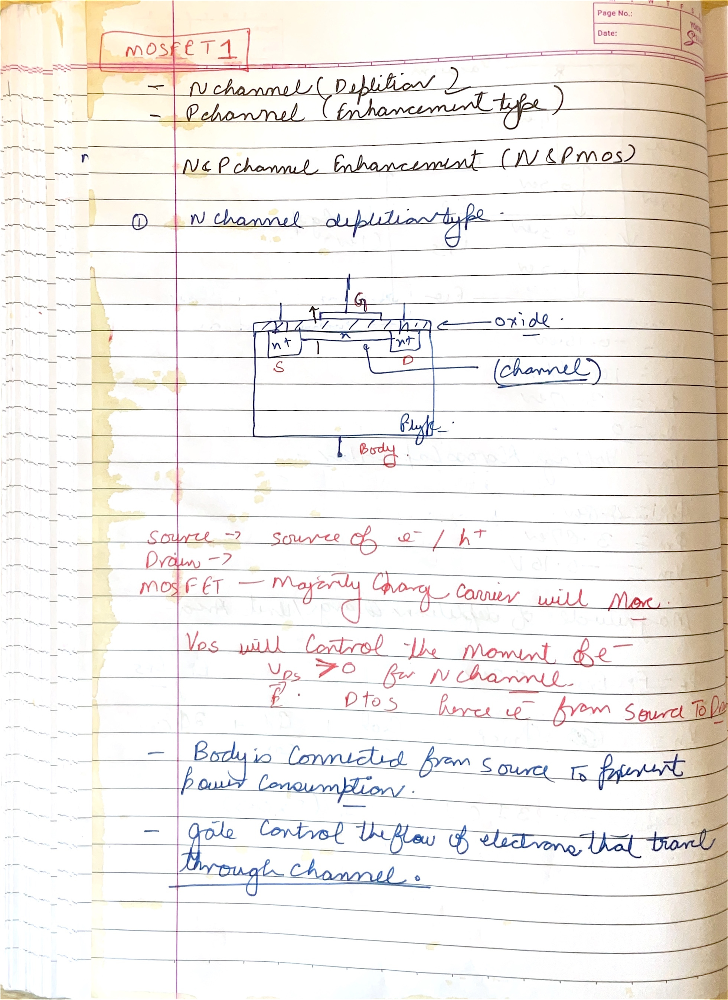

### What this page is doing

The rotated source page introduces the four terminals: gate, source, drain, and body. In an n-channel enhancement MOSFET, n+ source/drain regions sit in a p-type body, but no n-type surface channel exists at $V_{GS}=0$. A sufficiently positive gate creates the inversion channel that joins source to drain.

Source and drain provide electrons to the channel; the gate controls their surface density electrostatically. The body is commonly tied to the lowest circuit potential for nMOS so the source/body and drain/body junctions remain reverse biased and body effect is controlled.

### Clarity / correction / improvement

The heading line appears to mix “n-channel depletion” and “p-channel enhancement”; the actual cross-section drawn is an n-channel enhancement device. Source and drain are geometrically similar, but the lower-potential terminal is treated as source in normal nMOS operation.

### Active recall

Why are n+ source and drain not already shorted through the p-type body at $V_{GS}=0$?

## Page 18 - Channel potential and reverse-biased body junctions

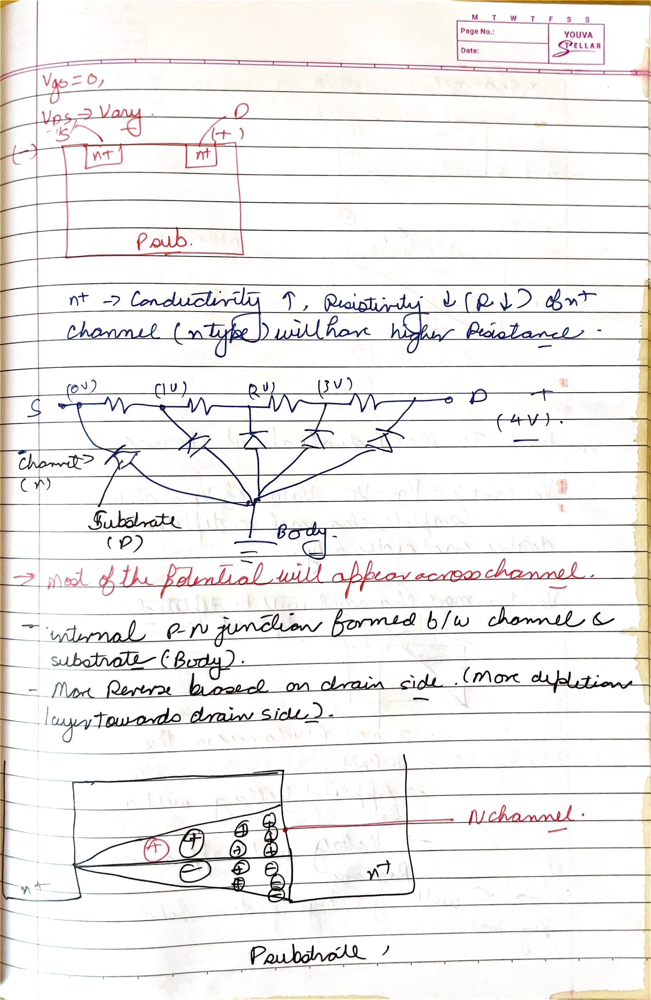

### What this page is doing

With $V_{GS}$ high enough to form a channel, the channel is not equipotential once $V_{DS}>0$. Its local voltage rises from approximately 0 at the source to $V_{DS}$ at the drain. Therefore the local gate-to-channel overdrive $V_{GS}-V(x)-V_T$ becomes smaller toward the drain, so inversion charge tapers.

The p-body/n-channel junction is also more reverse biased near the drain because the channel/drain potential is higher while body voltage remains fixed. That widens the local depletion region and contributes to the wedge-shaped channel picture.

### Question / TODO acknowledged

The handwriting asks why “more reverse bias” appears on the drain side. The local n-region potential is most positive near the drain, while the p-body stays near ground. This increases $V_n-V_p$, the reverse-bias magnitude of that p-n junction, so its depletion width grows toward the drain.

### Clarity / correction / improvement

Higher n+ doping lowers bulk resistivity, but the channel resistance is mainly controlled by inversion charge and geometry, not by the source/drain doping alone.

### Active recall

Why does inversion charge decrease along the channel even when the physical gate voltage is constant everywhere?

## Page 19 - Applying drain voltage to a formed channel

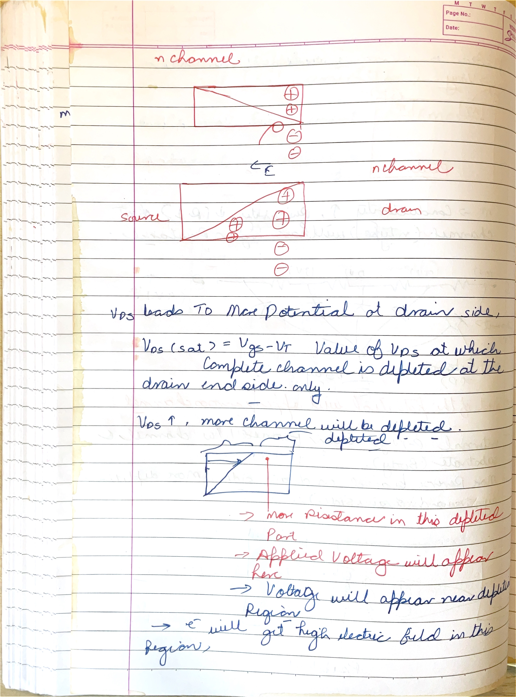

### What this page is doing

The page shows source and drain creating a lateral electric field after the gate has created an inversion layer. Electrons drift from source toward drain, while conventional drain current is defined from drain toward source. For small $V_{DS}$, the channel exists along its full length and behaves approximately like a voltage-controlled resistor.

As $V_{DS}$ grows, local overdrive at the drain is $V_{GD}-V_T=V_{GS}-V_{DS}-V_T$. When this reaches zero, inversion charge at the drain end vanishes and pinch-off begins.

### Clarity / correction / improvement

Keep electron motion and conventional current arrows distinct. Saying “current moves from source to drain” is ambiguous unless the carrier or current convention is named.

### Active recall

Write the local inversion overdrive at channel position $x$, then state where it is smallest.

## Page 20 - Output characteristics and operating regions

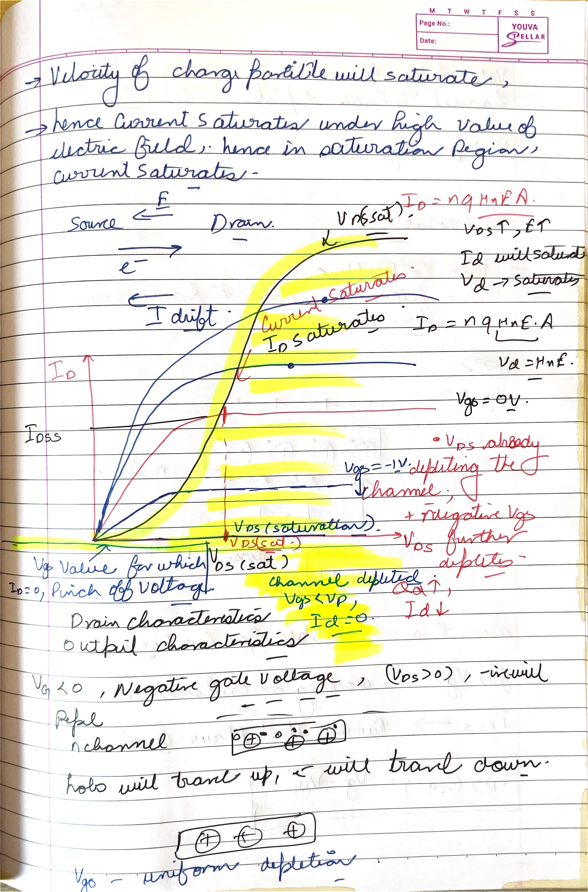

### What this page is doing

The family of $I_D-V_{DS}$ curves is parameterized by $V_{GS}$. Below threshold, ideal long-channel current is treated as zero. Above threshold and for $0<V_{DS}<V_{GS}-V_T$, the device is in triode/linear region. When $V_{DS}\ge V_{GS}-V_T$, the drain end pinches off and the ideal long-channel model enters saturation.

Increasing $V_{GS}$ raises inversion charge, so it raises both the small-$V_{DS}$ slope and saturation current. The boundary points trace the saturation locus $V_{DS,sat}=V_{GS}-V_T$.

### Clarity / correction / improvement

The note suggests current saturates because carrier velocity saturates. That is not the mechanism of the square-law long-channel model shown here. Its saturation comes from channel pinch-off and redistribution of additional $V_{DS}$ across the pinch-off region. Velocity saturation is a separate short-channel/high-field effect.

### Active recall

What two different physical mechanisms can cause current saturation, and which one belongs to the equations on this page?

## Page 21 - Pinch-off and the saturation voltage

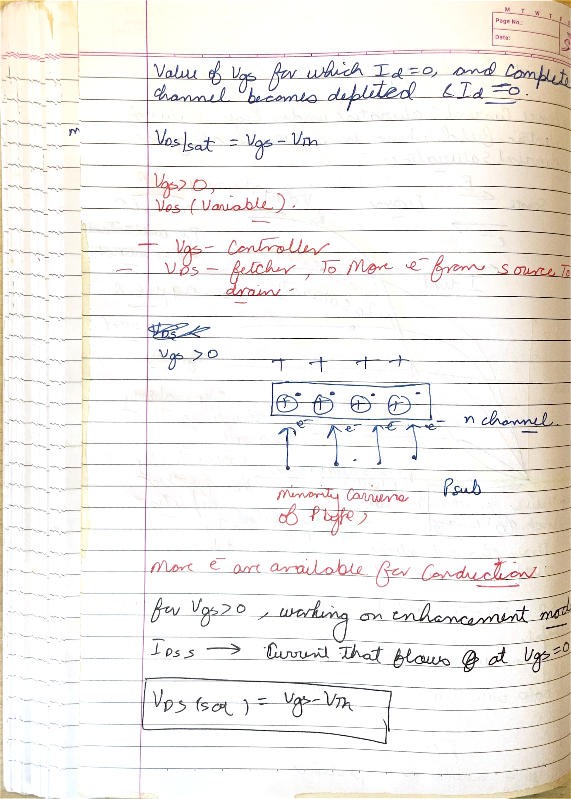

### What this page is doing

The page defines $V_{DS,sat}=V_{GS}-V_T$, the drain voltage at which the drain-end channel charge reaches zero. Pinch-off does not sever current. Electrons arriving at the end of the inversion channel are swept through the short high-field depletion region into the drain.

For a fixed $V_{GS}$, additional $V_{DS}$ mainly extends the pinch-off region rather than substantially increasing channel charge, so the ideal current becomes nearly constant. This is the basis for treating a saturated MOSFET as a voltage-controlled current source.

### Clarity / correction / improvement

The channel is depleted only near the drain at pinch-off, not along its entire length. Also distinguish `saturation` in a MOSFET from `saturation` in a BJT; the region meanings are not analogous.

### Active recall

Why can drain current continue after the inversion charge reaches zero exactly at the drain-end boundary?

## Page 22 - Depletion-mode nMOS operation

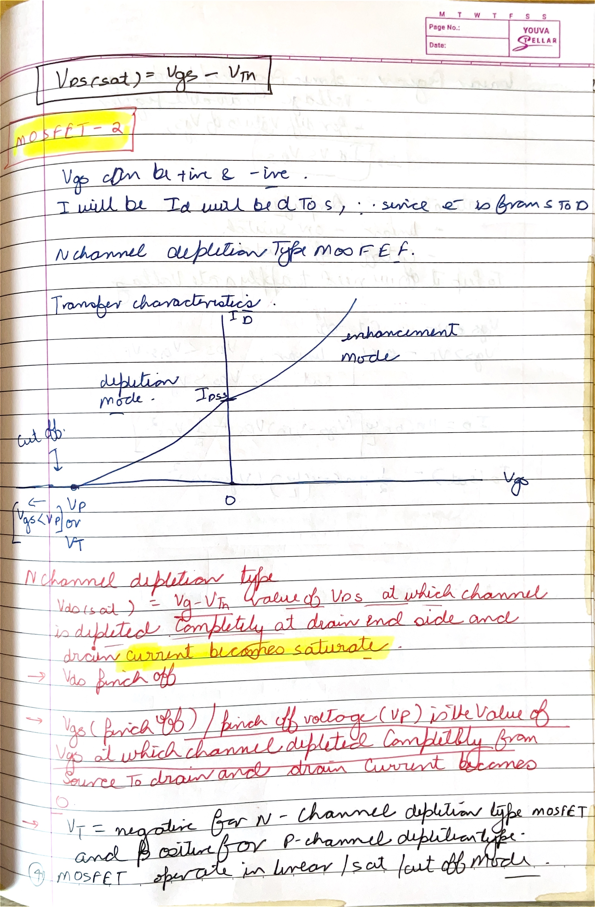

### What this page is doing

The transfer curve introduces an n-channel depletion MOSFET, which has a fabricated channel at $V_{GS}=0$ and therefore conducts $I_{DSS}$. A negative gate voltage depletes electrons and can turn it off at a negative threshold; positive gate voltage enhances the existing channel and raises current.

The page contrasts this with enhancement nMOS, whose threshold is positive and whose channel must be induced. Both use the same region equations if the signed threshold is inserted consistently.

### Clarity / correction / improvement

“Depletion type” describes the zero-bias channel and threshold sign, not the triode-region depletion zone at the drain. Avoid using the same word for those unrelated ideas without context.

### Active recall

How can the same nMOS current equation describe both enhancement and depletion devices?

## Page 23 - Long-channel current equations

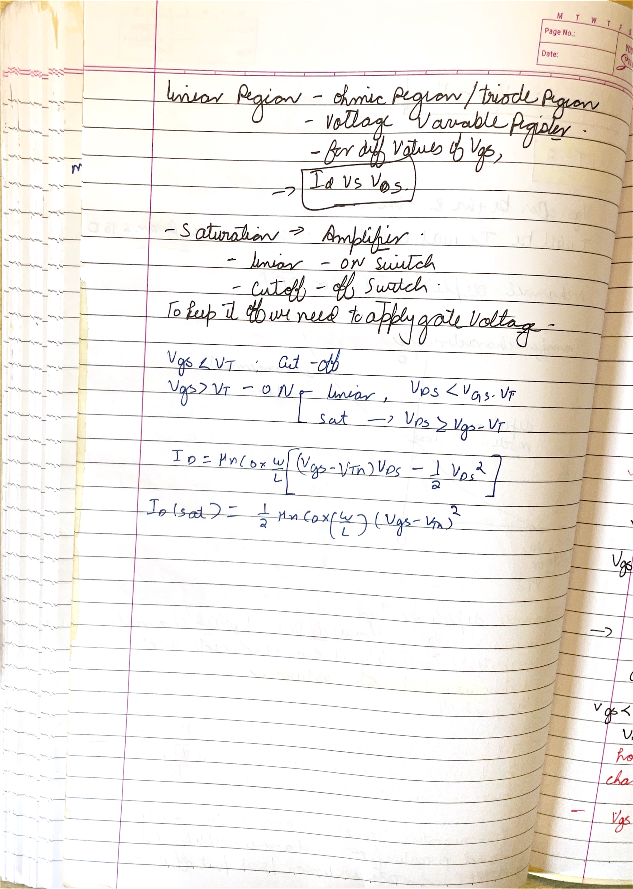

### What this page is doing

The page records the piecewise square-law model. With $k'_n=\mu_nC'_{ox}$ and $\beta_n=k'_nW/L$:

- Cutoff: $I_D\approx0$ for $V_{GS}\le V_T$.
- Triode: $I_D=\beta_n[(V_{GS}-V_T)V_{DS}-V_{DS}^2/2]$ for $0\le V_{DS}<V_{GS}-V_T$.
- Saturation: $I_D=(\beta_n/2)(V_{GS}-V_T)^2$ for $V_{DS}\ge V_{GS}-V_T$, initially neglecting channel-length modulation.

The “linear” name refers to the nearly linear small-$V_{DS}$ behavior, not to the full equation, which contains a quadratic term.

### Clarity / correction / improvement

Use one definition of the process/device parameter. Some notes absorb the factor $1/2$ into $k_n$; others do not. State $\beta_n=\mu_nC'_{ox}W/L$ before comparing equations.

### Active recall

Derive the saturation equation by substituting $V_{DS}=V_{GS}-V_T$ into the triode equation.

## Page 24 - p-channel depletion MOSFET and sign symmetry

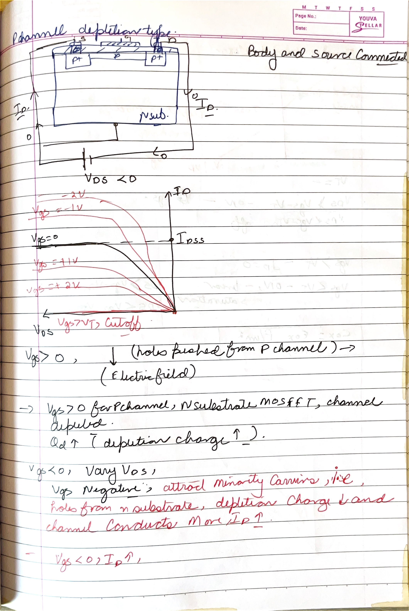

### What this page is doing

The page mirrors depletion-mode behavior for pMOS. A p-channel exists at zero gate bias, and gate polarity controls whether that hole channel is depleted or enhanced. The current and voltage curves occupy reversed quadrants if signed $V_{SG}$, $V_{SD}$, and $I_D$ conventions are used.

The most reliable method is to write pMOS equations in positive magnitudes using $V_{SG}$, $V_{SD}$, and $|V_{Tp}|$, then attach the chosen conventional-current sign at the end. Region boundaries become $V_{SD}=V_{SG}-|V_{Tp}|$.

### Clarity / correction / improvement

The page mixes signed and magnitude labels. That is common but dangerous. Choose either all signed terminal voltages or all pMOS magnitudes for one derivation; do not switch midway.

### Active recall

Rewrite the nMOS triode/saturation inequalities for pMOS using only $V_{SG}$, $V_{SD}$, and $|V_{Tp}|$.

## Module checkpoint

You are ready for Module 3 when you can move in both directions through this chain:

`process/work-function/oxide charge <-> VFB <-> VT <-> inversion charge <-> MOSFET region and current equation`
