# 03 - MOSFET Models and CMOS Inverter

[Back to MOSFET and CMOS](../README.md) | [Previous module](../02%20Non-Ideal%20MOS%20and%20MOSFET%20Regions/README.md) | [Untouched source PDF](../sources/mos3.pdf)

This module refines the ideal MOSFET into a usable circuit model: transfer curves, on-resistance, transconductance, channel-length modulation, parasitic capacitances, pMOS symmetry, and the CMOS inverter switching point.

## Page map

| Page | Revision focus | Page | Revision focus |
|---:|---|---:|---|
| [1](#page-01) | pMOS transfer curve | [13](#page-13) | Output resistance |
| [2](#page-02) | MOSFET symbols | [14](#page-14) | Small-signal current-source model |
| [3](#page-03) | nMOS enhancement device | [15](#page-15) | Gate overlap/intrinsic capacitance |
| [4](#page-04) | nMOS piecewise model | [16](#page-16) | Body-junction capacitance |
| [5](#page-05) | Deep-triode resistance | [17](#page-17) | pMOS enhancement curves |
| [6](#page-06) | Transconductance | [18](#page-18) | pMOS symbols and signs |
| [7](#page-07) | Channel-length modulation | [19](#page-19) | MOSFET as amplifier |
| [8](#page-08) | Effective channel length | [20](#page-20) | pMOS region equations |
| [9](#page-09) | Lambda model | [21](#page-21) | CMOS inverter current balance |
| [10](#page-10) | Early voltage | [22](#page-22) | Switching-point derivation |
| [11](#page-11) | Current increase from shortening | [23](#page-23) | General and symmetric $V_M$ |
| [12](#page-12) | Non-ideal saturation slope | [24](#page-24) | Inverter numerical/VTC check |

## Page 01 - pMOS transfer characteristics

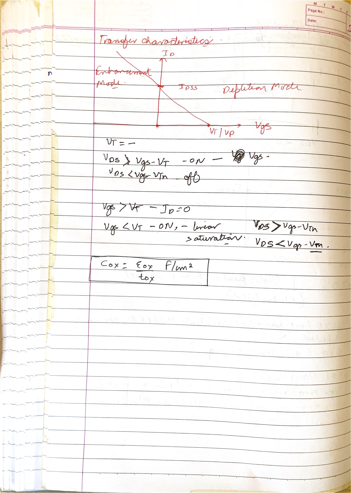

### What this page is doing

The transfer plot places enhancement- and depletion-mode pMOS behavior on a signed $I_D-V_{GS}$ axis. An enhancement pMOS is normally off at $V_{GS}=0$ and turns on when the gate becomes sufficiently negative relative to the source. A depletion pMOS has a pre-existing channel and can conduct at zero gate bias.

Using magnitudes avoids quadrant confusion: enhancement pMOS turns on when $V_{SG}>|V_{Tp}|$, and its long-channel saturation-current magnitude is $|I_D|$ $=(\beta_p/2)(V_{SG}-|V_{Tp}|)^2$. The curve's intercept is threshold; its curvature reflects the square law.

The horizontal-axis crossing identifies which device is present. For enhancement pMOS, the current remains zero until the gate is negative enough relative to the source to exceed the threshold magnitude. For depletion pMOS, the curve already has a nonzero intercept at zero gate bias because the channel exists before bias is applied. Reading the plotted quadrant and the stated current convention together prevents a magnitude curve from being mistaken for signed current.

### Clarity / correction / improvement

Specify whether plotted $I_D$ is signed or magnitude. A positive-looking current curve drawn against negative $V_{GS}$ is often a magnitude plot, not the passive-sign-convention current.

### Active recall

How do the zero-gate-current states of enhancement and depletion pMOS differ?

## Page 02 - Reading MOSFET symbols

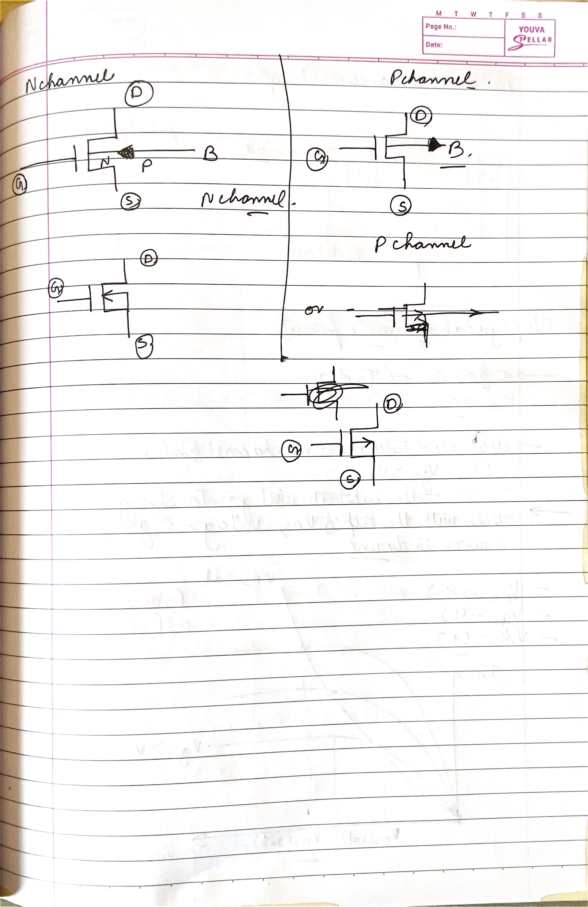

### What this page is doing

The page collects n-channel and p-channel symbols in enhancement and depletion forms. A broken/absent channel line conventionally indicates enhancement mode; a solid channel line indicates depletion mode. A gate bubble often marks pMOS in digital schematics because it turns on with a low gate relative to its source.

Body-arrow conventions vary between textbooks and integrated-circuit symbols. The invariant physical fact is the body/source junction type: p-body for nMOS, n-body for pMOS. The arrow identifies the p-to-n junction direction, not normal channel-current direction.

Decode each symbol in a fixed order. First use the channel line to identify enhancement or depletion mode. Next use the bubble or body-arrow convention to identify n-channel or p-channel polarity. Finally inspect the circuit voltages to decide which diffusion terminal acts as source. This order keeps three separate facts—channel at zero bias, carrier type, and operating terminal orientation—from being inferred from one mark.

### Clarity / correction / improvement

Do not identify source and drain solely from the drawn symbol when the body is not tied internally; MOSFET geometry can be nearly symmetric. Circuit potentials and body connection determine which terminal acts as source.

### Active recall

What symbol feature distinguishes enhancement from depletion mode, and what feature commonly distinguishes pMOS from nMOS?

## Page 03 - nMOS enhancement operation and output curves

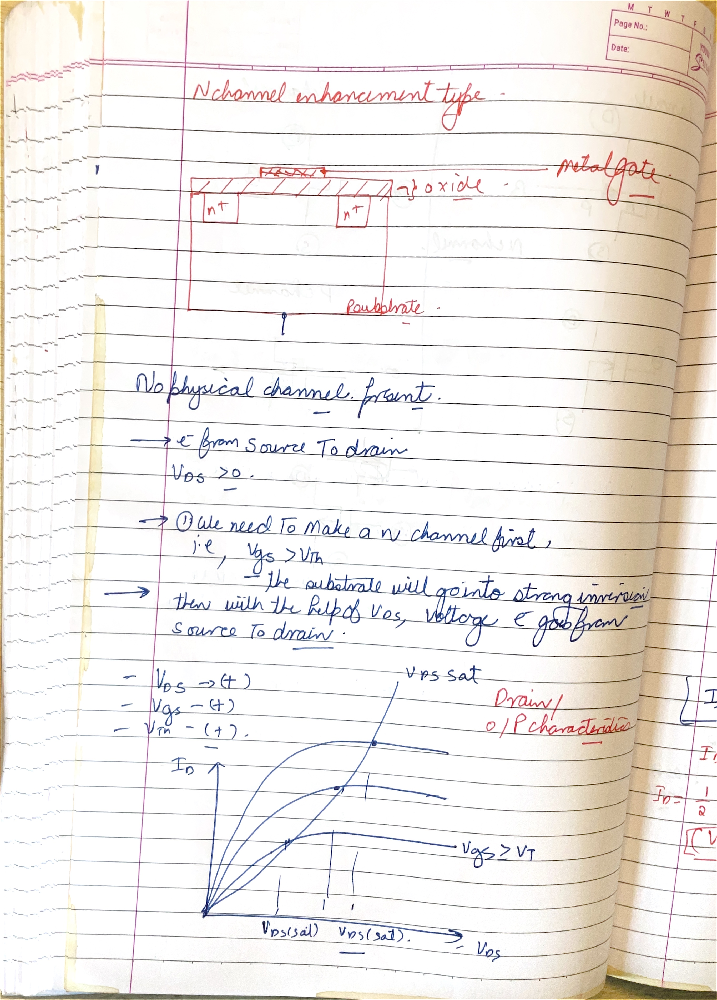

### What this page is doing

The cross-section shows an nMOS enhancement device: n+ source/drain in p-type body, insulated gate, and no channel until $V_{GS}>V_T$. The output family then shows drain current versus drain voltage for increasing gate voltage. Higher gate overdrive creates more inversion charge and therefore more current.

The output curves naturally split into cutoff, linear, and saturation regions. The boundary rises with gate voltage because $V_{DS,sat}=V_{GS}-V_T=V_{OV}$. The gate sets channel charge; the drain voltage sets the lateral field and how nonuniform the channel becomes.

The cross-section and curve family describe the same device at two levels. Once $V_{GS}$ creates the surface inversion layer, a small $V_{DS}$ drives carriers through a continuous channel and gives the steep initial slope. Raising $V_{DS}$ reduces drain-end inversion charge until the knee is reached. Raising $V_{GS}$ strengthens the entire inversion sheet, which is why the next curve has both a larger slope and a higher knee current.

### Clarity / correction / improvement

The word “strong inversion” should be attached to $V_{GS}>V_T$; merely applying a positive voltage is not enough if flat-band and depletion requirements have not been met.

### Active recall

Why do both the linear-region slope and the saturation current increase with $V_{GS}$?

## Page 04 - Piecewise long-channel nMOS model

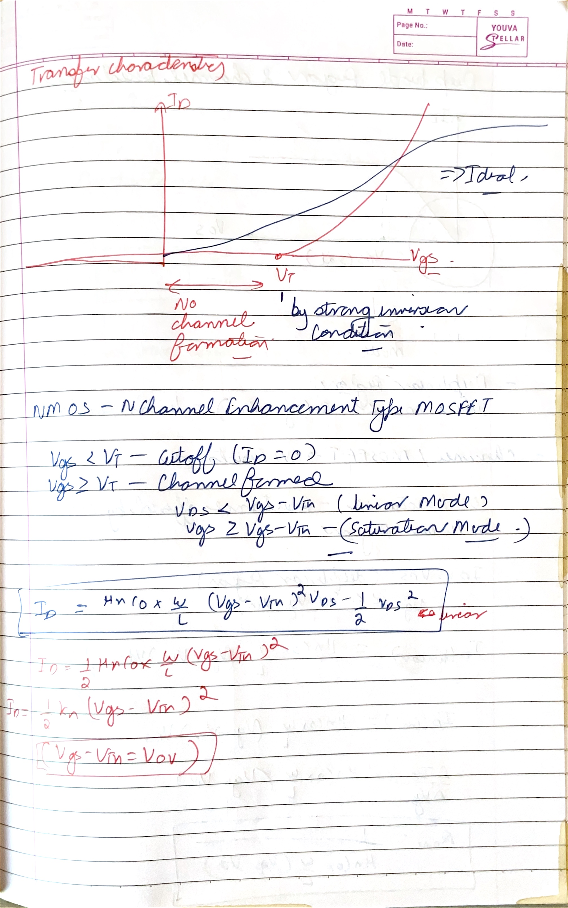

### What this page is doing

The page writes the large-signal current law by region. In cutoff, $V_{GS}<V_T$ and ideal current is zero. In linear region, $V_{GS}>V_T$ and $0\le V_{DS}<V_{OV}$, giving $I_D=\beta_n(V_{OV}V_{DS}-V_{DS}^2/2)$. In saturation, $V_{DS}\ge V_{OV}$, giving $I_D=(\beta_n/2)V_{OV}^2$ before channel-length modulation.

The transfer curve is obtained by holding the device in saturation and sweeping $V_{GS}$. Its square-law shape is why transconductance depends on bias rather than remaining constant.

The piecewise equations meet at the boundaries drawn on the page. Setting $V_{DS}=V_{OV}$ in the linear expression produces the saturation current, so there is no current jump at pinch-off. Setting $V_{OV}=0$ makes the ideal strong-inversion current vanish at threshold. These substitutions connect the algebra to the smooth output and transfer curves rather than treating the three formulas as independent rules.

### Clarity / correction / improvement

Real subthreshold current is not exactly zero below $V_T$. The page uses the strong-inversion square-law approximation; label it as such when applying it to modern or low-power devices.

### Active recall

Which inequality selects the region: a comparison between $V_{DS}$ and what gate-dependent voltage?

## Page 05 - Deep-triode channel resistance

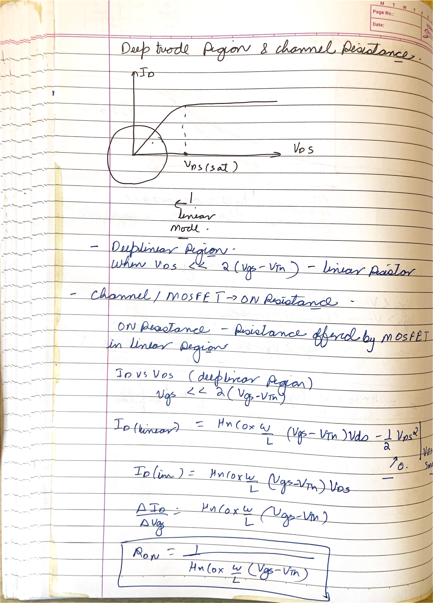

### What this page is doing

For $V_{DS}\ll V_{OV}$, the quadratic $V_{DS}^2/2$ term is small, so $I_D\approx\beta_nV_{OV}V_{DS}$. The MOSFET then behaves approximately as a resistor with

$$
R_{on}\approx\frac{1}{\beta_n(V_{GS}-V_T)}.
$$
This is a voltage-controlled resistance: increasing gate overdrive or $W/L$, mobility, or oxide capacitance reduces $R_{on}$. The approximation is local because channel charge still changes slightly along the device as $V_{DS}$ grows.

The page obtains the resistor form from the slope near the origin of an output curve. In that small-$V_{DS}$ interval, $I_D$ is approximately proportional to $V_{DS}$, so the reciprocal slope is $R_{on}$. The gate voltage changes that slope by changing inversion charge, which is why this is an electrically controlled resistor rather than a fixed material resistance.

### Clarity / correction / improvement

The page calls the region “deep triode,” which is appropriate only when $V_{DS}$ is much smaller than overdrive. Near the triode-saturation boundary, use the full quadratic equation rather than a constant resistor.

### Active recall

Which four device/bias quantities can be changed to lower the ideal long-channel $R_{on}$?

## Page 06 - Transconductance as gate control of current

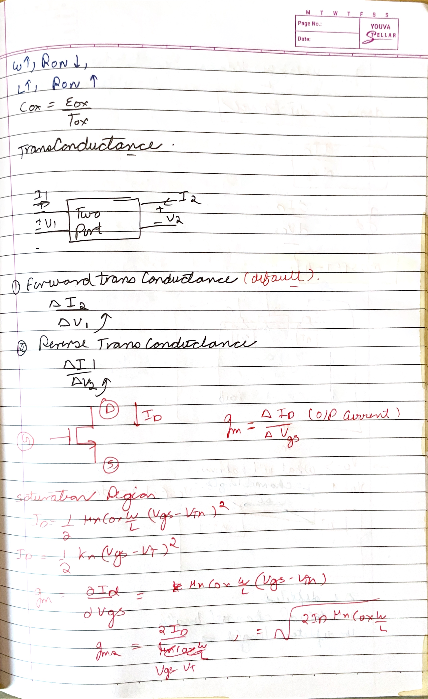

### What this page is doing

The page defines forward transconductance $g_m=\partial I_D/\partial V_{GS}$ at fixed $V_{DS}$. In ideal saturation,

$$
g_m=\beta_n(V_{GS}-V_T)=\frac{2I_D}{V_{OV}}=\sqrt{2\beta_nI_D}.
$$
These equivalent forms answer different design questions: the first emphasizes gate overdrive, the second relates gain efficiency to current, and the third shows how device strength and bias current set $g_m$.

Graphically, $g_m$ is the tangent slope of the saturation transfer curve at the chosen bias point. Because the curve is quadratic, two devices on the same curve can have different $g_m$. The derivative is a small-signal statement: it predicts the incremental current change $\Delta I_D\approx g_m\Delta V_{GS}$ only for a sufficiently small movement around that operating point.

### Clarity / correction / improvement

The derivative must state what is held constant and which operating region is assumed. In triode, $g_m=\beta_nV_{DS}$, not the saturation expression above.

### Active recall

At fixed drain current, what happens to $g_m$ if $W/L$ is increased?

## Page 07 - Why ideal saturation still has a slope

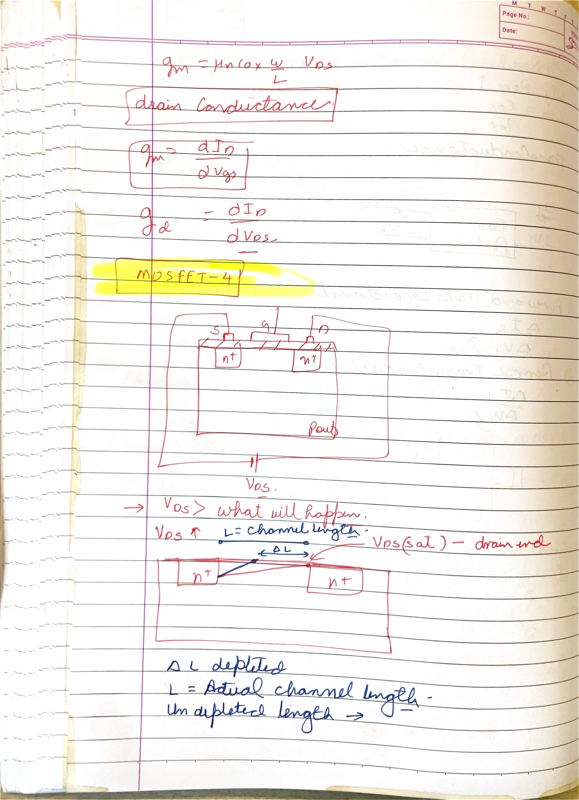

### What this page is doing

The page begins channel-length modulation. Once pinch-off occurs, raising $V_{DS}$ widens the drain depletion/pinch-off region into the channel. The effective inversion-channel length becomes $L_{eff}=L-\Delta L$. Since current strength is proportional to $W/L_{eff}$, drain current rises slightly with drain voltage instead of remaining perfectly flat.

This is the MOSFET analogue of finite output resistance: a saturated transistor is a good current source, but not an ideal one.

The channel sketch should be read from source to drain. The source-end overdrive and injected charge remain primarily set by $V_{GS}$, while the drain-side depletion boundary moves slightly toward the source as $V_{DS}$ increases. That movement reduces the length over which the gradual channel voltage falls, so the same gate-controlled channel behaves as though its $W/L$ strength has increased.

### Question / TODO acknowledged

The sketch asks whether the extra drain voltage “reflects” or returns through the channel. It does not. Most incremental $V_{DS}$ appears across the enlarged high-field pinch-off/depletion region; the inversion boundary moves toward the source and current increases because the effective channel shortens.

### Clarity / correction / improvement

Channel-length modulation and velocity saturation are distinct. This page models geometric shortening after pinch-off, not a limit on carrier drift velocity.

### Active recall

How can $I_D$ rise in saturation if the inversion charge at the drain-end pinch-off point remains approximately zero?

## Page 08 - Effective length and the small-λ approximation

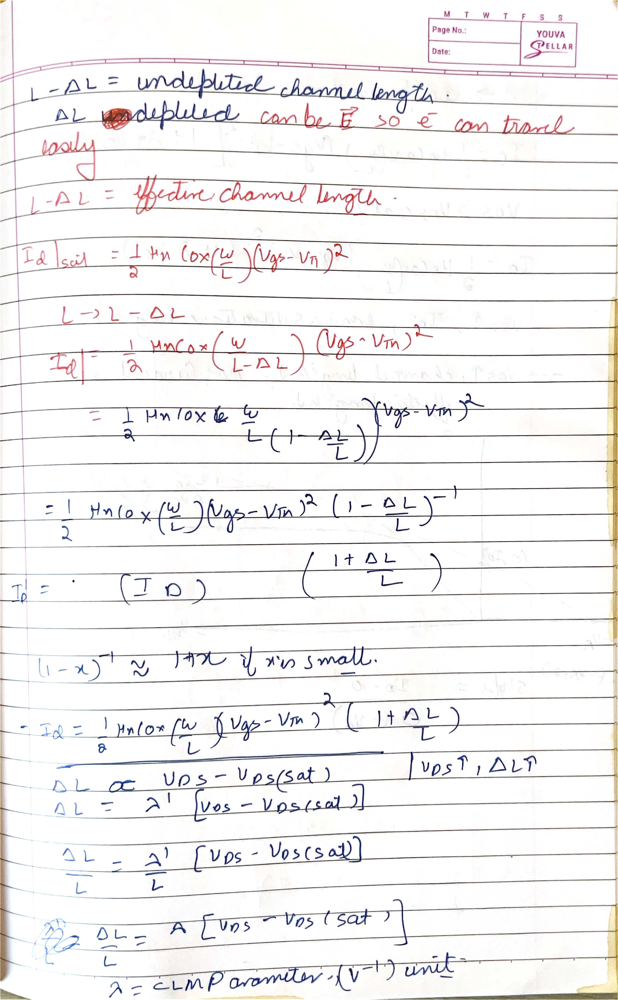

### What this page is doing

The derivation replaces $L$ by $L-\Delta L$:

$$
I_D=\frac12\mu_nC'_{ox}\frac{W}{L-\Delta L}V_{OV}^2.
$$
For $\Delta L/L\ll1$, $1/(1-\Delta L/L)\approx1+\Delta L/L$. If channel shortening grows approximately with excess drain voltage, the result becomes the compact correction $1+\lambda V_{DS}$ or, more precisely in some conventions, $1+\lambda(V_{DS}-V_{DS,sat})$.

The algebra isolates the small parameter before approximating it. Factoring $L$ from $L-\Delta L$ produces $1/[1-(\Delta L/L)]$, so the Taylor expansion is valid only when the lost length is a small fraction of the drawn channel. The final $\lambda$ term compresses the page's geometric change into a voltage-dependent factor; it does not mean the channel literally shortens linearly at every bias.

### Clarity / correction / improvement

The common $1+\lambda V_{DS}$ form extrapolates the saturation line to an Early-voltage intercept and is a model, not an exact geometric identity. State the chosen reference for $V_{DS}$ when comparing formulas.

### Active recall

Which small-quantity approximation converts a shortened channel into the linear $1+\lambda V_{DS}$ factor?

## Page 09 - The channel-length-modulation parameter λ

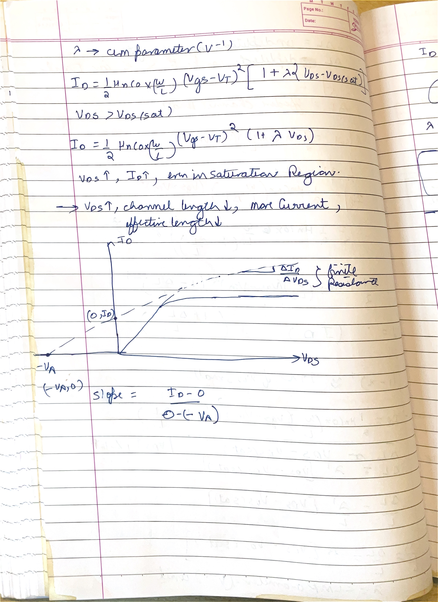

### What this page is doing

The page writes the non-ideal saturation model

$$
I_D\approx\frac{\beta_n}{2}V_{OV}^2(1+\lambda V_{DS}).
$$
The output curves now have a finite positive slope in saturation. Larger $\lambda$ means stronger drain-voltage dependence and a poorer current source. Longer channels generally have smaller $\lambda$ because a given depletion-region extension is a smaller fraction of total length.

On the plotted family, $\lambda$ is read through fractional slope rather than absolute slope alone. Since $\partial I_D/\partial V_{DS}\approx\lambda I_D$, a higher-current curve can have a steeper line even with the same $\lambda$. The parameter therefore measures output-current sensitivity per volt relative to the operating current, and its unit V$^{-1}$ follows directly from making $1+\lambda V_{DS}$ dimensionless.

### Clarity / correction / improvement

Lambda has units V$^{-1}$. The note's slope line should be interpreted at fixed $V_{GS}$; moving between different $V_{GS}$ curves changes both the base current and usually the slope.

### Active recall

Why is channel-length modulation usually more severe in a shorter device?

## Page 10 - Early voltage and extrapolated output curves

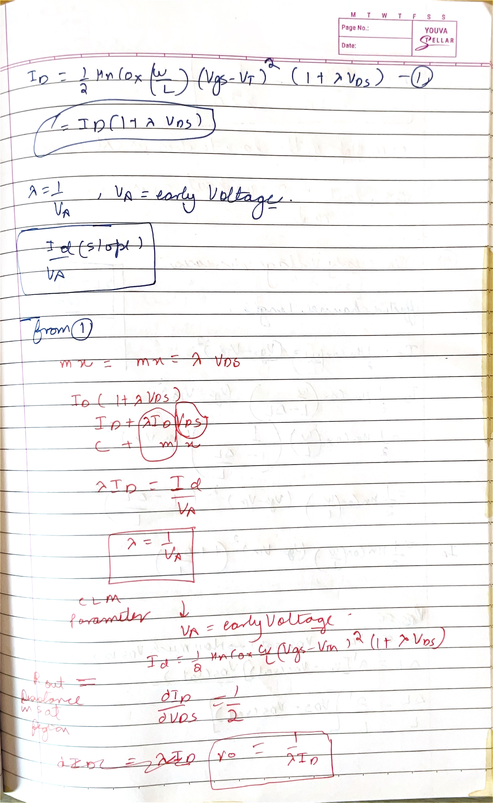

### What this page is doing

The page introduces the Early-voltage form $\lambda\approx1/V_A$ in magnitude. Extrapolating the nearly straight saturation portions backward makes them meet the voltage axis near $-V_A$ for nMOS. A large $V_A$ means shallow slope, small λ, and high output resistance.

The equation $I_D=I_{D0}(1+V_{DS}/V_A)$ separates the ideal gate-controlled current $I_{D0}$ from drain-voltage modulation. This is especially useful for analog gain estimates.

The backward extrapolation is a graphical construction. Extending several nearly straight saturation segments to one approximate intercept means their fractional slopes are related by the same $V_A$. It does not predict that the device physically operates at negative drain voltage. The useful reading is local: around the positive-bias operating point, a larger intercept magnitude corresponds to a smaller slope and a more nearly ideal current source.

### Clarity / correction / improvement

The curves meet only approximately because λ can depend on bias and geometry. Early voltage is a local compact-model parameter, not a literal breakdown or supply voltage.

### Active recall

Which device makes the better current source: $V_A=10$ V or $V_A=100$ V, and why?

## Page 11 - Deriving current change from channel shortening

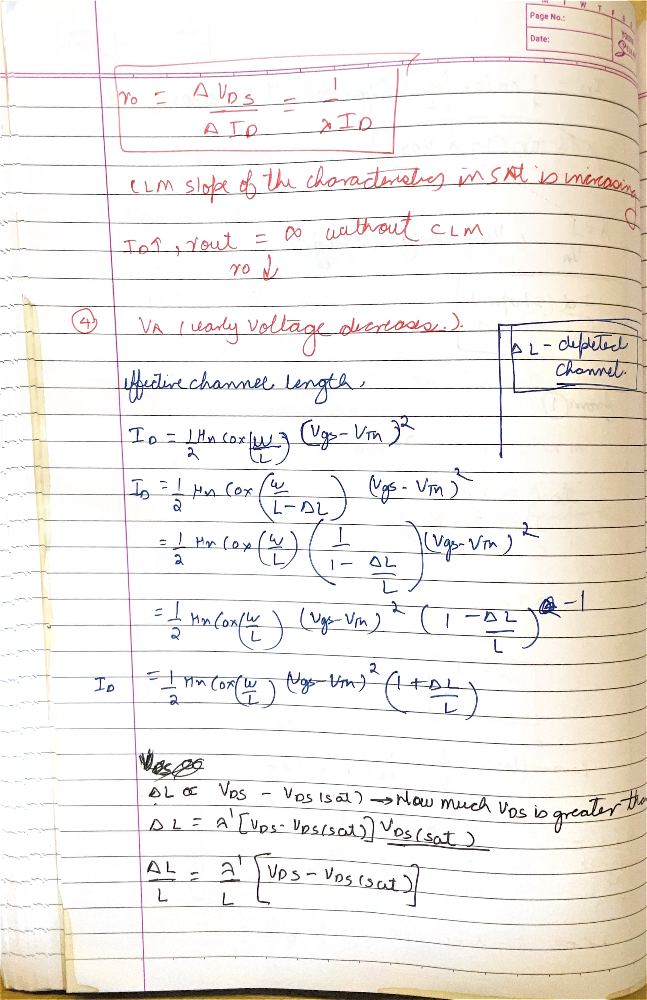

### What this page is doing

The algebra explicitly compares current before and after a small length reduction. Because $I_D\propto1/L$, the fractional current change is approximately $\Delta I_D/I_D\approx\Delta L/L$. The notes then connect $\Delta L$ to drain voltage through a proportionality constant.

This page provides the physical meaning hidden inside λ: it summarizes how much fractional channel shortening and therefore fractional current increase occur per volt of drain bias.

The ratio form makes the approximation transparent. If $L$ changes to $L-\Delta L$, then $I_{new}/I_{old}=L/(L-\Delta L)$. For a small $\Delta L/L$, subtracting one from this ratio gives approximately $\Delta L/L$. The page then associates that fractional change with a drain-voltage increment, which is exactly why $\lambda$ describes fractional current change per volt.

### Clarity / correction / improvement

The exact growth of $\Delta L$ is not universally linear in $V_{DS}$; the compact model linearizes it around a bias range. Treat λ as a fitted small-signal parameter.

### Active recall

If the effective channel shortens by 1% at fixed overdrive, approximately how much does ideal current increase?

## Page 12 - Non-ideal saturation and output conductance

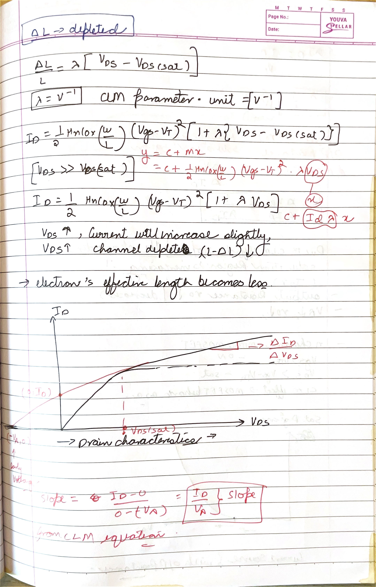

### What this page is doing

The page combines $\Delta L$ and $\lambda\Delta V_{DS}$, then sketches the nonzero saturation slope. Differentiating the CLM model at fixed $V_{GS}$ gives output conductance $g_o=\partial I_D/\partial V_{DS}\approx\lambda I_D$.

Its inverse is output resistance $r_o\approx1/(\lambda I_D)$. These are small-signal quantities around a chosen operating point, not the large-signal ratio $V_{DS}/I_D$.

The slanted saturation line supplies both quantities. Its tangent slope at the bias point is $g_o=\Delta I_D/\Delta V_{DS}$ for a small movement along the same $V_{GS}$ curve. Turning that slope over gives the local resistance seen looking into the drain. Drawing a line from the origin to the operating point would instead calculate a different large-signal ratio and would not represent the page's small-signal model.

### Clarity / correction / improvement

The lower sketch should label the slope as $g_o$, not $r_o$. Resistance is the inverse slope on an $I_D$-versus-$V_{DS}$ graph.

### Active recall

At fixed λ, what happens to $r_o$ when bias current doubles?

## Page 13 - Output resistance and current-source quality

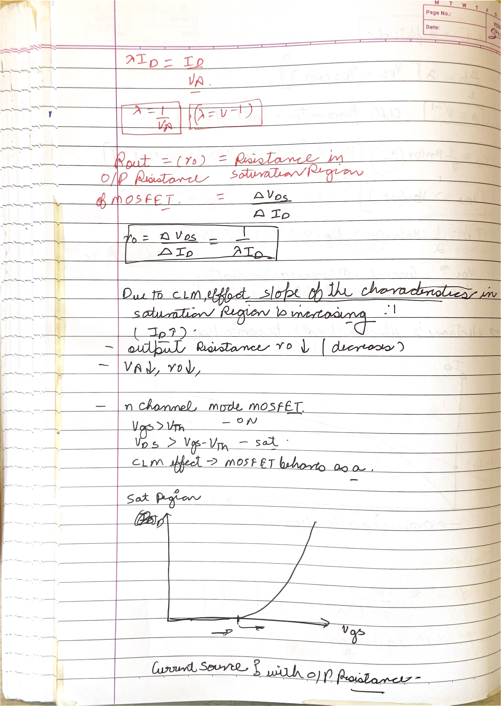

### What this page is doing

The page writes $\lambda I_D=I_D/V_A$ and arrives at $r_o=V_A/I_D=1/(\lambda I_D)$. It then interprets the saturated MOSFET as a current source whose finite output resistance causes current to change with output voltage.

For analog circuits, intrinsic voltage gain is roughly $g_mr_o$. Thus high $g_m$, low λ, and moderate current improve gain, though other speed, area, and noise trade-offs remain.

The current-source symbol and sloped characteristic must be used together. The symbol represents gate-controlled current, while the finite slope represents the parallel $r_o$ that lets output voltage perturb that current. The approximation applies only around the marked saturation bias and only while the device remains beyond its region boundary; moving the drain voltage below $V_{OV}$ returns the device to triode behavior.

### Clarity / correction / improvement

The drawn current-source characteristic is correct locally. A real device also has compliance limits: if $V_{DS}$ falls below $V_{OV}$, it leaves saturation and no longer follows the small-signal current-source model.

### Active recall

Why can increasing drain current raise $g_m$ but reduce $r_o$ at the same time?

## Page 14 - Small-signal gate and drain control

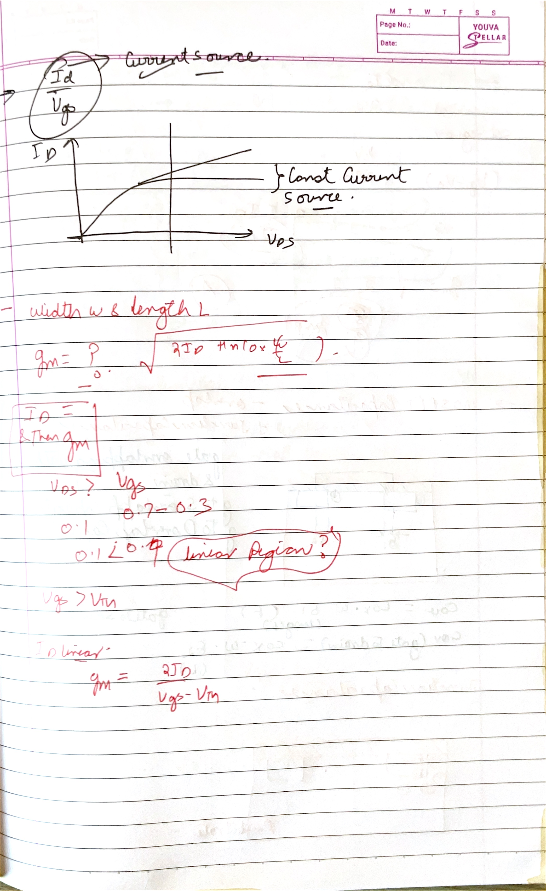

### What this page is doing

The page interprets the device as a controlled current source. A small gate change produces $g_mv_{gs}$, while a small drain change produces $g_ov_{ds}=v_{ds}/r_o$. Around a DC bias point,

$$
i_d=g_mv_{gs}+g_ov_{ds}.
$$
The transfer slope relates gate voltage to current; the output slope relates drain voltage to current. Keeping those derivatives separate is the foundation of the low-frequency small-signal model.

The page is performing a two-variable linearization about one DC operating point. A small horizontal move on the transfer curve produces the $g_mv_{gs}$ contribution, while a small horizontal move on the output curve produces the $g_ov_{ds}$ contribution. Superposition adds them because higher-order products are neglected. The DC current itself is not part of $i_d$; lowercase variables denote only the incremental change.

### Clarity / correction / improvement

The plotted lines should be labeled with their held-constant variables. $g_m$ comes from an $I_D-V_{GS}$ curve at fixed $V_{DS}$; $g_o$ comes from an $I_D-V_{DS}$ curve at fixed $V_{GS}$.

### Active recall

Write the two-source small-signal expression for drain current and identify which term represents channel-length modulation.

## Page 15 - Gate overlap and intrinsic channel capacitances

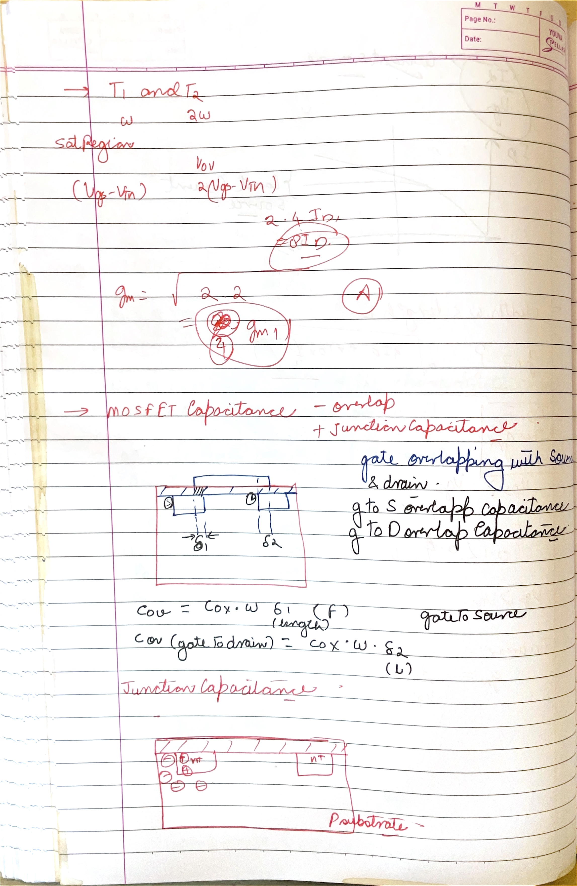

### What this page is doing

The page separates parasitic overlap capacitance from intrinsic gate-channel capacitance. Fabrication requires the gate to overlap source and drain slightly, creating nearly bias-independent $C_{gso}$ and $C_{gdo}$. The gate also couples through oxide to the channel/body over area $WL$; how this intrinsic capacitance partitions depends on operating region.

In cutoff, much of the intrinsic gate capacitance couples to body. In triode, a channel exists from source to drain and gate capacitance is shared roughly between them. In saturation, pinch-off reduces drain-end channel coupling, so the intrinsic part is mainly $C_{gs}\approx(2/3)C'_{ox}WL$, while $C_{gd}$ is largely overlap.

Match each capacitance to a physical overlap visible in the cross-section. $C_{gso}$ and $C_{gdo}$ come from the gate extending over the source/drain diffusions and remain even if no channel exists. The larger intrinsic term comes from the gate facing the bias-dependent channel charge. When the drain-end channel disappears in saturation, that intrinsic charge can no longer respond strongly to the drain, so its partition shifts toward the source.

### Clarity / correction / improvement

Do not add overlap area twice. Write intrinsic and overlap contributions separately before forming total terminal capacitances.

### Active recall

Why does intrinsic $C_{gd}$ fall when a long-channel MOSFET moves from triode into saturation?

## Page 16 - Source/body and drain/body junction capacitance

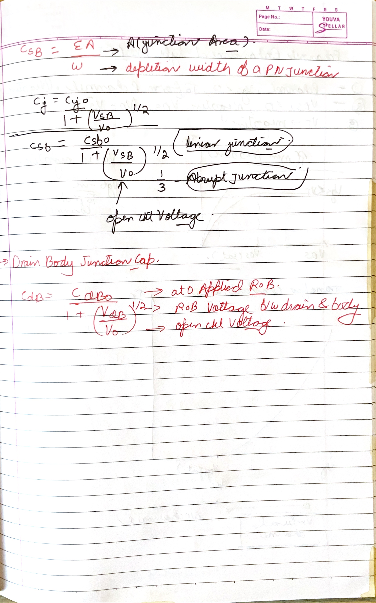

### What this page is doing

The n+ source/body and drain/body interfaces are reverse-biased p-n junctions. Each contributes bottom-plate area capacitance plus sidewall capacitance. The depletion width grows with reverse bias, so junction capacitance falls nonlinearly with voltage.

A standard form is $C_j(V)=C_{j0}/(1+V_R/\Phi_0)^m$, with different exponent/parameters for abrupt or graded junctions. These capacitances load internal and output nodes even though no forward DC current flows.

The bottom and sidewall labels split the junction geometry into two measurable contributions. Bottom-plate capacitance scales with diffusion area, while sidewall capacitance scales with perimeter and can be important for narrow layouts. Both arise from depletion-region charge, so increasing reverse bias widens the region and separates incremental charge more strongly, reducing capacitance even though the physical diffusion dimensions remain unchanged.

### Clarity / correction / improvement

The page's `open bias voltage` should read reverse-bias voltage. Body junction capacitance is not a fixed geometric oxide capacitance; it is depletion capacitance and must be evaluated at the operating voltage.

### Active recall

Why does raising drain voltage usually reduce $C_{db}$ in an nMOS whose body is grounded?

## Page 17 - pMOS enhancement characteristics

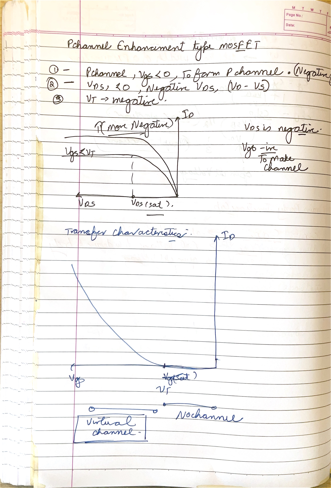

### What this page is doing

The output and transfer plots mirror nMOS using negative signed voltages/current or positive magnitudes. With source at the highest potential, pMOS turns on when $V_{SG}>|V_{Tp}|$. It is linear for $V_{SD}<V_{SG}-|V_{Tp}|$ and saturated beyond that boundary.

The transfer characteristic is quadratic in overdrive under the same long-channel assumptions. The page's main purpose is symmetry: all physical reasoning carries over after swapping carrier type, substrate/well type, and voltage polarity.

Read the pMOS curves in positive magnitudes before mapping them back to signed axes. Increasing $V_{SG}$ strengthens the hole inversion channel, and increasing $V_{SD}$ takes it from a continuous-channel linear region to drain-end pinch-off. The knee distance is still the overdrive, now $V_{SG}-|V_{Tp}|$, so the curve shapes are not new equations—only the terminal references and carrier polarity have changed.

### Clarity / correction / improvement

Use $V_{SG}$ and $V_{SD}$ for calculation; they keep the pMOS region inequalities visually identical to nMOS magnitude equations and avoid double negatives.

### Active recall

State the pMOS saturation condition using positive voltage magnitudes.

## Page 18 - pMOS symbols and current direction

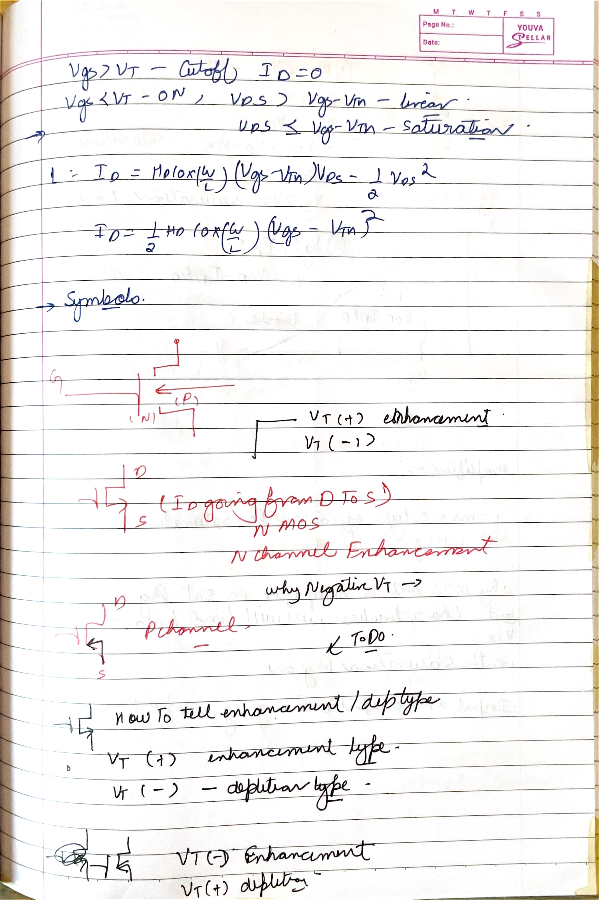

### What this page is doing

The page revisits enhancement/depletion symbols and current arrows, then records that enhancement pMOS has a negative signed threshold while depletion pMOS may have the opposite zero-bias behavior. Hole motion is from source toward drain; conventional current follows holes, unlike electron motion in nMOS.

The sign table is preparing for CMOS, where source of pMOS is usually tied to $V_{DD}$ and source of nMOS to ground. Their gate voltages are shared, but their useful controlling magnitudes are $V_{SG,p}=V_{DD}-V_{in}$ and $V_{GS,n}=V_{in}$.

The arrows on the page distinguish carrier motion from conventional current. Holes and conventional pMOS current move in the same direction, while nMOS electrons move opposite conventional current. In the inverter connection, identifying the pMOS source at $V_{DD}$ makes its control voltage automatically decrease as $V_{in}$ rises; identifying the nMOS source at ground makes its control voltage increase at the same time.

### Clarity / correction / improvement

The symbol alone does not guarantee a terminal's role if voltages reverse. Define pMOS source as the higher-potential terminal for the normal operating case used in CMOS logic.

### Active recall

For a CMOS inverter, express both transistor gate-source control voltages using $V_{in}$ and $V_{DD}$.

## Page 19 - Why a MOSFET can amplify in saturation

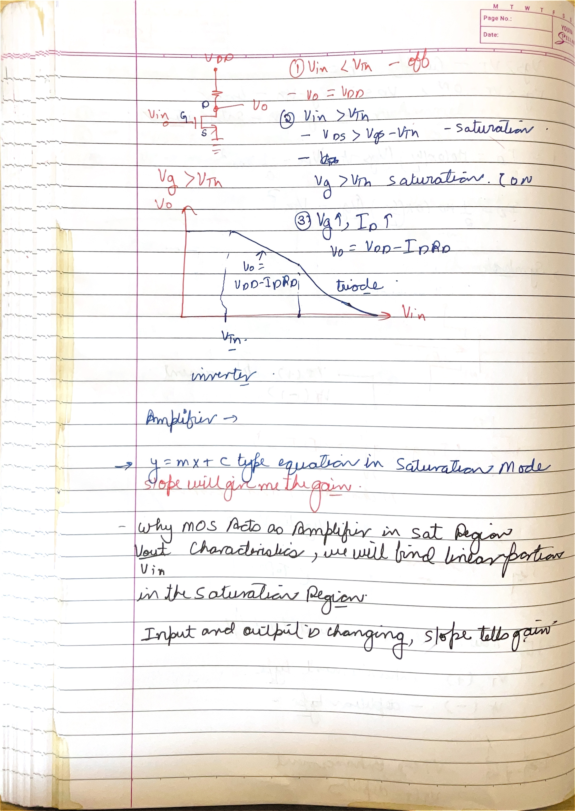

### What this page is doing

The region summary is followed by an amplifier question. In saturation, drain current is strongly controlled by gate voltage but only weakly controlled by drain voltage: $i_d\approx g_mv_{gs}+v_{ds}/r_o$. If that current flows through a load, a small input-voltage change produces a larger output-voltage change, with gain set by approximately $-g_mR_{load,eff}$.

Saturation is valuable because the device behaves like a transconductor/current source. The output must still remain within the saturation compliance range; otherwise the current law and gain change.

The load converts the page's current variation into voltage variation. A positive change in gate voltage increases nMOS drain current by approximately $g_mv_{gs}$; that increased current creates a larger voltage drop across the drain load, so the output voltage falls. This explains both amplification and inversion of sign. Finite $r_o$ reduces the effective load resistance and therefore reduces the obtainable gain.

### Question / TODO acknowledged

The handwriting asks why MOS acts as an amplifier in saturation. It is not because the $I_D-V_{DS}$ curve itself is steep; it is because the $I_D-V_{GS}$ transfer slope $g_m$ converts a small gate-voltage change into current, and the load converts that current change into a larger voltage change.

### Clarity / correction / improvement

A MOSFET can also be used in triode as a variable resistor, but voltage amplification normally uses saturation because high output resistance preserves current-source behavior.

### Active recall

Why does high $r_o$ increase the voltage gain of a common-source stage?

## Page 20 - pMOS equations by region

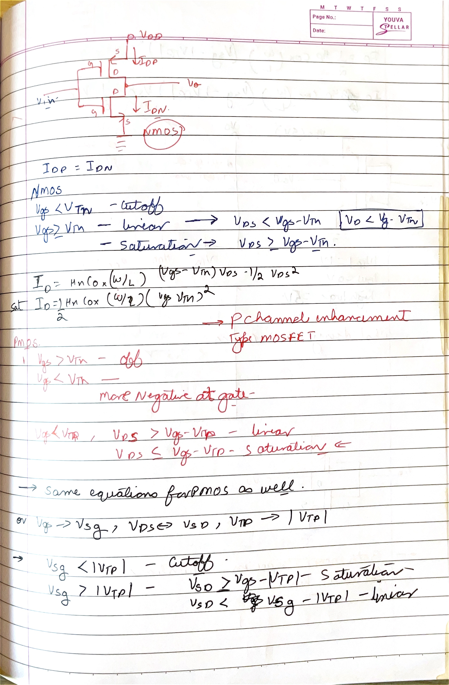

### What this page is doing

The page translates cutoff, linear, and saturation conditions to pMOS. In magnitudes: cutoff for $V_{SG}\le|V_{Tp}|$; linear for $V_{SG}>|V_{Tp}|$ and $V_{SD}<V_{SG}-|V_{Tp}|$; saturation for $V_{SD}\ge V_{SG}-|V_{Tp}|$.

The magnitude equations match nMOS after replacing n parameters with p parameters. This symmetry is what lets CMOS analysis equate nMOS pull-down current and pMOS pull-up current at the same output node.

Choose the region by looking at the two pMOS magnitudes drawn at the terminals. $V_{SG}$ decides whether a hole channel exists, while $V_{SD}$ decides whether that channel remains continuous to the drain. Comparing $V_{SD}$ with $V_{SG}-|V_{Tp}|$ therefore performs exactly the same drain-end-overdrive test used for nMOS without introducing signed negative inequalities.

### Clarity / correction / improvement

The handwritten signed inequalities are hard to audit. Convert all pMOS terminal voltages to $V_{SG}$ and $V_{SD}$ before selecting a region, then restore signed current only if the problem demands it.

### Active recall

Why is a pMOS with $V_{SG}=0$ off even though its absolute gate voltage may be large?

## Page 21 - CMOS inverter at the switching point

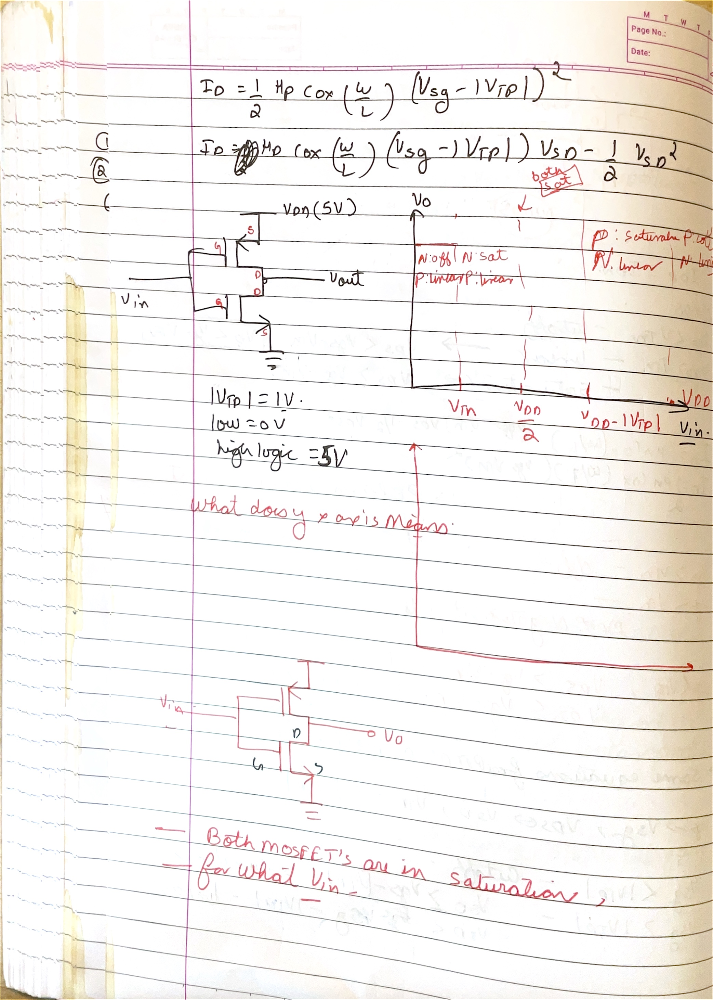

### What this page is doing

The circuit joins pMOS and nMOS drains at $V_{out}$ and gates at $V_{in}$. Near the switching threshold $V_M$, both devices conduct. With no DC output load, Kirchhoff's current law requires equal current magnitudes: $I_{Dn}=|I_{Dp}|$.

At the special point $V_{out}=V_{in}=V_M$, both devices are normally treated as saturated in the long-channel first-order derivation. The nMOS overdrive is $V_M-V_{Tn}$; the pMOS overdrive is $V_{DD}-V_M-|V_{Tp}|$.

The circuit drawing shows why current magnitudes must match. The output node has no independent DC path and stores no steadily increasing charge, so current entering through pMOS must equal current leaving through nMOS. At $V_M$, the common gate voltage simultaneously weakens pMOS and strengthens nMOS. Their current balance fixes the crossing voltage at which neither pull-up nor pull-down dominates.

### Question / TODO acknowledged

The page's “what does $V_{in}$ mean?” issue is resolved by distinguishing a swept independent input from the special switching-point equality. $V_{out}=V_{in}$ is not true for the whole inverter curve; it defines the intersection used to calculate $V_M$.

### Clarity / correction / improvement

Before equating saturation currents, verify both saturation inequalities at the proposed point. The result is a DC switching threshold, not a MOSFET device threshold.

### Active recall

Why is inverter switching threshold $V_M$ conceptually different from $V_{Tn}$ and $V_{Tp}$?

## Page 22 - Deriving the CMOS switching threshold

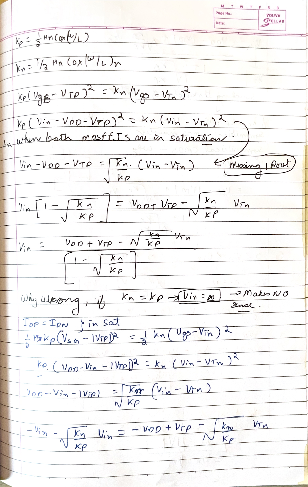

### What this page is doing

Equating the two square-law saturation currents gives

$$
\beta_n(V_M-V_{Tn})^2=\beta_p(V_{DD}-V_M-|V_{Tp}|)^2.
$$
Taking the physically positive square root and solving yields a weighted balance between nMOS and pMOS strengths. This equation shows that the switching point is set by supply, thresholds, mobility, and device geometry through $\beta=\mu C'_{ox}W/L$.

The positive square root is selected because both overdrive magnitudes are positive at the assumed switching point. After the root, $\sqrt{\beta_n}$ and $\sqrt{\beta_p}$ weight the voltage headroom required by each device. A stronger device needs less overdrive to carry the balancing current, so strengthening nMOS lowers the input crossing and strengthening pMOS raises it.

The resulting expression is therefore a balance of the two devices' overdrives, weighted by their strengths; it is not a resistive-divider formula.

### Question / TODO acknowledged

The handwriting questions why $k_n=k_p$ or why one device must be “strong.” Equality is not automatic. It is a design choice achieved mainly by sizing pMOS wider because hole mobility is lower. Unequal strengths intentionally move $V_M$ toward the weaker side's rail.

### Clarity / correction / improvement

When taking square roots, use $\sqrt{\beta_n/\beta_p}$, not $\beta_n/\beta_p$. The square appears in the current law and disappears only after the positive root.

### Active recall

If pMOS becomes stronger while nMOS is unchanged, does $V_M$ move up or down? Explain physically.

## Page 23 - General and symmetric switching-point formulas

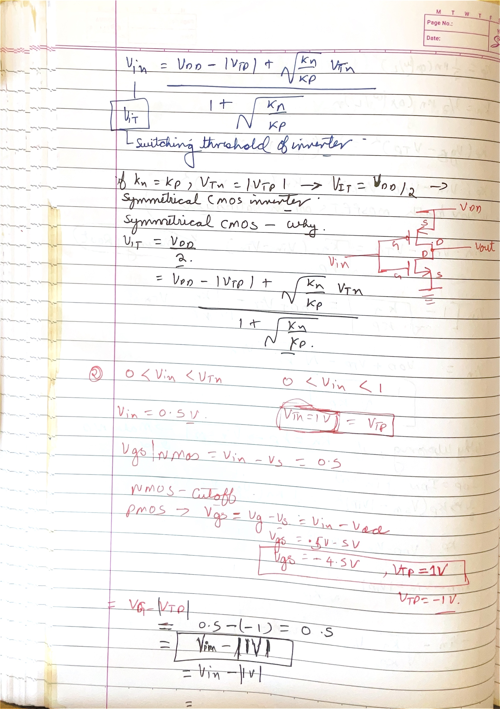

### What this page is doing

Defining $r=\sqrt{\beta_n/\beta_p}$, the general result is

$$
V_M=\frac{V_{DD}-|V_{Tp}|+rV_{Tn}}{1+r}.
$$
For a symmetric inverter with $\beta_n=\beta_p$ and $V_{Tn}=|V_{Tp}|$, this reduces to $V_M=V_{DD}/2$. The page then inserts example values to show how the transfer crossing shifts when strengths or thresholds differ.

The ratio $r$ makes limiting cases visible. If $r$ grows, nMOS is relatively stronger and the denominator and weighted threshold term pull $V_M$ toward the lower rail; if $r$ shrinks, pMOS dominates and $V_M$ moves upward. Setting $r=1$ removes strength weighting, but half-supply switching still also requires the threshold magnitudes to match.

The numerical result should move in the same direction predicted by that strength ratio before its arithmetic is accepted.

### Clarity / correction / improvement

Symmetric transfer behavior requires both equal effective strengths and appropriately matched threshold magnitudes. Equal widths alone do not give equal strengths because $\mu_n>\mu_p$ in typical silicon processes.

### Active recall

What two matching conditions make the inverter switch at exactly half the supply in this model?

## Page 24 - Numerical region check and inverter transfer curve

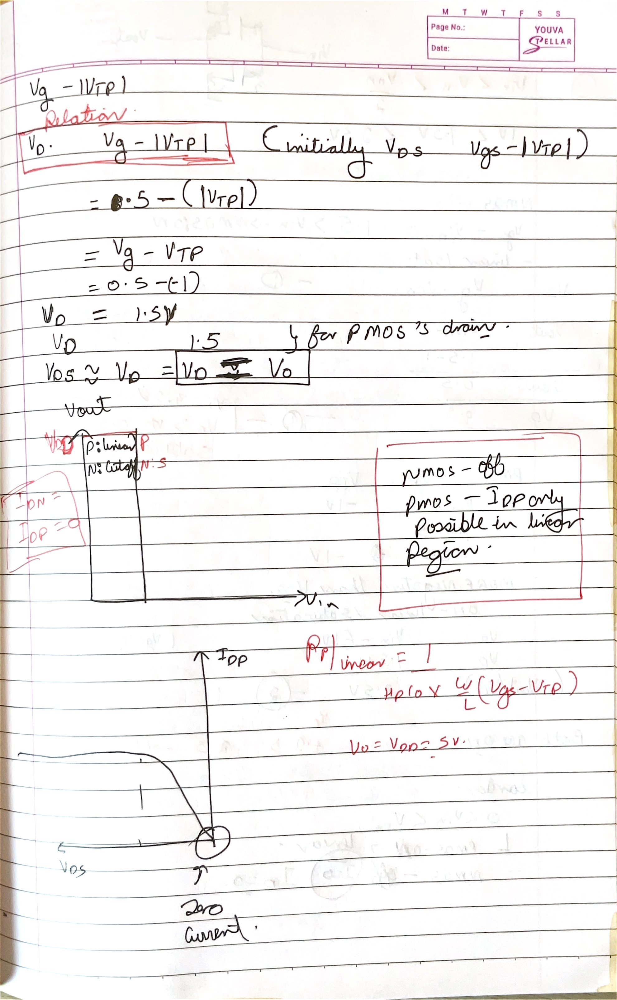

### What this page is doing

The numerical work evaluates transistor overdrives at a chosen $V_{in}$, decides whether nMOS and pMOS are off, linear, or saturated, and then solves current balance for $V_{out}$. The transfer sketch records the resulting high-output, transition, and low-output portions.

This is the correct order for every inverter DC problem: determine which devices are on; assume regions; write equal current magnitudes; solve $V_{out}$; verify the assumed inequalities. An algebraic solution that violates a region inequality must be discarded and recalculated with the correct model.

The transfer sketch is assembled from verified operating intervals. Near low input, nMOS is off and pMOS holds the output high. Near high input, pMOS is off and nMOS holds it low. Between those limits both conduct, but their linear/saturation roles change as $V_{out}$ moves. The numerical region check on the page is one point on that larger piecewise curve, not a standalone current calculation.

### Question / TODO acknowledged

The note flags a “possible in linear region” concern. Yes: away from the exact central switching point, one transistor is commonly saturated while the other is linear. Both-saturation is a narrow transition condition in the ideal model, not the whole VTC.

### Clarity / correction / improvement

Write a five-region table beside the VTC: n off/p linear; n sat/p linear; both sat; n linear/p sat; n linear/p off. It makes the curve derivation much easier to audit.

### Active recall

After solving a candidate $V_{out}$, which two inequalities must be checked to confirm nMOS and pMOS region assumptions?

## Module checkpoint

You are ready for Module 4 when you can explain why a CMOS inverter's steep transition comes from simultaneous transconductance and high output resistance, then predict how capacitance turns that static curve into delay.
