# 04 - CMOS Switching Delay, Power, and Noise

[Back to MOSFET and CMOS](../README.md) | [Previous module](../03%20MOSFET%20Models%20and%20CMOS%20Inverter/README.md) | [Untouched source PDF](../sources/mos4.pdf)

This module turns the CMOS inverter from a DC transfer curve into a real logic gate. It tracks the transistor regions through the transition, models the output capacitance, explains pass-transistor level loss, derives switching energy, and defines noise margins.

## Page map

| Page | Revision focus | Page | Revision focus |
|---:|---|---:|---|
| [1](#page-01) | Inverter region calculation | [13](#page-13) | Propagation-delay waveforms |
| [2](#page-02) | Near-rail resistance picture | [14](#page-14) | pMOS pass behavior |
| [3](#page-03) | On-resistance and rail limits | [15](#page-15) | nMOS/pMOS level limits |
| [4](#page-04) | Pull-down to logic 0 | [16](#page-16) | Transmission gate |
| [5](#page-05) | Symmetric inverter conditions | [17](#page-17) | Static and dynamic power |
| [6](#page-06) | Five VTC regions | [18](#page-18) | Capacitor charging energy |
| [7](#page-07) | Region-based current example | [19](#page-19) | Dynamic-power derivation |
| [8](#page-08) | Both devices saturated | [20](#page-20) | Power numerical example |
| [9](#page-09) | VTC mapping and gate load | [21](#page-21) | Switching-threshold calculation |
| [10](#page-10) | Equivalent resistance | [22](#page-22) | VIL, VIH, VOL, VOH |
| [11](#page-11) | Output-capacitor transient | [23](#page-23) | Noise-margin geometry |
| [12](#page-12) | RC rise and fall | [24](#page-24) | Strength and delay ratios |

## Page 01 - Solving an inverter point by transistor regions

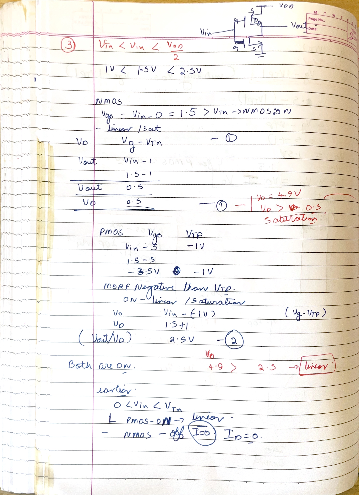

### What this page is doing

The page continues a numerical CMOS inverter analysis for an intermediate (V_{in}). It computes nMOS (V_{GS}), pMOS (V_{SG}), and candidate (V_{out}), then compares drain voltages with overdrive to decide whether each transistor is linear or saturated.

At the output node, pull-up and pull-down current magnitudes must be equal in DC. A correct solution is therefore an assumption loop: choose the likely region pair, write both current laws, solve, and check every inequality. The marked “linear” conclusions are region checks, not labels inferred from where the transistor is drawn.

### Clarity / correction / improvement

Use pMOS magnitudes (V_{SG}=V_{DD}-V_{in}) and (V_{SD}=V_{DD}-V_{out}). This turns a sign-heavy calculation into the same inequalities used for nMOS.

### Active recall

What KCL equation applies at a CMOS inverter output with no DC load current?

## Page 02 - Near-rail behavior as pull-up and pull-down resistances

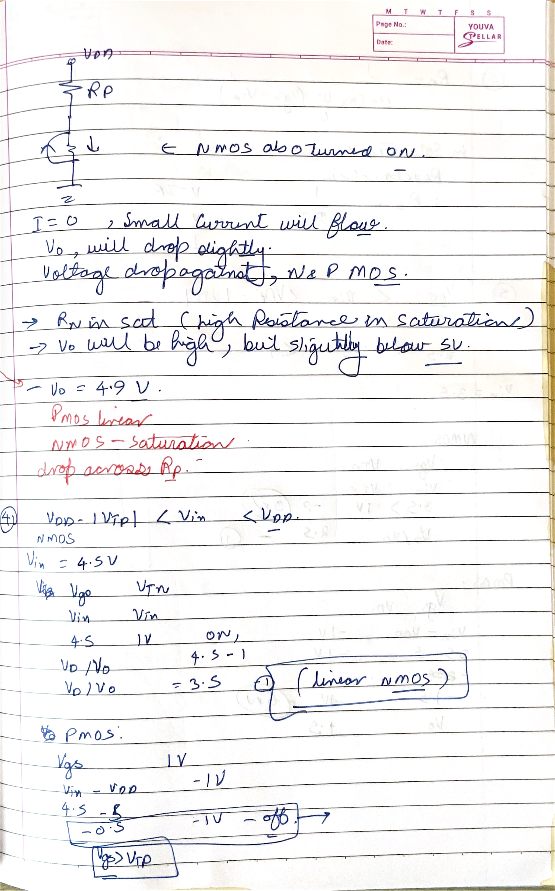

### What this page is doing

The page approximates a strongly on MOSFET by an on-resistance. When input is low, pMOS is on and nMOS is off, so there is no ideal DC path to ground and (V_{out}\approx V_{DD}). If the supposedly off device leaks or the output drives a load, a small current can create a small voltage drop through the pull-up resistance.

The resistor picture is useful near the rails and during RC transitions, but it is a linearized approximation to the MOS current equation. The effective resistance changes with output voltage because overdrive and region change during switching.

### Clarity / correction / improvement

In ideal static CMOS with one transistor exactly off and no load, current is zero and there is no (R_{on}) drop: the output reaches the rail. The small-drop statement belongs to leakage, finite load, or a ratioed/non-complementary circuit.

### Active recall

Why is a logic-high CMOS output ideally (V_{DD}) even though the conducting pMOS has finite on-resistance?

## Page 03 - On-resistance and the high-input state

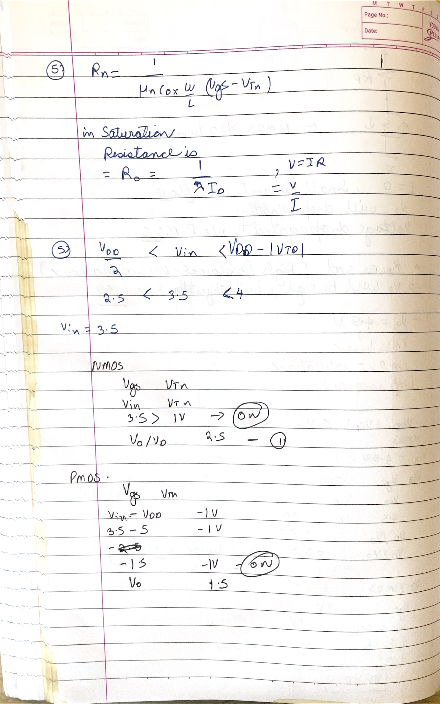

### What this page is doing

The page records (R_n\approx1/[\beta_n(V_{GS}-V_{Tn})]) in deep triode and examines the high-input case. With (V_{in}=V_{DD}), nMOS is on, pMOS is off, and the output is discharged toward ground. Again, without DC load there is no final current and no final resistor drop, so ideal (V_{OL}=0).

During the transition, however, the output capacitor carries current and the nMOS on-resistance controls the discharge time. This distinction between final-value logic and transient current is central to CMOS timing.

### Clarity / correction / improvement

The on-resistance formula is bias-dependent. Using one constant (R_n) over the full swing is an equivalent-delay approximation, not an exact device model.

### Active recall

When a CMOS output is already settled low, why is nMOS current ideally zero even though nMOS remains on?

## Page 04 - Pull-down action after an input step

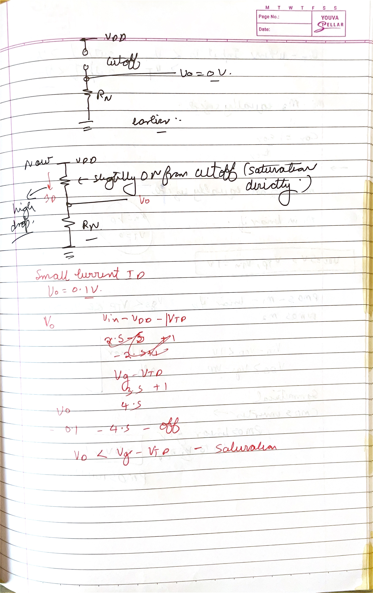

### What this page is doing

The circuit shows a high input turning nMOS on and pMOS off. Immediately after the input step, the output may still be high because the load capacitor preserves voltage. nMOS initially sees large (V_{DS}), often begins in saturation, and removes stored charge. As (V_{out}) falls below nMOS overdrive, it enters linear region and completes the discharge.

Thus a single output transition crosses device regions even though gate input is held constant. The final state is (V_{out}=0), but the transient current trajectory determines delay and energy.

### Clarity / correction / improvement

The note's “suddenly on from cutoff” should be split into (t=0^+) and (t\to\infty). Capacitor voltage cannot jump at (t=0); transistor current can.

### Active recall

During a high-to-low output transition, in which region does nMOS typically start and in which region does it finish?

## Page 05 - Conditions for a symmetric CMOS inverter

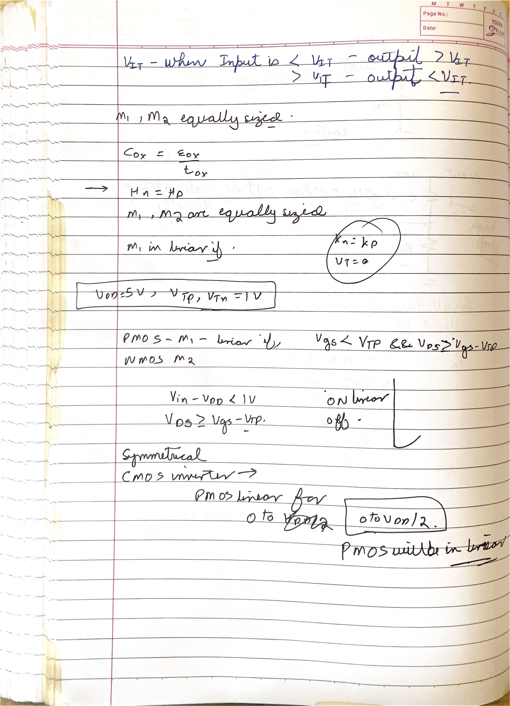

### What this page is doing

The page lists the conditions that center the switching point: equal threshold magnitudes, equal effective strengths (\beta_n=\beta_p), and a symmetric supply reference. Under the square-law model, these conditions give (V_M=V_{DD}/2).

Because (\beta=\mu C'_{ox}W/L) and electron mobility normally exceeds hole mobility, equal strengths generally require pMOS to be wider. Symmetry refers to the electrical transfer curve, not necessarily to equal physical dimensions.

### Clarity / correction / improvement

The handwritten `m1, m2 equally size` condition is not generally sufficient. Equal (W/L) produces (\beta_n>\beta_p) in a typical process. State “electrically equal strength” as the actual requirement.

### Active recall

Why is the pMOS commonly made wider than the nMOS in a symmetric inverter?

## Page 06 - Tracking the five inverter VTC regions

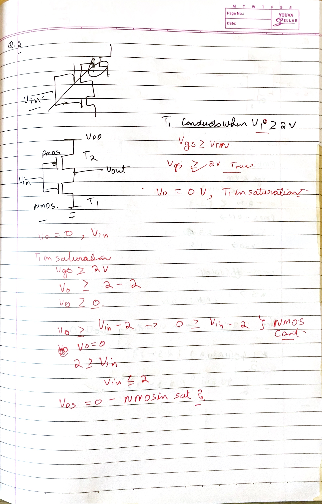

### What this page is doing

The inverter drawing is used to walk from (V_{in}=0) to (V_{DD}). The usual region sequence is: nMOS off/pMOS linear; nMOS saturated/pMOS linear; both saturated near the switching point; nMOS linear/pMOS saturated; nMOS linear/pMOS off.

Which device is saturated is determined by its own drain-source voltage and overdrive. The shared output makes the two tests interdependent, which is why a VTC is solved piecewise rather than from one equation.

### Clarity / correction / improvement

In the ideal model, the both-saturation region collapses to a very steep transition because both currents are nearly independent of (V_{out}). Channel-length modulation gives it finite width and slope.

### Active recall

List the five nMOS/pMOS region pairs encountered as input rises from 0 to (V_{DD}).

## Page 07 - Numerical current at the switching region

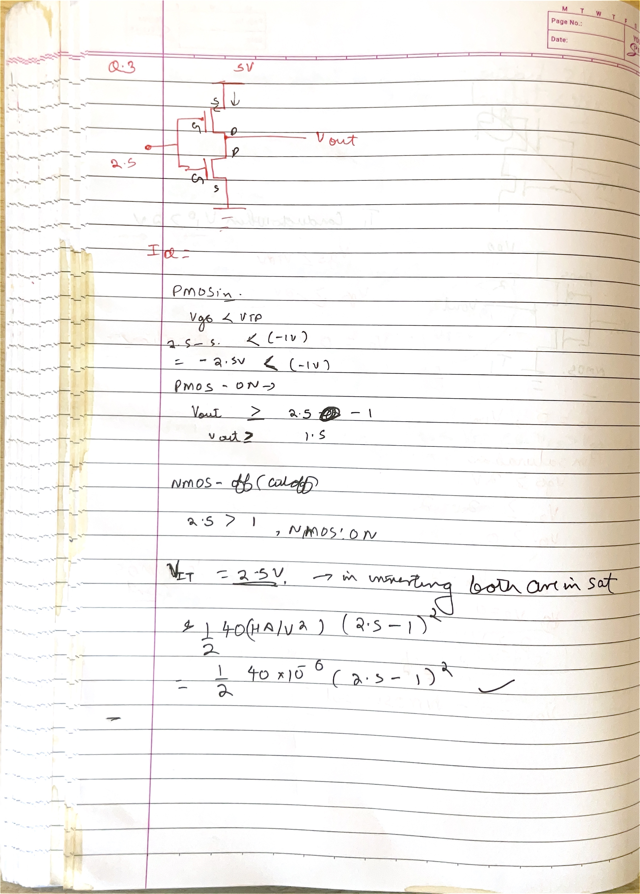

### What this page is doing

The page evaluates a particular input and checks whether both devices are on and saturated. Once the region is verified, it uses the square-law currents to find or compare nMOS and pMOS drain current. In DC steady state these currents must match in magnitude because charge cannot keep accumulating at the output node.

The boxed current is therefore also a consistency check on transistor sizing. If the two calculated saturation currents differ at an assumed (V_{in}=V_{out}), the actual switching point lies elsewhere.

### Clarity / correction / improvement

Carry units through (\mu C'_{ox}(W/L)V_{OV}^2/2). Device strength has units A/V2, so the final current must be in amperes.

### Active recall

If (I_{Dn}>|I_{Dp}|) at a candidate output voltage, which direction must the output move to restore KCL?

## Page 08 - Why both devices can be saturated

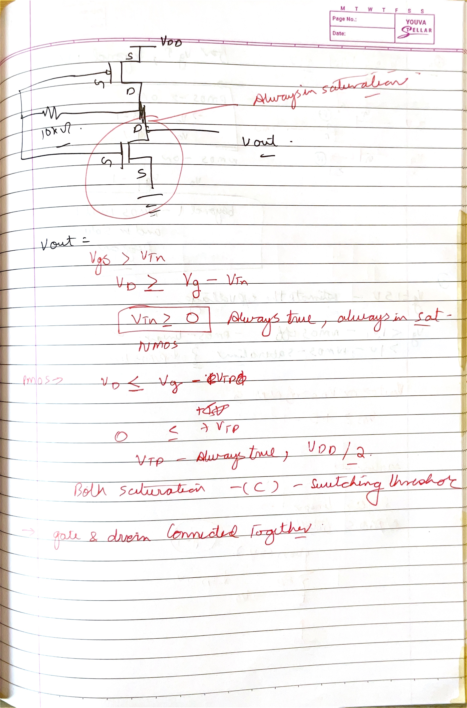

### What this page is doing

The page marks the transition-region conditions. nMOS saturation requires (V_{out}\ge V_{in}-V_{Tn}). pMOS saturation in magnitude form requires (V_{DD}-V_{out}\ge V_{DD}-V_{in}-|V_{Tp}|), which simplifies to (V_{out}\le V_{in}+|V_{Tp}|).

Both can therefore be saturated for an overlapping range around the switching point. In that range, a small input change strongly changes both currents in opposite directions, while output dependence is weak; the result is high negative voltage gain.

### Clarity / correction / improvement

“Both saturation” does not mean both carry independent currents indefinitely. At the shared node, their magnitudes must still be equal in DC; otherwise the output capacitance charges and (V_{out}) moves.

### Active recall

Write the two inequalities that bound (V_{out}) when both inverter transistors are saturated.

## Page 09 - Mapping input ranges and recognizing capacitive loading

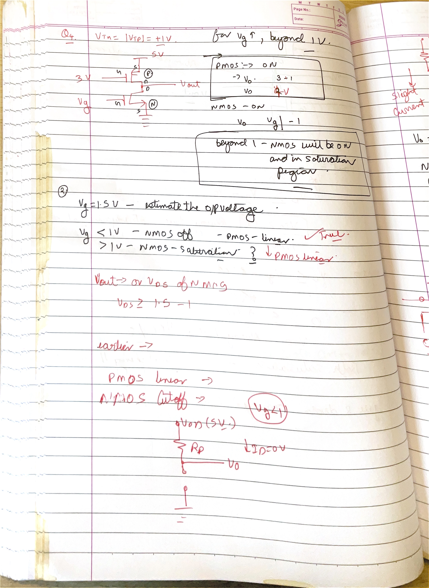

### What this page is doing

The upper work maps several input values to transistor states and output behavior. The lower sketches reduce following logic gates to their input capacitances, which appear as a load at the driving inverter output. This is the transition from static VTC analysis to dynamic timing.

Even if the next gate draws essentially no DC current, its gate capacitance requires charge (Q=C_LV) whenever the logic level changes. The driving pMOS or nMOS must source or sink that charge, so fan-out affects delay without altering ideal DC logic levels.

### Clarity / correction / improvement

“No gate current” means no steady oxide conduction. It does not mean zero transient input current; displacement current flows while gate capacitances charge or discharge.

### Active recall

Why can adding more CMOS gate inputs slow an inverter even though each added input has nearly infinite DC resistance?

## Page 10 - Equivalent pull-up and pull-down resistance

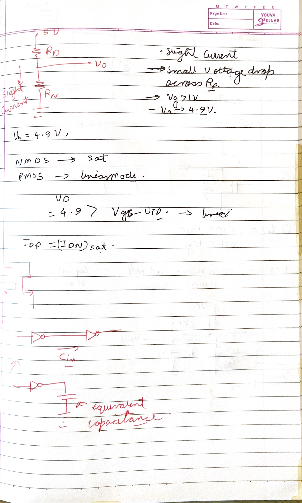

### What this page is doing

The page replaces the conducting transistor with an equivalent resistance and the following gate inputs/interconnect with a lumped capacitance. During a rising output, pMOS supplies current through (R_p); during a falling output, nMOS removes charge through (R_n).

This first-order model gives separate time constants (\tau_{rise}=R_pC_L) and (\tau_{fall}=R_nC_L). Matching pull-up and pull-down strength makes rise and fall delay similar.

### Clarity / correction / improvement

The equivalent resistance is an average over a nonlinear voltage trajectory. It is excellent for intuition and hand timing, but transistor-current integration is needed for more accurate delay.

### Active recall

Which transistor and which equivalent resistance control (t_{PLH}) and (t_{PHL})?

## Page 11 - Capacitor voltage cannot change instantly

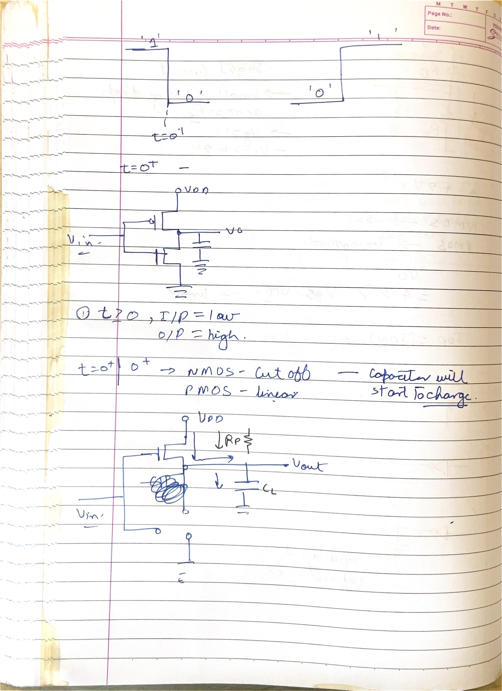

### What this page is doing

The step input and inverter-capacitor circuit show initial and final conditions. At (t=0^+), (V_{out}) remains at its pre-step value because changing capacitor voltage instantaneously would require infinite current. The newly conducting transistor then charges or discharges (C_L), making (V_{out}(t)) continuous and exponential in the RC approximation.

The page's separate (t=0^-), (t=0^+), and (t>0) sketches are the right way to reason about switched-capacitor nodes.

### Clarity / correction / improvement

State both continuity laws: capacitor voltage is continuous, while capacitor current may jump. Inductor current, by contrast, is the quantity that cannot jump.

### Active recall

Immediately after a low-to-high input step, what are the output voltage and nMOS operating region if the output was previously high?

## Page 12 - RC charging, discharging, and delay definitions

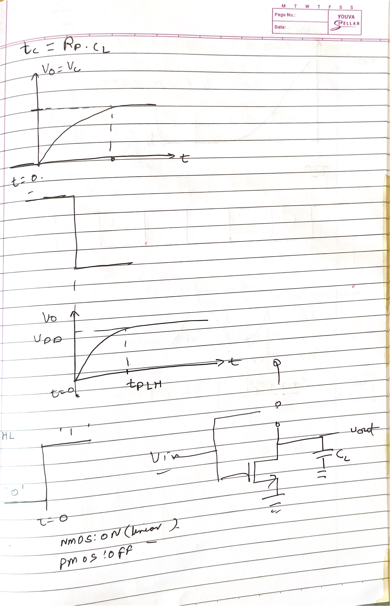

### What this page is doing

For a constant equivalent resistance, a rising output is (V_{out}=V_{DD}(1-e^{-t/RC})), while a falling output is (V_{out}=V_{DD}e^{-t/RC}). The 50% crossing occurs at (t=RC\ln2\approx0.69RC), the usual first-order propagation delay.

The 10%-to-90% rise or fall time is about (2.2RC). Propagation delay and rise/fall time are therefore related but not identical measurements.

### Clarity / correction / improvement

Use (t_{PLH}) for output low-to-high and (t_{PHL}) for output high-to-low. The first letter pair describes the **output**, not the input transition.

### Active recall

Why is a 50% propagation delay approximately (0.69RC), while a 10%-90% transition takes about (2.2RC)?

## Page 13 - Timing waveforms and propagation delay

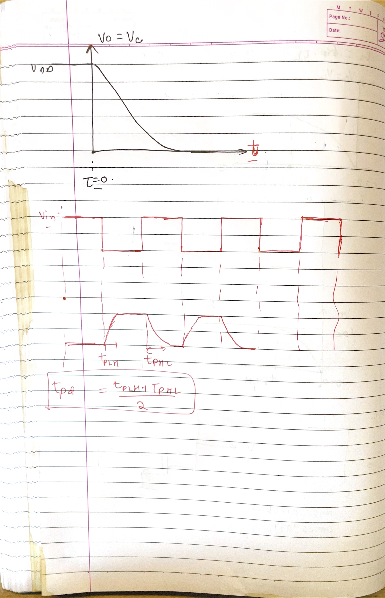

### What this page is doing

The input pulse and delayed, rounded output show that a CMOS gate has finite response time. (t_{PHL}) is measured from the input's 50% point to the falling output's 50% point; (t_{PLH}) is measured similarly for the rising output. Average propagation delay is often (t_p=(t_{PHL}+t_{PLH})/2).

The asymmetry between the two delays comes from unequal nMOS/pMOS drive, different voltage-dependent current paths, and potentially different capacitance during each transition.

### Clarity / correction / improvement

Do not measure delay from the start of the input edge unless a problem explicitly defines it that way. Standard 50%-to-50% measurement reduces dependence on input waveform origin.

### Active recall

If (R_p>R_n) for the same load, which propagation delay is larger?

## Page 14 - pMOS pass transistor and the “strong 1”

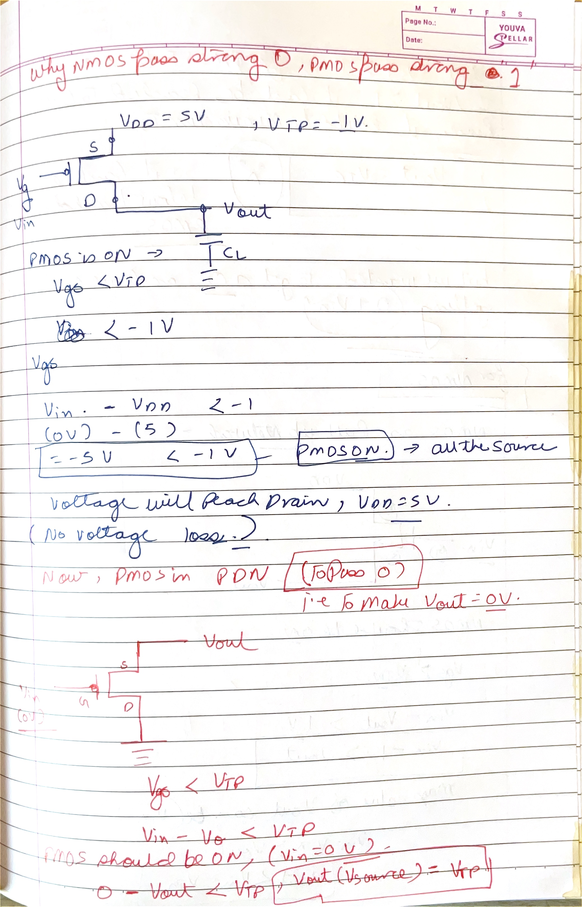

### What this page is doing

The page studies a pMOS used as a pass switch. With a low gate, pMOS passes a high input strongly because its source-gate voltage stays large as the output rises toward (V_{DD}). When asked to pass a low level, conduction weakens and stops when the relevant source-gate magnitude falls to |(V_{Tp})|, leaving a threshold-degraded low.

Thus pMOS is naturally a strong pull-up/pass-high device and a weak pull-down/pass-low device.

### Question / TODO acknowledged

The handwriting asks why pMOS can pull all the way to the upper rail. As its output rises, the higher-potential terminal remains the source and (V_{SG}) remains sufficient until the output reaches the high input itself. There is no threshold loss for the logic level whose polarity keeps the device strongly on.

### Clarity / correction / improvement

The exact weak-low limit includes body effect if the pMOS body is fixed rather than tied to the moving source. “One threshold” is the first-order result.

### Active recall

Why does a pMOS pass a high level without the same threshold loss that an nMOS suffers?

## Page 15 - nMOS passes strong 0, pMOS passes strong 1

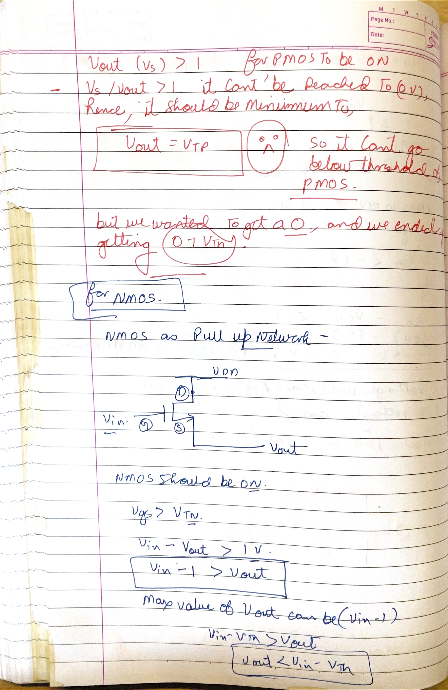

### What this page is doing

The page contrasts pass-transistor limits. An nMOS with gate at (V_{DD}) raises its output only until (V_{GS}=V_T), giving approximately (V_{out,max}=V_G-V_{Tn}); it passes a weak 1 but a strong 0. A pMOS with gate at 0 passes a strong 1 but stops lowering a node when (V_{SG}) reaches |(V_{Tp})|, so it passes a weak 0.

These are not resistive divider losses. The transistor turns itself off as the output approaches the problematic rail because its gate-to-source control voltage shrinks.

### Question / TODO acknowledged

The page's “maximum value of (V_{out})” question for nMOS is answered by the turn-off boundary: (V_{out,max}\approx V_G-V_{Tn}), usually somewhat lower when body effect raises (V_T).

### Clarity / correction / improvement

Always identify which terminal becomes the source as the pass-node voltage moves. MOS source/drain roles can exchange, and the controlling (V_{GS}) must use the instantaneous lower-potential terminal for nMOS.

### Active recall

Derive the nMOS weak-high limit by writing its turn-off condition.

## Page 16 - Transmission gate restores full logic swing

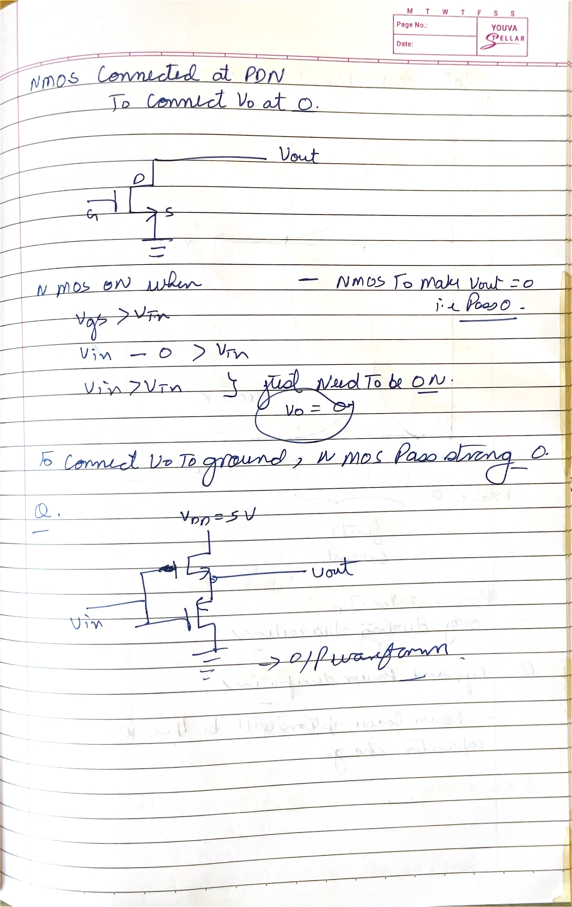

### What this page is doing

The page combines nMOS and pMOS in parallel with complementary gate controls. When enabled, nMOS strongly transmits low values and pMOS strongly transmits high values; in the middle both conduct. When disabled, both turn off and isolate the two nodes.

This complementary pass pair is a transmission gate. It avoids the first-order threshold loss of a single pass transistor and provides more uniform resistance across the signal range.

### Question / TODO acknowledged

The earlier TODO “how is threshold loss removed?” is resolved here: use both device types and drive their gates with complementary enable signals. One device remains strong wherever the other becomes weak.

### Clarity / correction / improvement

A transmission gate is bidirectional for signal flow but still has finite on-resistance, parasitic capacitance, charge injection, and clock feedthrough. “Full swing” does not mean ideal zero-resistance behavior.

### Active recall

Which complementary gate voltages enable a transmission gate made of parallel nMOS and pMOS?

## Page 17 - Static, short-circuit, and dynamic power

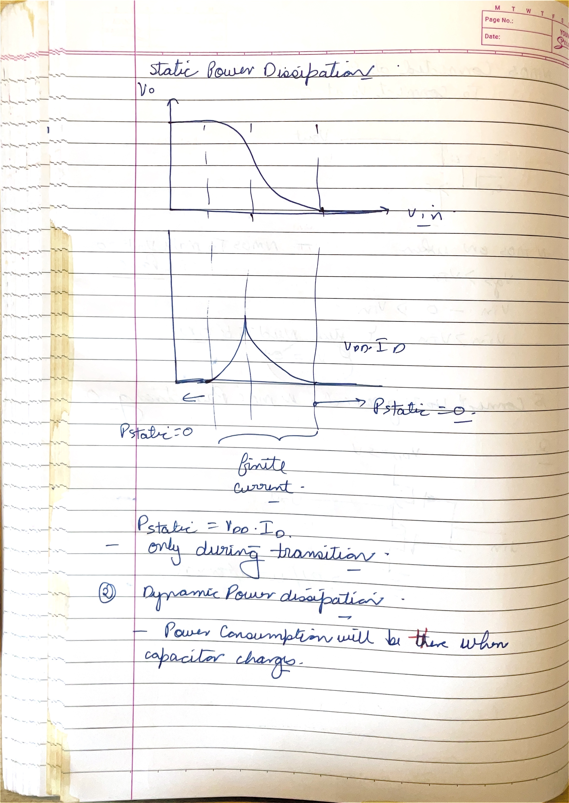

### What this page is doing

The VTC and current peak divide CMOS power into mechanisms. In stable ideal logic states, one transistor is off, so there is no direct (V_{DD})-to-ground path and ideal static power is zero. Real static power comes mainly from leakage.

During an input transition, both transistors can conduct briefly, producing short-circuit current. Separately, charging and discharging the output/load capacitance consumes dynamic energy even if the input edge were infinitely sharp.

### Clarity / correction / improvement

The phrase “static power only during transition” is contradictory: transition current is dynamic short-circuit power. Reserve “static” for steady-state leakage or ratioed-logic DC current.

### Active recall

Name the three power components in a real CMOS gate and state when each occurs.

## Page 18 - Charging a load capacitor from the supply

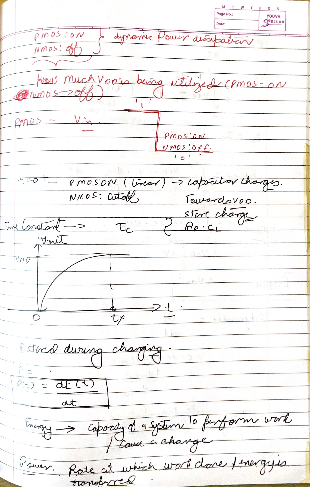

### What this page is doing

When input goes low, pMOS turns on and charges (C_L) from 0 to (V_{DD}). The supply delivers total charge (Q=C_LV_{DD}). The energy drawn from an ideal constant-voltage supply is therefore (E_{supply}=V_{DD}Q=C_LV_{DD}^2).

Only half, (\tfrac12C_LV_{DD}^2), remains stored in the capacitor. The other half is dissipated in the pull-up path, independent of its resistance value for an ordinary RC charge; resistance changes how fast, not the total dissipated fraction.

### Question / TODO acknowledged

The handwriting asks “how much (V_{DD}) is being utilized?” In energy terms, the supply provides (C_LV_{DD}^2) per 0-to-1 event: half is stored on (C_L), half becomes heat in the pMOS/interconnect resistance.

### Clarity / correction / improvement

When the capacitor later discharges, its stored half-energy is dissipated in nMOS and is not returned to an ordinary supply. Therefore a complete 0-1-0 cycle dissipates (C_LV_{DD}^2).

### Active recall

Why does making the pull-up resistance smaller reduce delay but not the ideal RC charging energy?

## Page 19 - Deriving dynamic power

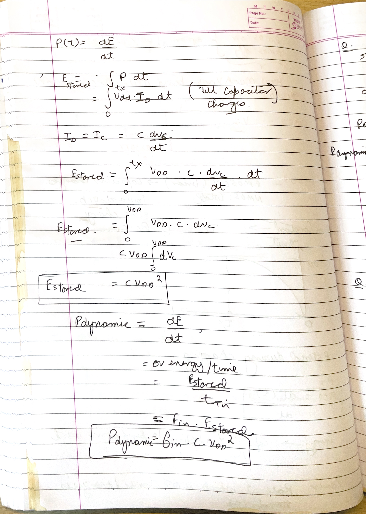

### What this page is doing

The page integrates supply power during charging and obtains the energy per charging event. Repeated events at rate (f) give average dynamic power

\[P_{dyn}=\alpha C_LV_{DD}^2f,\]

where (\alpha) is the average number/probability of 0-to-1 charging events per clock opportunity under the chosen frequency convention. This square dependence makes supply reduction a powerful energy-saving lever.

### Clarity / correction / improvement

Define α and (f) together. Some conventions count full cycles, others transitions; ambiguity can create a factor-of-two error. The commonly used digital formula counts energy drawn on 0-to-1 events.

### Active recall

If supply voltage falls by 20% while capacitance, activity, and frequency stay fixed, by what factor does dynamic power change?

## Page 20 - Dynamic-power numerical example

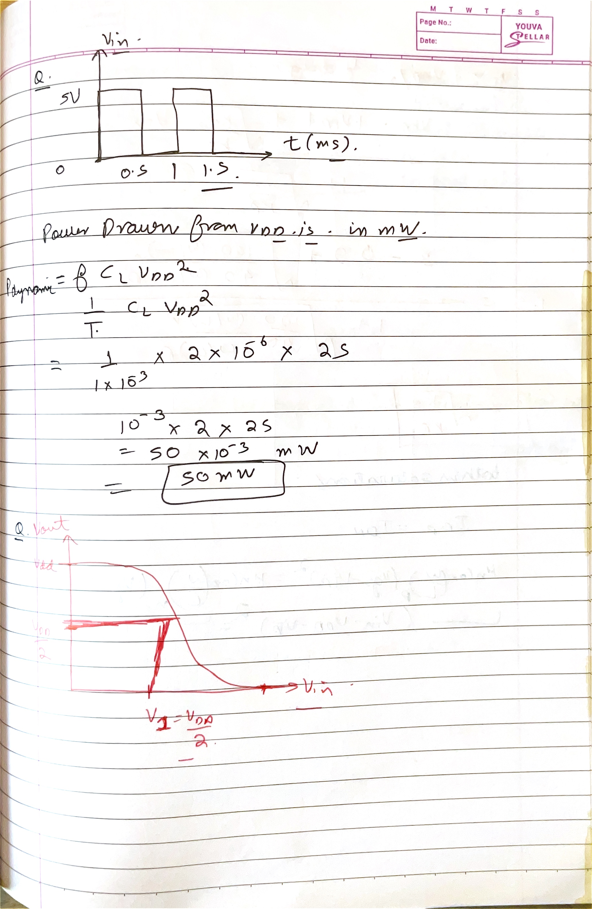

### What this page is doing

The square input waveform identifies switching frequency and the calculation substitutes (C_L), (V_{DD}), and event rate into (P=\alpha C_LV_{DD}^2f). The boxed milliwatt result is an order-of-magnitude check that capacitance and frequency units were converted consistently.

The lower VTC sketch reminds that reducing (V_{DD}) also reduces signal swing and available overdrive. Power improves quadratically, but delay tends to worsen because transistor current falls.

### Clarity / correction / improvement

If the waveform has one 0-to-1 transition per period, use α = 1 with the period frequency. Do not multiply by both two edges per cycle and full-cycle energy unless the energy convention is adjusted accordingly.

### Active recall

Which three independent unit conversions should be checked in a dynamic-power calculation?

## Page 21 - Switching-threshold strength ratio

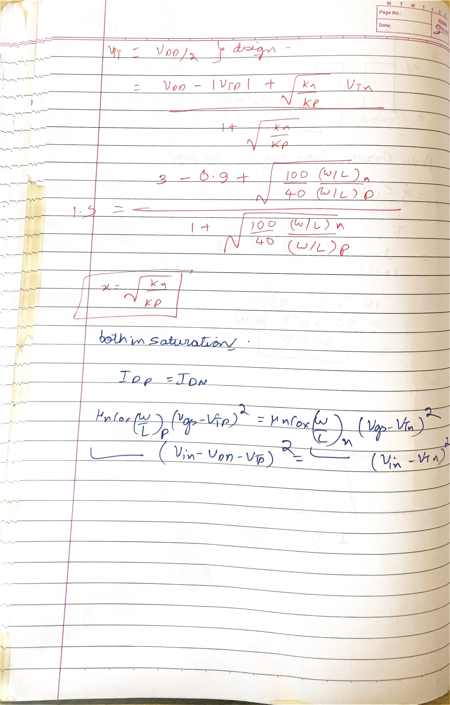

### What this page is doing

The page returns to the CMOS switching-point equation and substitutes threshold and strength-ratio values. It shows explicitly how (\sqrt{\beta_n/\beta_p}) weights the two sides. Stronger nMOS pulls the transition downward; stronger pMOS pulls it upward.

The equality of current magnitudes is valid at the DC switching point. It is not an energy or delay equation, although the same sizing parameters later influence delay.

### Clarity / correction / improvement

Check whether the page's strength symbol uses (k=\mu C'_{ox}W/L) or uses a convention with a factor (1/2). Ratios are unaffected only when both n and p use the same definition.

### Active recall

If (\beta_n/\beta_p=4), what weighting factor appears after taking the square root, and which way does (V_M) shift?

## Page 22 - Defining valid input and output logic levels

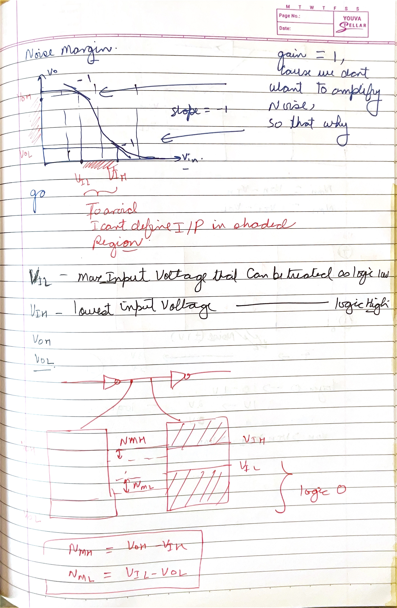

### What this page is doing

The voltage-transfer curve defines four levels. (V_{OL}) and (V_{OH}) are guaranteed output levels near the rails. (V_{IL}) is the largest input still safely interpreted as low; (V_{IH}) is the smallest input safely interpreted as high. In the standard graphical definition, (V_{IL}) and (V_{IH}) are the VTC points where slope equals (-1).

The noise margins are (NM_L=V_{IL}-V_{OL}) and (NM_H=V_{OH}-V_{IH}). They measure how much unwanted voltage can be added before a valid output is no longer guaranteed as a valid input to the next stage.

### Question / TODO acknowledged

The handwriting wonders why the gain-(-1) points are used. At |(dV_{out}/dV_{in})| below 1, small disturbances shrink through a stage; above 1 they are amplified. The (-1) crossings therefore mark the boundaries of regenerative logic behavior.

### Clarity / correction / improvement

Noise margin is a DC voltage allowance, not noise power. It assumes the next gate has compatible input thresholds and does not by itself capture very narrow transient glitches.

### Active recall

Why are (V_{IL}) and (V_{IH}) input specifications while (V_{OL}) and (V_{OH}) are output specifications?

## Page 23 - Reading noise margins geometrically

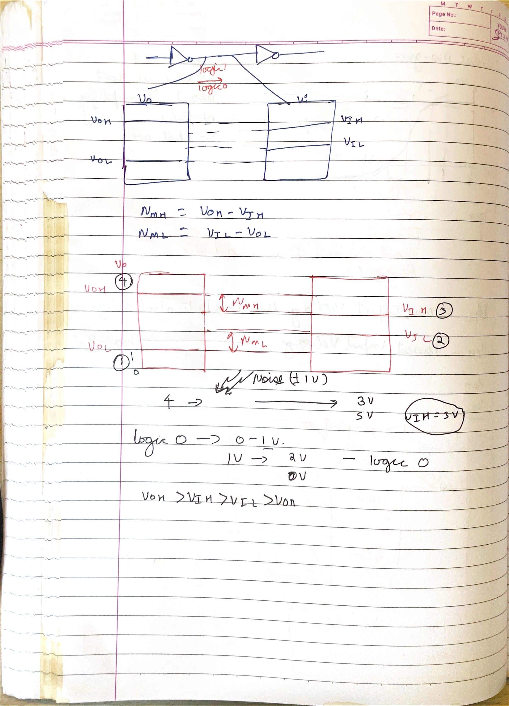

### What this page is doing

The diagrams place valid logic-0 and logic-1 ranges on the voltage axis and show the unused gap between guaranteed output and accepted input. Cascading inverters works reliably when every output-high is at least (V_{IH}) and every output-low is at most (V_{IL}).

The two-inverter sketch also shows logic restoration. A slightly degraded but still valid input is pushed toward a clean rail at the next output because the stable VTC regions have gain magnitude less than one.

### Clarity / correction / improvement

Use worst-case bounds: (V_{OH,min}), (V_{OL,max}), (V_{IH,min}), and (V_{IL,max}). Nominal rail values can overstate real noise tolerance across process, voltage, and temperature.

### Active recall

Given (V_{OH}=4.8\) V and (V_{IH}=3.2\) V, what is (NM_H), and what physical disturbance does it tolerate?

## Page 24 - Strength ratio, resistance ratio, and delay matching

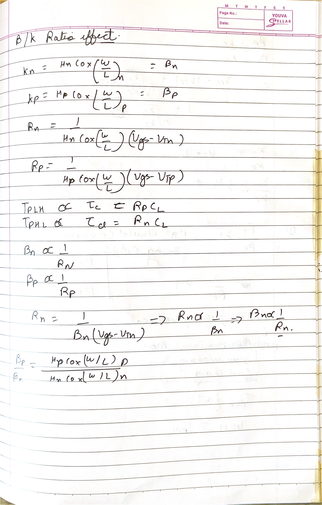

### What this page is doing

The page defines nMOS and pMOS strengths (\beta_n=\mu_nC'_{ox}(W/L)_n) and (\beta_p=\mu_pC'_{ox}(W/L)_p), then connects them to effective on-resistance and RC delay. Roughly, stronger β means smaller (R_{on}), so (t_{PHL}\propto R_nC_L) and (t_{PLH}\propto R_pC_L).

To equalize delays, choose geometry so (R_n\approx R_p), equivalently (\beta_n\approx\beta_p) under the same overdrive approximation. Since (\mu_p<\mu_n), this generally means ((W/L)_p>(W/L)_n).

### Clarity / correction / improvement

Equal β is a first-order sizing target, not a guarantee of identical delay over all slews and loads. Parasitic capacitances grow when devices are widened, so making a transistor stronger also increases the load seen by its driver.

### Active recall

Why can endlessly widening both inverter transistors eventually stop improving system-level delay?

## Module checkpoint

You are ready for Module 5 when you can explain the full switching event:

`input edge -> transistor-region trajectory -> load charge flow -> output delay -> energy loss -> restored logic level and noise margin`
