# 05 - CMOS Sizing and NAND Timing

[Back to MOSFET and CMOS](../README.md) | [Previous module](../04%20CMOS%20Switching%20Delay%20Power%20and%20Noise/README.md) | [Untouched source PDF](../sources/mos5.pdf)

This module closes the first notebook sequence by connecting transistor-strength ratio to transfer-curve position, rise/fall delay, two-input NAND sizing, current-based timing, and the power-delay/noise trade-offs of a logic path.

## Page map

| Page | Revision focus | Page | Revision focus |
|---:|---|---:|---|
| [1](#page-01) | Strength ratio and VTC shift | [8](#page-08) | Average-current delay method |
| [2](#page-02) | Weak/strong pMOS cases | [9](#page-09) | Discharge-region trajectory |
| [3](#page-03) | Symmetric inverter sizing | [10](#page-10) | Power-delay trade-off |
| [4](#page-04) | Equal pull-up/pull-down resistance | [11](#page-11) | Switching-threshold current equality |
| [5](#page-05) | Two-input NAND network | [12](#page-12) | VIL/VIH region setup |
| [6](#page-06) | NAND worst-case delay | [13](#page-13) | Noise margins and $t_{PLH}$ |
| [7](#page-07) | Dynamic node initial conditions | [14](#page-14) | Exponential delay calculation |

## Page 01 - Strength ratio moves the inverter transition

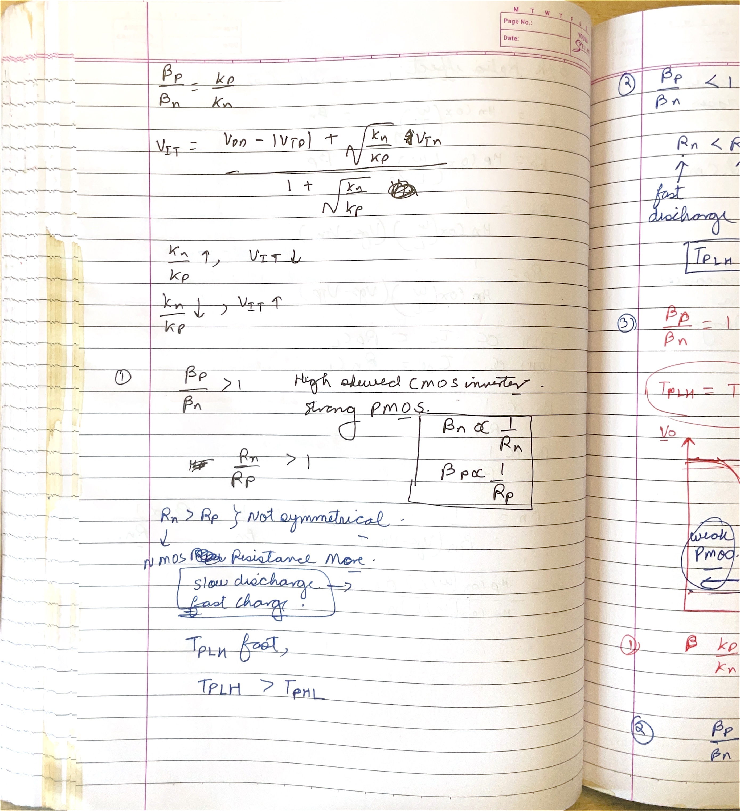

### What this page is doing

The page compares $\beta_p/\beta_n$ or the equivalent resistance ratio and shows how it moves $V_M$. If pMOS is stronger relative to nMOS, the input must rise farther before pull-down wins, so the transfer curve and $V_M$ move right/up. If nMOS is stronger, $V_M$ moves left/down.

The same strength imbalance affects timing. Stronger pMOS lowers $R_p$ and improves low-to-high output delay; stronger nMOS lowers $R_n$ and improves high-to-low delay. A DC sizing choice therefore changes both switching threshold and dynamic edge symmetry.

Read the two plotted VTC shifts together with the resistance notes: widening pMOS both delays the point at which the falling curve changes state and gives the output capacitor a stronger charging path. Widening nMOS produces the complementary pair of effects. The page is linking one physical sizing change to both the horizontal VTC position and the unequal rise/fall times.

### Clarity / correction / improvement

Keep strength and resistance ratios inverse: $R_p/R_n\approx\beta_n/\beta_p$ for comparable overdrive. Writing both as if they increase together reverses the design conclusion.

### Active recall

If the pMOS is made wider while everything else is fixed, how do $V_M$ and $t_{PLH}$ move?

## Page 02 - Reading weak- and strong-pMOS VTC cases

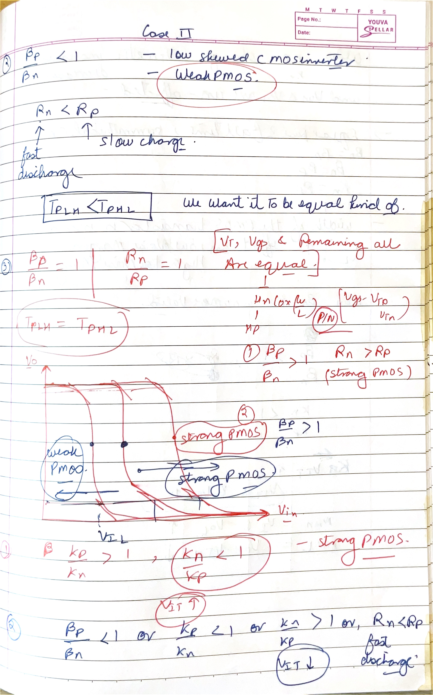

### What this page is doing

The cases classify the inverter by relative device strength. $\beta_p/\beta_n<1$ means pMOS is relatively weak and nMOS dominates sooner, shifting the VTC toward lower input. $\beta_p/\beta_n>1$ means pMOS is relatively strong and holds the output high longer.

The plotted transition families give a fast physical test for algebra: any computed strength ratio must move the curve in the same direction as the stronger pull network. If not, the ratio or square-root weighting has been inverted.

The important comparison on the graph is the input voltage at the steep transition, not a change in the final rails: ideally the output still approaches $V_{DD}$ and $0$ in both cases. Relative strength mainly decides how long the pull-up can oppose the pull-down as $V_{in}$ rises, which is why the bend moves while the Boolean inversion remains unchanged.

### Clarity / correction / improvement

Call the inverter “skewed” rather than absolutely weak or strong. A strong pMOS can be desirable for a deliberately high switching threshold or heavy rising-edge load even if it is not symmetric.

### Active recall

Why does a strong pMOS increase the low-state input range but potentially reduce one noise margin on the high side?

## Page 03 - Sizing a symmetric CMOS inverter

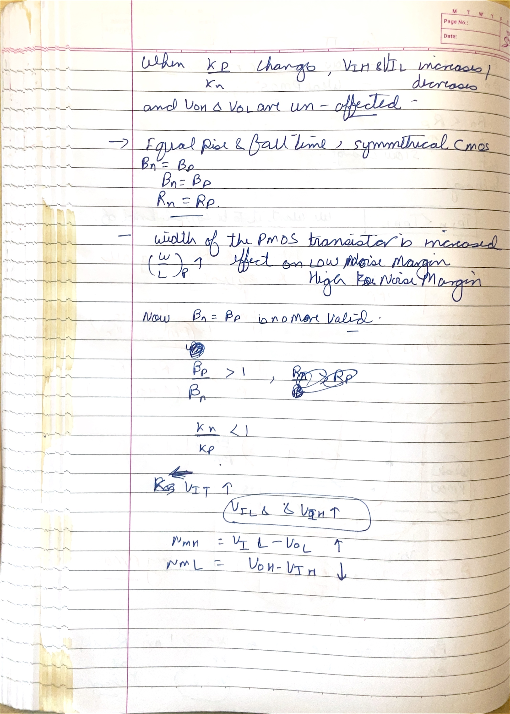

### What this page is doing

The page imposes equal effective gain, $\beta_n=\beta_p$, to center the switching point and approximately equalize edge strength. Because $\beta=\mu C'_{ox}W/L$, equal channel lengths and oxide capacitance require

$$
\frac{W_p}{W_n}\approx\frac{\mu_n}{\mu_p}.
$$
Electron mobility is typically about two to three times hole mobility in a given process, so pMOS is made roughly two to three times wider in a first-order symmetric design.

The width correction on the page compensates for mobility, not for a different logic function. With equal $L$ and the same $C'_{ox}$, the narrower nMOS can equal the wider pMOS because electrons provide more current per unit width. Once the two $\beta$ values match, equal threshold magnitudes place the current-balance point near $V_{DD}/2$.

### Clarity / correction / improvement

The exact width ratio is process- and bias-dependent; it should come from the provided $k'_n/k'_p$ or characterized cell data. “pMOS is always 2x” is a rule of thumb, not a law.

### Active recall

If $k'_n=2.5k'_p$ and channel lengths are equal, what width ratio gives $\beta_n=\beta_p$?

## Page 04 - Equal propagation delay through resistance matching

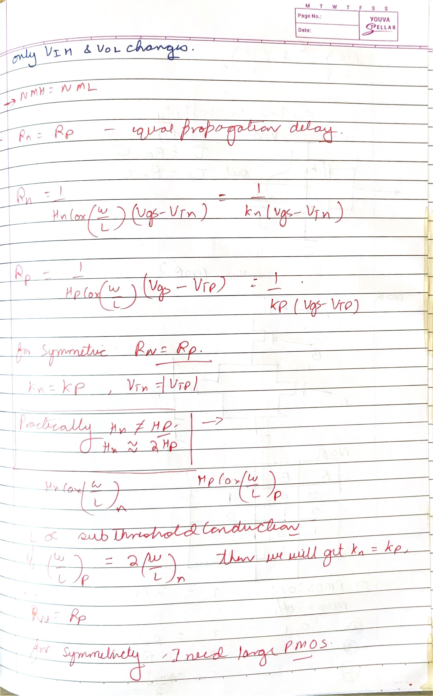

### What this page is doing

The page derives the same sizing target from timing rather than DC transfer. In the RC model, $t_{PLH}\approx0.69R_pC_L$ and $t_{PHL}\approx0.69R_nC_L$. Equal delays therefore require $R_p\approx R_n$, which in turn requires comparable effective $\beta_p$ and $\beta_n$.

Substituting mobility and $W/L$ expressions produces the required pMOS-to-nMOS width ratio. The page is valuable because it shows that centered $V_M$ and balanced edge delay often point toward the same first-order sizing choice.

Follow the two delay arrows separately: the falling edge exposes $C_L$ to the nMOS pull-down resistance, whereas the rising edge exposes the same load to the pMOS pull-up resistance. Since the factor $0.69C_L$ is common, it cancels when the delays are compared. What remains is precisely the resistance—or inverse-strength—matching condition written below the waveforms.

### Clarity / correction / improvement

The equality is approximate because the two transitions traverse different device regions and capacitances. Match measured/characterized delay if precision matters; use $R_p=R_n$ for hand design.

### Active recall

Which assumption allows a transistor-strength ratio to be converted directly into a propagation-delay ratio?

## Page 05 - Two-input CMOS NAND network and truth table

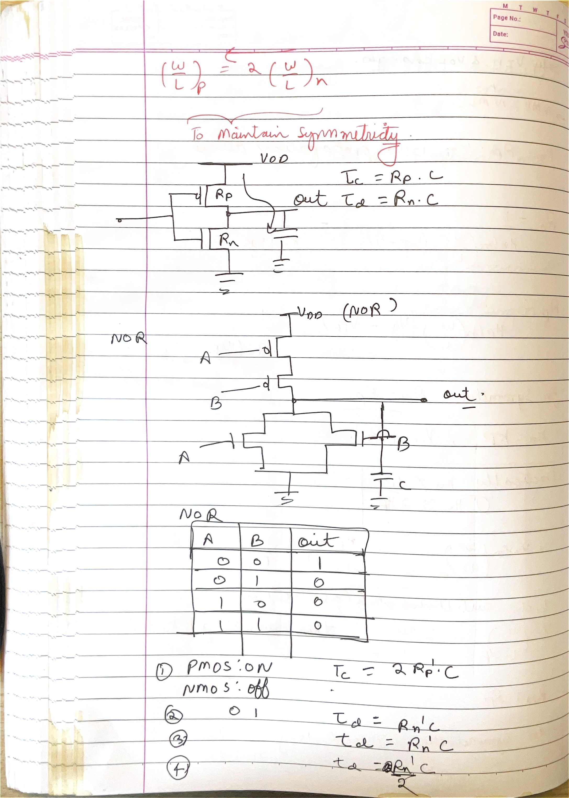

### What this page is doing

The CMOS NAND has two pMOS devices in parallel in the pull-up network and two nMOS devices in series in the pull-down network. The output is low only when both inputs are high, because only then is the full series nMOS path on while both pMOS devices are off. For every other input combination, at least one pMOS provides a path to $V_{DD}$ and at least one nMOS breaks the ground path.

The resistance sketches prepare a worst-case delay model. Falling output sees two series nMOS resistances. Rising output can be driven by one pMOS in the worst case or two parallel pMOS devices in the fastest case.

The complementary topology in the drawing follows De Morgan's law physically. A series pull-down requires $A=1$ **and** $B=1$ to reach ground, while the parallel pull-up reaches $V_{DD}$ when $A=0$ **or** $B=0$. Thus each truth-table row can be reconstructed directly from continuity of the two transistor networks rather than recalled as an isolated NAND fact.

### Clarity / correction / improvement

The table's current-path reasoning is more dependable than memorizing NAND output. For each input row, explicitly mark each of the four transistors on/off and verify that pull-up and pull-down are never simultaneously complete in a stable state.

### Active recall

Why does the pMOS network implement the dual of the nMOS series network?

## Page 06 - Worst-case NAND charge and discharge delay

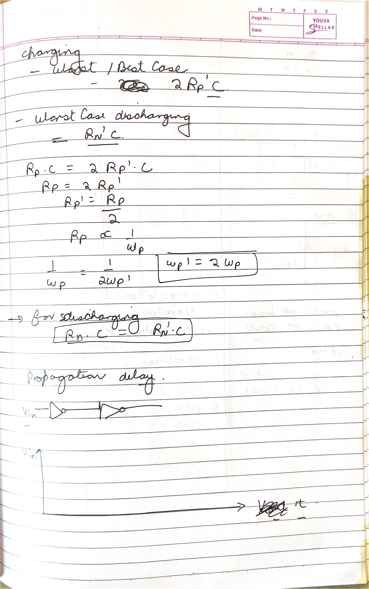

### What this page is doing

The page compares charging and discharging time constants. With unit devices, worst-case discharge is approximately $2R_nC_L$ because two nMOS are in series. Worst-case charge is approximately $R_pC_L$ because only one parallel pMOS may be on. Internal diffusion capacitance at the midpoint of the nMOS stack can add extra delay beyond this simple output-only model.

To make NAND pull-down comparable with an inverter, each series nMOS is often widened about 2x, making each roughly $R_n/2$ so the two-device series path returns to $R_n$. Pull-up sizing is chosen from its worst-case one-device path.

The page's two charging cases should not be averaged together. If only one input falls, one pMOS charges the output and sets the conservative rising delay; if both are low, the two parallel devices reduce the effective resistance and the rise is faster. By contrast, every valid falling event needs both series nMOS on, so their summed resistance is unavoidable in the discharge path.

### Clarity / correction / improvement

Series resistance does not scale exactly as ideal $1/W$ across all voltages, and widening adds capacitance. The 2x rule is a first-order equivalent-resistance design, not a proof of equal characterized delay.

### Active recall

Why are series nMOS devices widened in a NAND, while the parallel pMOS devices do not both have to be on for the worst rising edge?

## Page 07 - Initial conditions during a dynamic output transition

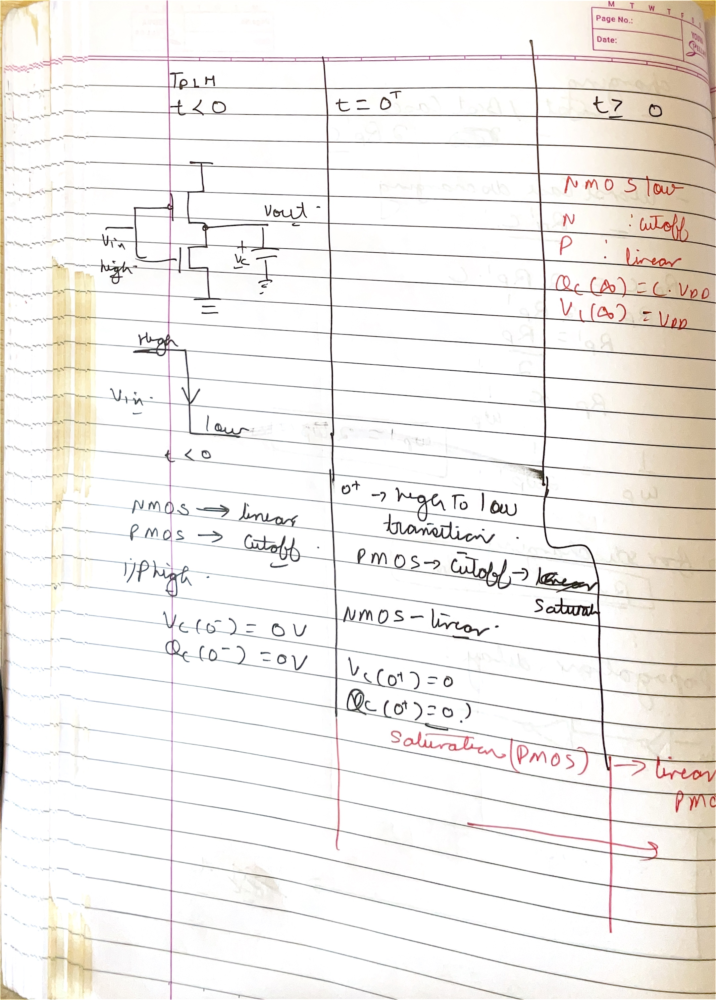

### What this page is doing

The page divides a switched-capacitor event into $t=0^-$, $t=0^+$, and $t>0$. Before the input change, the output capacitor holds a rail voltage. Immediately after the change, that voltage is unchanged but the transistor network has switched states. Current then moves charge until the new rail is reached.

For a falling output, nMOS begins with large $V_{DS}$, usually saturation, and later enters linear region. For a rising output, pMOS follows the complementary trajectory. Writing initial capacitor charge $Q_C(0^-)=C_LV_{out}(0^-)$ prevents accidental assumption that output jumps with input.

This time ordering explains the seemingly contradictory labels in the sketch: at $t=0^+$ the transistor current may change immediately because its gate voltage changed, yet $V_{out}$ is still the value stored at $t=0^-$. Only after current has transferred charge can the output trace move. In a stacked NAND, the same rule also applies to the internal-node capacitance.

### Clarity / correction / improvement

The annotation “most potential will appear across channel” should be localized: voltage distribution evolves with time and across series devices. In a NAND stack, internal-node initial charge can make the two nMOS voltages unequal.

### Active recall

What can change discontinuously at $t=0$: transistor region, capacitor voltage, or capacitor current?

## Page 08 - Estimating delay from average transistor current

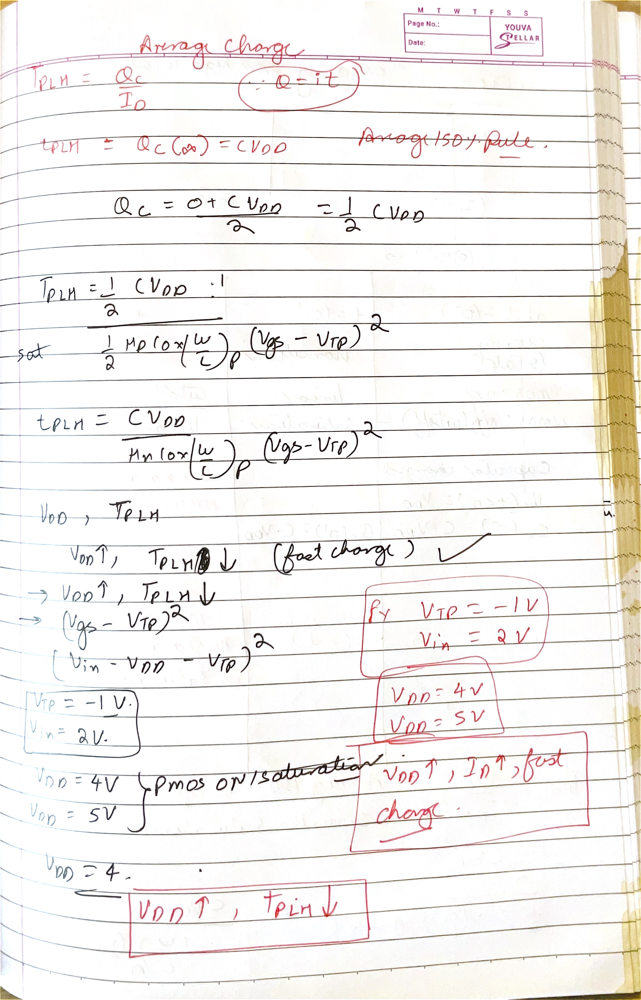

### What this page is doing

Instead of replacing the transistor by a constant resistance, the page uses charge balance. To move the output by $\Delta V$, the transistor must transfer $\Delta Q=C_L\Delta V$. If an average current is estimated over that interval,

$$
t\approx\frac{C_L\Delta V}{I_{avg}}.
$$
For 50% propagation delay, $|\Delta V|$ is usually $V_{DD}/2$. The page samples current near the beginning and midpoint and averages them, which captures some nonlinear MOS behavior without performing the full differential-equation integral.

The two current samples shown are tied to two output voltages along the same transition. Their difference reflects the change in $V_{DS}$ and, possibly, a change of operating region while $V_{GS}$ stays fixed after the input step. Dividing the required half-swing charge by that representative current converts the page's transistor-current calculation into a time estimate with units of seconds.

### Clarity / correction / improvement

The arithmetic mean $[I(0)+I(t_p)]/2$ is an approximation because current does not vary linearly with time or voltage. It is often better than one fixed $R$, but exact hand analysis integrates $C\,dV/I(V)$.

### Active recall

Why does the charge-over-average-current method naturally use $V_{DD}/2$ for a 50% delay measurement?

## Page 09 - Region trajectory during output discharge

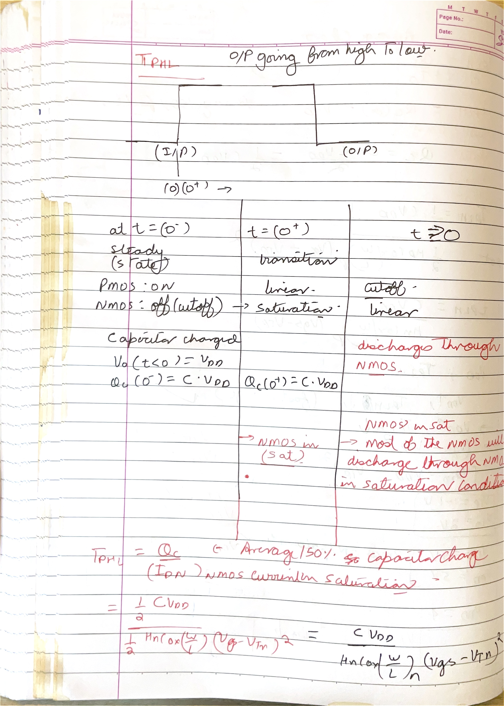

### What this page is doing

For a step-high input, nMOS turns on while the output initially remains high. With $V_{DS}\ge V_{GS}-V_T$, it starts in saturation at approximately constant square-law current. When $V_{out}$ falls below $V_{GS}-V_T$, it enters linear region and current decreases as the output approaches ground.

The page uses the initial and 50%-output currents to estimate $t_{PHL}$. The region boundary must be compared with $V_{DD}/2$: depending on $V_T/V_{DD}$, the 50% point may lie in saturation or linear region, changing which current formula belongs in the estimate.

On the drawn discharge path, $V_{GS}=V_{DD}$ remains constant after the input step, while $V_{DS}=V_{out}$ continuously falls. The operating point therefore moves horizontally through the output characteristics: it begins on the saturation plateau and crosses the boundary at $V_{out}=V_{DD}-V_T$. That movement is the reason a single constant-current formula cannot describe the full waveform.

### Clarity / correction / improvement

The label “nMOS saturation during discharging” is true initially, not for the entire fall. Always test $V_{out}$ at the measurement point against $V_{DD}-V_T$.

### Active recall

For $V_{GS}=V_{DD}$, at what output voltage does the discharging nMOS leave saturation?

## Page 10 - Supply voltage creates a power-delay trade-off

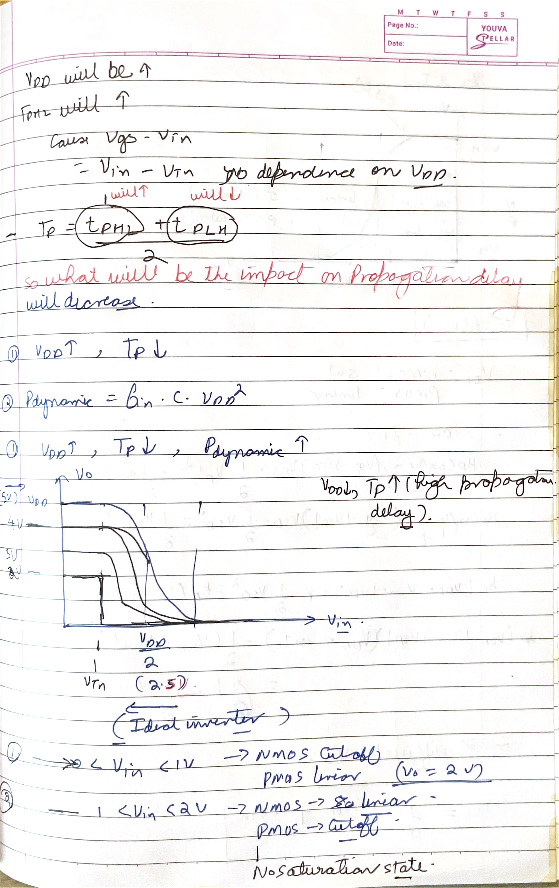

### What this page is doing

The page notes that increasing $V_{DD}$ raises gate overdrive, increases transistor current, and usually reduces propagation delay. But dynamic power rises as $V_{DD}^2$, and electric-field/reliability stress also rises. Lowering supply saves energy but makes delay grow rapidly as $V_{DD}$ approaches threshold.

The VTC family shifts/scales with supply because the available high level and both device overdrives change. Thresholds do not normally scale in direct proportion to $V_{DD}$, which is why low-voltage operation becomes increasingly difficult.

The page is comparing two consequences of the same supply change. The capacitor must move through a larger voltage swing when $V_{DD}$ rises, but transistor current rises strongly because the overdrive also grows; the current improvement usually wins for delay. Energy is less forgiving: each full charge event draws approximately $C_LV_{DD}^2$ from the supply, so the higher rail carries a quadratic switching-energy penalty.

### Clarity / correction / improvement

The page's “$V_{DD}\uparrow, t_p\downarrow, P\uparrow$” is correct as a first-order trend. Add leakage and short-circuit power for a complete real-process trade-off; they do not necessarily follow the same simple square law.

### Active recall

Why does delay become especially sensitive to supply voltage when $V_{DD}$ is only slightly above threshold?

## Page 11 - Switching threshold from equal saturation currents

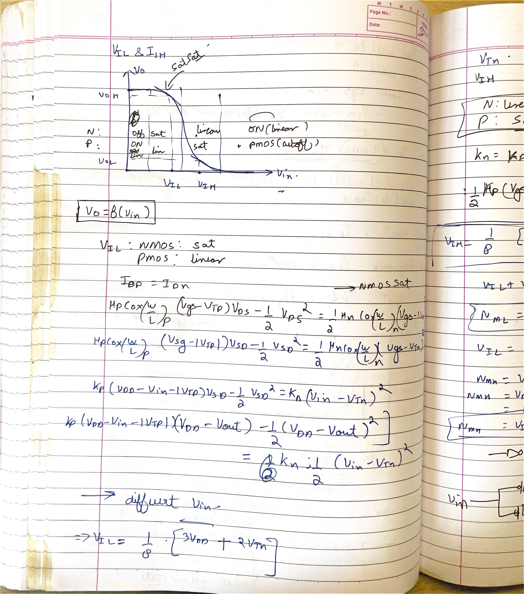

### What this page is doing

The page places the inverter's operating point on nMOS and pMOS current curves and equates their magnitudes at $V_{in}=V_{out}=V_M$. With both devices saturated,

$$
\frac{\beta_n}{2}(V_M-V_{Tn})^2=\frac{\beta_p}{2}(V_{DD}-V_M-|V_{Tp}|)^2.
$$
The result connects $V_M$ to strength ratio and thresholds. This is also the center around which the noise-margin boundaries are later found, though $V_{IL}$ and $V_{IH}$ require a slope condition rather than only current equality.

The diagonal condition $V_{in}=V_{out}$ shown at the crossing fixes all four terminal voltages from the single unknown $V_M$. It also makes both devices satisfy their saturation inequalities around the ideal switching point, allowing the two square-law expressions to be equated. Taking the positive square roots then exposes the strength ratio as $\sqrt{\beta_p/\beta_n}$ rather than as a direct linear multiplier.

### Clarity / correction / improvement

The central both-saturation equation cannot directly produce the entire VTC. Outside the switching point, solve mixed saturation/linear region pairs to obtain $V_{out}(V_{in})$.

### Active recall

Why is current equality necessary at every DC VTC point, while the both-saturation current formulas are valid only near one part of the curve?

## Page 12 - Setting up $V_{IL}$ and $V_{IH}$

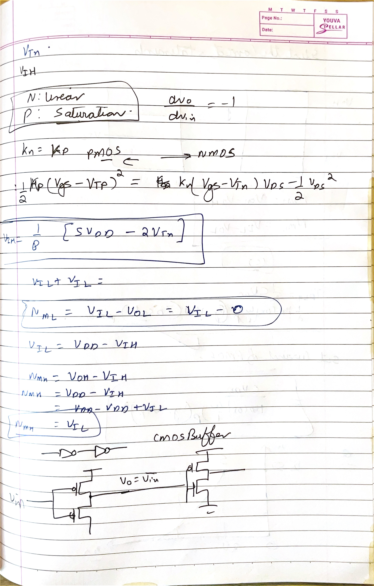

### What this page is doing

The page identifies the mixed transistor regions used at the two unity-gain boundaries. Near $V_{IL}$, nMOS is usually saturated and pMOS linear. Near $V_{IH}$, nMOS is linear and pMOS saturated. For each side, equate current magnitudes to get the VTC expression and apply $dV_{out}/dV_{in}=-1$.

This produces the input limits that separate stable logic-level restoration from the high-gain transition. The calculations are more involved than $V_M$ because $V_{out}$ remains in the equations.

The page's left and right boundary sketches are mirror cases. At $V_{IL}$, the output is still high, so the newly conducting nMOS has large $V_{DS}$ while the pMOS has small source-to-drain drop. At $V_{IH}$, the output is already low, reversing those voltage conditions. This voltage reading—not memorization—selects the saturation/linear formula used on each side.

### Clarity / correction / improvement

Do not substitute $V_{out}=V_{in}$ when finding $V_{IL}$ or $V_{IH}$. That equality defines $V_M$, not the unity-gain boundaries.

### Active recall

Which transistor is linear and which is saturated near $V_{IL}$, and why is the pairing reversed near $V_{IH}$?

## Page 13 - Correct noise-margin relations and rising-delay formula

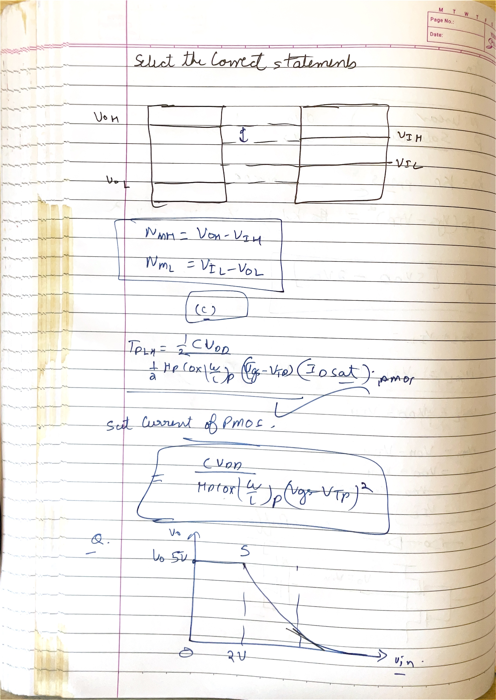

### What this page is doing

The logic-level sketch supports the correct definitions $NM_L=V_{IL}-V_{OL}$ and $NM_H=V_{OH}-V_{IH}$. The two margins are distances between what one gate guarantees at its output and what the next gate accepts at its input.

The lower timing expression estimates pMOS-controlled rising delay from required capacitor charge divided by pMOS drive current. In square-law form, stronger $\mu_pC'_{ox}(W/L)_p$ and larger pMOS overdrive reduce $t_{PLH}$, while larger $C_L$ and voltage swing increase it.

These two parts of the page serve different checks on an inverter design. The voltage diagram asks whether a noisy output from one stage is still recognized by the next; the delay relation asks how quickly the physical load reaches that output. Sizing pMOS improves the rising-current denominator, but the added device width can also increase capacitance, so the displayed expression captures the drive benefit before parasitic loading is added.

### Question / TODO acknowledged

The page says “select the correct statement,” but the photographed source does not contain the answer choices. The technically correct statements recoverable from the page are: $NM_L=V_{IL}-V_{OL}$, $NM_H=V_{OH}-V_{IH}$, pMOS controls low-to-high delay, and $t_{PLH}$ grows with $C_L$ but falls with pMOS strength. These let you identify the correct option if the choices are supplied later.

### Clarity / correction / improvement

The displayed delay fraction is an average-current approximation. Confirm whether the problem defines delay at 50%, 10%-90%, or another level before selecting the voltage interval in $C\Delta V/I$.

### Active recall

Which two voltage differences must be nonnegative for compatible cascaded logic gates?

## Page 14 - Solving an exponential delay equation

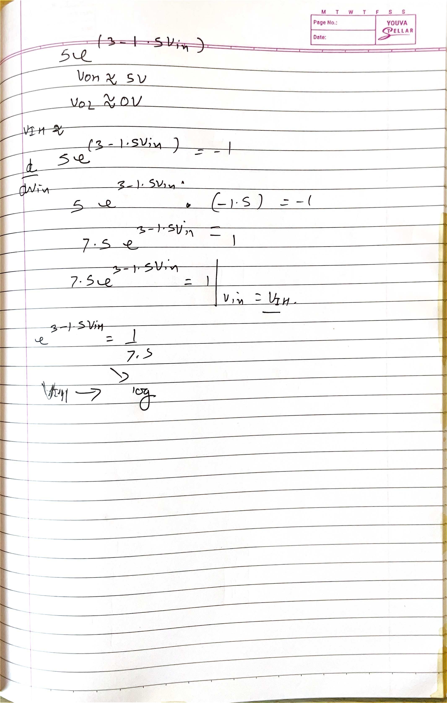

### What this page is doing

The final page rearranges an RC exponential to solve for the time at which output reaches a specified fraction of its final value. For discharge, $V_{out}=V_0e^{-t/RC}$, so

$$
t=-RC\ln\left(\frac{V_{out}}{V_0}\right).
$$
For charging, $V_{out}=V_{DD}[1-e^{-t/RC}]$, so $t=-RC\ln[1-V_{out}/V_{DD}]$. At 50%, both reduce to $RC\ln2$.

The two normalized quantities in the page's exponentials must be read differently. During discharge, $V_{out}/V_0$ is the fraction **remaining**; during charge, $1-V_{out}/V_{DD}$ is the fraction of the original voltage error remaining. Setting either remaining-error fraction to $e^{-1}$ gives $t=RC$: the discharge has fallen to about $36.8\%$, while the charge has reached about $63.2\%$ of its final value.

### Clarity / correction / improvement

The handwritten exponential manipulation should use natural logarithm, not base-10 logarithm, unless the conversion factor is included. Check that the logarithm argument is dimensionless and between 0 and 1 for a positive elapsed time.

### Active recall

What fraction of the final voltage gives exactly one time constant for a charging capacitor and for a discharging capacitor?

## First-iteration checkpoint

The five modules now form one revision chain. Test it in reverse:

1. Explain NAND delay from series resistance and load charge.
2. Trace that resistance back to MOSFET region and overdrive.
3. Trace threshold and overdrive back to MOS-capacitor surface potential and depletion charge.
4. Trace surface potential back to work-function, oxide charge, and gate voltage.

If every arrow can be explained without the images, the first iteration has become usable knowledge rather than a photographed notebook.
